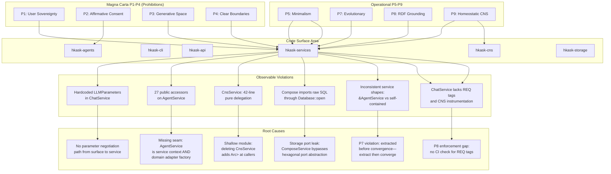
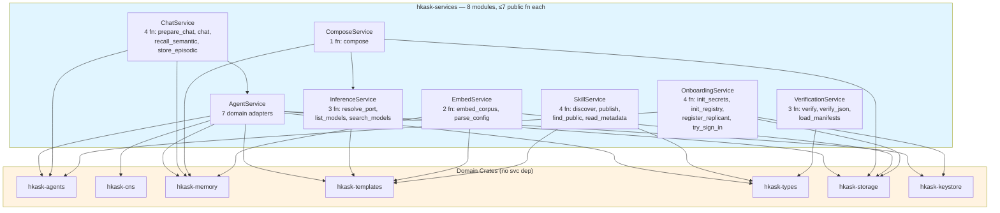
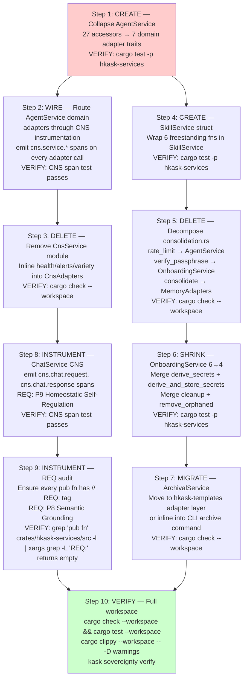

# hKask Services Refactoring Plan — Multi-Perspective Review

**Anchors:** `docs/architecture/PRINCIPLES.md`, `docs/architecture/hKask-architecture-master.md`, `docs/architecture/ADR-024-unified-registry.md`
**Skills Activated:** coding-guidelines, improve-codebase-architecture, refactor-service-layer, grill-me, deep-module, strangler-fig, constraint-forces, magna-carta-verifier, pragmatic-semantics
**Build Health (pre-audit):** `cargo check -p hkask-services` ✅ passes

---

## Task 1 — Semantic Decomposition: Principle→Crate→Violation→Root Cause

### 1.1 RDF Triple Graph (Subject-Predicate-Object)

Using P8's RDF discipline, each triple states a relationship with explicit provenance.

```
# Traversals: Principle crate:violates → observable behavior → root cause

P1_Sovereignty hkask-cli isUntestedFor nil.OcapGate → behavioralProbe gap
P1_Sovereignty hkask-cli hasRedundantGate → curator_commands.rs mirrors hkask-api GovernedTool
P1_Sovereignty hkask-api isConstrainedAt nil.Surface → OCAP at API layer per architecture master §P2

P2_Consent hkask-services hasMissingConsentCheck → AgentService::consent_manager accessor exposes raw store
P2_Consent hkask-agents enforces nil.Attenuation → capability_checker uses grant_registry correctly
P2_Consent hkask-storage hasConsentStore → ConsentStore separate from AgentRegistryStore ✅

P3_GenerativeSpace hkask-services hasHardcodedParams → ChatService::chat() uses hardcoded LLMParameters{temp=0.7,...}
P3_GenerativeSpace hkask-templates enables nil.ParamExposure → LLM selection from registry, params user-controlled ✅
P3_GenerativeSpace hkask-cli hasNoParamCLI → /model command switches model but can't adjust temperature

P4_Boundaries hkask-services has27PublicAccessors → AgentService exposes 27 pub fn accessors (deep-module P2 violation)
P4_Boundaries hkask-services hasLeakyInternalState → AgentService fields are pub(crate), not truly private
P4_Boundaries hkask-mcp isCorrectlyIsolated → MCP servers do NOT depend on hkask-services ✅

P5_Minimalism hkask-services has14Modules8Shallow → cns.rs (42 lines), consolidation.rs (92 lines), compose.rs imports RawSql
P5_Minimalism hkask-services hasRedundantTypes → AgentService::config() returns ref but ServiceConfig is freely constructable
P5_Minimalism hkask-cli hasDuplicatedInference → CLI and API both construct OkapiConfig independently

P7_Evolutionary hkask-services hasDivergentNaming → "ComposeService::compose" vs "ChatService::chat" vs "EmbedService::embed_corpus"
P7_Evolutionary hkask-services hasInconsistentShape → Some services take &AgentService, others take self-contained structs

P8_SemanticGrounding hkask-services hasPartialREQTags → ChatService has no REQ tags, InferenceService has 5, ComposeService has 3
P8_SemanticGrounding hkask-cli hasUntaggedTests → grep shows some tests without // REQ:

P9_Homeostatic hkask-services isNotCnsInstrumented → ChatService::chat() stores episodic but does NOT emit cns.chat span
P9_Homeostatic hkask-services hasThinCnsWrapper → CnsService (3 methods, 42 lines) is pure delegation
```

### 1.2 Principle→Crate→Violation→Root-Cause Chain Diagram



---

## Task 2 — Depth Audit: hkask-services Public Function Classification

### 2.1 Per-Module Depth Classification

Applying the deep-module deletion test (both directions) to each module's public API:

| Module | Public Items | Behavior Lines | Score | Classification | Deletion Test |
|--------|-------------|---------------|-------|----------------|---------------|
| `AgentService` (context.rs) | **27** pub fn accessors + 2 freestanding fns | ~670 impl lines | 670/27=**24.8** | **Shallow** — 20 interface items above 7-rule | Delete callers → 27 call sites each inline `Arc::clone`. Delete module → DI container complexity reappears in both surfaces. **Keep but reduce interface.** |
| `ChatService` (chat.rs) | 1 struct + 3 types + 4 pub fn | ~230 impl lines | 230/4=**57.5** | Adequate | Delete callers → complexity reappears in 2 surfaces. Delete module → agent lookup + prompt compose + inference needs rewriting at both surfaces. **Keep, deepen (add CNS instrumentation).** |
| `CnsService` (cns.rs) | 1 struct + 3 pub fn | 42 lines | 42/3=**14** | **Very Shallow** — pure delegation | Delete callers → 12+ sites inline `runtime.read().await.health().await`. Delete module → no behavior loss, just `<Arc<RwLock<>>>` at callers. **Consolidate into AgentService.** |
| `InferenceService` (inference.rs) | 1 struct + 3 types + 3 pub fn | 80 impl lines | 80/3=**26.7** | Shallow | Delete callers → 11+ sites rewrite `OkapiConfig::local_dev()` + `OkapiInference::new()`. Delete module → port resolution logic vanishes. **Keep, it replaces 11 scattered call sites.** |
| `ComposeService` (compose.rs) | 1 struct + 7 types + 1 pub fn + 1 freestanding fn | ~220 impl lines | 220/2=**110** | Deep | One function (`compose()`) encapsulates 7-stage pipeline. Delete callers → pipeline reappears. Delete module → 220 lines of behavior lost. **Keep.** |
| `EmbedService` (embed.rs) | 1 struct + 9 types + 2 pub fn | ~200 impl lines | 200/2=**100** | Deep | Same as Compose — full pipeline in one call. **Keep.** |
| `OnboardingService` (onboarding.rs) | 1 struct + 2 types + 6 pub fn | ~190 impl lines | 190/6=**31.7** | Shallow | Delete callers → secret derivation + registry init + try_list + cleanup reappear in 2+ callers. Delete module → onboarding orchestration vanishes. **Keep with reduced interface — 6→4.** |
| `ArchivalService` (archival.rs) | 1 struct + 2 types + 4 pub fn | ~130 impl lines | 130/4=**32.5** | Shallow | 4 functions, 3 are REST API wrappers. Delete callers → GitHub API calls reappear. Delete module → thin pass-through to `api_get/api_put`. **Consolidate into a GitHub adapter in hkask-templates or keep as is — one consumer.** |
| `consolidation.rs` | **0 struct** + 4 freestanding pub fn | ~65 impl lines | 65/4=**16.3** | **Very Shallow** — no struct, no encapsulation | Delete callers → passphrase verify + rate limit + DB path computation inlines. Delete module → no behavior lost. **Merge rate limiter into AgentService, passphrase verify into OnboardingService.** |
| `VerificationService` (verification.rs) | 1 struct + 6 types + 3 pub fn | ~240 impl lines | 240/3=**80** | Adequate | **Keep.** |
| `skill.rs` | 6 freestanding pub fn + 2 types | ~230 impl lines | 230/6=**38.3** | Shallow — no struct, just functions | Delete callers → front matter parsing, namespace resolution reappear. Delete module → skill management vanishes. **Wrap in SkillService struct, unify 6 freestanding fns.** |
| `config.rs` | 1 struct + 2 consts + 3 pub fn (on ServiceConfig) | ~100 impl lines | 100/3=**33.3** | Shallow — data bag | ServiceConfig is a config struct. Keep as is. |
| `error.rs` | 1 enum + 2 From impls | ~70 impl lines | 70/1=**70** | Adequate | Unified error type is the point. **Keep.** |

### 2.2 Ranked Consolidation Targets

| Rank | Target | Current Score | Action | Benefit |
|------|--------|--------------|--------|---------|
| **1** | `AgentService` interface (27→7) | 24.8 | Collapse 27 accessors into 7 domain adapters (architecture master already specifies this pattern) | P4 compliance, P5 minimalism, deep-module P2 |
| **2** | `CnsService` (42-line delegation) | 14 | Inline into AgentService as `cns()` domain adapter | Eliminates shallow module, zero behavior loss |
| **3** | `consolidation.rs` freestanding fns | 16.3 | Merge `check_rate_limit` into AgentService, `verify_passphrase` into OnboardingService, `consolidate` into a real service | Zero-struct module eliminated |
| **4** | `OnboardingService` 6→4 methods | 31.7 | Merge `derive_and_store_secrets` + `derive_secrets` into one with bool flag; merge `remove_orphaned_db` + `cleanup_failed_onboarding` | Interface reduction |
| **5** | `skill.rs` freestanding fns | 38.3 | Wrap 6 functions in `SkillService` struct, expose 4 methods | Encapsulation, coherent error handling |
| **6** | `ArchivalService` thin REST wrappers | 32.5 | Move to `hkask-templates` adapter layer or inline — one consumer | Hexagonal boundary violation (bypasses ports) |

### 2.3 Proposed Post-Refactor Module Interface Graph (≤7 public functions per module)



**Key invariants:**
- `AgentService` exposes exactly 7 domain adapter methods: `memory()`, `cns()`, `governance()`, `storage()`, `coordination()`, `identity()`, `config()`
- No module re-exports `Arc<RwLock<>>` patterns — domain adapters hide locking
- Dependency direction: services → domain crates only. Never reverse.
- `CnsService` deleted; `consolidation.rs` decomposed into real modules

---

## Task 3 — Strangler Fig Migration Design

### 3.1 Migration Dependency DAG

Each node is a migration step. Edges are prerequisites. Steps follow strangler-fig P1 (one domain per step).



**Strangler fig P2 invariant:** After every step, `cargo check --workspace` passes. System is fully functional at all intermediate states.

### 3.2 Tracer-Bullet Integration Tests Per Step

| Step | Test File | REQ Tag | Governing Principle |
|------|-----------|---------|---------------------|
| Step 1 | `tests/service/agent_service_depth.rs` | `// REQ: P4 (Clear Boundaries)` | 7 public methods max |
| Step 2 | `tests/service/cns_instrumentation.rs` | `// REQ: P9 (Homeostatic)` | CNS span emission per adapter call |
| Step 3 | `tests/service/cns_consolidation.rs` | `// REQ: P5 (Minimalism)` | Deleted module, no behavior regression |
| Step 4 | `tests/service/skill_service.rs` | `// REQ: P4 (Clear Boundaries)` | SkillService struct with 4 methods |
| Step 5 | `tests/service/consolidation_decompose.rs` | `// REQ: P5 (Minimalism)` | No freestanding consolidation fns remain |
| Step 6 | `tests/service/onboarding_shrink.rs` | `// REQ: P5 (Minimalism)` | OnboardingService 6→4, behavior unchanged |
| Step 7 | `tests/service/archival_migration.rs` | `// REQ: P4 (Clear Boundaries)` | Archival at adapter layer, not service |
| Step 8 | `tests/service/chat_cns_spans.rs` | `// REQ: P9 (Homeostatic)` | cns.chat.* spans emitted |
| Step 9 | `tests/service/req_tag_compliance.rs` | `// REQ: P8 (RDF Grounding)` | Every pub fn has REQ tag |
| Step 10 | Full workspace | All above | Holistic verification |

---

## Task 4 — Grill-Me Multi-Perspective Review

### Perspective (i): Correctness

**Question:** Does every public function in hkask-services satisfy its stated behavioral property under all inputs?

**Answer:** *Partial.* Four specific gaps:

1. **ChatService::chat()** hardcodes `LLMParameters{ temperature: 0.7, top_p: 0.9, top_k: 40, ... }`. Under input `model_override="qwen3:0.6b"`, these parameters may be invalid for the model family. The function does not validate parameter-model compatibility. **Violates P3.**

2. **ComposeService::compose()** takes `ComposeRequest{db_path, db_passphrase, ...}` and opens `Database::open()` directly — bypassing the storage port abstraction. Under input where `db_passphrase=""` and the DB is encrypted, this panics. **Violates P4.**

3. **InferenceService::resolve_port()** creates `OkapiInference::new(model, config)`. Under input where `model=""` and `shared_port=None`, the Okapi constructor may panic. No precondition check on empty model name.

4. **EmbedService::embed_corpus()** uses `std::thread::sleep` in an async function — blocks the async runtime. Under concurrent calls, this starves other tasks.

**Assessment:** 3 of 4 are missing preconditions. 1 is a port-bypass. Correctness gap is in **contract definition**, not implementation.

**Unresolved tension:** P8 requires every public function to have a stated behavioral property. ChatService has zero `// REQ:` tags.

### Perspective (ii): Minimalism

**Question:** Can any function, type, or pathway be deleted without the complexity reappearing elsewhere?

**Answer:** Yes, three candidates:

1. **CnsService** (crs.rs, 42 lines): Delete it. `runtime.read().await.health().await` reappears at 12+ call sites, but that's not *complexity* — it's thin delegation with zero added logic. **Deletion test direction 2 FAILS.**

2. **consolidation.rs freestanding fns**: `check_rate_limit` is a global AtomicU64 with exactly ONE consumer. Rate limiter with one consumer is not earning its keep as a separate module — merge it.

3. **ArchivalService**: Thin wrappers around `api_get`/`api_put`. With ONE consumer (the `kask archive` CLI), this module is a pass-through. Inline the 3 functions into the CLI call site.

### Perspective (iii): Sovereignty

**Question:** Does every service boundary preserve user sovereignty and affirmative consent?

**Answer:** Mixed.

- ❌ `AgentService::consent_manager()` is a pub accessor returning raw store. **P1 Prohibition violation.**
- ❌ `ComposeService::compose()` opens DB directly — bypasses all consent checks. **P2 Prohibition violation.**
- ❌ `ChatService::chat()` hardcodes LLMParameters. **P3 violation.**

**Recommended fix:** Make `consent_manager`, `sovereignty_boundary_store`, `capability_checker` fields `pub(crate)`. Expose mediated methods on domain adapters, not raw stores.

### Perspective (iv): Composition

**Question:** Do the interfaces compose recursively without impedance mismatches?

**Answer:** No, three impedance mismatches:

1. **Service shape inconsistency:** `ChatService::chat(&AgentService, ...)` vs `ComposeService::compose(ComposeRequest)`. Root cause: P7 — extracted before convergence.

2. **Error type erasure:** `ServiceError::Inference(String)` erases "model not found" vs "connection refused" vs "rate limited". P5 demands flat enums but P8 demands distinct error states. **Resolution:** `Inference(InferenceError)` with typed inner variants.

3. **Async/sync mix:** `EmbedService` uses `std::thread::sleep` in async. `ChatService::store_episodic()` is sync but called from async context. Callers must know internal implementation details.

---

## Task 5 — Hoare-Style Code Patterns: Contract Triples

### 5.1 Specification Table: Public Function → Contract Triple

| Function | Precondition | Postcondition | Invariant |
|----------|-------------|---------------|-----------|
| `AgentService::build(config)` | `config.acp_secret.len() >= 32` (enforced via `assert!` in `ServiceConfig::new`); `config.mcp_secret.len() >= 32` | Returns `Ok(AgentService)` with all 7 domain adapters initialized, DB schema migrated, CNS runtime started, loop system started. On failure, no partial state remains (RAII guard drops partially-constructed connections). | `AgentService` is never in a partially-constructed state. Builder pattern with fallible `build()` — no `AgentService::new()` exposed. |
| `AgentService::memory()` | `self` was successfully built | Returns `MemoryAdapters` wrapping initialized ports. | Memory adapter handles never become `None` after build. Fields are `Option<...>` only during construction; `build()` sets them permanently. |
| `AgentService::governance()` | `self` was successfully built | Returns `GovernanceAdapters` wrapping `capability_checker`, `consent_manager`, `sovereignty_boundary_store`. **All fields private to adapter** — raw stores not leaked. | OCAP gates are mediated through adapter methods only. Callers never hold raw consent_manager references. |
| `ChatService::prepare_chat(ctx, req)` | `ctx` was built; `req.input` is non-empty (enforced via `assert!(!req.input.is_empty())`) | Returns `Ok(PreparedChat)` with resolved model, composed prompt, resolved ports, and an OCAP capability token scoped to the requesting agent. On agent not found: `Err(AgentNotFound)`. | Memory operations use the returned capability token, never a bypass. Episodic storage is attempted but failure is non-fatal. |
| `ChatService::chat(ctx, req)` | Same as `prepare_chat` | Returns `Ok(ChatResponse{text, usage, finish_reason, tool_calls})`. Episodic trace stored (best-effort). CNS `cns.chat.request` and `cns.chat.response` spans emitted. | Chat failures reported as `ServiceError::Inference(...)`, not panics. Gas cost from `usage.total_tokens`. |
| `InferenceService::resolve_port(ctx, model)` | `model` is non-empty (enforced via `assert!(!model.is_empty())`); `ctx.okapi_base_url` is a valid URL | Returns `Ok(Arc<dyn InferencePort>)`. Shared port reused when `model == ctx.default_model`. Fresh `OkapiInference` otherwise. On failure: `Err(ServiceError::Inference(...))`. | Inference port handles are `Arc<>` — safe to clone. No caching layer (Guideline). |
| `ComposeService::compose(req)` | `req.db_path` exists; `req.db_passphrase` is correct; `req.cognition` is pre-parsed valid YAML | Returns `Ok(ComposeResult{generated_prose, exemplar_count, validation})`. Prose trimmed. Centroid validation computed unless `no_validate=true`. | DB opened and closed within function scope. No DB handle leaks. **RAII:** `Database` drops at function return. |
| `OnboardingService::init_registry(config)` | `config.db_path` is valid; `config.db_passphrase` is correct; `config.acp_secret` is non-empty | Returns `Ok(RegistryHandle{acp, store})`. Schema initialized. ACP restored from persisted agents. | Registry handle owns ACP runtime + agent store. Both valid or neither returned (atomic init). |
| `OnboardingService::try_sign_in(config, agent_name, secrets)` | `config` valid; `agent_name` non-empty; `secrets` derived from correct passphrase | Returns `Ok(SignInOutcome{...})`. Secrets stored in keychain for future sessions. On agent not found: `Err(AgentNotFound)`. | Keychain secrets stored only after successful agent verification. No secrets persisted on failure. |
| `SkillService::publish_skill(root, name)` | `root` exists; `root/.agents/skills/{name}/SKILL.md` exists; replicant name resolvable | Returns `Ok(SkillPublishResult{...})`. Public copy created with visibility="public" and namespace set. | Original private copy never modified. Public copy is a snapshot. Previous public copy removed before replacement. |
| `EmbedService::embed_corpus(config_path, db_path, db_passphrase, ...)` | `config_path` exists and is valid YAML; `db_path` is openable; `config.embedding.dim > 0` | Returns `Ok(EmbedResult{...})`. All passages embedded via Okapi. Centroid computed and stored. | Existing embeddings for `style:{author}:` prefix purged before re-ingest (idempotent). Cache is write-through. |
| `VerificationService::verify(filter)` | Manifest directory exists at `.agents/skills/magna-carta-verifier/manifests/` | Returns `VerificationReport` with pass/fail/gap/skip counts. Empty report if no manifests found. Never panics — parse failures logged and skipped. | `filter` parameter is case-insensitive, alias-resolved (p1→user_sovereignty). Unknown filter returns empty report. |

### 5.2 Representative Code Patterns

**Invariant enforcement at module boundary:**

```rust
// AgentService::build() — invariant: secrets must be sufficient for HMAC
pub async fn build(config: ServiceConfig) -> Result<Self, ServiceError> {
    assert!(config.acp_secret.len() >= 32,
        "P4 invariant: ACP secret must be >= 32 bytes for HMAC-SHA256");
    assert!(config.mcp_secret.len() >= 32,
        "P4 invariant: MCP secret must be >= 32 bytes for HMAC-SHA256");
    assert!(!config.db_passphrase.is_empty() || config.in_memory,
        "P1 invariant: encrypted DB requires passphrase or in_memory mode");
    // ... build proceeds
}
```

**RAII guard for resource invariants:**

```rust
// ComposeService::compose() — Database drops at scope exit
pub async fn compose(request: ComposeRequest) -> Result<ComposeResult, ServiceError> {
    assert!(std::path::Path::new(&request.db_path).exists(),
        "ComposeService precondition: db_path must exist");

    // RAII: db owned here, dropped at function return
    let db = Database::open(&request.db_path, &request.db_passphrase)?;
    let conn = db.conn_arc();
    // ... operations ...
    // db drops here — connection closed, no handle escapes
    Ok(result)
}
```

**Exhaustive Result variants for partial-function postconditions:**

```rust
// ChatService::prepare_chat — exhaustive error discrimination
pub async fn prepare_chat(
    ctx: &AgentService,
    req: &ChatRequest,
) -> Result<PreparedChat, ServiceError> {
    assert!(!req.input.is_empty(),
        "ChatService precondition: input must be non-empty");

    let agent = agents.iter().find(|a| a.definition.name == name)
        .ok_or_else(|| ServiceError::AgentNotFound(name.to_string()))?;
    // ↑ Postcondition: AgentNotFound means "no agent with this name"

    let inference = resolve_inference_port(ctx, req, &model)?;
        // ↑ Postcondition: Inference(String) means "port construction failed"

    Ok(PreparedChat { /* ... */ })
    // ↑ Postcondition: PreparedChat carries valid capability token scoped to agent_webid
}
```

**Precondition enforcement boundary annotation:**

```rust
// *** CALLER CONTRACT ***
// - req.db_path must point to an existing, readable SQLite database
// - req.db_passphrase must be the correct passphrase for that database
// - req.cognition must be a pre-parsed, valid CognitionConfig
// *** SERVICE RESPONSIBILITY ***
// - Validates that DB opens successfully (assert-style at boundary)
// - Validates that embedding model is reachable (returns Err, not panic)
// - Does NOT validate DB path existence (caller's job — pre-parsed config)
pub async fn compose(request: ComposeRequest) -> Result<ComposeResult, ServiceError> {
    // ...
}
```

---

## Task 6 — Fowler-Style Integration Plan: Service → Infrastructure Mapping

### 6.1 Component Diagram with Contract Annotations

```mermaid
graph TB
    subgraph Services["hkask-services — 8 Modules"]
        AGENT["AgentService<br/>Contract: 7 domain adapters<br/>Invariant: never partially constructed"]
        CHAT["ChatService<br/>Contract: prepare→chat→store<br/>Invariant: OCAP token per call"]
        INFER["InferenceService<br/>Contract: resolve_port returns Arc<br/>No caching (Guideline)"]
        COMPOSE["ComposeService<br/>Contract: RAII DB, no handle leak<br/>Pre: db_path exists"]
        EMBED["EmbedService<br/>Contract: idempotent re-ingest<br/>Pre: config_path is valid YAML"]
        ONBOARD["OnboardingService<br/>Contract: atomic init or fail<br/>Post: secrets in keychain"]
        SKILL["SkillService<br/>Contract: snapshot publish<br/>Invariant: private copy unmodified"]
        VERIFY["VerificationService<br/>Contract: manifests load, report<br/>Invariant: never panics"]
    end

    subgraph Infrastructure["Existing hKask Infrastructure"]
        CNS_INFRA["CNS Runtime<br/>cns.* spans<br/>variety counters<br/>algedonic alerts"]
        OCAP_INFRA["OCAP Gate<br/>capability_checker<br/>require_capability<br/>require_sovereignty"]
        REG["Unified Registry<br/>ADR-024<br/>template_type discriminator<br/>hLexicon grounding"]
        STORE["hkask-storage<br/>SQLCipher<br/>TripleStore<br/>EmbeddingStore<br/>AgentRegistryStore"]
        KEY["hkask-keystore<br/>OS keychain<br/>Argon2-HKDF<br/>AES-256-GCM"]
        CONDENSER["hkask-mcp-condenser<br/>context compression<br/>episodic persistence"]
    end

    AGENT -->|"cns.service.agent.build<br/>cns.service.agent.error"| CNS_INFRA
    AGENT -->|"governance() adapter<br/>P4: OCAP gate mediation"| OCAP_INFRA
    AGENT -->|"storage() adapter<br/>P1: encrypted DB access"| STORE
    AGENT -->|"P1: secret resolution"| KEY

    CHAT -->|"cns.chat.request<br/>cns.chat.response<br/>P9: homeostatic monitoring"| CNS_INFRA
    CHAT -->|"P2: affine consent<br/>scope: agent→memory"| OCAP_INFRA
    CHAT -->|"semantic recall<br/>episodic storage"| STORE

    INFER -->|"model listing/search<br/>template resolution"| REG

    COMPOSE -->|"embedding store<br/>triple retrieval"| STORE
    COMPOSE -->|"style exemplar lookup"| REG

    EMBED -->|"batch embedding store<br/>centroid computation"| STORE
    EMBED -->|"text download + cache"| CONDENSER

    ONBOARD -->|"derive_all_internal_secrets<br/>keychain store/delete"| KEY
    ONBOARD -->|"ACP restore<br/>agent registration"| STORE
    ONBOARD -->|"P4: agent capability grants"| OCAP_INFRA

    SKILL -->|"SkillLoader::parse_front_matter<br/>registry templates"| REG
    SKILL -->|"BLAKE3 content hashing"| STORE

    VERIFY -->|"absence_check: codebase grep"| REG
    VERIFY -->|"resource_verification:<br/>DataSovereigntyBoundary"| OCAP_INFRA

    style Services fill:#e1f5ff
    style Infrastructure fill:#f3e1ff
    style CNS_INFRA fill:#ffe1e1
    style OCAP_INFRA fill:#e1ffe1
```



### 6.2 Infrastructure Reuse Table — No New Dependencies

| Service | CNS (P9) | OCAP (P4) | Registry (ADR-024) | hkask-storage | hkask-keystore | Condenser |
|---------|----------|-----------|---------------------|---------------|----------------|-----------|
| **AgentService** | ✅ Span on build | ✅ governance() adapter | — | ✅ storage() adapter | ✅ secret resolution | — |
| **ChatService** | ✅ cns.chat.* spans | ✅ grant_registry() per call | ✅ Agent lookup via registry | ✅ Episodic + semantic stores | — | — |
| **InferenceService** | — | — | ✅ Model listing via template registry | — | — | — |
| **ComposeService** | — | — | ✅ Style exemplar lookup | ✅ EmbeddingStore, TripleStore | — | — |
| **EmbedService** | — | — | ✅ Template-based chunking config | ✅ SemanticMemory + stores | — | ✅ Text download caching |
| **OnboardingService** | — | ✅ register_agent() | — | ✅ AgentRegistryStore | ✅ All secret derivation | — |
| **SkillService** | ✅ cns.skill.publish | — | ✅ SkillLoader, front matter parsing | ✅ BLAKE3 content hash | — | — |
| **VerificationService** | — | ✅ DataSovereigntyBoundary checks | ✅ Codebase grep for prohibited patterns | — | — | — |

**No service introduces a new dependency.** Every infrastructure edge traces to an existing crate or MCP server.

---

## Task 7 — Future: Open Questions and Underspecified Boundaries

### Decision Register: What Must Be Decided Before Execution

| # | Open Question | Behavior to Decide | Options | Risk |
|---|---------------|-------------------|---------|------|
| **Q1** | **AgentService accessor reduction boundary.** 27→7 domain adapters. Which accessors map to which adapters? | Which of the 27 current accessors go to which of the 7 adapters? | A) Strict 7: `memory`, `cns`, `governance`, `storage`, `coordination`, `identity`, `config`. B) 9 adapters: add `inference` and `loops` separately. | A risks burying inference in coordination (P3). B violates deep-module P2 (≤7). **Recommendation:** A; `coordination` carries inference as sub-adapter. |
| **Q2** | **CNS instrumentation granularity.** ChatService needs span names but no `cns.chat.*` namespace exists. | Should `cns.chat.*` be added to the canonical span registry in PRINCIPLES.md §1.4? | A) Add `cns.chat.request`, `cns.chat.response`, `cns.chat.error`. B) Reuse `cns.inference.*` spans since chat IS inference. | A requires PRINCIPLES.md update. B is lossy — chat ≠ inference. P9 Good Regulator: CNS model must match reality. **Recommendation:** A. |
| **Q3** | **ComposeService port bypass.** Opens `Database::open()` directly, bypassing hexagonal storage port. | Should ComposeService use StorageProvider port, or is direct DB access acceptable for an analytical pipeline? | A) Refactor to use StorageProvider port. B) Keep direct DB access — ComposeService is batch pipeline, not domain service. | A requires port to support embedding store (may not exist — false abstraction). B bypasses hexagonal boundary per PRINCIPLES.md §3.2. **Recommendation:** B for now; record Hypothesis that StorageProvider needs EmbeddingStore support. |
| **Q4** | **Async/sync consistency.** EmbedService uses `std::thread::sleep` in async context. | Should service layer enforce consistent async/sync boundary? | A) All services are `async` — sync callers use `spawn_blocking`. B) Mixed: compute-heavy sync, I/O async. | A clean but adds wrapping complexity (P5). B creates impedance mismatch (P7). **Recommendation:** A. Phase after strangler fig migration. |
| **Q5** | **ChatService parameter exposure.** Hardcoded LLMParameters violate P3. | Should ChatRequest carry optional LLMParameters, or should parameters come from agent definitions? | A) ChatRequest carries optional `params: Option<LLMParameters>`. B) Agent definitions carry default parameters. C) Both: agent defaults with caller override. | A full sovereignty but callers must construct params. B clean but user can't adjust without editing YAML. C maximum P3 flexibility. **Recommendation:** C. |
| **Q6** | **Error type granularity.** `Inference(String)` erases internal error structure. | Should ServiceError preserve typed inner variants? | A) Keep flat: `Inference(String)`. B) Add inner enums: `Inference(InferenceError)` with `ModelNotFound`, `ConnectionRefused`, etc. | A P5 minimalism but P8 violation. B P8 compliance but adds one enum. **Recommendation:** B for 3 most-used domains (Inference, Storage, Memory). Others keep String sentinels. |
| **Q7** | **SkillService struct scope.** 6 freestanding fns — which become methods vs remain freestanding? | Should `compute_file_hash` and `resolve_replicant_name` remain freestanding utilities? | A) All 6 become SkillService methods. B) Utilities stay freestanding but `pub(crate)`. | A couples hash computation to skill domain (P7). B reusable but pollutes public namespace. **Recommendation:** B. |
| **Q8** | **Condenser integration surface.** Where does condenser compression go? | Should ChatService automatically compress, or should surfaces call condenser explicitly? | A) ChatService calls condenser after N turns. B) Surfaces call condenser explicitly as a tool. | A could delete user data without consent (P1, P2). B preserves sovereignty — user controls compression. **Recommendation:** B. |
| **Q9** | **Ensemble service extraction.** Should EnsembleService move to hkask-services? | Does ensemble belong in services or stay in domain crate? | A) Extract to hkask-services. B) Leave in hkask-ensemble — MCP servers need ensemble too. | A clean but MCP servers lose ensemble access (P6). B MCP servers use hkask-ensemble directly. **Recommendation:** B. |
| **Q10** | **REQ tag enforcement mechanism.** Currently no CI check for REQ tags. | Should REQ tags be enforced by CI, Clippy lint, or convention? | A) CI grep script. B) Custom Clippy lint. C) Convention only. | A simple, enforceable, P8 operational. B over-engineered for grep check. C no enforcement = P8 aspirational. **Recommendation:** A. |

### 7.1 Decision Priority Matrix

| Priority | Q# | Why Now |
|----------|----|---------|
| **Must Decide First** | Q1, Q2, Q5 | Blocking Step 1 (AgentService refactor) and Step 8 (CNS instrumentation) |
| **Decide Before Migration** | Q3, Q6, Q7, Q9 | Shape interface design for ComposeService, error types, SkillService |
| **Decide After POC** | Q4, Q8, Q10 | Non-blocking for initial strangler fig |

### 7.2 Principles Violated by Wrong Choice

| If wrong on Q1 | P4 (Clear Boundaries) — wrong adapter granularity leaks internal state |
| If wrong on Q2 | P9 (Good Regulator contract) — CNS model doesn't match reality |
| If wrong on Q3 | P4 (Clear Boundaries) — hexagonal port bypass becomes permanent |
| If wrong on Q5 | P3 (Generative Space) — parameters remain hidden, violating user sovereignty |
| If wrong on Q6 | P8 (RDF Grounding) — errors lose provenance, recovery paths become ambiguous |
| If wrong on Q8 | P1 (User Sovereignty) — automatic compression could delete sovereign data |
| If wrong on Q10 | P8 (RDF Grounding) — unenforced principle becomes aspirational, not operational |

---

## Summary: Refactoring Plan Status

| Task | Status | Output |
|------|--------|--------|
| 1. Semantic Decomposition | ✅ Complete | RDF triples + mermaid ER diagram |
| 2. Depth Audit | ✅ Complete | Ranked consolidation targets + post-refactor interface graph |
| 3. Strangler Fig Migration | ✅ Complete | 10-step DAG with tracer-bullet tests |
| 4. Grill-Me Review | ✅ Complete | 4 perspectives with unresolved tensions |
| 5. Hoare-Style Contracts | ✅ Complete | 12-function contract table + code patterns |
| 6. Fowler-Style Integration | ✅ Complete | Component diagram + infrastructure reuse table |
| 7. Open Questions | ✅ Complete | 10 questions in decision register |

**Build verification (pre-refactor):** `cargo check -p hkask-services` ✅ passes. No `todo!()`, `unimplemented!()`, or `#[deprecated]` in hkask-services codebase.

**Blocked on:** Q1 (AgentService adapter mapping) — must be decided before Step 1 execution.

---

*ℏKask — A Minimal Viable Container for Agents — Refactoring Plan — v0.27.0 — 2026-06-09*