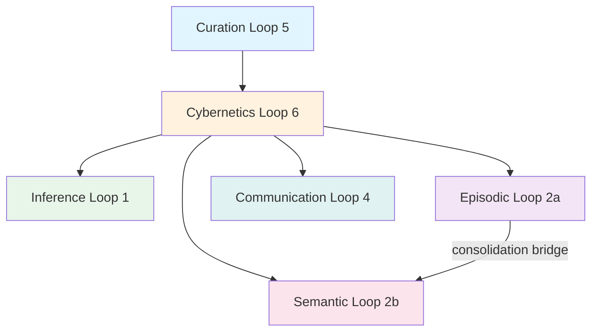
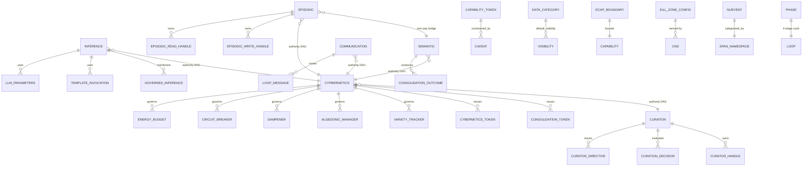
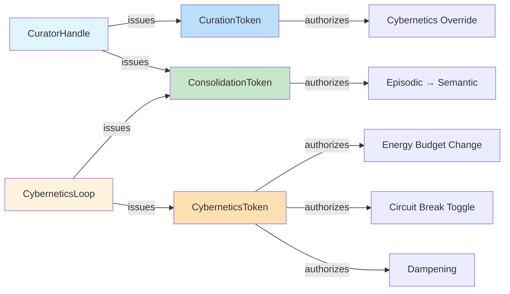

# hKask Distillation ERD

**Version:** v0.22.0 (post-distillation)
**Status:** Active — reflects the codebase after semantic distillation

## Authority DAG

No sideways edges. Authority flows downward. The consolidation bridge (EPI→SEM) is one-way, gated by `ConsolidationToken`.

## Core Entity Relationships

## Capability Token Authority Flow

## Distillation Changes Summary

| # | Change | Root Cause | Loop |
|---|--------|-----------|------|
| 1 | Remove `LoopId::External` | Dead variant, zero consumers | Cross-cutting |
| 2 | Replace `SpanCategory` enum with `SpanNamespace` newtype | Structural duplication, OCP violation | Cybernetics |
| 3 | Add `Phase::Compare`, rename `Observe→Sense`, `Regulate→Compute`, `Outcome→Act` | Phase didn't match 4-stage cycle | Cross-cutting |
| 4 | Move `SoapInferenceConfig` I/O to CLI, keep `InferenceConfig` in types | Types crate had I/O and config | Inference |
| 5 | Remove `AuthorityLevel` enum | OCAP anti-pattern (Implicit authority) | Curation |
| 6 | Add ZST capability tokens (`CyberneticsToken`, `CurationToken`, `ConsolidationToken`) | String-based capability forgery | Cybernetics |
| 9 | Enforce AUTHORITY_ORDER in LoopSystem tick | Loops ticked in registration order, not authority order | Cross-cutting |
| 15 | Remove speculative `AgentDefinition` fields | P6: delete stubs, don't publish | Curation |
| 16 | Move `KillZoneDetector` logic to CNS, keep `KillZoneConfig` in types | Regulation logic in type crate | Cybernetics |
| 17 | Add `DataCategory::default_visibility()` | Scattered visibility mapping | Cybernetics |
| 18 | Wire `ConsolidationToken` into `ConsolidationPort` | One-way bridge had no capability gate | Cybernetics |