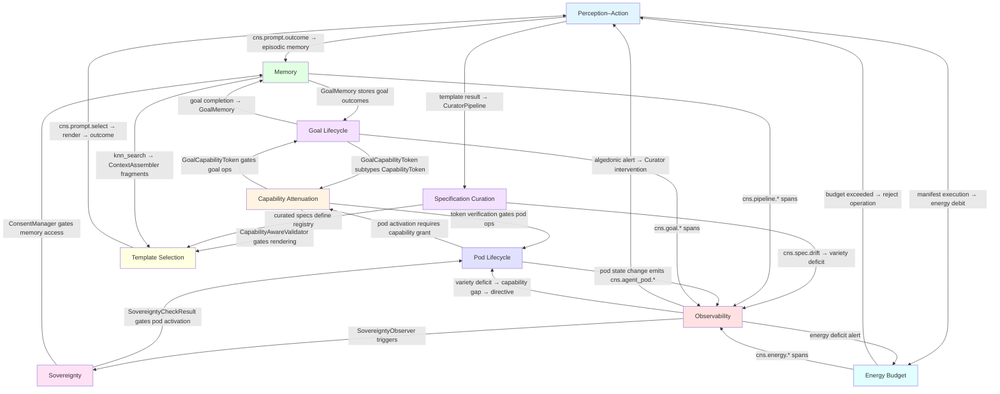
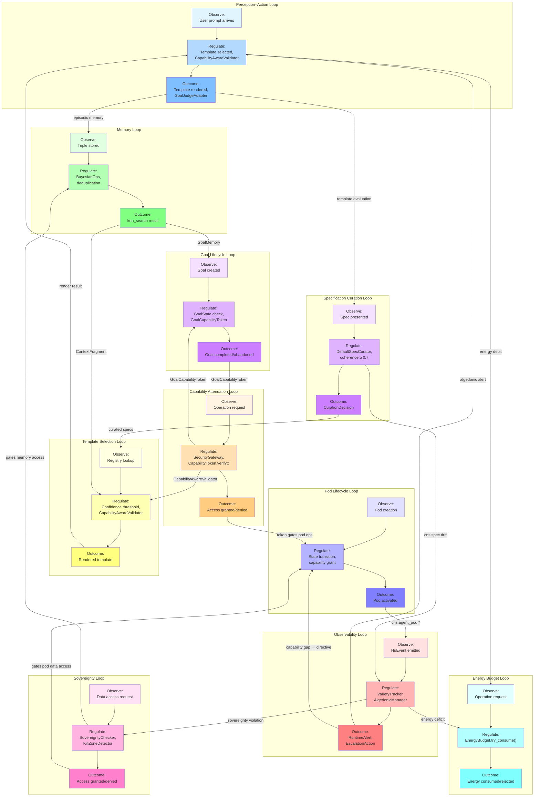

# hKask Feedback Loops and System Decomposition

**Version:** 0.21.0 · **Status:** Active · **Grounded in:** Rust source, DDMVSS spec, CNS ERD

> *As simple as possible, but no simpler. The loops close because reality closes.*
> *ℏKask — A Minimal Viable Container for Agents*

---

## Task 1 — Identify the Loops: Semantic Decomposition into Cybernetic Feedback Cycles

### Loop 1: The Perception–Action Loop

**Purpose:** Transform user/agent input into structured output via template selection and execution, with episodic memory feedback.

**Input source:** User prompt or agent dispatch → `kask chat` / `EnsembleChat.dispatch_to_bot()`
**Output sink:** Template render result → `TemplateOutcome` (Success/Failure/Merged/Discarded) → episodic memory
**Evaluation:** `GoalJudgeAdapter` + `GoalVerifier` compare outcome against goal criteria; `CuratorPipeline.evaluate_invocation()` assesses quality against OCAP boundaries and sovereignty constraints.
**Improvement mechanism:** `CuratorPipeline` issues `CurationDecision` (Merge/Discard/Revise/Defer); variety counter tracks result diversity; `AlgedonicManager` escalates deficit; Curator revises template selection.

**RDF triples:**

```
:PerceptionAction_Loop  a                :FeedbackLoop ;
    :hasInput           "UserPrompt" ;
    :hasOutput          "TemplateOutcome" ;
    :hasEvaluation      :GoalJudgeAdapter ;
    :hasFeedbackPath    "cns.prompt.select → cns.prompt.render → cns.prompt.outcome → episodic memory" ;
    :hasImprovement     :CuratorPipeline ;
    :instantiates       :ObserveRegulateOutcome .

:PerceptionAction_Loop  :entryPoint       :InferencePort ;
    :span              "cns.prompt.*" ;
    :sourceType        "TemplateInvocation" .
```

**Implementation status:** ✅ Implemented — `ManifestExecutorImpl::execute()` orchestrates Select→Populate→Execute steps with CNS span emission. `CuratorPipeline` evaluates outcomes. `GoalJudgeAdapter` exists (heuristic stub, LLM path documented).

---

### Loop 2: The Capability Attenuation Loop

**Purpose:** Ensure Principle of Least Authority (POLA) by minting, attenuating, and revoking capability tokens.

**Input source:** Root authority mints `CapabilityToken` (attenuation_level=0)
**Output sink:** Attenuated child token (attenuation_level+1, capped at 7) or revocation
**Evaluation:** `SecurityGateway.verify_capability()` + `CapabilityToken.verify()` + `CapabilityToken.verify_cryptographic()` compare requested operation against token scope. `CapabilityAwareValidator` gates template rendering.
**Improvement mechanism:** Revocation via `RevocationStore` (persistent SQLite); `ExpiryEnforcer` auto-expires tokens; `OCAP::verify_attenuation_chain()` checks chain integrity; CNS `cns.cap.*` spans (emitted via `SecurityGateway.audit()`) track drift.

**RDF triples:**

```
:CapabilityAttenuation_Loop  a                :FeedbackLoop ;
    :hasInput           "RootAuthority mint" ;
    :hasOutput          "Attenuated CapabilityToken | Revocation" ;
    :hasEvaluation      :SecurityGateway ;
    :hasFeedbackPath    "cns.tool.rate_limit_exceeded / cns.tool.unauthorized → RevocationStore" ;
    :hasImprovement     "Attenuation narrows scope; CNS spans track drift" ;
    :instantiates       :ObserveRegulateOutcome .

:CapabilityAttenuation_Loop  :entryPoint       :SovereigntyPort ;
    :attenuation       "CapabilityToken.attenuate() depth+1, max=7" ;
    :revocation        "RevocationStore (SQLite HMAC invalidation)" ;
    :auditTrail        "SecurityGateway.audit() → cns.tool.* spans" .
```

**Implementation status:** ✅ Implemented — `CapabilityToken` with HMAC-SHA256, `attenuate()`, `verify_cryptographic()`, `OCAP` struct with `AttenuationHistory`, `RevocationStore` (SQLite), `SecurityGateway` with rate limiting + audit log, `CapabilityAwareValidator` for template gating.

---

### Loop 3: The Specification Curation Loop (MVSDD)

**Purpose:** Ensure specifications remain coherent, complete, and operationally grounded through iterative evaluate→reconcile→cultivate cycles.

**Input source:** `Goal` specified from domain → `Spec` composed with goals and criteria
**Output sink:** `SpecCurationRecord` with decision (Merge/Revise/Defer/Discard) and coherence score
**Evaluation:** `DefaultSpecCurator::evaluate()` compares `spec.coherence()` (weighted average of goal satisfaction × sub-goal coherence) against threshold (0.7). `Spec::is_complete()` checks all criteria satisfied. `Spec::collection_coherence()` measures cross-category coverage.
**Improvement mechanism:** `CurationDecision` drives the loop: Merge (accept), Revise (loop back), Defer (delay), Discard (reject). `Cultivate` returns collection coherence if ≥ threshold.

**RDF triples:**

```
:SpecificationCuration_Loop  a                :FeedbackLoop ;
    :hasInput           "Goal from domain" ;
    :hasOutput          "SpecCurationRecord" ;
    :hasEvaluation      :DefaultSpecCurator ;
    :hasFeedbackPath    "cns.spec.* → AlgedonicEscalationAdapter → cns.spec.drift" ;
    :hasImprovement     "CurationDecision: Merge/Revise/Defer/Discard" ;
    :instantiates       :ObserveRegulateOutcome .

:SpecificationCuration_Loop  :entryPoint       :SpecCurator ;
    :threshold          "0.7 (coherence)" ;
    :span              "cns.spec.*" .
```

**Implementation status:** ✅ Core implemented — `DefaultSpecCurator` with `evaluate/reconcile/cultivate`. ⚠️ Gaps: no unified `mvsdd_cycle` orchestration function; `CompletenessCheck` is methods on `Spec`/`GoalSpec` (no trait); `cns.spec.drift` span exists in `AlgedonicEscalationAdapter` but the feedback loop comparing spec goals against actual implementation state is not built.

---

### Loop 4: The Observability Loop

**Purpose:** Detect variety deficit and sovereignty violations; escalate to Curator/human when the system cannot self-regulate.

**Input source:** Any `NuEvent` emission with `Phase::Observe`
**Output sink:** `RuntimeAlert` (Info/Warning/Critical) → `EscalationAction` (CalibrateThreshold/TriggerKata/EscalateToHuman)
**Evaluation:** `VarietyTracker` counts distinct states per domain; `AlgedonicManager.check()` computes `deficit = expected_variety.saturating_sub(variety)`; severity is auto-classified: Info (deficit ≤ threshold/2), Warning (> threshold/2), Critical (> threshold). `BotMetricsCollector` computes `success_rate`, `variety_deficit`, `sovereignty_violations` per bot.
**Improvement mechanism:** `AlgedonicEscalationAdapter.process_alert()` produces `EscalationAction`; `CalibrationRecord` tracks threshold adjustments; `CnsRuntime.subscribe()` enables headless escalation callbacks.

**RDF triples:**

```
:Observability_Loop  a                :FeedbackLoop ;
    :hasInput           "NuEvent (Phase::Observe)" ;
    :hasOutput          "RuntimeAlert → EscalationAction" ;
    :hasEvaluation      "VarietyTracker + AlgedonicManager" ;
    :hasFeedbackPath    "cns.* → VarietyCounter → AlgedonicManager → CnsRuntime.subscribe()" ;
    :hasImprovement     "CalibrateThreshold | TriggerKata | EscalateToHuman" ;
    :instantiates       :ObserveRegulateOutcome .

:Observability_Loop  :span              "cns.variety.* / cns.killzone.* / cns.energy.*" ;
    :threshold          "deficit > 100 (default)" ;
    :severityScale      "Info ≤50, Warning 51-100, Critical >100" .
```

**Implementation status:** ✅ Fully implemented — `CnsRuntime` with `AlgedonicManager`, `VarietyTracker`, `VarietyMonitor`, `BotMetricsCollector`, `SovereigntyObserver`, `AlgedonicEscalationAdapter`, `EnergyBudget`, `GoalVarietyMonitor`. ⚠️ Gap: automated remediation is Curator-directed only (`applied: false` until `mark_applied()`); no autonomous remediation loop.

---

### Loop 5: The Memory Loop

**Purpose:** Store episodic experiences, distill semantic knowledge, and retrieve context for future prompts.

**Input source:** `Triple` stored with `perspective: Some(WebID)` (episodic) or `perspective: None` (semantic)
**Output sink:** `KnnResult` from `EmbeddingStore::knn_search()` → `ContextAssembler` fragment
**Evaluation:** `BayesianOps::combine/retract/join/decay` adjusts confidence scores; `Triple.confidence` field enables probabilistic reasoning; `recall_dedup` removes duplicates via BLAKE3 EAV hash.
**Improvement mechanism:** `SemanticMemory::consolidate()` promotes episodic triples to semantic (strips perspective, deduplicates); `BayesianOps::decay()` reduces confidence over time; `ContextAssembler` prioritizes fragments by `priority` field and enforces token budget.

**RDF triples:**

```
:Memory_Loop  a                :FeedbackLoop ;
    :hasInput           "Episodic Triple (perspective=Some)" ;
    :hasOutput          "KnnResult → ContextFragment" ;
    :hasEvaluation      "BayesianOps (confidence adjustment)" ;
    :hasFeedbackPath    "cns.pipeline.* → consolidation → knn_search → context assembly" ;
    :hasImprovement     "Episodic→semantic promotion; confidence decay" ;
    :instantiates       :ObserveRegulateOutcome .

:Memory_Loop  :entryPoint       :MemoryStoragePort ;
    :persistence        "SQLCipher + sqlite-vec (bitemporal triples)" ;
    :span              "cns.pipeline.*" .
```

**Implementation status:** ✅ Core implemented — `TripleStore`, `EmbeddingStore`, `SemanticMemory`, `EpisodicMemory`, `BayesianOps`, `recall_dedup`, `GoalMemory`. ❌ Gap: no explicit feedback mechanism from recall relevance back to template selection — `MemoryStorageAdapter` provides one-directional query access; `MemoryFragment.confidence` is never consumed by `CuratorPipeline` or the template engine.

---

### Loop 6: The Template Selection Loop

**Purpose:** Select the best-fit template from the registry, render it with assembled context, and evaluate the outcome.

**Input source:** Raw input → `ManifestExecutorImpl::execute()` with `SelectorConfig`
**Output sink:** Rendered template output → `TemplateInvocation.outcome`
**Evaluation:** Selector model confidence vs. `SelectorConfig.confidence_threshold` (default 0.3); fallback to higher model tier (Balanced → Reasoning); `CapabilityAwareValidator.validate()` gates required capabilities.
**Improvement mechanism:** Low confidence → `ConfidenceRouter.generate_with_escalation()` escalates model; `CuratorPipeline.evaluate_quality()` discards failures and merges successes; variety counter tracks template diversity.

**RDF triples:**

```
:TemplateSelection_Loop  a                :FeedbackLoop ;
    :hasInput           "Raw user/agent input" ;
    :hasOutput          "Rendered template output (TemplateOutcome)" ;
    :hasEvaluation      "SelectorConfig.confidence_threshold + CapabilityAwareValidator" ;
    :hasFeedbackPath    "cns.prompt.select → cns.prompt.render → cns.prompt.outcome" ;
    :hasImprovement     "Model escalation; CurationDecision; variety tracking" ;
    :instantiates       :ObserveRegulateOutcome .

:TemplateSelection_Loop  :entryPoint       :InferencePort ;
    :fallback           "Fast → Balanced → Reasoning model tier" ;
    :span              "cns.prompt.select / cns.prompt.render / cns.prompt.outcome" .
```

**Implementation status:** ✅ Implemented — `ManifestExecutorImpl` with Select→Populate→Execute steps, `SelectorConfig` with confidence threshold, `ContextAssembler` with BLAKE3 dedup and token budget, `CapabilityAwareValidator`, `ConfidenceRouter` with model escalation. `CuratorPipeline` evaluates outcomes.

---

### Loop 7: The Pod Lifecycle Loop

**Purpose:** Manage agent pod creation, registration, activation, and deactivation with capability-gated state transitions.

**Input source:** `PodManager::create_pod()` from CLI/API/ensemble
**Output sink:** `PodLifecycleState::Deactivated` with CNS audit trail
**Evaluation:** State machine enforcement — each transition checks `can_transition_to()`; capability token gates each operation; `SovereigntyChecker` gates data access.
**Improvement mechanism:** Capability revocation suspends pod (via ACP `revoke_capability`); re-grant reactivates; `Deactivated` is terminal; `EnergyBudget` gates operations; `BotMetricsCollector` identifies capability gaps and produces `BotDirective`s.

**RDF triples:**

```
:PodLifecycle_Loop  a                :FeedbackLoop ;
    :hasInput           "PodManager::create_pod()" ;
    :hasOutput          "PodLifecycleState::Deactivated" ;
    :hasEvaluation      "PodLifecycleState::can_transition_to()" ;
    :hasFeedbackPath    "cns.agent_pod.* → BotMetricsCollector → EvaluationResult" ;
    :hasImprovement     "Capability re-grant reactivates; timeout terminates" ;
    :instantiates       :ObserveRegulateOutcome .

:PodLifecycle_Loop  :entryPoint       :AcpPort ;
    :states             "Populated → Registered → Activated → Deactivated" ;
    :span              "cns.agent_pod.*" .
```

**Implementation status:** ✅ Fully implemented — `PodManager` with `create_pod/activate_pod/deactivate_pod`, `PodLifecycleState` enum with `can_transition_to()`, `AgentPod` with HKDF-SHA256 OCAP secret derivation, `AcpRuntime` for registration and capability management. **Design decision:** Goal state and pod state are intentionally independent — pod deactivation does not cascade to goal blocking because goals are data records (not running processes), capability token revocation already prevents deactivated pods from acting on goals, and other agents may continue working on the same goal.

---

### Loop 8: The Sovereignty Loop

**Purpose:** Enforce user data sovereignty boundaries — no data access without consent, acquisition resistance, and kill-zone detection.

**Input source:** User action → `SovereigntyChecker.check(data_category, operation, requester)`
**Output sink:** `SovereigntyCheckResult { allowed, denial_reason, data_category, operation }`
**Evaluation:** `DataSovereigntyBoundary` classifies data into sovereign/shared/public; `AcquisitionResistance` blocks passive acquisition; `KillZoneDetector` triggers when `acquisition_attempt && vc_investment < threshold`.
**Improvement mechanism:** `ConsentManager.grant_consent()` / `revoke_consent()` updates access state; `SovereigntyObserver` tracks acquisition attempts and violation counts; algedonic alerts trigger at thresholds (5 acquisition attempts, 3 violations).

**RDF triples:**

```
:Sovereignty_Loop  a                :FeedbackLoop ;
    :hasInput           "Data access request" ;
    :hasOutput          "SovereigntyCheckResult" ;
    :hasEvaluation      "DataSovereigntyBoundary + KillZoneDetector" ;
    :hasFeedbackPath    "cns.sovereignty.* → SovereigntyObserver → AlgedonicManager" ;
    :hasImprovement     "Consent grant/revoke; acquisition resistance update" ;
    :instantiates       :ObserveRegulateOutcome .

:Sovereignty_Loop  :entryPoint       :SovereigntyPort ;
    :boundary           "DataCategory classification (sovereign/shared/public)" ;
    :killZone           "acquisition_attempt && vc_investment < threshold" ;
    :span              "cns.sovereignty.* / cns.killzone.*" .
```

**Implementation status:** ✅ Fully implemented — `SovereigntyChecker` with `check()`, `UserSovereigntyState`, `KillZoneDetector`, `ConsentManager`, `SovereigntyObserver` with threshold-based alerting, `SovereigntyPort` trait. `SpanScope` enforces capability-scoped emissions (out-of-scope → `Sovereignty("alert.boundary_violation")`).

---

### Loop 9: The Goal Lifecycle Loop

**Purpose:** Manage goal creation, activation, blocking, completion, and abandonment with capability-gated transitions.

**Input source:** `Goal` created in `Pending` state via CLI/API
**Output sink:** Terminal states `Completed` / `Abandoned` with `GoalArtifact` and `GoalEpisodicMemory`
**Evaluation:** `GoalState::can_transition_to()` enforces state machine; `GoalCapabilityToken` gates operations; `GoalAccess::can_write()` checks visibility; `GoalVerifier` + `GoalJudgeAdapter` evaluate completion criteria.
**Improvement mechanism:** Goal decomposition into sub-goals (max depth 7); `GoalMemory::record_goal_completion()` stores semantic + episodic memories; `GoalVarietyMonitor` detects when goal count exceeds threshold.

**RDF triples:**

```
:GoalLifecycle_Loop  a                :FeedbackLoop ;
    :hasInput           "Goal created in Pending state" ;
    :hasOutput          "Completed/Abandoned GoalArtifact + GoalEpisodicMemory" ;
    :hasEvaluation      "GoalState::can_transition_to() + GoalCapabilityToken + GoalVerifier" ;
    :hasFeedbackPath    "cns.goal.* → GoalVarietyMonitor → AlgedonicManager" ;
    :hasImprovement     "Sub-goal decomposition; episodic→semantic memory promotion" ;
    :instantiates       :ObserveRegulateOutcome .

:GoalLifecycle_Loop  :entryPoint       "GoalCapabilityToken" ;
    :states             "Pending → Active → Completed/Blocked/Abandoned" ;
    :span              "cns.goal.*" .
```

**Implementation status:** ✅ Core implemented — `Goal`, `GoalState` with `can_transition_to()`, `GoalCapabilityToken` with HMAC-SHA256 and `GoalRevoker` membrane, `GoalJudgeAdapter` (heuristic), `GoalVerifier`, `GoalMemory` with semantic + episodic recording. `GoalVarietyMonitor` detects overload. ⚠️ Gap: `GoalJudgeAdapter.call_inference()` is a heuristic stub (keyword matching); the LLM inference path is documented but not wired.

---

### Additional Loop: The Energy Budget Loop

**Purpose:** Gate resource consumption by energy budget with alert thresholds and Curator-directed adjustment.

**Input source:** Operation request → `EnergyBudget::try_consume()`
**Output sink:** Energy consumed or `EnergyError::BudgetExceeded`
**Evaluation:** `EnergyBudget.should_alert()` checks usage ratio ≥ `alert_threshold` (default 0.8); `BotMetricsCollector` detects `EnergyBudgetCritical` when utilization > 90%.
**Improvement mechanism:** `DirectiveType::AdjustEnergyBudget` allows Curator to recalibrate; `CalibrationConfig.adjust_energy_on_success` for automatic adjustment; `OpportunityCost` tracking for cost-benefit analysis.

**RDF triples:**

```
:EnergyBudget_Loop  a                :FeedbackLoop ;
    :hasInput           "Operation request (estimated tokens)" ;
    :hasOutput          "Energy consumed or BudgetExceeded error" ;
    :hasEvaluation      "EnergyBudget.remaining / cap ratio" ;
    :hasFeedbackPath    "cns.energy.allocate → cns.energy.consume → cns.energy.deficit" ;
    :hasImprovement     "Curator-directed budget adjustment via DirectiveType" ;
    :instantiates       :ObserveRegulateOutcome .
```

**Implementation status:** ✅ Implemented — `EnergyBudget` with `try_consume()`, `should_alert()`, `EnergyAccount`, `OpportunityCost`, `ManifestExecutorImpl` energy accounting per step (Select=100, Populate=50, Execute=500). ⚠️ Gap: no adaptive throttling loop — budget rejection is hard (`hard_limit: true`), no automatic load-shedding or priority queue.

---

## Task 2 — Root-Cause Drilldown: Why Each Loop Exists and What Drives It

| Loop | Root Driver (`predicate`) | Failure Mode if Absent | DDMVSS Principle |
|------|---------------------------|----------------------|-------------------|
| Perception–Action | `hasGoal` | Agent acts without purpose — no template selection, no outcome measurement | P4 (Essential Tools) |
| Capability Attenuation | `constrains` | Ambient authority — any agent can do anything (POLA violation) | C5 (OCAP boundaries) |
| Specification Curation | `curates` | Specs become stale; no feedback between specification and operation | C7 (curation debt) |
| Observability | `satisfies` (completeness) | No way to detect variety deficit or sovereignty violation; system runs blind | P5 (CNS anchor) |
| Memory | `grounds` | Agent loses episodic context; no learning from experience | P3 (User Sovereignty — private memory) |
| Template Selection | `enables` | System has capabilities no one can exercise; dead functionality | P2 (Agent Enablement) |
| Pod Lifecycle | `belongsToDomain` | Agents exist without bounded context; scope creep across pods | C1 (bounded context) |
| Sovereignty | `constrains` (boundary) | User data shared without consent; Magna Carta violated | P3 (User Sovereignty) |
| Goal Lifecycle | `composesInto` | Goals cannot compose or decompose; no incremental progress | C4 (composition) |
| Energy Budget | `constrains` (resource) | Unbounded resource consumption; system starvation | C5 (OCAP — resource attenuation) |

---

## Task 3 — Loop Interconnection: Connect Every Loop to Every Other Loop It Touches



**Interconnection detail table:**

| From → To | Connection | Mechanism |
|-----------|------------|-----------|
| Perception–Action → Memory | Outcome storage | `cns.prompt.outcome` → episodic `Triple` storage |
| Perception–Action → Specification Curation | Template result evaluation | `CuratorPipeline.evaluate_invocation()` |
| Capability Attenuation → Pod Lifecycle | Token gates | `AgentPod.delegate()` creates child tokens; revocation triggers suspension |
| Capability Attenuation → Template Selection | Rendering gates | `CapabilityAwareValidator.validate()` checks `required_capabilities` |
| Capability Attenuation → Goal Lifecycle | Goal capability tokens | `GoalCapabilityToken` is a subtype of `CapabilityToken` |
| Specification Curation → Template Selection | Registry population | `Spec` defines `required_capabilities`; curated specs populate registry |
| Specification Curation → Observability | Drift detection | `cns.spec.drift` span + `compute_spec_drift()` |
| Observability → Perception–Action | Alert escalation | `AlgedonicEscalationAdapter` → Curator → revised template selection |
| Observability → Pod Lifecycle | Capability gap detection | `BotMetricsCollector` → `EvaluationResult` → `BotDirective` |
| Observability → Sovereignty | Boundary violation detection | `SovereigntyObserver` processes acquisition/violation events |
| Observability → Energy Budget | Deficit alerts | `EnergyBudget.should_alert()` → `cns.energy.deficit` |
| Memory → Template Selection | Context assembly | `EmbeddingStore::knn_search()` → `ContextFragment` → `ContextAssembler` |
| Memory → Goal Lifecycle | Goal outcome storage | `GoalMemory::record_goal_completion()` |
| Sovereignty → Pod Lifecycle | Activation gate | `SovereigntyChecker.check()` before pod data access |
| Sovereignty → Memory | Access control | `DataCategory` classification gates `MemoryStoragePort.recall()` |
| Goal Lifecycle → Capability Attenuation | Goal-scoped authority | `GoalCapabilityToken` with `GoalOp`-specific operations |
| Pod Lifecycle → Observability | State change telemetry | `cns.agent_pod.*` spans per state transition |
| Energy Budget → Perception–Action | Consumption gate | `EnergyBudget::try_consume()` rejects when exhausted |

**Orphan check:** No loop is an orphan — every loop has at least 2 feedback paths and 1 evaluation element.

---

## Task 4 — Evaluation Elements: What Compares Actual vs. Desired in Each Loop

| Loop | Evaluation Element | hKask Implementation | Improvement Mechanism |
|------|-------------------|---------------------|----------------------|
| Perception–Action | Template outcome vs. goal criteria | `GoalJudgeAdapter` + `GoalVerifier` (heuristic stub; LLM path documented) | Curator revises template selection based on episodic outcome via `CuratorPipeline` |
| Capability Attenuation | Token scope vs. requested operation | `SecurityGateway.verify_capability()` + `CapabilityToken.verify_cryptographic()` | Attenuation narrows scope; `RevocationStore` invalidates; `cns.tool.*` spans track drift |
| Specification Curation | Coherence score vs. threshold (0.7) | `DefaultSpecCurator::evaluate()` + `Spec::coherence()` + `Spec::collection_coherence()` | `CurationDecision` (Merge/Revise/Defer/Discard); `cultivate()` returns coherence |
| Observability | Variety counter vs. threshold (100/500) | `VarietyTracker::deficit()` + `AlgedonicManager::check()` + `BotMetricsCollector` | `CalibrateThreshold` / `TriggerKata` / `EscalateToHuman` via `AlgedonicEscalationAdapter` |
| Memory | Retrieval relevance (cosine similarity) | `EmbeddingStore::knn_search()` + `BayesianOps::combine/retract/decay` | Episodic→semantic promotion via `consolidate()`; confidence decay via `BayesianOps::decay()` |
| Template Selection | Selector confidence vs. tier threshold (0.3) | `SelectorConfig.confidence_threshold` + `CapabilityAwareValidator` | Model escalation via `ConfidenceRouter`; variety counter tracks template diversity |
| Pod Lifecycle | Pod state vs. desired state | `PodLifecycleState::can_transition_to()` + `AcpRuntime::verify_capability()` | Capability re-grant reactivates; `BotDirective` from `EvaluationResult`; timeout terminates |
| Sovereignty | Data access vs. `DataSovereigntyBoundary` | `SovereigntyChecker::check()` + `KillZoneDetector` + `ConsentManager` | `grant_consent()`/`revoke_consent()`; `SovereigntyObserver` threshold alerts |
| Goal Lifecycle | Criteria satisfaction vs. goal state | `GoalState::can_transition_to()` + `GoalCapabilityToken` + `GoalVerifier` | Sub-goal decomposition (max depth 7); `GoalMemory::record_goal_completion()` |
| Energy Budget | Energy consumed vs. cap ratio | `EnergyBudget::should_alert()` (threshold 0.8) + `try_consume()` | Curator-directed `AdjustEnergyBudget` directive; `OpportunityCost` tracking |

---

## Task 5 — Capability-Boundary Composition: OCAP Membrane Design per Loop

### Loop 1: Perception–Action

```
PerceptionAction_Loop  entryPoint       InferencePort
PerceptionAction_Loop  attenuation      CapabilityAwareValidator (depth+1 per template cascade)
PerceptionAction_Loop  revocation       RevocationStore (capability_token HMAC invalidation)
PerceptionAction_Loop  auditTrail      cns.prompt.select → cns.prompt.render → cns.prompt.outcome
```

**Membrane entry:** `InferencePort` trait — the only authorized way to invoke LLM inference.
**Attenuation:** `ManifestExecutorImpl` attenuates the capability token at each cascade level (max depth 7, per ADR-025). `CapabilityAwareValidator` checks `required_capabilities` against the token's `CapabilityResource`.
**Revocation:** `RevocationStore` persists revocation in SQLite; `HMAC-SHA256` verification detects tampering.
**Audit:** `SpanEmitter` emits `cns.prompt.*` spans at each step.

### Loop 2: Capability Attenuation

```
CapabilityAttenuation_Loop  entryPoint       RootAuthority (mint root token)
CapabilityAttenuation_Loop  attenuation      OCAP::attenuate_with_history() (level+1, max=7)
CapabilityAttenuation_Loop  revocation       RevocationStore + GoalRevoker (AtomicBool liveness)
CapabilityAttenuation_Loop  auditTrail      SecurityGateway.audit() → cns.tool.unauthorized / cns.tool.completed
```

**Membrane entry:** `RootAuthority` creates root tokens with `attenuation_level=0`.
**Attenuation:** `OCAP::attenuate_with_history()` creates child tokens with `level+1`, tracking chain in `AttenuationHistory`. Max depth 7 (`SYSTEM_MAX_ATTENUATION`).
**Revocation:** `RevocationStore` (SQLite) for general tokens; `GoalRevoker` (Miller membrane with `AtomicBool`) for goal tokens — once revoked, no new children can be produced.
**Audit:** `SecurityGateway.audit()` records to `AuditLogPort` + `CnsEmit`.

### Loop 3: Specification Curation

```
SpecificationCuration_Loop  entryPoint       SpecCurator trait (evaluate/reconcile/cultivate)
SpecificationCuration_Loop  attenuation      OCAPBoundary (Explicit/Implicit/Denied) per CurationRecord
SpecificationCuration_Loop  revocation       CurationDecision::Discard (revokes spec from collection)
SpecificationCuration_Loop  auditTrail       SpecObserver::emit_span() → cns.spec.* → cns.spec.drift
```

**Membrane entry:** `SpecCurator` trait — the only authorized way to evaluate specs.
**Attenuation:** `OCAPBoundary` on each `SpecCurationRecord` — `AuthorityLevel::Denied` blocks, `Explicit` requires capability token, `Implicit` allows if holder has `spec:write`.
**Revocation:** `CurationDecision::Discard` removes spec from the collection; `CurationDecision::Revise` sends back for rework.
**Audit:** `SpecObserver::emit_span()` emits `cns.spec.*`; `AlgedonicEscalationAdapter` emits `cns.spec.drift` on Critical alerts.

### Loop 4: Observability

```
Observability_Loop  entryPoint       CnsEmit trait / SpanEmitter
Observability_Loop  attenuation      SpanScope (allowed_categories per domain)
Observability_Loop  revocation       Out-of-scope emission → cns.sovereignty.alert.boundary_violation
Observability_Loop  auditTrail       cns.variety.* → AlgedonicManager → RuntimeAlert → EscalationAction
```

**Membrane entry:** `CnsEmit` trait — all telemetry flows through `emit_event(span, phase, observation, confidence)`.
**Attenuation:** `SpanScope` restricts emission categories per domain (e.g., `mcp` can only emit `Tool` category). Out-of-scope emissions trigger sovereignty violation.
**Revocation:** Sovereignty violation alerts are emitted and tracked by `SovereigntyObserver`; threshold violations trigger algedonic escalation.
**Audit:** `NuEvent` records with `Phase::Observe/Regulate/Outcome`; `VarietyTracker` accumulates; `AlgedonicManager` checks deficit.

### Loop 5: Memory

```
Memory_Loop  entryPoint       MemoryStoragePort trait
Memory_Loop  attenuation      CapabilityToken.action (Read/Write/Execute) gates storage and recall
Memory_Loop  revocation       ⚠️ UNDERSPECIFIED — no explicit memory-specific revocation membrane
Memory_Loop  auditTrail       cns.pipeline.* spans (store, recall, consolidate operations)
```

**Membrane entry:** `MemoryStoragePort` trait — `store_artifact()` and `recall()` require a `CapabilityToken`.
**Attenuation:** `MemoryStorageAdapter` checks `CapabilityToken.action` — `Read` action cannot write; `Write`/`Execute`/`Validate` required for storage; `Read`/`Execute`/`Validate` required for recall.
**⚠️ Gap:** No explicit memory-specific revocation membrane. Memory triples are soft-deleted (`valid_to=now`) but there's no `MemoryRevoker` analogous to `GoalRevoker`. The `DataCategory` classification (`EpisodicMemory` = sovereign, `SemanticMemory` = shared) provides access control via `SovereigntyChecker`, but the revocation path is indirect.
**Audit:** `cns.pipeline.*` spans track store/recall/consolidate operations.

### Loop 6: Template Selection

```
TemplateSelection_Loop  entryPoint       InferencePort + RegistryIndex
TemplateSelection_Loop  attenuation      CapabilityAwareValidator (required_capabilities check)
TemplateSelection_Loop  revocation       CuratorPipeline CurationDecision::Discard revokes template from output
TemplateSelection_Loop  auditTrail       cns.prompt.select → cns.prompt.render → cns.prompt.outcome
```

**Membrane entry:** `InferencePort` for model invocation; `RegistryIndex` for template lookup.
**Attenuation:** `CapabilityAwareValidator` checks that the caller's capabilities intersect with the template's `required_capabilities`.
**Revocation:** `CuratorPipeline` issues `Discard` decisions; `CurationDecision::Revise` sends back for rework.
**Audit:** `cns.prompt.*` spans at each step of the manifest execution.

### Loop 7: Pod Lifecycle

```
PodLifecycle_Loop  entryPoint       AcpPort (register/unregister/send_message)
PodLifecycle_Loop  attenuation      AgentPod.delegate() (attenuation_level+1, max=7)
PodLifecycle_Loop  revocation       AcpRuntime.revoke_capability() → pod suspension
PodLifecycle_Loop  auditTrail       cns.agent_pod.populated → registered → activated → deactivated
```

**Membrane entry:** `AcpPort` trait — registration, messaging, capability management.
**Attenuation:** `AgentPod::delegate()` creates attenuated child tokens; `PodManager::activate_pod()` uses 3-phase locking to prevent state races.
**Revocation:** `AcpRuntime::revoke_capability()` revokes capabilities; `PodManager::deactivate_pod()` deactivates and persists event.
**Audit:** `cns.agent_pod.*` spans at each lifecycle transition.

### Loop 8: Sovereignty

```
Sovereignty_Loop  entryPoint       SovereigntyPort trait (can_access)
Sovereignty_Loop  attenuation      DataCategory classification (sovereign → shared → public)
Sovereignty_Loop  revocation       ConsentManager.revoke_consent() + KillZoneDetector
Sovereignty_Loop  auditTrail       cns.sovereignty.* + cns.killzone.* → SovereigntyObserver
```

**Membrane entry:** `SovereigntyPort` trait — `can_access(data_category, requester) → bool`.
**Attenuation:** `DataSovereigntyBoundary` classifies data into sovereign (requires explicit consent + owner match), shared (requires explicit consent), public (always allowed). `AcquisitionResistance` blocks passive acquisition.
**Revocation:** `ConsentManager::revoke_consent()` removes consent; `KillZoneDetector` triggers when acquisition attempt detected and VC investment drops below threshold.
**Audit:** `cns.sovereignty.*` and `cns.killzone.*` spans; `SovereigntyObserver` tracks acquisition attempts and violations.

### Loop 9: Goal Lifecycle

```
GoalLifecycle_Loop  entryPoint       GoalCapabilityToken (HMAC-SHA256 per operation)
GoalLifecycle_Loop  attenuation      GoalCapabilityToken.attenuate() (halved expiry, subset of GoalOps, level+1)
GoalLifecycle_Loop  revocation       GoalRevoker (AtomicBool liveness membrane)
GoalLifecycle_Loop  auditTrail       cns.goal.* → GoalVarietyMonitor → AlgedonicManager
```

**Membrane entry:** `GoalCapabilityToken` — every goal operation (`Create`, `Read`, `Update`, `Verify`, `Complete`, `CreateSubgoal`, `AddArtifact`) requires a valid token.
**Attenuation:** `GoalCapabilityToken::attenuate()` halves expiry, takes subset of operations, increments `attenuation_level` (max 7). Operations are canonicalized (sorted, deduped) before HMAC signing.
**Revocation:** `GoalRevoker` uses `AtomicBool` liveness flag — once revoked, no new child tokens can be produced. Existing children remain valid until expiry (Miller membrane pattern).
**Audit:** `cns.goal.*` spans; `GoalVarietyMonitor` detects overload (>10 active goals per user).

### Loop 10: Energy Budget

```
EnergyBudget_Loop  entryPoint       EnergyBudget::try_consume()
EnergyBudget_Loop  attenuation      EnergyAccount debit (cost_per_token, default 0.25)
EnergyBudget_Loop  revocation       ⚠️ PARTIAL — hard_limit=true rejects but no adaptive throttling
EnergyBudget_Loop  auditTrail       cns.energy.allocate → cns.energy.consume → cns.energy.deficit
```

**Membrane entry:** `EnergyBudget::try_consume()` — the only authorized way to consume energy.
**Attenuation:** `cost_per_token` (default 0.25) converts tokens to energy; `OpportunityCost` tracks alternative costs.
**⚠️ Gap:** `hard_limit: true` means `try_consume()` rejects when budget is exhausted, but there's no adaptive throttling — no priority queue, no load-shedding, no gradual rate reduction.
**Audit:** `cns.energy.*` spans track allocation, consumption, and deficit.

---

## Task 6 — Implementation Mapping: Crates, Types, and Code Patterns

| Loop | Primary Crate | Key Types | Key Functions | Port Trait |
|------|--------------|-----------|---------------|------------|
| Perception–Action | `hkask-templates` | `TemplateInvocation`, `ManifestStep`, `ProcessManifest`, `TemplateOutcome`, `ContextFragment` | `ManifestExecutorImpl::execute()`, `ContextAssembler::add()`, `TemplateRendererImpl::render()`, `CuratorPipeline::evaluate_invocation()` | `InferencePort`, `RegistryIndex`, `McpPort`, `CnsPort` |
| Capability Attenuation | `hkask-types` + `hkask-agents` + `hkask-mcp` | `CapabilityToken`, `CapabilityTokenBuilder`, `CapabilityResource`, `CapabilityAction`, `Caveat`, `OCAP`, `AttenuationHistory`, `SecurityGateway` | `CapabilityToken::attenuate()`, `OCAP::attenuate_with_history()`, `SecurityGateway::verify_capability()`, `RevocationStore::revoke()` | `SovereigntyPort`, `AuditLogPort` |
| Specification Curation | `hkask-types` + `hkask-storage` | `Spec`, `SpecCategory`, `GoalSpec`, `CurationDecision`, `SpecCurationRecord`, `OCAPBoundary` | `DefaultSpecCurator::evaluate()`, `DefaultSpecCurator::reconcile()`, `DefaultSpecCurator::cultivate()`, `Spec::coherence()`, `Spec::collection_coherence()` | `SpecStore`, `SpecCurator`, `SpecObserver` |
| Observability | `hkask-cns` | `NuEvent`, `Span`, `Phase`, `VarietyTracker`, `VarietyMonitor`, `AlgedonicManager`, `RuntimeAlert`, `AlertSeverity`, `CnsHealth`, `BotMetricsCollector`, `SovereigntyObserver` | `CnsRuntime::check_variety()`, `AlgedonicManager::check()`, `SpanEmitter::emit()`, `CnsRuntime::subscribe()`, `AlgedonicEscalationAdapter::process_alert()` | `CnsEmit`, `NuEventSink` |
| Memory | `hkask-memory` + `hkask-storage` | `Triple`, `Embedding`, `KnnResult`, `SemanticMemory`, `EpisodicMemory`, `BayesianOps`, `ContextFragment` | `TripleStore::insert()`, `EmbeddingStore::knn_search()`, `SemanticMemory::consolidate()`, `BayesianOps::combine()`, `ContextAssembler::add()` | `MemoryStoragePort` |
| Template Selection | `hkask-templates` | `SqliteRegistry`, `DependencyGraph`, `SelectorConfig`, `ManifestExecutorImpl`, `CapabilityAwareValidator`, `ContextAssembler` | `SqliteRegistry::get()`, `DependencyGraph::add_edge()`, `ManifestExecutorImpl::execute_step()`, `ConfidenceRouter::generate_with_escalation()` | `InferencePort`, `McpPort`, `RegistryIndex` |
| Pod Lifecycle | `hkask-agents` | `AgentPod`, `PodManager`, `PodLifecycleState`, `AgentPersona`, `PodContext` | `PodManager::create_pod()`, `AgentPod::register()`, `AgentPod::activate()`, `AgentPod::deactivate()`, `AgentPod::delegate()` | `AcpPort`, `MCPRuntimePort`, `MemoryStoragePort`, `CnsEmit` |
| Sovereignty | `hkask-types` + `hkask-agents` + `hkask-cns` | `DataCategory`, `DataSovereigntyBoundary`, `AcquisitionResistance`, `KillZoneDetector`, `SovereigntyChecker`, `ConsentManager`, `SovereigntyObserver` | `SovereigntyChecker::check()`, `ConsentManager::grant_consent()`, `ConsentManager::revoke_consent()`, `KillZoneDetector::check_kill_zone()`, `SovereigntyObserver::process_event()` | `SovereigntyPort` |
| Goal Lifecycle | `hkask-types` + `hkask-storage` | `Goal`, `GoalState`, `GoalCapabilityToken`, `GoalRevoker`, `GoalAccess`, `GoalJudgeAdapter`, `GoalVerifier` | `GoalState::can_transition_to()`, `GoalCapabilityToken::attenuate()`, `GoalJudgeAdapter::judge()`, `GoalVerifier::verify()`, `GoalMemory::record_goal_completion()` | `GoalJudgeAdapter`, `GoalVerifier` (no port trait — inherent methods) |
| Energy Budget | `hkask-cns` + `hkask-templates` | `EnergyBudget`, `EnergyAccount`, `OpportunityCost`, `EnergySpanType` | `EnergyBudget::try_consume()`, `EnergyBudget::should_alert()`, `EnergyAccount::debit()`, `ManifestExecutorImpl` energy accounting | (internal — no separate port trait) |

**Gaps flagged:**
- `GoalJudgeAdapter` / `GoalVerifier`: heuristic stub, LLM inference path documented but not wired
- `CompletenessCheck`: no trait, only inherent methods on `Spec` and `GoalSpec`
- `mvsdd_cycle`: no unified orchestration function
- Memory → Template Selection: no explicit feedback mechanism
- Pod → Goal cascade: no code connecting pod deactivation to goal blocking
- Algedonic → automated remediation: Curator-directed only, no autonomous loop
- Ensemble deliberation: no feedback from outcomes back to agent learning
- Energy Budget: no adaptive throttling, only hard rejection

---

## Task 7 — Verify Feedback Closure: Each Loop Has Evaluation, Feedback, and Improvement

| Loop | Evaluation? | Evidence | Feedback? | Evidence | Improvement? | Evidence |
|------|-------------|----------|-----------|----------|---------------|----------|
| Perception–Action | ✅ Yes | `GoalJudgeAdapter` + `CuratorPipeline.evaluate_quality()` | ✅ Yes | `cns.prompt.outcome` → episodic memory → `ContextAssembler` | ⚠️ Partial | Curator revises templates, but `GoalJudgeAdapter` is heuristic stub |
| Capability Attenuation | ✅ Yes | `SecurityGateway.verify_capability()` + `CapabilityToken.verify_cryptographic()` | ✅ Yes | `SecurityGateway.audit()` → `AuditLogPort` + `cns.tool.*` | ✅ Yes | Attenuation narrows scope; `RevocationStore` invalidates |
| Specification Curation | ✅ Yes | `DefaultSpecCurator::evaluate()` with coherence threshold 0.7 | ✅ Yes | `cns.spec.*` + `cns.spec.drift` spans | ✅ Yes | `CurationDecision` drives Merge/Revise/Defer/Discard |
| Observability | ✅ Yes | `VarietyTracker.deficit()` vs. threshold | ✅ Yes | `CnsRuntime.subscribe()` → escalation callbacks | ⚠️ Partial | Escalation produces `EscalationAction` but `applied: false` until Curator acts |
| Memory | ✅ Yes | `BayesianOps::combine/retract/decay` adjusts confidence | ✅ Yes | `cns.pipeline.*` spans track store/recall | ❌ No | No feedback from recall relevance back to template selection or model choice |
| Template Selection | ✅ Yes | `SelectorConfig.confidence_threshold` + `CapabilityAwareValidator` | ✅ Yes | `cns.prompt.select → cns.prompt.render → cns.prompt.outcome` | ✅ Yes | Model escalation via `ConfidenceRouter`; `CuratorPipeline` curation |
| Pod Lifecycle | ✅ Yes | `PodLifecycleState::can_transition_to()` + capability checks | ✅ Yes | `cns.agent_pod.*` spans per transition | ✅ Yes | Capability re-grant reactivates; `BotDirective` from evaluation |
| Sovereignty | ✅ Yes | `SovereigntyChecker::check()` + `KillZoneDetector` | ✅ Yes | `cns.sovereignty.*` + `SovereigntyObserver` threshold alerts | ✅ Yes | `ConsentManager::grant/revoke_consent()`; acquisition resistance update |
| Goal Lifecycle | ✅ Yes | `GoalState::can_transition_to()` + `GoalVerifier` | ✅ Yes | `cns.goal.*` spans + `GoalVarietyMonitor` | ⚠️ Partial | Sub-goal decomposition works; `GoalJudgeAdapter` is heuristic stub |
| Energy Budget | ✅ Yes | `EnergyBudget::should_alert()` (0.8 threshold) | ✅ Yes | `cns.energy.*` spans | ⚠️ Partial | Curator can adjust budget, but no adaptive throttling loop |

**Open loops identified:**
1. **Memory → Template Selection** (❌ No improvement): `knn_search` results flow into `ContextAssembler` but there's no mechanism to adjust template selection strategy based on recall relevance.
2. **Algedonic → Automated Remediation** (⚠️ Partial): Escalation produces actions but requires Curator approval (`applied: false`).
3. **Energy Budget → Adaptive Throttling** (⚠️ Partial): Hard rejection only, no gradual load-shedding.

---

## Task 8 — Minimal Recursive Core: The ℏ-Scale Loop

The smallest self-similar feedback loop that every other loop instantiates:

```
Observe → Regulate → Outcome
   ↑                         |
   |_________________________|
```

**Expressed in hKask types:**

```rust
NuEvent { phase: Observe,  span: Span, observation: Value }
  → NuEvent { phase: Regulate, span: Span, regulation: Value }
  → NuEvent { phase: Outcome,  span: Span, outcome: Value }
  → feeds back into next Observe
```

**Verification that every loop instantiates this pattern:**

| Loop | Observe | Regulate | Outcome | Span Variant |
|------|---------|----------|---------|--------------|
| Perception–Action | User input arrives | Template selected, capabilities validated | Template rendered, outcome judged | `Span::Prompt` |
| Capability Attenuation | Operation request | Token scope verified against operation | Access granted/denied, audit logged | `Span::Tool` |
| Specification Curation | Spec presented for evaluation | Coherence checked against threshold (0.7) | CurationDecision issued | `Span::Spec` |
| Observability | NuEvent emitted (Phase::Observe) | Variety deficit computed, algedonic check | Alert produced, escalation action | `Span::Variety` |
| Memory | Triple stored (episodic) | Deduplication, confidence adjustment | Semantic consolidation, knn_search result | `Span::Pipeline` |
| Template Selection | Registry lookup | Capability validation, confidence check | Template rendered, outcome emitted | `Span::Prompt` |
| Pod Lifecycle | Pod creation request | State transition validated, capabilities checked | Pod activated/deactivated, CNS event | `Span::AgentPod` |
| Sovereignty | Data access request | Boundary check, acquisition resistance | Access granted/denied, kill-zone alert | `Span::Sovereignty` |
| Goal Lifecycle | Goal created (Pending) | State transition checked, goal capability verified | Goal completed/abandoned | `Span::Goal` |
| Energy Budget | Operation request (estimated tokens) | Budget check (try_consume) | Energy consumed or rejected | `Span::Energy` |

**Structural gaps (loops that cannot fully express Observe→Regulate→Outcome):**

| Span | Gap | Description |
|------|-----|-------------|
| `cns.killzone.*` | ⚠️ Regulation phase underspecified | `KillZoneDetector` produces detection (Observe) and alert (Outcome), but the *regulation* (what corrective action closes the loop) is external (Curator/human) |
| `cns.energy.*` | ⚠️ Regulation phase underspecified | `try_consume()` is a gate, not a regulation — it rejects when over budget but doesn't adjust future consumption |
| `cns.review.*` | ❌ No implementation | `Span::Review(String)` exists in the enum but no review loop is implemented |
| `cns.curation.*` | ⚠️ Partial | `CuratorPipeline` evaluates, but the MVSDD recursion (`curate → respecify → re-evaluate`) has no orchestration function |

These spans emit `Observe` and `Outcome` events but their `Regulate` phase is either external (human-in-the-loop) or absent (open loop). The ℏ-scale invariant requires that every `Span` variant close its own feedback — if regulation happens externally, the span should still record the regulation decision.

---

## Task 9 — Unified Loop Diagram and RDF Graph

### (a) Mermaid Diagram: All Loops, Interconnections, and Evaluation Elements



### (b) Lean RDF/Turtle Graph

```turtle
@prefix : <https://hkask.dev/ontology/loops#> .
@prefix rdfs: <http://www.w3.org/2000/01/rdf-schema#> .
@prefix xsd: <http://www.w3.org/2001/XMLSchema#> .

:ObserveRegulateOutcome a :FeedbackPattern ;
    rdfs:label "ℏ-scale loop" ;
    :hasPhase :Observe, :Regulate, :Outcome ;
    :hasSpan "NuEvent.phase enum" ;
    :closesVia "outcome feeds back into next Observe" .

:PerceptionAction_Loop a :FeedbackLoop ;
    :hasInput :UserPrompt ;
    :hasOutput :TemplateOutcome ;
    :hasEvaluation :GoalJudgeAdapter ;
    :hasFeedbackPath "cns.prompt.select → cns.prompt.render → cns.prompt.outcome → episodic memory" ;
    :hasImprovement :CuratorPipeline ;
    :instantiates :ObserveRegulateOutcome ;
    :entryPoint :InferencePort ;
    :span "cns.prompt.*" .

:CapabilityAttenuation_Loop a :FeedbackLoop ;
    :hasInput :RootAuthorityMint ;
    :hasOutput :AttenuatedToken ;
    :hasEvaluation :SecurityGateway ;
    :hasFeedbackPath "cns.tool.rate_limit_exceeded → RevocationStore" ;
    :hasImprovement "Attenuation narrows scope; CNS spans track drift" ;
    :instantiates :ObserveRegulateOutcome ;
    :entryPoint :SovereigntyPort ;
    :attenuation "CapabilityToken.attenuate() depth+1, max=7" ;
    :revocation :RevocationStore ;
    :span "cns.tool.*" .

:SpecificationCuration_Loop a :FeedbackLoop ;
    :hasInput :GoalFromDomain ;
    :hasOutput :SpecCurationRecord ;
    :hasEvaluation :DefaultSpecCurator ;
    :hasFeedbackPath "cns.spec.* → cns.spec.drift → AlgedonicEscalationAdapter" ;
    :hasImprovement :CurationDecision ;
    :instantiates :ObserveRegulateOutcome ;
    :entryPoint :SpecCurator ;
    :threshold 0.7 ;
    :span "cns.spec.*" .

:Observability_Loop a :FeedbackLoop ;
    :hasInput :NuEvent ;
    :hasOutput :RuntimeAlert ;
    :hasEvaluation "VarietyTracker + AlgedonicManager" ;
    :hasFeedbackPath "cns.* → VarietyCounter → AlgedonicManager → CnsRuntime.subscribe()" ;
    :hasImprovement :EscalationAction ;
    :instantiates :ObserveRegulateOutcome ;
    :threshold 100 ;
    :span "cns.variety.* / cns.killzone.* / cns.energy.*" .

:Memory_Loop a :FeedbackLoop ;
    :hasInput :EpisodicTriple ;
    :hasOutput :KnnResult ;
    :hasEvaluation :BayesianOps ;
    :hasFeedbackPath "cns.pipeline.* → consolidation → knn_search → ContextAssembler" ;
    :hasImprovement "Episodic→semantic promotion; confidence decay" ;
    :instantiates :ObserveRegulateOutcome ;
    :entryPoint :MemoryStoragePort ;
    :span "cns.pipeline.*" .

:TemplateSelection_Loop a :FeedbackLoop ;
    :hasInput :RawInput ;
    :hasOutput :RenderedTemplate ;
    :hasEvaluation "SelectorConfig.confidence_threshold + CapabilityAwareValidator" ;
    :hasFeedbackPath "cns.prompt.select → cns.prompt.render → cns.prompt.outcome" ;
    :hasImprovement "Model escalation; CurationDecision; variety tracking" ;
    :instantiates :ObserveRegulateOutcome ;
    :entryPoint :InferencePort ;
    :span "cns.prompt.*" .

:PodLifecycle_Loop a :FeedbackLoop ;
    :hasInput :PodCreationRequest ;
    :hasOutput :PodLifecycleState ;
    :hasEvaluation "PodLifecycleState.can_transition_to()" ;
    :hasFeedbackPath "cns.agent_pod.* → BotMetricsCollector → EvaluationResult" ;
    :hasImprovement "Capability re-grant reactivates; BotDirective" ;
    :instantiates :ObserveRegulateOutcome ;
    :entryPoint :AcpPort ;
    :span "cns.agent_pod.*" .

:Sovereignty_Loop a :FeedbackLoop ;
    :hasInput :DataAccessRequest ;
    :hasOutput :SovereigntyCheckResult ;
    :hasEvaluation "DataSovereigntyBoundary + KillZoneDetector" ;
    :hasFeedbackPath "cns.sovereignty.* → SovereigntyObserver → AlgedonicManager" ;
    :hasImprovement "ConsentManager grant/revoke; acquisition resistance" ;
    :instantiates :ObserveRegulateOutcome ;
    :entryPoint :SovereigntyPort ;
    :killZone "acquisition_attempt && vc_investment < threshold" ;
    :span "cns.sovereignty.* / cns.killzone.*" .

:GoalLifecycle_Loop a :FeedbackLoop ;
    :hasInput :GoalCreation ;
    :hasOutput :GoalCompletion ;
    :hasEvaluation "GoalState.can_transition_to() + GoalCapabilityToken" ;
    :hasFeedbackPath "cns.goal.* → GoalVarietyMonitor → AlgedonicManager" ;
    :hasImprovement "Sub-goal decomposition; GoalMemory recording" ;
    :instantiates :ObserveRegulateOutcome ;
    :entryPoint :GoalCapabilityToken ;
    :span "cns.goal.*" .

:EnergyBudget_Loop a :FeedbackLoop ;
    :hasInput :OperationRequest ;
    :hasOutput :EnergyConsumed ;
    :hasEvaluation "EnergyBudget.remaining / cap ratio" ;
    :hasFeedbackPath "cns.energy.* → should_alert() → AlgedonicManager" ;
    :hasImprovement "Curator-directed AdjustEnergyBudget directive" ;
    :instantiates :ObserveRegulateOutcome ;
    :span "cns.energy.*" .

# Interconnections

:PerceptionAction_Loop :feedsInto :Memory_Loop ;
    :connection "cns.prompt.outcome → episodic Triple storage" .
:PerceptionAction_Loop :feedsInto :SpecificationCuration_Loop ;
    :connection "CuratorPipeline evaluates template outcomes" .
:CapabilityAttenuation_Loop :feedsInto :PodLifecycle_Loop ;
    :connection "token revocation triggers pod suspension" .
:CapabilityAttenuation_Loop :feedsInto :TemplateSelection_Loop ;
    :connection "CapabilityAwareValidator gates rendering" .
:CapabilityAttenuation_Loop :feedsInto :GoalLifecycle_Loop ;
    :connection "GoalCapabilityToken subtypes CapabilityToken" .
:SpecificationCuration_Loop :feedsInto :TemplateSelection_Loop ;
    :connection "curated specs populate registry" .
:SpecificationCuration_Loop :feedsInto :Observability_Loop ;
    :connection "cns.spec.drift → variety deficit" .
:Observability_Loop :feedsInto :PerceptionAction_Loop ;
    :connection "algedonic alert → Curator → revised template selection" .
:Observability_Loop :feedsInto :PodLifecycle_Loop ;
    :connection "capability gap → BotDirective" .
:Observability_Loop :feedsInto :Sovereignty_Loop ;
    :connection "SovereigntyObserver processes acquisition/violation events" .
:Memory_Loop :feedsInto :TemplateSelection_Loop ;
    :connection "knn_search → ContextFragment → ContextAssembler" .
:Memory_Loop :feedsInto :GoalLifecycle_Loop ;
    :connection "GoalMemory stores goal outcomes" .
:Sovereignty_Loop :feedsInto :PodLifecycle_Loop ;
    :connection "SovereigntyCheckResult gates pod data access" .
:Sovereignty_Loop :feedsInto :Memory_Loop ;
    :connection "DataCategory classification gates MemoryStoragePort" .
:GoalLifecycle_Loop :feedsInto :CapabilityAttenuation_Loop ;
    :connection "GoalCapabilityToken subtypes CapabilityToken" .
:PodLifecycle_Loop :feedsInto :Observability_Loop ;
    :connection "cns.agent_pod.* spans per state transition" .
:EnergyBudget_Loop :feedsInto :PerceptionAction_Loop ;
    :connection "budget exceeded → reject operation" .
:EnergyBudget_Loop :feedsInto :Observability_Loop ;
    :connection "cns.energy.* spans" .
```

---

## Task 10 (Future) — Open Questions and Underspecified Aspects

### 1. Memory → Template Selection explicit feedback path ❌

**Current state:** `MemoryStorageAdapter` provides one-directional query access (`recall()` → `Vec<Value>`). `MemoryFragment.confidence` is never consumed by `CuratorPipeline` or the template engine.

**Gap:** No mechanism adjusts template selection strategy based on recall relevance or episodic memory quality. The path `knn_search → ContextAssembler` exists, but there's no `cns.pipeline.relevance` span and no feedback from recall hit rates to template weights.

**Recommendation:** Add a `MemoryFeedbackAdapter` that emits `cns.pipeline.relevance` spans with recall confidence scores, consumed by `CuratorPipeline` to weight future template selections.

### 2. `cns.spec.drift` feedback loop ⚠️ Partial

**Current state:** `AlgedonicEscalationAdapter` emits `cns.spec.drift` spans on Critical alerts (via `compute_spec_drift()`). However, the feedback loop comparing Spec goals against actual implementation state is not built.

**Gap:** The span exists but no consumer reads it to trigger spec reconciliation.

**Recommendation:** Wire `cns.spec.drift` into `DefaultSpecCurator` to automatically trigger `reconcile()` when drift exceeds a threshold, closing the MVSDD cycle.

### 3. Goal Lifecycle ↔ Pod Lifecycle bidirectionality ⚠️ Design decision: Keep independent

**Current state:** Both have independent state machines. Pod deactivation emits `cns.agent_pod.deactivated` but no listener translates this to `GoalState::Blocked`.

**Assessment:** This independence is **a feature, not a bug**. Goal state and pod state model different concerns:
- `PodLifecycleState` models agent availability
- `GoalState` models goal pursuit status

Coupling them would mean every pod deactivation silently mutates goal state without user consent — violating the sovereignty principle (C5). An `Active` goal with a deactivated pod simply means the goal is still open for work; the pod's revoked capability token prevents it from acting on the goal. Other agents or the Curator can still work on the goal.

**Decision:** Keep goal and pod state independent. If a specific deployment wants cascade behavior, it should be an explicit policy layer, not a structural invariant.

### 4. Algedonic alert → automated remediation ⚠️ Partial

**Current state:** `AlgedonicEscalationAdapter` produces `EscalationAction` but all remediation requires Curator approval (`applied: false` until `mark_applied()`).

**Design intent:** Deliberate — hKask follows the principle that algedonic alerts escalate to Curator/human (Principles §5: "Algedonic alerts only").

**Recommendation:** Keep human-in-the-loop for Critical alerts, but consider automatic `CalibrateThreshold` for Warning-level alerts (currently queued for "next metacognition cycle" but never processed autonomously).

### 5. MVSDD recursion termination ⚠️

**Current state:** `GoalSpec::is_complete()` checks `criteria.iter().all(|c| c.satisfied)` and `sub_goals.iter().all(|g| g.is_complete())`. But `CompletenessCheck` is a method, not a trait, and `Criterion.satisfied` is a `bool` field set externally — not derived from verification.

**Gap:** As noted in DDMVSS §10.1, "completeness is a claim, not a proof." No maximum recursion depth safeguard prevents infinite `cultivate` loops.

**Recommendation:** Add a `max_iterations: u8` parameter to `DefaultSpecCurator::cultivate()` with a hard cap (e.g., 7, matching `SYSTEM_MAX_RECURSION`).

### 6. Ensemble deliberation feedback loop ❌

**Current state:** `DeliberationSession::synthesize()` concatenates individual responses by confidence. No feedback from ensemble outcomes back to individual agent learning or template selection.

**Scope decision:** Deliberate for v0.21.0 — ensemble feedback is a future concern.

**Recommendation:** Track which agents contributed to successful outcomes via `cns.agent_pod.*` spans, and feed back into `CuratorPipeline` confidence weighting.

### 7. Standing session context as feedback ⚠️

**Current state:** `StandingSessionStore` persists chat sessions with key-version sealing. The `ContextAssembler` can include `SessionHistory` fragments. However, the mechanism by which prior session context influences future Perception–Action loops is implicit (context assembly) rather than explicit (session learning).

**Gap:** No explicit `cns.session.learning` span or mechanism to promote session patterns to semantic memory.

**Recommendation:** Add a `SessionConsolidator` that runs after session sealing, extracting recurring patterns into semantic triples with `BayesianOps::combine()` confidence.

### 8. Energy budget adaptive throttling ❌

**Current state:** `EnergyBudget` rejects operations when `hard_limit: true` and remaining budget is insufficient. No adaptive throttling — no priority queue, no gradual rate reduction, no load-shedding.

**Recommendation:** Implement `EnergyBudget::try_consume_with_priority()` that accepts a priority level and applies different rejection thresholds per priority. Wire `OpportunityCost` tracking into `BotMetricsCollector` for priority adjustment.

### 9. Inference loop conflict resolution ❌

**Current state:** Okapi's inference loop and hKask's Perception–Action loop interact via `InferencePort`. The DDMVSS states this is "federated, not summed," but there's no mechanism to resolve conflicts when inference quality feedback contradicts template selection feedback.

**Recommendation:** Define a `FederatedFeedbackResolver` that weights inference quality signals (model latency, token throughput from `OkapiCnsSpan`) against template selection signals (confidence, curation decision) using a configurable merge strategy.

### 10. ℏ-scale loop as universal invariant — observation-only spans ⚠️

**Current state:** The following spans emit events without a clear regulation phase within hKask:
- `cns.killzone.*`: Detection (Observe) and alert (Outcome), but regulation happens externally (Curator/human)
- `cns.energy.*`: Gate check (Observe) and rejection (Outcome), but no adaptive regulation
- `cns.review.*`: Span exists in the enum but no review loop is implemented

**Assessment:** `cns.killzone.*` and `cns.energy.*` are **observation-only within hKask** — their regulation phase is external (human-in-the-loop). This is consistent with the design principle that algedonic alerts escalate to Curator/human, not self-regulate. However, `cns.review.*` is a true gap — no implementation exists.

**Recommendation:** For observation-only spans, add `Phase::Regulate` events that explicitly record the external regulation decision (Curator directive, human action). This closes the ℏ-scale loop structurally even when regulation is external.

---

*ℏKask — A Minimal Viable Container for Agents — v0.21.0*
*Every loop closes because reality closes. The ℏ-scale pattern — Observe → Regulate → Outcome — is the quantum of feedback below which loops cannot close.*