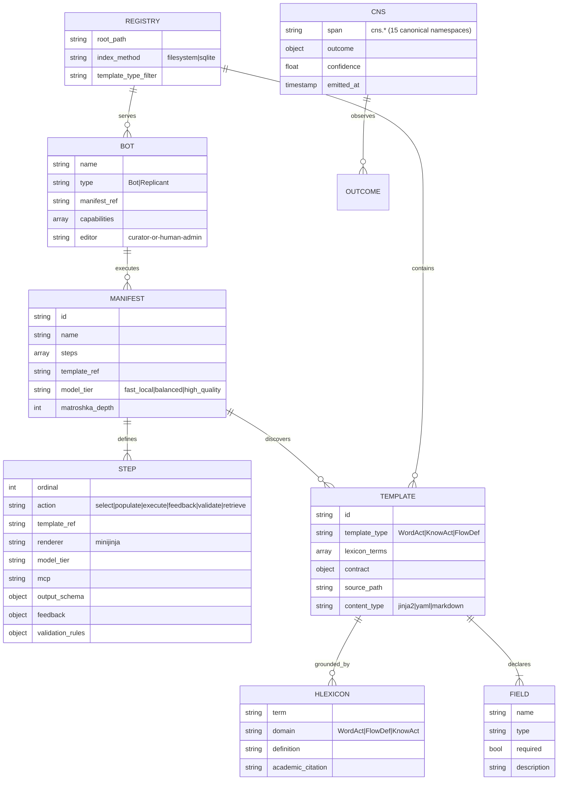
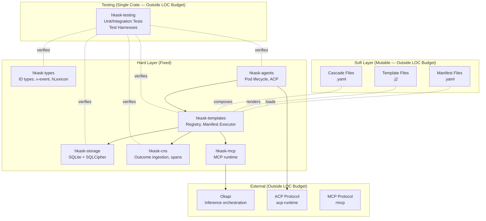
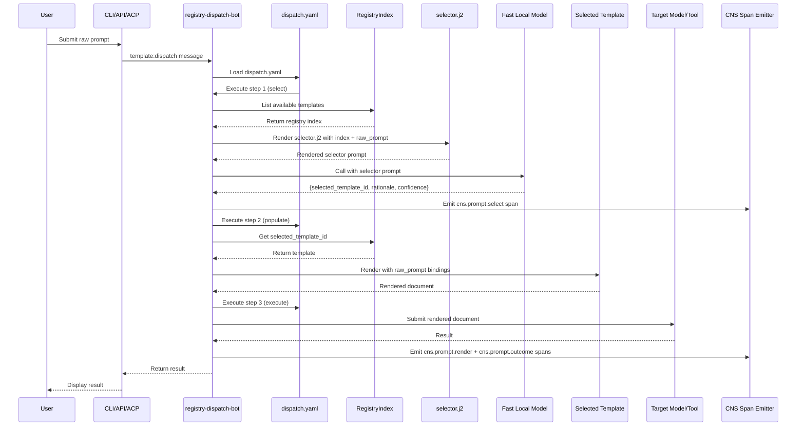
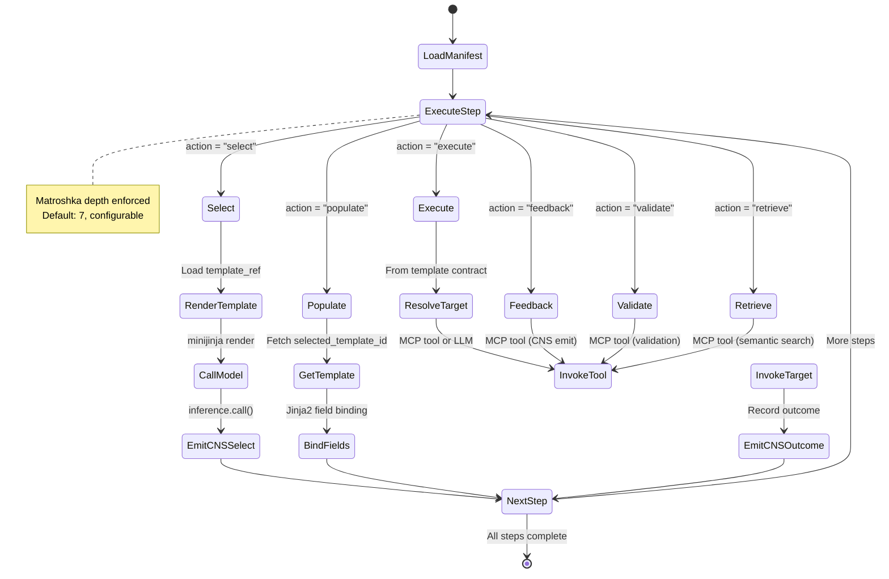
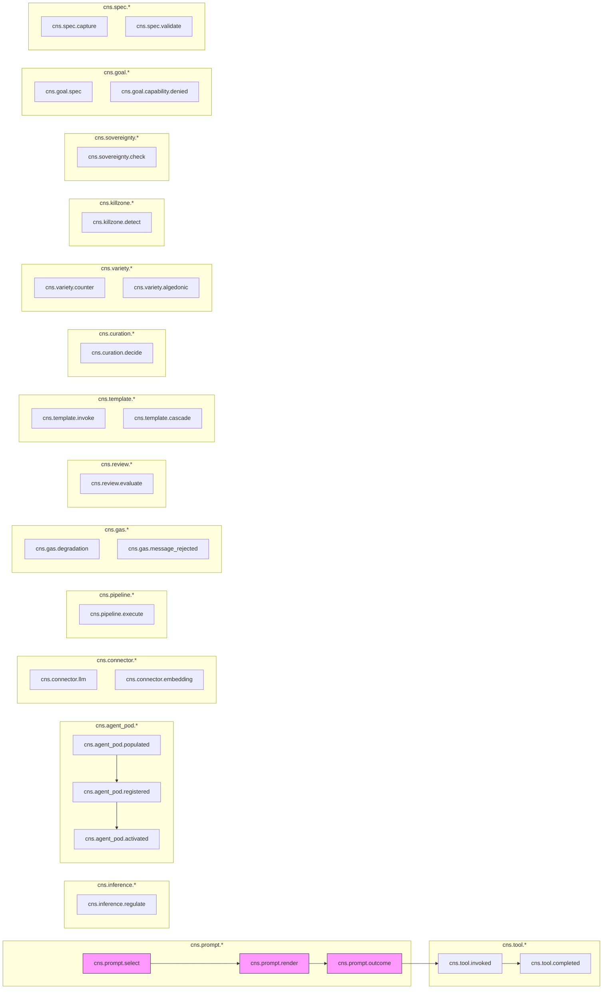

# hKask Entity Relationship Diagram

**Version:** v0.23.00
**Status:** Pre-alpha — MVP in progress

---

## Contents

| Section | Description |
|---------|-------------|
| [Core Entities](#core-entities) | Primary entity relationships in the data model |
| [Architecture Layers](#architecture-layers) | Three-tier architecture layer ERD |
| [Data Flow: Dispatch Pattern](#data-flow-dispatch-pattern) | MCP dispatch data flow diagram |
| [Manifest Step Grammar](#manifest-step-grammar) | Step grammar entity relationships |
| [CNS Span Hierarchy](#cns-span-hierarchy) | CNS observability span hierarchy |
| [Key Invariants](#key-invariants) | Data model invariants and constraints |
| [CNS ERD](#cns-cybernetic-nervous-system-erd) | Cybernetic Nervous System entity relationships |
| [References](#references) | Citations and references |

---

## Core Entities

Core entity relationships in the hKask data model, following the entity-relationship approach to data modeling:[^chen-er]



<!-- DIAGRAM_ALIGNMENT
id: DIAG-ERD-001
verified_date: 2026-05-24
verified_against: crates/hkask-types/src/; crates/hkask-templates/src/; crates/hkask-agents/src/
status: VERIFIED
-->

---

## Architecture Layers

The hKask codebase is organized into mutable and fixed layers, adhering to the layered architecture pattern:[^fowler-layers]



<!-- DIAGRAM_ALIGNMENT
id: DIAG-ERD-002
verified_date: 2026-05-24
verified_against: Cargo.toml workspace members; crates/*/src/lib.rs
status: VERIFIED
-->

---

## Data Flow: Dispatch Pattern

Template dispatch follows a message routing pattern common in enterprise integration:[^hohpe-eip]



<!-- DIAGRAM_ALIGNMENT
id: DIAG-ERD-003
verified_date: 2026-05-24
verified_against: crates/hkask-mcp/src/dispatch.rs; crates/hkask-templates/src/manifest.rs
status: VERIFIED
-->

---

## Manifest Step Grammar

Step execution follows an interpreter pattern where each action type maps to a discrete execution strategy:[^gamma-patterns]



<!-- DIAGRAM_ALIGNMENT
id: DIAG-ERD-004
verified_date: 2026-06-06
verified_against: crates/hkask-templates/src/executor.rs, crates/hkask-types/src/bundle.rs
status: VERIFIED
-->

---

## CNS Span Hierarchy

CNS spans form a hierarchical observability structure grounded in cybernetic regulation theory:[^ashby-law]



<!-- DIAGRAM_ALIGNMENT
id: DIAG-ERD-005
verified_date: 2026-05-24
verified_against: crates/hkask-types/src/cns.rs:122-145; crates/hkask-types/src/event.rs:75-86
status: VERIFIED
-->

---

## Key Invariants

System invariants define the unchanging design contracts that preserve architectural integrity:[^meyer-contract]

| Invariant | Description | Enforcement |
|-----------|-------------|-------------|
| **Loom/Thread** | Rust is fixed logic; YAML/Jinja2 is mutable content | Architecture boundary |
| **Unified Registry** | Single registry with `template_type` discriminator | P1 (no trait without 2 consumers) |
| **Manifest Execution** | Generic step interpreter applies to any manifest | ~50 LOC core loop |
| **Matroshka Depth** | Recursion limit enforced across all template chains | Rust executor |
| **CNS Observation** | All template outcomes emitted as spans | Port requirement |
| **hLexicon Grounding** | Templates declare terms; validator checks existence | Render-time check |

---

## CNS (Cybernetic Nervous System) ERD

The cybernetic core — ν-events, observers, and algedonic alerts:[^beer-vsm][^ashby-law]

```mermaid
erDiagram
    CYBERNETIC_EVENT ||--|| OBSERVER_REF : "produced_by"
    CYBERNETIC_EVENT ||--|| CYBERNETIC_PHASE : "in"
    CYBERNETIC_EVENT ||--|| OBSERVATION : "contains"
    CYBERNETIC_EVENT ||--o{ REGULATION : "computes"
    CYBERNETIC_EVENT ||--o{ ACTION : "triggers"
    CYBERNETIC_EVENT ||--o{ OUTCOME : "yields"
    CYBERNETIC_EVENT ||--o{ CYBERNETIC_EVENT : "parent_event"
    
    CYBERNETIC_PHASE: "Sense"
    CYBERNETIC_PHASE: "Compute"
    CYBERNETIC_PHASE: "Compare"
    CYBERNETIC_PHASE: "Act"
    
    OBSERVER_REF {
        string webid "Observer identity"
        string role "bot|replicant|human"
    }
    
    OBSERVATION {
        json telemetry "Raw sensor data"
        json pattern "Recognized patterns"
        json state_estimate "Current state"
    }
    
    REGULATION {
        json contract "Expected behavior"
        json error_signal "Deviation from contract"
        string corrective_action "Action to restore equilibrium"
    }
    
    ACTION {
        string tool_invocation "Tool called"
        string template_render "Template rendered"
        string memory_write "Memory updated"
    }
    
    OUTCOME {
        json result "Execution result"
        float confidence "Bayesian confidence"
        timestamp completed_at "Completion time"
    }
    
    CYBERNETIC_EVENT {
        uuid id
        timestamp emitted_at
        uuid parent_event
        int recursion_depth
        int variety_counter
        bool algedonic_alert "Variety deficit >50 (Warning) / >100 (Critical)"
    }
```

<!-- DIAGRAM_ALIGNMENT
id: DIAG-ERD-007
verified_date: 2026-05-24
verified_against: crates/hkask-types/src/event.rs:10-22,148-152; crates/hkask-cns/src/
status: VERIFIED
-->

**Cybernetic Flow:**
1. **Sense** — Telemetry capture, pattern recognition, state estimation
2. **Compute** — Contract validation, error signal computation, corrective action
3. **Compare** — Deviation assessment against set-points, variety measurement
4. **Act** — Tool invocation result, confidence scoring, memory write

**Algedonic Alert:** Warning escalation to Curator when variety deficit >50; Critical escalation to human when deficit >100.

---

## References

[^beer-vsm]: Beer, S. (1972). *Brain of the Firm*. Penguin Books. Viable System Model.
[^ashby-law]: Ashby, W. R. (1956). *An Introduction to Cybernetics*. Chapman & Hall. Law of Requisite Variety.
[^chen-er]: Chen, P. P.-S. (1976). The entity-relationship model—Toward a unified view of data. *ACM Transactions on Database Systems*, 1(1), 9–36. https://doi.org/10.1145/320434.320440
[^fowler-layers]: Fowler, M. (2002). *Patterns of Enterprise Application Architecture*. Addison-Wesley. Layered architecture pattern.
[^hohpe-eip]: Hohpe, G., & Woolf, B. (2003). *Enterprise Integration Patterns: Designing, Building, and Deploying Messaging Solutions*. Addison-Wesley. Message dispatch and routing patterns.
[^gamma-patterns]: Gamma, E., Helm, R., Johnson, R., & Vlissides, J. (1994). *Design Patterns: Elements of Reusable Object-Oriented Software*. Addison-Wesley. Interpreter and command patterns.
[^meyer-contract]: Meyer, B. (1997). *Object-Oriented Software Construction* (2nd ed.). Prentice Hall. Design by contract and class invariants.

---

*ℏKask - A Minimal Viable Container for Agents — v0.23.00*
*The Rust is the loom. The YAML/Jinja2 is the thread.*
*MVP in progress.*
