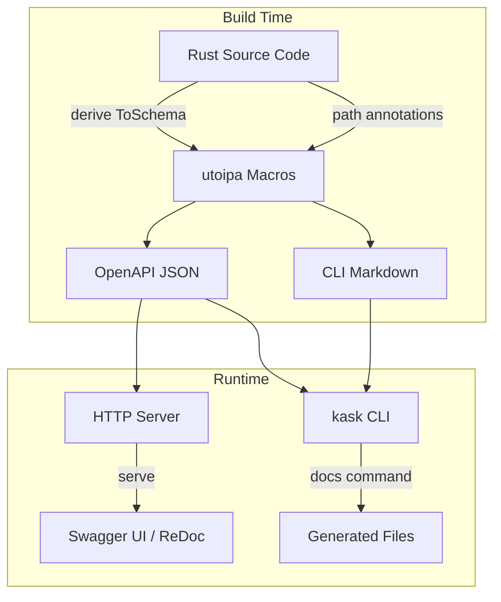

# utoipa Implementation — API and CLI Documentation

## 1. Statement

utoipa provides automatic OpenAPI specification generation for the hKask HTTP API and Markdown documentation for the CLI. The implementation adds zero runtime overhead — all documentation is generated at build time from type annotations and path macros.[^utoipa-docs]

## 2. Evidence

### 2.1 Code Budget Impact

| Crate | Lines Added | Total Lines | Purpose |
|-------|-------------|-------------|---------|
| `hkask-api` | ~640 | 5,755 | OpenAPI schemas and path annotations |
| `hkask-cli` | ~200 | 11,454 | Documentation generation commands |
| **Total core crates** | — | 22,251 | —

### 2.2 Dependencies

Workspace-level dependencies (already present in `Cargo.toml`):

```toml
utoipa = { version = "5.5", features = ["axum_extras", "uuid", "chrono"] }
utoipa-axum = "0.2"
```

The `axum_extras` feature enables integration with the axum web framework. The `uuid` and `chrono` features provide schema generation for those types.[^utoipa-crate]

### 2.3 Schema Types

All response and request types derive `ToSchema`:

```rust
#[derive(Debug, Serialize, Deserialize, ToSchema)]
pub struct TemplateResponse {
    pub id: String,
    pub template_type: String,
    pub description: String,
    pub source_path: String,
    pub lexicon_terms: Vec<String>,
}
```

**Component schemas by domain:**

| Domain | Schemas |
|--------|---------|
| templates | `TemplateResponse` |
| bots | `GrantCapabilityRequest` |
| pods | `CreatePodRequest`, `CreatePodResponse`, `PodStatusResponse`, `ListPodsResponse` |
| mcp | `McpInvokeRequest`, `McpInvokeResponse` |
| cns | `CnsHealthResponse`, `CnsVarietyResponse`, `CnsSubscribeParams` |
| chat | `ChatRequest`, `ChatResponse` |
| models | `ModelEntry`, `ModelListResponse`, `ModelSearchQuery` |
| curator | `ListEscalationsResponse`, `EscalationEntryResponse`, `EscalationStatsResponse`, `ResolveEscalationRequest`, `ResolveEscalationResponse`, `DismissEscalationRequest`, `DismissEscalationResponse`, `MetacognitionStatusResponse` |
| ensemble | `StandingStartRequest`, `StandingStartResponse`, `StandingStatusResponse`, `CreateChatRequest`, `EnsembleResponse`, `ImprovTurnRequest`, `ImprovTurnResponse` |
| acp | `AcpRegisterRequest`, `AcpRegisterResponse`, `AgentListResponse` |
| bundles | `BundleSummary`, `BundleListResponse`, `ComposeBundleRequest`, `ComposeBundleResponse`, `ApplyBundleResponse`, `EvolveBundleResponse`, `DeactivateBundleResponse` |
| specs | `SpecListResponse`, `SpecDetailResponse`, `SpecCaptureRequestDto`, `SpecCoherenceResponse`, `SpecWritingQualityResponse` |
| episodic | `StoreEpisodeRequest`, `StoreEpisodeResponse`, `QueryEpisodesResponse`, `EpisodicUsageResponse` |
| sovereignty | `SovereigntyStatusResponse`, `SovereigntyConsentResponse`, `AccessCheckResponse` |
| consolidation | `ConsolidateRequest`, `ConsolidateResponse` |
| git | `ArchiveRequest`, `ArchiveResponse`, `ResolveShaResponse` |
| goals | `CreateGoalRequest`, `SetGoalStateRequest`, `GoalResponse`, `GoalListResponse` |
| settings | `SettingsResponse`, `UpdateSettingsRequest` |
| wallet | `WalletBalanceResponse`, `DepositAddressResponse`, `DepositAddressQuery`, `DepositReferenceRequest`, `DepositReferenceResponse`, `TransactionQuery`, `TransactionResponse`, `TransactionListResponse`, `CreateKeyRequest`, `ApiKeyCreatedResponse`, `ApiKeyEntry`, `ApiKeyListResponse`, `ApiKeyRevokedResponse`, `WithdrawRequest`, `WithdrawalResponse` |

### 2.4 API Endpoints

Each endpoint has a `#[utoipa::path]` annotation:

```rust
#[utoipa::path(
    get,
    path = "/api/templates",
    tag = "templates",
    responses(
        (status = 200, description = "List of templates", body = Vec<TemplateResponse>),
        (status = 500, description = "Internal server error"),
    ),
)]
async fn list_templates(State(state): State<ApiState>) -> Json<Vec<TemplateResponse>> {
    // ...
}
```

**Endpoints with OpenAPI annotations:**

| Method | Path | Tag | Status Codes |
|--------|------|-----|--------------|
| GET | `/api/templates` | templates | 200, 500 |
| GET | `/api/templates/{id}` | templates | 200, 404, 500 |
| GET | `/api/bots/{id}/capabilities` | bots | 200, 500 |
| POST | `/api/bots/{id}/grant` | bots | 200, 400, 500 |
| GET | `/api/mcp/servers` | mcp | 200, 500 |
| GET | `/api/mcp/tools` | mcp | 200, 500 |
| POST | `/api/mcp/invoke` | mcp | 200, 400, 401, 404, 500 |
| GET | `/api/cns/health` | cns | 200, 500 |
| GET | `/api/cns/variety` | cns | 200, 500 |
| GET | `/api/cns/subscribe` | cns | 200, 400 |
| POST | `/api/chat` | chat | 200, 400, 500 |
| POST | `/api/chat/stream` | chat | 200, 400, 401, 500 |
| GET | `/api/models` | models | 200, 503 |
| GET | `/api/models/search` | models | 200 |
| POST | `/api/ensemble/chat` | ensemble | 201, 500 |
| POST | `/api/ensemble/chat/{session}/improv` | ensemble | 200, 404, 500 |
| POST | `/api/v1/ensemble/standing-start` | ensemble | 201, 401, 500 |
| GET | `/api/v1/ensemble/standing-status` | ensemble | 200, 401, 404 |
| GET | `/api/v1/acp/agents` | acp | 200, 401, 500 |
| DELETE | `/api/v1/acp/agents/{agent_id}` | acp | 200, 400, 401, 500 |
| GET | `/api/v1/bundles` | bundles | 200 |
| POST | `/api/v1/bundles/compose` | bundles | 200, 400 |
| GET | `/api/v1/bundles/{id}` | bundles | 200, 404 |
| POST | `/api/v1/bundles/{id}/apply` | bundles | 200, 404 |
| POST | `/api/v1/bundles/{id}/evolve` | bundles | 200, 404 |
| DELETE | `/api/v1/bundles/{id}/deactivate` | bundles | 200 |
| GET | `/api/specs` | specs | 200 |
| POST | `/api/specs/capture` | specs | 200 |
| GET | `/api/specs/{spec_id}` | specs | 200, 404 |
| GET | `/api/specs/coherence` | specs | 200 |
| GET | `/api/specs/{spec_id}/writing-quality` | specs | 200 |
| GET | `/api/v1/curator/escalations` | curator | 200, 401, 500 |
| POST | `/api/v1/curator/escalations/{id}/resolve` | curator | 200, 401, 404, 500 |
| POST | `/api/v1/curator/escalations/{id}/dismiss` | curator | 200, 401, 404, 500 |
| GET | `/api/v1/curator/metacognition` | curator | 200, 401, 500 |
| POST | `/api/episodic/store` | episodic | 200, 400, 401, 500 |
| GET | `/api/episodic/query` | episodic | 200, 400, 401, 500 |
| GET | `/api/episodic/usage` | episodic | 200, 401, 500 |
| GET | `/api/sovereignty/status` | sovereignty | 200, 401, 500 |
| POST | `/api/sovereignty/consent/grant` | sovereignty | 200, 400, 401, 500 |
| POST | `/api/sovereignty/consent/revoke` | sovereignty | 200, 401, 404, 500 |
| GET | `/api/sovereignty/access/check` | sovereignty | 200, 400, 401, 500 |
| POST | `/api/consolidate` | consolidation | 200, 401, 429, 500 |
| POST | `/api/v1/git/archive` | git | 200, 400, 401, 500 |
| GET | `/api/v1/git/resolve/{sha}` | git | 200, 401, 500 |
| POST | `/api/goals` | goals | 200, 400, 401, 403 |
| GET | `/api/goals` | goals | 200, 400, 401, 403 |
| POST | `/api/goals/{id}/state` | goals | 200, 400, 401, 403, 404 |
| GET | `/api/wallet/balance` | wallet | 200, 503 |
| GET | `/api/wallet/deposit-address` | wallet | 200, 503 |
| POST | `/api/wallet/deposit-reference` | wallet | 200, 503 |
| GET | `/api/wallet/transactions` | wallet | 200, 503 |
| POST | `/api/wallet/keys` | wallet | 201, 503 |
| GET | `/api/wallet/keys` | wallet | 200, 503 |
| DELETE | `/api/wallet/keys/{key_id}` | wallet | 200, 503 |
| POST | `/api/wallet/withdraw` | wallet | 200, 503 |

**Endpoints registered via `.route()` (not in OpenAPI spec):**

These endpoints use direct `.route()` registration without `#[utoipa::path]` annotations. They are functional at runtime but do not appear in the generated OpenAPI specification.

| Method | Path | Tag |
|--------|------|-----|
| POST | `/api/templates` | templates |
| GET | `/api/templates/search/{term}` | templates |
| GET | `/api/pods` | pods |
| POST | `/api/pods` | pods |
| POST | `/api/pods/{id}/activate` | pods |
| POST | `/api/pods/{id}/deactivate` | pods |
| GET | `/api/pods/{id}/status` | pods |
| GET | `/api/cns/alerts` | cns |
| GET | `/api/ensemble/chat/{session}` | ensemble |
| GET | `/api/ensemble/chat/{session}/list` | ensemble |
| POST | `/api/ensemble/chat/{session}/register` | ensemble |
| POST | `/api/ensemble/chat/{session}/send` | ensemble |
| POST | `/api/ensemble/deliberation` | ensemble |
| POST | `/api/v1/acp/register` | acp |
| GET | `/api/settings` | settings |
| PUT | `/api/settings` | settings |

MCP tools are discovered dynamically at runtime — the OpenAPI spec does not enumerate individual tools. New servers (e.g., `hkask-mcp-replica` with 6 style replication tools) appear automatically in `GET /api/mcp/tools` when started.

## 3. Diagram



<!-- DIAGRAM_ALIGNMENT
id: DIAG-UTOIPA-001
verified_date: 2026-06-07
verified_against: crates/hkask-api/src/openapi.rs:11; crates/hkask-cli/src/main.rs:385
status: VERIFIED
-->

## 4. CLI Documentation Commands

The `kask docs` command provides three subcommands:

### 4.1 OpenAPI Specification

```bash
kask docs openapi [-o OUTPUT]
```

Generates the complete OpenAPI 3.1 specification in JSON format. Output goes to stdout by default, or to a file with `-o`.

### 4.2 CLI Documentation

```bash
kask docs cli [-o OUTPUT]
```

Generates Markdown documentation for all CLI commands, options, and subcommands. The documentation includes usage examples and template type reference.

### 4.3 Complete Documentation

```bash
kask docs all -o OUTPUT_DIR
```

Generates both OpenAPI specification (`openapi.json`) and CLI documentation (`cli.md`) in the specified directory.

## 5. Implications

### 5.1 For API Developers

- **No manual spec maintenance** — OpenAPI spec updates automatically when code changes
- **Type safety** — Schema generation from Rust types prevents documentation drift
- **IDE support** — utoipa annotations provide inline documentation hints

### 5.2 For Integration Engineers

- **Swagger UI ready** — Generated spec works with Swagger UI, ReDoc, and other OpenAPI tools
- **Client generation** — OpenAPI spec can generate client SDKs in multiple languages[^openapi-generators]
- **Contract testing** — Spec serves as the API contract for integration tests

### 5.3 For Operators

- **Single source of truth** — CLI documentation generated from actual command definitions
- **No outdated help text** — Documentation reflects current CLI state
- **Offline access** — Generated Markdown files work without network access

## 6. Verification

```bash
# Verify hkask-api compiles with utoipa annotations
cargo check -p hkask-api

# Generate and inspect OpenAPI spec
cargo run -p hkask-cli -- docs openapi -o docs/openapi.json
jq '.paths | keys' docs/openapi.json

# Generate CLI documentation
cargo run -p hkask-cli -- docs cli -o docs/cli.md

# Generate all documentation
cargo run -p hkask-cli -- docs all -o docs/
```

## 7. Future Enhancements

1. **Swagger UI integration** — Serve interactive API documentation at `/api/docs` endpoint
2. **ReDoc integration** — Alternative documentation UI with better mobile support[^redoc-docs]
3. **CLI shell completions** — Generate bash, zsh, fish completions using clap completions[^clap-completions]
4. **OpenAPI contract tests** — Integration tests that verify endpoints match the generated spec

## References

[^utoipa-docs]: utoipa Contributors. (2026). *utoipa Documentation*. <https://utoipa.dev/>. The primary documentation for the utoipa crate.

[^utoipa-crate]: utoipa Contributors. (2026). *utoipa Crate*. <https://crates.io/crates/utoipa>. The crate specification and feature flags.

[^openapi-generators]: OpenAPI Initiative. (2026). *Code Generators*. <https://github.com/OpenAPI/generator>. List of OpenAPI client and server generators.

[^redoc-docs]: ReDoc Contributors. (2026). *ReDoc Documentation*. <https://redocly.com/docs/redoc/>. Documentation for ReDoc, an open-source API documentation tool.

[^clap-completions]: clap Contributors. (2026). *clap Completions*. <https://docs.rs/clap/latest/clap/_cookbook/_typed_clap_example/index.html#shell-completions>. Documentation for generating shell completions with clap.
