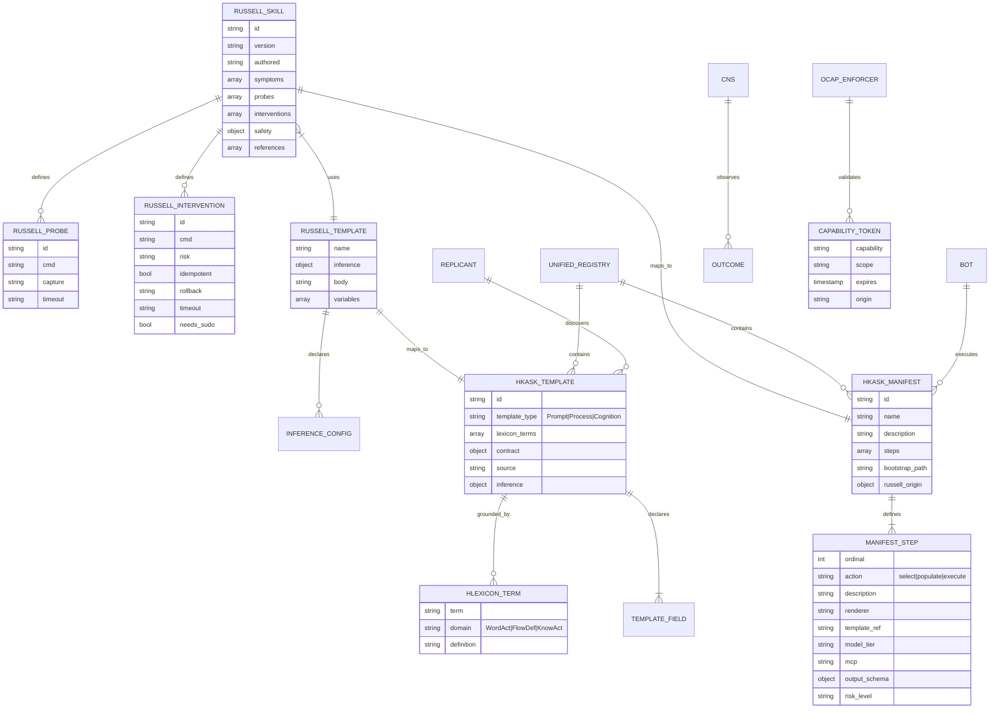

# Russell → hKask Migration — Entity Relationship Diagram

## Overview

This document captures the semantic mapping between Russell skill manifests/prompt templates and hKask unified registry entries.

**Migration Principle:** Rust is the loom. YAML/Jinja2 is the thread. Russell is the legacy library. hKask is the unified registry.

---

## Entity Relationship Diagram



---

## Transformation Rules

### Russell Skill Manifest → hKask Process Manifest

```yaml
# Russell (source)
id: web-search
version: 1.0.0
symptoms: [search_capability_needed, web_knowledge_gap]
probes: []
interventions: []
safety: {max_auto_risk: none}

# hKask (destination)
manifest:
  id: skill/web-search
  name: web-search-knowledge
  description: "Web search capability knowledge base"
  template_type: Process
  lexicon_terms: [search, fetch, browse, discover]

steps:
  - ordinal: 1
    action: populate
    description: "Load web search knowledge into context"
    template_ref: skills/web-search/knowledge
    mcp: hkask-mcp-memory
    risk_level: none

russell_origin:
  id: web-search
  version: 1.0.0
  # ... preserved metadata
```

### Russell Prompt Template → hKask Composition Template

```jinja2
{# Russell (source) #}
{# soap.md.j2 #}
[inference]
temperature = 0.2
max_tokens = 4096

# SOAP — russell help
## Subjective
{{ subjective }}
...

# hKask (destination)
[inference]
template_type: Prompt
lexicon_terms: [observe, assess, plan, act, monitor, recall, discover]
contract:
  input: [subjective, profile_block, severity_block, samples_table, freshness, events_table]
  output: [rendered_prompt]

---
## Subjective
{{ subjective }}
...
```

---

## Data Flow

```
[Russell YAML] → [Semantic Analyzer] → [hKask Manifest/Template] → [Registry Validator] → [Unified Registry]
                      ↓                        ↓                          ↓
                [RDF Graph]            [hLexicon Grounding]        [OCAP Validation]
                      ↓                        ↓                          ↓
                [Mermaid ERD]          [Contract Check]           [CNS ν-event]
```

---

## Security & Capability Enforcement

### OCAP Mapping

| Russell Field | hKask Equivalent | Enforcement |
|--------------|------------------|-------------|
| `safety.max_auto_risk` | `SecurityBoundary.max_auto_risk` | OCAP token scope |
| `interventions[].risk` | `ManifestStep.risk_level` | Human consent gate |
| `probes[]` | `ManifestStep.action: Execute` | Auto-execute if `risk=none` |
| `needs_sudo` | `SecurityBoundary.require_human_for` | Mandatory human approval |

### Capability Token Structure

```rust
pub struct CapabilityToken {
    pub capability: String,      // e.g., "template:render", "mcp:invoke"
    pub scope: String,           // e.g., "prompt/*", "mcp/hkask-mcp-inference"
    pub expires: u64,            // Unix timestamp
    pub origin: String,          // Provenance: "russell/web-search"
}
```

---

## Migration Statistics

### Priority 1 Assets (Migrated)

| Russell Asset | hKask Destination | Type | Status |
|--------------|-------------------|------|--------|
| `skills/web-search/manifest.yaml` | `registry/registries/skills/web-search.yaml` | Process | ✅ Complete |
| `skills/pragmatic-semantics/manifest.yaml` | `registry/registries/skills/pragmatic-semantics.yaml` | Process | ✅ Complete |
| `skills/pragmatic-cybernetics/manifest.yaml` | `registry/registries/skills/pragmatic-cybernetics.yaml` | Process | ✅ Complete |
| `crates/russell-meta/prompts/templates/soap.md.j2` | `registry/registries/prompt/soap.j2` | Prompt | ✅ Complete |

### hLexicon Terms Extracted

| Domain | Terms | Count |
|--------|-------|-------|
| WordAct | observe, assess, plan, act | 4 |
| FlowDef | search, fetch, browse, discover | 4 |
| KnowAct | monitor, recall, discriminate, validate | 4 |
| **Total** | | **12** |

---

## Provenance Tracking

All migrated assets carry forward Russell origin metadata:

```yaml
russell_origin:
  id: web-search
  version: 1.0.0
  authored: 2026-05-13
  min_harness_version: 0.1.0
  symptoms: [...]
  safety:
    max_auto_risk: none
  references: [...]
```

**Provenance Hash:** SHA-256 of `origin:content` for integrity verification.

---

## CNS Integration

Migration emits the following CNS spans:

- `cns.migration.analyze` — Russell asset analysis
- `cns.migration.transform` — Structure transformation
- `cns.migration.validate` — hLexicon validation
- `cns.migration.register` — Registry write
- `cns.migration.outcome` — Final result with success/failure count

**Variety Counters:**
- Templates migrated (count by `template_type`)
- Manifests migrated (count by step complexity)
- hLexicon terms extracted (count by domain)
- Capability tokens minted (count by risk level)

---

## Open Questions (Deferred)

See Task 6 in the migration specification for the following deferred decisions:

1. Bidirectional sync with Russell upstream
2. hLexicon term inference vs. manual specification
3. Capability granularity (coarse vs. fine-grained)
4. Provenance log retention policy
5. Template versioning (Russell version vs. Git SHA)
6. Cascade composition wrapping
7. Bot vs. Replicant mapping criteria
8. MCP tool discovery (inference vs. manual)
9. Error recovery strategy (rollback vs. skip)
10. Registry bloat prevention (utility assessment)

**Resolution:** Implement with sensible defaults (one-time migration, manual lexicon, coarse capabilities, indefinite provenance, flat templates, Bot mapping, manual MCP, skip-on-error, migrate-all). Revisit after operational data informs decision.

---

*ℏKask — Planck's Constant of Agent Systems — v0.21.0*
*Rust is the loom. YAML/Jinja2 is the thread. Russell is the legacy library. hKask is the unified registry.*
