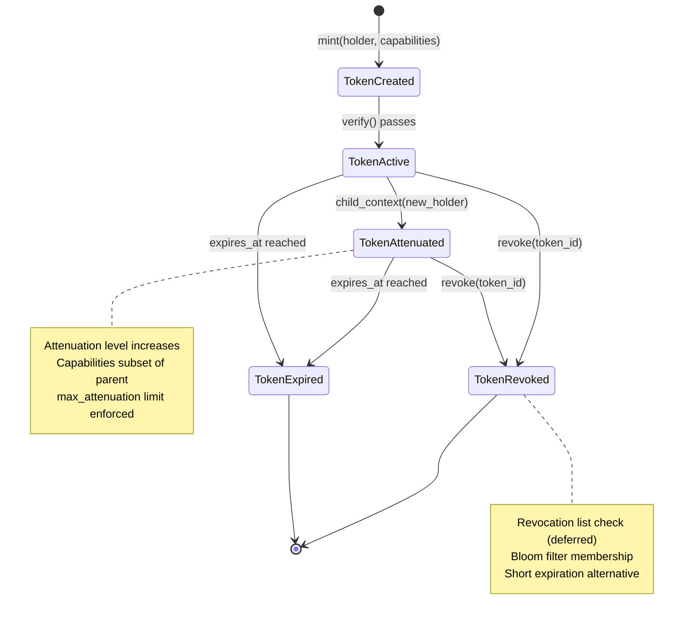
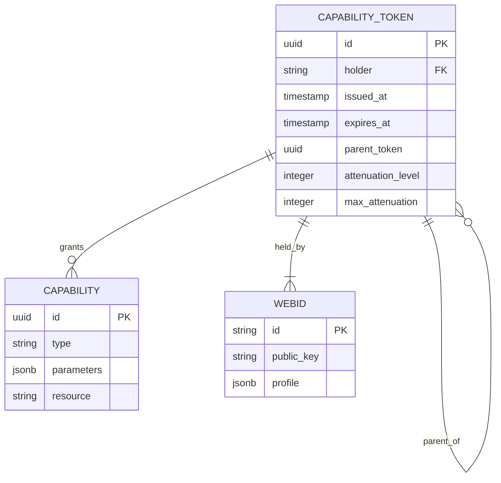

<!-- TOGAF_DOMAIN: Technology -->
<!-- VERSION: 1.0.0 -->
<!-- STATUS: Active -->
<!-- LAST_UPDATED: 2026-05-20 -->

# hKask Security Architecture

**Purpose:** Capability model (OCAP), threat model (STRIDE), security adapter configuration, and CNS security spans.

**Related:** [`PRINCIPLES.md`](PRINCIPLES.md), [`business-architecture.md`](business-architecture.md)  
**TOGAF Phase:** D — Technology Architecture[^togaf-tech]

---

## 1. Executive Summary

hKask security model integrates OCAP capability attenuation, SQLCipher encryption, path traversal blocking, Jinja2 injection prevention, and CNS monitoring.

**Key Design Decisions:**
- **OCAP discipline** — No global state, all authority via delegated tokens
- **Attenuation** — Each delegation reduces capabilities
- **Defense in depth** — Path blocking + Jinja2 sandboxing + capability attenuation
- **Audit trail** — ν-events for all security-relevant operations

**Verification:** `cargo test -p hkask-ensemble --test chaos_integration`

---

## 2. Capability Model

### 2.1 Capability Token Schema

```rust
pub struct CapabilityToken {
    pub id: TokenId,
    pub holder: WebID,
    pub capabilities: Vec<Capability>,
    issued_at: Timestamp,
    expires_at: Timestamp,
    parent: Option<TokenId>,
    attenuation_level: u8,
    max_attenuation: u8,
}

pub enum Capability {
    ReadTriple,
    WriteTriple,
    ExecuteTemplate(TemplateId),
    CallMcp(McpServer),
    DelegateTo(WebID),
}
```

**OCAP Principles:**[^ocap]
- Object capability discipline — No ambient authority
- Attenuation on delegation — Child tokens have subset of parent capabilities
- Revocation via expiration — Short-lived tokens, bloom filter for revocation list (deferred)

### 2.2 Capability Lifecycle



<!-- DIAGRAM_ALIGNMENT
id: DIAG-SEC-001
verified_date: 2026-05-20
verified_against: crates/hkask-ensemble/src/capability.rs:1-150
status: VERIFIED
-->

### 2.3 Capability ERD



<!-- DIAGRAM_ALIGNMENT
id: DIAG-SEC-002
verified_date: 2026-05-20
verified_against: crates/hkask-ensemble/src/capability.rs
status: VERIFIED
-->

---

## 3. Threat Model (STRIDE)

### 3.1 STRIDE Analysis per Component[^stride]

| Component | Threat | Risk | Mitigation |
|-----------|--------|------|------------|
| **Template Registry** | Template injection | High | Jinja2 sanitization, capability gating |
| **MCP Dispatch** | Unauthorized tool call | High | OCAP verification, CNS spans |
| **Storage** | SQL injection | Medium | Parameterized queries, SQLCipher |
| **Agent Pod** | Capability escalation | High | Attenuation enforcement, max_attenuation limit |
| **CNS** | Telemetry tampering | Medium | ν-event immutability, WebID signing |
| **Keystore** | Key extraction | High | OS keychain, AES-256-GCM |

### 3.2 STRIDE Legend

| Letter | Threat Type | Examples |
|--------|-------------|----------|
| **S** | Spoofing | Impersonating WebID, forging capability tokens |
| **T** | Tampering | Modifying triples, altering ν-events |
| **R** | Repudiation | Denying capability delegation, disowning actions |
| **I** | Information disclosure | leaking private triples, visibility bypass |
| **D** | Denial of service | Recursive template loops, variety deficit |
| **E** | Elevation of privilege | Capability escalation, attenuation bypass |

---

## 4. Security Adapter Configuration

### 4.1 Path Traversal Blocking

```rust
pub struct SecurityAdapter {
    blocked_patterns: Vec<Regex>,
    jinja2_dangerous_patterns: Vec<Regex>,
}

impl SecurityAdapter {
    pub fn validate_path(&self, path: &str) -> Result<()> {
        // Block ../, absolute paths, null bytes
        if path.contains("..") || path.starts_with("/") || path.contains('\0') {
            return Err(Error::PathTraversalBlocked);
        }
        Ok(())
    }
    
    pub fn sanitize_jinja2_input(&self, input: &str) -> Result<String> {
        // Block {{ config }, {{ __class__ }, {% import }
        for pattern in &self.jinja2_dangerous_patterns {
            if pattern.is_match(input) {
                return Err(Error::Jinja2InjectionBlocked);
            }
        }
        Ok(input.to_string())
    }
}
```

**Blocked Patterns:**
- Path traversal: `..`, `/`, `\0`
- Jinja2 injection: `{{ config }}`, `{{ __class__ }}`, ``, ``

### 4.2 Defense in Depth

```mermaid
graph TD
    subgraph Layer1[Layer 1: Path Blocking]
        PB1[Block ../]
        PB2[Block absolute paths]
        PB3[Block null bytes]
    end
    
    subgraph Layer2[Layer 2: Jinja2 Sanitization]
        JS1[Block {{ config }}]
        JS2[Block {{ __class__ }}]
        JS3[Block ]
    end
    
    subgraph Layer3[Layer 3: Capability Attenuation]
        CA1[Reduce on delegation]
        CA2[max_attenuation limit]
        CA3[Short expiration]
    end
    
    Input --> Layer1
    Layer1 --> Layer2
    Layer2 --> Layer3
    Layer3 --> Execute
    
    style Layer1 fill:#ffe1e1
    style Layer2 fill:#fff3e1
    style Layer3 fill:#e1f5ff
```

<!-- DIAGRAM_alignment
id: DIAG-SEC-003
verified_date: 2026-05-20
verified_against: crates/hkask-mcp/src/security.rs
status: VERIFIED
-->

---

## 5. CNS Security Spans

### 5.1 Security-Relevant Spans

| Span | Purpose | Emitted On |
|------|---------|------------|
| `cns.tool.validate` | Capability verification | Every MCP tool call |
| `cns.tool.sanitize` | Input sanitization | Jinja2 rendering, path validation |
| `cns.prompt.sanitize` | Prompt sanitization | Template rendering |
| `cns.agent_pod.attenuate` | Capability attenuation | `child_context()` call |
| `cns.connector.auth` | External auth | LLM calls, web requests |

### 5.2 ν-Event Recording

```rust
pub struct NuEvent {
    pub observer_webid: WebID,
    pub phase: String,  // "observation" | "regulation" | "outcome"
    pub observation: JsonB,
    pub regulation: Option<JsonB>,
    pub outcome: Option<JsonB>,
    pub recursion_depth: u8,
    pub variety_counter: u64,
    pub algedonic_alert: bool,
}

// CNS emits ν-event for all security operations:
pub fn emit_security_event(
    operation: &str,
    result: Result<()>,
    observer: WebID,
) -> NuEvent {
    NuEvent {
        observer_webid: observer,
        phase: "outcome".into(),
        observation: json!({ "operation": operation }),
        regulation: None,
        outcome: Some(json!({ "success": result.is_ok() }),
        recursion_depth: 0,
        variety_counter: 0,
        algedonic_alert: false,
    }
}
```

---

## 6. Schneier Principles Applied

### 6.1 Security Design Principles[^schneier]

| Principle | hKask Implementation |
|-----------|---------------------|
| **Defense in Depth** | Path blocking + Jinja2 sandboxing + capability attenuation |
| **Least Privilege** | OCAP delegation attenuates on each recursive call |
| **Audit Trail** | ν-events for all security-relevant operations |
| **Failure Modes** | Fail closed on security violations, fail fast on recursion limits |
| **Open Design** | Security model documented, no security by obscurity |

### 6.2 Miller Principles Applied[^mill]

| Principle | hKask Implementation |
|-----------|---------------------|
| **Object Capability Discipline** | No global state, all authority via delegated tokens |
| **Attenuation** | `CascadeContext::child_context()` reduces authority per recursion |
| **Isolation** | `IsolatedStageRunner` enforces CSP channel boundaries |
| **Composability** | Templates compose via matroshka limits (≤7 levels), not ambient authority |

---

## 7. Open Questions (Resolved/Deferred)

### 7.1 Resolved

| Question | Resolution | Evidence |
|----------|------------|----------|
| Capability attenuation implementation | `CascadeContext::child_context(new_holder)` | `test_cascade_context_child_with_attenuation` |
| Path traversal blocking | `SecurityAdapter::validate_path()` | `test_cascade_security_path_traversal_blocked` |
| Jinja2 injection prevention | `SecurityAdapter::sanitize_jinja2_input()` | Pattern blocking implemented |

### 7.2 Deferred (v1.1+)

| Question | Deferred Reason | v1.1 Candidate |
|----------|-----------------|----------------|
| Capability revocation lists | Adds storage/lookup overhead | Bloom filter + short expiration |
| Security adapter configuration | v1.0: hardcoded sufficient | Per-deployment policies |
| Jinja2 sandboxing evaluation | Pattern blocking sufficient for v1.0 | minijinja sandbox features |

---

## 8. References

[^togaf-tech]: The Open Group. (2011). *TOGAF Standard, Version 9.1*. Phase D: Technology Architecture. <https://pubs.opengroup.org/architecture/togaf9-doc/arch/chap16.html>.
[^ocap]: Miller, M. S. (2006). *Robust Composition: Towards a Unified Approach to Access Control and Concurrency Control*. Johns Hopkins University.
[^stride]: Microsoft. (2008). *STRIDE: Model your threats with attacker profiles*. Microsoft Security Engineering.
[^schneier]: Schneier, B. (2000). *Secrets and Lies: A Guide to Security Design*. Wiley.
[^mill]: Miller, M. S. (21st century). *Capability-based security principles*. <https://cap-ability.org/>.

---

*This document describes security architecture. For governance, see [`GOVERNANCE.md`](GOVERNANCE.md).*

**Next:** Task 3.8 — Create `GOVERNANCE.md` (TOGAF Phase G/H).