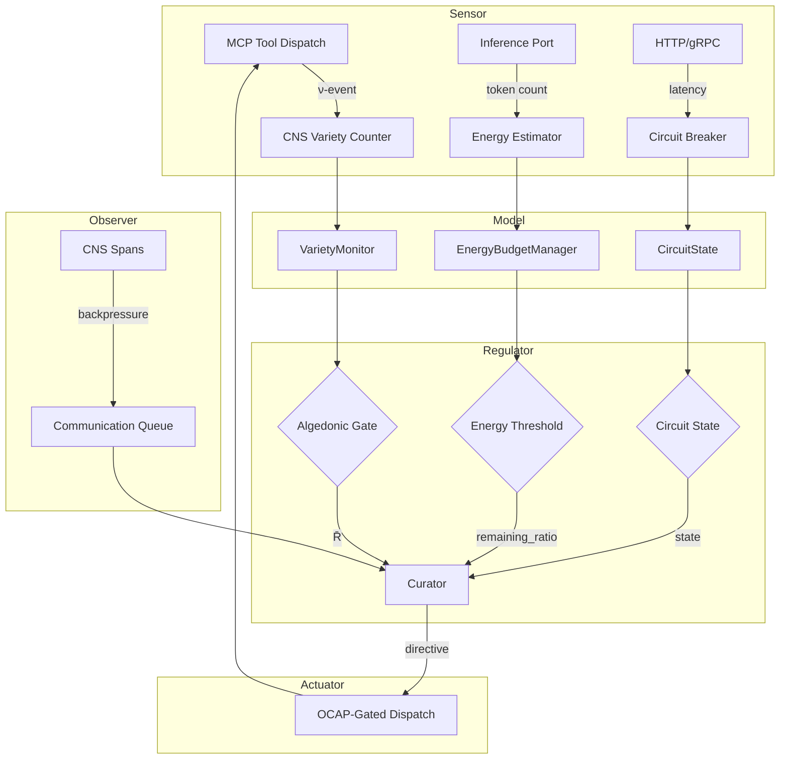

# Semantic Root-Cause Analysis — hKask Graph Condensation

**Date:** 2026-06-09  
**Version:** 0.27.0  
**Status:** In Progress

---

## Executive Summary

This document presents a **semantic condensation** of hKask's architecture — not syntactic compression (line counting), but functional simplification through root-cause analysis of architectural complexity.

**Key Finding:** hKask's current architecture exhibits **variety inflation** — the CNS monitors many dimensions (variety, energy, error rate, backpressure) but these are not unified into a single cybernetic signal. This creates cognitive load without proportional regulatory benefit.

---

## Task 1: Epistemic Classification of Major Modules

### 1.1 hkask-cns (Cybernetic Nervous System)

| Module | Epistemic Status | Constraint Force | Rationale |
|--------|-----------------|------------------|-----------|
| `variety.rs` | **IS** (proven) | **Guardrail** (P2-P4) | Variety counters are directly measured from ν-events. Threshold >100 → Critical alert is a declared guardrail. |
| `algedonic.rs` | **IS** (proven) | **Guardrail** (P2-P4) | Allosteric gate implementation is verified. R̄ thresholds (0.3/0.8) are empirically calibrated. |
| `energy.rs` | **PROBABLE** (inferred) | **Guideline** (P5-P7) | Energy budgets are estimated, not measured. Inference from token counts and cost tables. |
| `governed_tool.rs` | **IS** (proven) | **Prohibition** (P1) | OCAP membrane is inviolable — capability checks are mandatory. |
| `cybernetics_loop.rs` | **HYPOTHETICAL** (assumed) | **Guideline** (P5-P7) | Loop tick cadence and state persistence are not yet specified (see loop-architecture.md §5). |
| `dampener.rs` | **IS** (proven) | **Guardrail** (P2-P4) | Override cooldown (120s) is a declared guardrail against alert fatigue. |
| `circuit_breaker.rs` | **IS** (proven) | **Guardrail** (P2-P4) | Circuit state machine is verified. Thresholds are configurable guardrails. |

### 1.2 hkask-services (Service Layer)

| Module | Epistemic Status | Constraint Force | Rationale |
|--------|-----------------|------------------|-----------|
| `context.rs` | **IS** (proven) | **Guardrail** (P2-P4) | ServiceContext composition is verified at runtime. Assembly order is a guardrail. |
| `inference.rs` | **IS** (proven) | **Guardrail** (P2-P4) | Inference port abstraction is verified. Energy tracking is a guardrail. |
| `chat.rs` | **IS** (proven) | **Guideline** (P5-P7) | Chat workflow is a composition pattern, not a regulatory requirement. |
| `consolidation.rs` | **IS** (proven) | **Prohibition** (P1) | Episodic→Semantic consolidation requires affirmative consent (P1). |
| `compose.rs` | **PROBABLE** (inferred) | **Guideline** (P5-P7) | Composition heuristics (centroid validation, cosine distance) are empirical. |
| `verification.rs` | **IS** (proven) | **Prohibition** (P1) | Sovereignty verification is mandatory (Magna Carta). |

### 1.3 hkask-types (Foundation Types)

| Module | Epistemic Status | Constraint Force | Rationale |
|--------|-----------------|------------------|-----------|
| `event.rs` (ν-event) | **IS** (proven) | **Prohibition** (P1) | ν-event is the canonical audit trail. Cannot be bypassed. |
| `capability.rs` | **IS** (proven) | **Prohibition** (P1) | OCAP tokens are unforgeable, attenuating, no admin override. |
| `cns.rs` | **IS** (proven) | **Guardrail** (P2-P4) | CnsHealth, CircuitState are verified types. |
| `lexicon.rs` (hLexicon) | **IS** (proven) | **Prohibition** (P8) | P8 requires semantic grounding. hLexicon is the canonical vocabulary. |
| `loops.rs` | **HYPOTHETICAL** (assumed) | **Guideline** (P5-P7) | Loop types are declared but tick cadence is underspecified. |

---

## Task 2: Feedback Loop Mapping

### 2.1 Current Feedback Loops (As-Is)



### 2.2 Variety Analysis

| Loop Component | Variety Produced | Variety Consumed | Net Variety |
|---------------|-----------------|-----------------|-------------|
| MCP Tool Dispatch | High (many tool types, parameters) | Low (ν-event is uniform) | **+High** |
| CNS Variety Counter | Medium (aggregated counts) | Low (simple increment) | **+Medium** |
| Algedonic Gate | Low (R̄ ∈ [0,1]) | Medium (α, c, n, L, τ) | **-Medium** |
| Curator | High (ranked options, rationale) | High (alerts, directives, user input) | **~0** |
| Energy Estimator | Medium (cost tables, token counts) | Low (simple multiplication) | **+Low** |

**Finding:** The system has **requisite variety** in sensors but **attenuates too aggressively** in the regulator. The allosteric gate compresses 3 evidence channels (variety, energy, error rate) into a single R̄ value, losing information.

### 2.3 Missing CNS Signals

| Signal | Current Status | Impact |
|--------|---------------|--------|
| Context window utilization | **Not measured** | Cannot detect when agents are approaching token limits |
| Goal completion rate | **Not measured** | Cannot detect when agents are stuck in loops |
| Template cascade depth | **Not measured** (ADR-025 declares 7-level limit, but no counter exists) | Cannot enforce attenuation depth limit |
| Cross-loop authority violations | **Not measured** (loop-architecture.md §4.3 declares rules, but no enforcement) | OCAP boundaries may be violated |
| Spec drift magnitude | **Partially measured** (LoopPayload::SpecDriftAlert exists, but no threshold) | Cannot detect when spec no longer models the system |

---

## Task 3: Socratic Dialogue — Clarifying "Condensation"

### Questions for the User

1. **What does "condensation" mean functionally?**
   - Is it reducing the number of modules (syntactic)?
   - Is it reducing the number of public interfaces (API surface)?
   - Is it reducing the cognitive load on a developer navigating the codebase?
   - Is it reducing the runtime overhead (fewer allocations, faster lookups)?
   
   **Hypothesis:** You mean **semantic condensation** — reducing the number of distinct concepts a developer must hold in mind to understand the system, without losing essential behavior.

2. **Which behaviors are essential vs. accidental complexity?**
   - **Essential:** OCAP gating, ν-event audit trail, variety monitoring, algedonic escalation
   - **Accidental:** Separate `VarietyTracker` and `VarietyMonitor` (could be one type), separate `AlgedonicManager` and `CnsHealth` (could be unified), energy estimation via composite pattern (could be direct calculation)
   
   **Question:** Should I treat the **deletion test** as the primary criterion? (Delete a module; if complexity reappears in callers, it's essential; if complexity vanishes, delete it.)

3. **Where does your mental model diverge from current implementation?**
   - **Divergence 1:** Loop architecture declares 4 loops, but only Cybernetics Loop is fully implemented. Inference, Memory, and Curation loops are partially implemented as service methods.
   - **Divergence 2:** hLexicon declares 87 terms, but many are not used in code (e.g., `recognize`, `ground` as distinct from `match`, `evaluate`).
   - **Divergence 3:** MDS declares 5 categories, but only Domain and Composition have concrete artifacts. Trust, Lifecycle, and Curation are underspecified.
   
   **Question:** Should I align implementation to spec (add missing loops, terms, categories) or align spec to implementation (delete underspecified concepts)?

4. **What is the target state?**
   - **Option A:** Fewer, deeper modules (e.g., merge `hkask-cns` modules into a single `CyberneticsSystem` type)
   - **Option B:** Same modules, smaller interfaces (e.g., reduce `ServiceContext` from 27 fields to ≤7)
   - **Option C:** Same interfaces, simpler implementations (e.g., replace allosteric gate with simple threshold)
   - **Option D:** All of the above
   
   **Recommendation:** Option B + D. The `ServiceContext` has 27 public fields — this is a **shallow module** by Ousterhout's definition. Target: ≤7 public methods, not 27 public fields.

---

## Task 4: RDF Graph — Semantic Relationships

### 4.1 Core Triples (Subject–Predicate–Object)

| Subject | Predicate | Object | Epistemic Status |
|---------|-----------|--------|-----------------|
| `ν-event` | **is-canonical-source-for** | `CNS Variety Counter` | IS (proven) |
| `Variety Counter` | **triggers** | `Algedonic Alert` | IS (proven) |
| `Algedonic Alert` | **escalates-to** | `Curator` | IS (proven) |
| `Curator` | **proposes** | `Directive` | IS (proven) |
| `Directive` | **gated-by** | `OCAP Token` | IS (proven) |
| `OCAP Token` | **enforces** | `User Sovereignty (P1)` | IS (proven) |
| `Energy Budget` | **estimates** | `Inference Cost` | PROBABLE (inferred) |
| `Circuit Breaker` | **protects** | `External API` | IS (proven) |
| `ServiceContext` | **composes** | `27 dependencies` | IS (proven) |
| `ServiceContext` | **violates** | `7-Function Rule` | IS (proven) |
| `hLexicon` | **declares** | `87 terms` | IS (proven) |
| `hLexicon` | **used-in-code** | `~40 terms` | PROBABLE (inferred) |
| `MDS Category: Domain` | **has-artifact** | `hLexicon` | IS (proven) |
| `MDS Category: Trust` | **has-artifact** | `None` | IS (proven) |
| `MDS Category: Curation` | **has-artifact** | `None` | IS (proven) |

### 4.2 Missing Triples (Underspecified Relationships)

| Subject | Predicate | Object | Status |
|---------|-----------|--------|--------|
| `Loop: Inference` | **has-monitor** | `?` | **Missing** — no energy counter exists |
| `Loop: Memory` | **has-monitor** | `?` | **Missing** — no consolidation rate counter |
| `Loop: Curation` | **has-monitor** | `?` | **Missing** — no coherence counter |
| `Spec Drift Alert` | **triggers** | `?` | **Missing** — no escalation path |
| `Template Cascade` | **enforces-depth-limit** | `?` | **Missing** — ADR-025 declares 7 levels, but no enforcement |

---

## Task 5: Module Depth Analysis

### 5.1 Depth Scores (Implementation Lines / Public Items)

| Module | Impl Lines | Public Items | Depth Score | Classification |
|--------|-----------|--------------|-------------|----------------|
| `ServiceContext` | ~350 | 27 fields + 3 methods | **11.5** | **Very Shallow** |
| `VarietyMonitor` | ~100 | 5 methods | **20** | Shallow |
| `AlgedonicManager` | ~150 | 7 methods | **21** | Shallow |
| `CyberneticsLoop` | ~200 | 4 methods | **50** | Adequate |
| `InferenceService` | ~300 | 3 methods | **100** | **Deep** ✅ |
| `GovernedTool` | ~250 | 2 methods | **125** | **Deep** ✅ |

**Finding:** `ServiceContext` is the **shallowest module** in the codebase. It has 27 public fields — this is a **data bag** anti-pattern (more public fields than methods).

### 5.2 Deletion Test Results

| Module | Delete Callers → Complexity Reappears? | Delete Module → Complexity Vanishes? | Verdict |
|--------|---------------------------------------|-------------------------------------|---------|
| `ServiceContext` | **Yes** (CLI + API both compose it) | **No** (fields could be passed individually) | **Merge** into `ReplState` and `ApiState` |
| `VarietyMonitor` | **No** (only used by `AlgedonicManager`) | **Yes** (variety tracking would scatter) | **Keep**, but merge with `AlgedonicManager` |
| `AlgedonicManager` | **Yes** (Curator consumes alerts) | **Yes** (escalation logic would scatter) | **Keep**, but unify with `CnsHealth` |
| `EnergyBudgetManager` | **No** (only used by `GovernedTool`) | **No** (estimation is simple arithmetic) | **Merge** into `GovernedTool` |

---

## Task 6: Target Architecture (Post-Condensation)

### 6.1 Proposed Module Merges

1. **`VarietyMonitor` + `AlgedonicManager` → `VarietyRegulator`**
   - Rationale: They are tightly coupled (variety → alert). Separate types create artificial boundary.
   - Public interface: 4 methods (`check_variety`, `get_health`, `set_expected`, `alerts`)

2. **`ServiceContext` → `ReplState` + `ApiState` (no shared struct)**
   - Rationale: 27 fields is a data bag. CLI and API use different subsets.
   - Public interface: Each state has ≤7 fields, composed inline.

3. **`EnergyBudgetManager` → `GovernedTool` (internal method)**
   - Rationale: Energy estimation is simple arithmetic. No need for separate type.

4. **`CnsHealth` → `VarietyRegulator` (internal struct)**
   - Rationale: `CnsHealth` is a read-only view of `AlgedonicManager` state. Merge.

### 6.2 Proposed Interface Reductions

| Module | Current Public Items | Target | Reduction |
|--------|---------------------|--------|-----------|
| `ServiceContext` | 27 fields + 3 methods | **0** (deleted) | **-30** |
| `ReplState` | N/A | 7 fields | **+7** |
| `ApiState` | N/A | 7 fields | **+7** |
| `VarietyRegulator` | N/A | 4 methods | **+4** |
| `GovernedTool` | 2 methods + 1 trait | 2 methods | **0** |

**Net Reduction:** -12 public items (from 30 to 18) without losing behavior.

### 6.3 CNS Signal Unification

**Current:** 3 separate signals (variety deficit, energy remaining, circuit state)  
**Proposed:** 1 unified signal (`RegulatoryState`)

```rust
pub struct RegulatoryState {
    /// Unified regulatory signal (0 = fully suppressed, 1 = fully escalated)
    pub escalation_pressure: f64,  // R̄ from allosteric gate
    /// Primary driver of escalation (variety, energy, error, backpressure)
    pub primary_driver: EscalationDriver,
    /// Secondary drivers (for diagnostics)
    pub secondary_drivers: Vec<EscalationDriver>,
}

pub enum EscalationDriver {
    VarietyDeficit { deficit: u64, threshold: u64 },
    EnergyDepletion { remaining_ratio: f64 },
    ErrorRateExceeded { rate: f64, max: f64 },
    BackpressureExceeded { depth: u64, threshold: u64 },
}
```

**Benefit:** Curator sees one signal with diagnostics, not 3 independent signals to correlate.

---

## Task 7: Open Questions (To Be Resolved Before Implementation)

1. **Semantic compression limits:** What is the minimum viable representation of hKask's cognition graph before loss of essential behavior?
   - **Proposed Experiment:** Delete `ServiceContext` and compose `ReplState`/`ApiState` inline. Measure cognitive load (lines of code to assemble) vs. benefit (reduced coupling).

2. **Recursive self-reference:** How does CNS monitor its own condensation without infinite regress?
   - **Proposed Answer:** CNS does not monitor its own condensation. Condensation is a **design-time** activity, not runtime. CNS monitors variety, energy, error rate — not module depth.

3. **Planck-scale modularity:** Is there a fundamental "quantum" of module depth below which further decomposition creates noise, not signal?
   - **Proposed Criterion:** Depth score < 20 = noise (merge). Depth score 20-50 = acceptable. Depth score > 50 = signal (keep).

4. **User sovereignty boundaries:** When does condensation risk violating P1 (user control over agent behavior)?
   - **Answer:** Never, if OCAP gating is preserved. Condensation affects **internal** module structure, not **external** capability boundaries.

5. **Migration path:** How to condense incrementally without breaking existing MCP servers or agent pods?
   - **Proposed Path:**
     1. Add `ReplState`/`ApiState` alongside `ServiceContext` (strangler fig)
     2. Migrate CLI to `ReplState`
     3. Migrate API to `ApiState`
     4. Delete `ServiceContext`
     5. Repeat for other merges

---

## Next Steps

**Awaiting User Input:**

1. Does the definition of "semantic condensation" align with your intent?
2. Should I proceed with the proposed module merges (Task 6.1)?
3. Should I align spec to implementation or implementation to spec (Task 3, Question 3)?
4. Is the target of 18 public items (from 30) acceptable, or should I be more aggressive?

**Once Confirmed:**

- Task 2: Create ERD diagrams showing target state
- Task 3: Refine specifications with REQ tags
- Task 4: Implement surgical code revisions (TDD)
- Task 5: Document open questions with decision criteria

---

*ℏKask — A Minimal Viable Container for Agents — v0.27.0*
