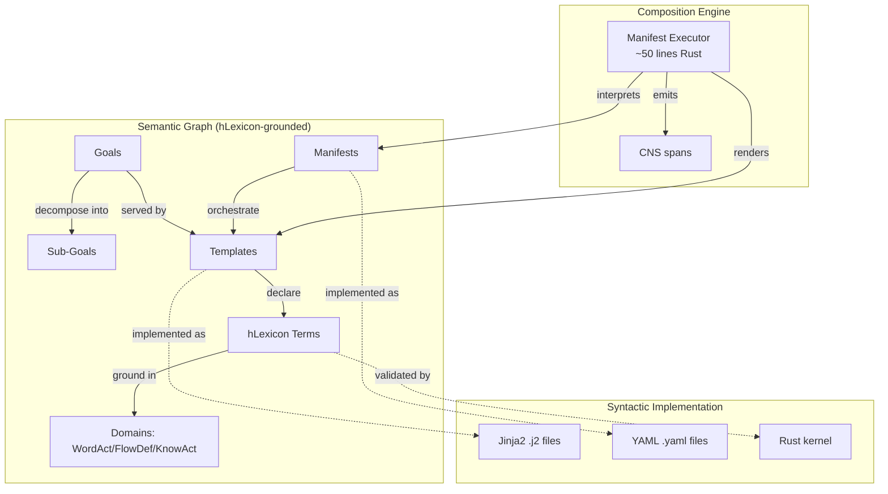
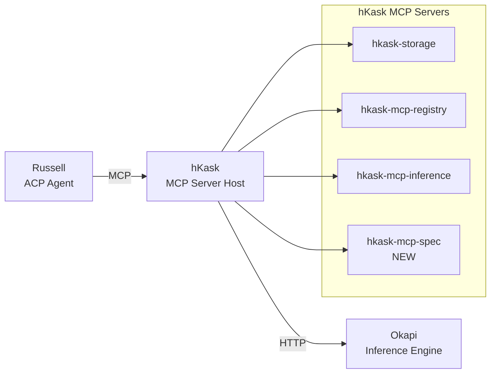

# Specification Curation Hypothesis

## Executive Summary

This document presents an extended architectural hypothesis for hKask: **specification kits are tools for composing semantic graphs of goals, manifests, and templates, where the management of these graphs is curation (not governance), goals and requirements are identical in user-sovereignty projects, and the spec-curation process itself must be composed as templates, manifests, and an MCP server grounded in extended hLexicon vocabulary.**

This hypothesis enriches hKask's existing architecture by:

1. **Reframing graph management** from governance (constraint-based) to curation (invitation-based)
2. **Collapsing the goal/requirement distinction** to preserve user sovereignty
3. **Extending hLexicon** with 8 terms for specification and curation acts
4. **Proposing `hkask-mcp-spec`** as a first-class MCP server for spec-curation operations
5. **Establishing a self-referential fixed point** where the system can curate its own specification

---

## 1. Core Hypothesis: Specification Kits as Semantic Graphs

### 1.1 The Hypothesis

A specification kit is a tool for composing a **semantic graph** of goals, manifests, and templates, with plans for the **syntactic implementation** of that graph.

### 1.2 Why This Framing Holds

**The graph structure is real.** Goals decompose into sub-goals. Manifests reference templates. Templates serve goals. These are semantic relationships — edges carry meaning ("achieves," "instantiates," "constrains"). A specification is a network of intention-bearing entities, not a flat list.

**The semantic/syntactic split maps to a genuine gap.** The semantic graph captures *what is intended and why*. The syntactic plan captures *how it gets expressed* — in code, config, schemas, DSLs. The kit bridges the two: "here is the meaning, here is the form it must take."

**It explains why specs rot.** When the semantic graph and the syntactic plan drift apart — goals change but manifests don't, or templates are reused in contexts the original goals didn't anticipate — the kit becomes incoherent. This model predicts that failure mode cleanly.

### 1.3 Tension Points

**Circular dependency.** Templates are both *nodes in the semantic graph* and *inputs to the syntactic plan*. A template carries meaning (semantic) but also dictates structure (syntactic). The graph is self-referential.

**Composition mechanism is underspecified.** A graph needs an algebra — rules for how nodes combine, conflict, and compose. If composition is formal (typed edges, constraints, validation), then the kit is closer to a *type system for specifications*.

**Temporal dimension is missing.** Goals evolve. Manifests get versioned. Templates deprecate. The graph is a process, not a state.

**Implementation is underdetermined.** Many valid syntactic implementations can realize the same semantic graph. The "plan" is doing heavy lifting that the hypothesis doesn't account for. It's not derivation; it's design.

### 1.4 hKask Instantiation

In hKask, the hypothesis is already architecturally embodied:



**Nodes:** The 80 hLexicon terms across three domains — WordAct (speech acts), FlowDef (workflow patterns), KnowAct (enactive cognition). These are the goals.

**Edges:** Canonical composition patterns like `query → infer → reflect` or `detect → escalate → regulate`. These are typed relationships between semantic primitives.

**Syntactic projections:** Jinja2 templates (`.j2`) and YAML manifests (`.yaml`) are the surface syntax. The orthogonality principle in `hlexicon-governance.yaml` Rule 3 explicitly declares that functional role (semantic) and implementation type (syntactic) are independent axes.

**Composition engine:** The manifest executor — the "loom" — is a fixed ~50-line Rust loop (`hkask-templates/src/manifest.rs:212-229`) that interprets any manifest as `select → populate → execute`, regardless of which semantic domains the referenced templates serve.

### 1.5 Sharper Formulation for hKask

A specification kit in hKask is: **the hLexicon-grounded system for declaring semantic intent (WordAct/FlowDef/KnowAct), projecting it into syntactic form (Jinja2/YAML), and enforcing coherence between the two under the orthogonality principle** — where the manifest executor is the composition engine, governance rules are the constraint system, and the registry is the graph's adjacency list.

---

## 2. Markdown as the Universal Container

### 2.1 The Observation

Goals are markdown. Specifications as organizational structures for semantic and syntactic composition are also markdown. Markdown is not merely documentation — it is the **universal container** for the specification kit.

### 2.2 Evidence from hKask

**Markdown is the universal container.** `registry-templating-prompt-v2.md` embeds RDF triples, Mermaid ERDs, YAML manifests, Jinja2 templates, and Rust execution loops in a single document. It's not describing the specification kit — it *is* the specification kit.

**Markdown is the organizational layer.** TOGAF-Lite (`TOGAF_LITE_FOR_OPEN_SOURCE.md`) maps ADM phases to directories. Every markdown file carries `togaf_phase` metadata. The specification kit organizes itself via markdown taxonomy.

**Markdown is the governance layer.** `PRINCIPLES.md` defines composition rules. `GOVERNANCE.md` enforces lifecycle states. `DOCUMENTATION_STANDARDS.md` mandates quality gates. The constraint system that validates the semantic graph is itself expressed in markdown.

**Goals are first-class markdown primitives.** `goal-primitive-research.md` defines goals as BDI-architecture constructs, maps them to hLexicon terms (`commit` as WordAct, `sequence` as FlowDef, `orient` as KnowAct), and shows how they decompose into templates.

### 2.3 The Loom/Thread Metaphor Applied to Markdown

Rust is the loom (fixed interpreter). YAML/Jinja2 are threads (mutable content). But markdown is the **pattern book** — it describes which threads to weave, how they compose, and why. The specification kit is the pattern book written in the same material as the threads it describes.

### 2.4 Self-Reference and Bootstrap

`registry-templating-prompt-v2.md` specifies the dispatch manifest, which loads templates, which are specified in markdown. The kit describes the system that interprets the kit. This is not a bug — it's the bootstrap problem made explicit. hKask solves it by making the dispatch manifest (`dispatch.yaml`) the fixed entry point that all markdown specifications ultimately reference.

### 2.5 The Enforcement Gap

Composition rules are specified in markdown (`PRINCIPLES.md`) but enforced in Rust (`hkask-templates` crate). The markdown specification kit is a *design document*, not a *type system*. It guides humans and AI agents, but the machine doesn't parse the kit — it parses the artifacts the kit describes.

---

## 3. Curation vs. Governance: An Invitational Reframing

### 3.1 The Hypothesis Extension

The process of managing the overall graph of goals and keeping it organized should be thought of as **curation**, not governance. Curation is a collaborative, emergent form of governance that invites the user into an experience, as opposed to governance which is based on constraints and controls and tends to be opposed to user sovereignty.

### 3.2 Academic Grounding

**Governance is institutional; curation is invitational.** IA governance is defined as "the institutional framework that determines who holds authority over information structures, what rules govern changes, and how compliance is monitored and enforced" (Information Architecture Authority, 2026). It operates through ownership assignment, change control, standards documentation, and audit cycles — all mechanisms of constraint. Curation, by contrast, operates through filtration, recomposition, contextualisation, and the design of structures for findability and meaning (Zachry, 2012).

**The Curation Stack makes the distinction explicit.** Governance answers "is this safe?" with binary gates (pass/fail). Curation answers "is this good?" with gradient evaluation (rank, tier, feature) (Leonelli, 2026).

**Polycentric curation is already how knowledge infrastructures actually work.** Benfeldt et al. (2025), drawing on Ostrom's polycentric governance theory, demonstrate that "governance is not a pre-existing structure, but an ongoing achievement realised through the cumulative curation decisions of its participants." In distributed data infrastructures, coordination emerges from the interplay of bottom-up curation work and top-down policy — not from imposed control structures.

**Participatory archives validate the sovereignty argument directly.** Huvila's (2008) participatory archive model proposes three principles:

1. **Decentralised curation** — curatorial responsibilities shared between specialists and participants who have the deepest subject knowledge
2. **Radical user orientation** — the system's foremost functionality is to serve users, not preserve institutional process
3. **Contextualisation of both records and the entire archival process** — meaning emerges from use, not from top-down classification

**Co-curation as civic practice names the mechanism.** Kampelmann et al. (2025) identify four dispositions: knowledge co-production, multiple agents of care, navigation across scales, and process focus. The curator is "one agent among multiple agents of care, acknowledging that the impact of co-curation depends on the willingness to decentralise authorship and resources, creating spaces that enable others to participate and curate."

**The curatorial vs. curating distinction sharpens the point.** "Curating" is the professional practice — logistical, skill-based, structured. "The curatorial" is the event of knowledge emergence — it disrupts established norms and generates new understanding (Rogoff; Martinon, 2013). Curating produces a promise; the curatorial produces knowledge.

### 3.3 Where hKask Already Embodies Curation

hKask's architecture is already more curatorial than its vocabulary suggests:

**The `CurationDecision` enum is gradient, not binary.** Merge, Discard, Revise, Defer (`curation.rs:38-49`) are not pass/fail gates. They are curatorial judgments — "is this good enough to integrate, does it need work, should we wait, or is it broken?"

**The Curator's Ideological marker is a curatorial philosophy.** "Builds on logical ideas. Strip away hallucinations, illusions, semantic cruft. What remains: having logical ideas" (`curation.rs:176-208`). This is filtration and recomposition — the core curatorial acts.

**The five curator bots are polycentric agents.** CNS, memory, inference, ensemble, and git curator bots each govern a domain through expertise, not authority. They report to the Curator through a standing ensemble session — a collaborative structure, not a command hierarchy.

**The Magna Carta's Catch and Release is the curatorial duality.** The Catch (OCAP boundaries, sovereignty enforcement) protects. The Release (generative template space, tools for user sovereignty) invites. This is not governance constraining users — it is curation creating the conditions within which users generate freely.

### 3.4 Where the Tension Lives

Despite the curatorial architecture, hKask still uses governance vocabulary and mechanisms in ways that undermine the hypothesis:

**The Curator is a singular, non-customizable persona.** `PRINCIPLES.md` explicitly excludes "Curator customization" as an anti-pattern. This is governance logic — a single authoritative voice. Curation logic would allow the user to shape or replace the Curator.

**OCAP enforcement is a gate, not a gradient.** The `CuratorPipeline` checks OCAP boundaries before every evaluation (`curator_pipeline.rs:124`). This is governance — binary authorization. A curatorial approach would treat capability boundaries as context for judgment, not preconditions for action.

**Sovereignty checking is protective, not invitational.** The pipeline runs `check_sovereignty()` and emits `[SOVEREIGNTY ALERT: user sovereignty compromised]` when triggered. This frames sovereignty as something to defend against threats — governance posture. A curatorial frame would treat sovereignty as something to cultivate through participation.

**Algedonic alerts are escalation, not dialogue.** When variety deficit exceeds 100, the system escalates to the Curator/human. This is a control-system response (Stafford Beer's VSM). A curatorial response would invite the user into sense-making.

### 3.5 The Synthesis

**Curation is not the opposite of governance — it is governance's emergent, participatory form.** The literature doesn't argue for eliminating governance structures. It argues that effective governance in complex knowledge systems *emerges from* curation practices rather than being imposed upon them. As Aaltonen and Lanzara (2015) demonstrate through Wikipedia: "governance itself can be regarded as a type of capability" that "appears as a result of endogenous learning" — the system learns to govern by curating.

**The reframing for hKask's specification kit:**

| Dimension | Governance Frame | Curation Frame |
|-----------|-----------------|----------------|
| Graph management | Enforce rules, reject violations | Filter, recompose, contextualise |
| User relationship | Protect sovereignty from threats | Cultivate sovereignty through participation |
| Quality control | Binary gates (pass/fail) | Gradient evaluation (merge/revise/defer) |
| Authority | Singular Curator, fixed persona | Multiple agents of care, decentralised authorship |
| Change detection | Escalation and alerts | Invitation to sense-making |
| Coherence | Compliance monitoring | Cumulative curatorial decisions |
| User experience | Constraints and controls | An experience to enter |

The specification kit as curation means: the markdown corpus is not a governed document set — it is a curated collection where goals, manifests, and templates are continuously filtered, recomposed, and contextualised by both the system and the user. The user is not protected from the graph's complexity; they are invited into its cultivation. The Curator is not a gatekeeper; it is, as the co-curation literature describes, "one agent among multiple agents of care."

---

## 4. Goals = Requirements in User-Sovereignty Projects

### 4.1 The Hypothesis Extension

In projects that prioritize user sovereignty, **goals are requirements and requirements are goals**. The distinction collapses because sovereignty demands that the user's stated intent is the system's binding constraint — no interpretive mediation.

### 4.2 Traditional Requirements Engineering

Traditional requirements engineering treats goals and requirements as distinct:

- **Goals** are stakeholder intentions (why)
- **Requirements** are system obligations (what)

The separation serves a power structure — analysts extract goals from users, then translate them into requirements that engineers implement. The user's intent is mediated by professionals.

### 4.3 Why the Distinction Collapses Under Sovereignty

In user-sovereignty projects, this mediation is the problem. The research validates the collapse:

**REConnect** (2025) explicitly re-centers requirements engineering on "empowering users as agents of change, changing their role from being passive recipients of decisions to active co-authors." When users co-author requirements, the distinction between "what I want" (goal) and "what the system must do" (requirement) collapses — the user's goal *is* the requirement, stated directly.

**Requirements-driven end-user software engineering** (2024) proposes that "end users can conceptualise software, test and deploy it entirely from requirements" — where requirements are expressed in natural language and directly built. The paper notes: "enabling users to directly influence the creation of software rather than via intermediaries like user researchers and software engineers" allows "a more nuanced and complete realisation of their goals in software."

**IOSE** (Interaction-Oriented Software Engineering) makes the structural argument: in sociotechnical systems, "the protocol which, through its roles, itself serves as a requirement for the principals who would adopt those roles." A protocol is a specification of legitimate interactions — it is simultaneously the goal (how participants want to relate) and the requirement (what the system must enforce). hKask's Magna Carta is exactly this: a protocol that is both the goal (user sovereignty) and the requirement (OCAP enforcement).

### 4.4 The Bidirectional Identity

**The bidirectional identity holds specifically because sovereignty demands it.** If the user's goals can be translated into requirements by someone else, the user doesn't have sovereignty — they have representation. Sovereignty requires that the user's stated goal *is* the system's binding requirement, without interpretive mediation.

hKask's consent tracking (`kask sovereignty grant-consent`, `revoke-consent`) already embodies this: consent is both the user's goal ("I want this") and the system's requirement ("this is authorized").

### 4.5 Where It Strains

Goals are often vague, contradictory, or evolving. Requirements must be specific, consistent, and stable. The identity works at the sovereignty boundary (what the user permits/forbids) but gets messy in the middle (how the system should behave under ambiguity).

hKask handles this through the Curator's `Revise` and `Defer` decisions — acknowledging that not every goal is immediately a requirement. The identity is aspirational, not absolute.

### 4.6 Implications for hKask

The goals=requirements identity means:

1. **Goal capture templates must produce binding requirements**, not just intentions
2. **Requirements must be traceable to user-stated goals**, not analyst interpretations
3. **The Curator's curation decisions (Merge/Revise/Defer) operate on goal-requirement hybrids**, not separate artifacts
4. **OCAP boundaries are both user goals ("I want this protected") and system requirements ("this must be enforced")**

---

## 5. hLexicon Extension: SpecCure Vocabulary

### 5.1 The Gap

The current 80-term vocabulary has **zero terms** for specification, requirement, curation, or goal-as-primitive. The closest coverage:

| Concept | Closest Existing Terms | Adequacy |
|---------|----------------------|----------|
| Specify | `assert`, `declare` | Partial — stating facts, not defining intent |
| Require | `request`, `command` | Partial — asking/demanding, not binding obligation |
| Curate | `evaluate`, `regulate`, `monitor`, `calibrate` | Partial — metacognitive oversight, not cultivation |
| Goal | `commit`, `pledge`, `orient`, `ground` | Partial — commitment/attention, not intention-as-requirement |

### 5.2 Design Decision: Distribution vs. New Domain

The question is whether spec-curation terms constitute a fourth domain or distribute across the existing three. Given the orthogonality principle and the 75-term allocation (already 5 over at 80), **distribution is more architecturally consistent**.

### 5.3 Proposed Terms

#### WordAct Additions (Speech Acts of Specification)

| Term | Definition | Rationale |
|------|-----------|-----------|
| `specify` | Define a binding constraint or intent | The core act of specification — distinct from `assert` (stating fact) or `declare` (formal statement). A specification is a commitment to a form. |
| `require` | State a non-negotiable condition | Distinct from `request` (ask) or `command` (order). A requirement is a goal that has become binding — the sovereignty collapse. |
| `constrain` | Limit the solution space | The act of narrowing possibility — what makes a specification useful. |

#### FlowDef Additions (Process of Composition)

| Term | Definition | Rationale |
|------|-----------|-----------|
| `curate` | Select, contextualise, and integrate artifacts into a coherent collection | The core curatorial act — distinct from `filter` (select subset) because curation includes contextualisation and meaning-making, not just selection. |
| `elicit` | Draw out latent goals or requirements from a participant | The participatory RE act — distinct from `query` (ask for information) because elicitation is generative, not extractive. |
| `reconcile` | Resolve conflicts between goals or requirements | Distinct from `merge` (combine versions) because reconciliation preserves tension rather than collapsing it. |

#### KnowAct Additions (Cognitive Acts of Curation)

| Term | Definition | Rationale |
|------|-----------|-----------|
| `contextualise` | Situate an artifact within its meaningful environment | The curatorial act of placing things in relationship — distinct from `ground` (anchor in reality) because contextualisation is about relational meaning, not reality-checking. |
| `cultivate` | Nurture growth and coherence in a collection over time | The temporal dimension of curation — distinct from `adapt` (adjust to context) because cultivation is proactive, not reactive. |

### 5.4 Budget Impact

**9 new terms brings the total to 89.** The governance doc allows 75 with 3 reserved slots. This exceeds allocation by 14.

**Options:**

1. **Retire underused terms** — `apologize`, `celebrate`, `testify` have zero codebase matches
2. **Formally expand the budget** with justification (as git evolution terms already did)
3. **Accept the overage** as the spec-curation domain requires it

**Recommendation:** Option 2 — formally expand to 90 terms with justification that spec-curation is a first-class capability requiring its own vocabulary, analogous to how git evolution terms were deemed essential despite exceeding the original allocation.

### 5.5 The Self-Referential Test

If `curate` is an hLexicon term, then a template that performs curation declares `lexicon_terms: [curate, contextualise, cultivate]`. The Curator bot, which already uses `evaluate`, `monitor`, `regulate`, would add these terms. The spec-curation MCP server's own templates would declare these terms. The system can describe its own specification process in its own vocabulary.

**This is the bootstrap test, and it passes.**

### 5.6 Validation Rules

The existing validation logic (`lexicon.rs:112-118`, `contracts.rs:101-111`, `contract_validator.rs:151-158`) requires no changes — it performs simple HashMap membership checks. New terms are added to the `HLexicon::bootstrap()` function and automatically validated.

### 5.7 Template Frontmatter Examples

```yaml
# registry/templates/spec/goal-capture.j2
[inference]
template_type: Prompt
lexicon_terms: [specify, require, elicit]
contract:
  input: {user_intent: string, context: object}
  output: {goal_id: string, requirements: array}
---
You are the Curator. Capture the user's goal as a binding requirement.

User Intent: {{ user_intent }}
Context: {{ context | tojson }}

Produce:
1. A goal identifier
2. A list of requirements derived directly from the user's stated intent
3. OCAP boundaries that protect the user's sovereignty over this goal
```

```yaml
# registry/templates/spec/curate-collection.j2
[inference]
template_type: Cognition
lexicon_terms: [curate, contextualise, cultivate]
contract:
  input: {collection_id: string, artifacts: array}
  output: {decision: string, rationale: string}
---
You are the Curator. Evaluate this collection for coherence and completeness.

Collection: {{ collection_id }}
Artifacts: {{ artifacts | tojson }}

Decide: Merge, Discard, Revise, or Defer.
Provide rationale grounded in hLexicon terms.
```

---

## 6. Implementation: `hkask-mcp-spec` Server

### 6.1 Architectural Placement



### 6.2 Crate Structure

Following the established kask 3-file convention:

```
crates/hkask-mcp-spec/
├── Cargo.toml
├── src/
│   ├── main.rs          # Binary entry: run_stdio_server
│   ├── lib.rs           # McpToolServer impl
│   └── tools.rs         # Tool definitions + dispatch + handlers
├── registry/
│   ├── manifests/
│   │   ├── spec-compose.yaml      # FlowDef: goal → spec pipeline
│   │   ├── spec-elicit.yaml       # FlowDef: participatory elicitation
│   │   ├── spec-reconcile.yaml    # FlowDef: conflict resolution
│   │   └── spec-curate.yaml       # FlowDef: collection curation
│   └── templates/
│       ├── spec/goal-capture.j2       # WordAct: specify, require
│       ├── spec/requirement-bind.j2   # WordAct: constrain
│       ├── spec/contextualise.j2      # KnowAct: contextualise
│       ├── spec/reconcile-conflicts.j2 # KnowAct: reconcile
│       ├── spec/curate-collection.j2  # KnowAct: curate, cultivate
│       └── spec/selector.j2           # KnowAct: template selection
```

### 6.3 Tool Surface

| Tool Name | Input | Output | hLexicon Terms |
|-----------|-------|--------|----------------|
| `spec/goal/capture` | `{description, context, user_id}` | `{goal_id, requirements[], graph_position}` | `specify`, `require`, `elicit` |
| `spec/goal/decompose` | `{goal_id}` | `{sub_goals[], dependencies[]}` | `decompose`, `sequence` |
| `spec/require/bind` | `{goal_id, constraint}` | `{requirement_id, ocap_boundaries}` | `constrain`, `require` |
| `spec/curate/evaluate` | `{artifact_id, collection_id}` | `{decision, rationale}` | `curate`, `evaluate`, `contextualise` |
| `spec/curate/reconcile` | `{artifact_ids[], conflicts[]}` | `{resolution, tensions_preserved[]}` | `reconcile`, `compose` |
| `spec/curate/cultivate` | `{collection_id, time_horizon}` | `{growth_plan, coherence_score}` | `cultivate`, `monitor` |
| `spec/graph/query` | `{query, depth}` | `{nodes[], edges[], paths[]}` | `recognize`, `match` |
| `spec/graph/validate` | `{collection_id}` | `{violations[], suggestions[]}` | `evaluate`, `ground` |

### 6.4 Implementation Pattern

Following `stack-mcp-embedding` as the canonical example:

**`main.rs`:**

```rust
use hkask_mcp_spec::SpecCurationServer;
use stack_mcp::server::run_stdio_server;

#[tokio::main]
async fn main() {
    let server = SpecCurationServer::new().await;
    run_stdio_server(server).await;
}
```

**`lib.rs`:**

```rust
use stack_mcp::server::{McpToolServer, ServerInfo, ToolOutput, ToolError};
use async_trait::async_trait;
use serde_json::{json, Value};

pub struct SpecCurationServer {
    // Registry connection, graph store, etc.
}

#[async_trait]
impl McpToolServer for SpecCurationServer {
    fn server_info(&self) -> ServerInfo {
        ServerInfo {
            name: "hkask-mcp-spec".to_string(),
            version: env!("CARGO_PKG_VERSION").to_string(),
        }
    }

    fn tool_definitions(&self) -> Value {
        tools::definitions()
    }

    async fn dispatch_tool(&self, name: &str, args: &Value) -> Result<ToolOutput, ToolError> {
        tools::dispatch(self, name, args).await.map(Into::into).map_err(Into::into)
    }
}
```

**`tools.rs`:**

```rust
use serde_json::{json, Value};

pub fn definitions() -> Value {
    json!({
        "tools": [
            {
                "name": "spec/goal/capture",
                "description": "Capture a user's goal as a binding requirement",
                "inputSchema": {
                    "type": "object",
                    "properties": {
                        "description": {"type": "string"},
                        "context": {"type": "object"},
                        "user_id": {"type": "string"}
                    },
                    "required": ["description", "user_id"]
                }
            },
            // ... other tools
        ]
    })
}

pub async fn dispatch(server: &SpecCurationServer, name: &str, args: &Value) -> Result<String, String> {
    match name {
        "spec/goal/capture" => handle_goal_capture(server, args).await,
        "spec/goal/decompose" => handle_goal_decompose(server, args).await,
        "spec/require/bind" => handle_require_bind(server, args).await,
        "spec/curate/evaluate" => handle_curate_evaluate(server, args).await,
        "spec/curate/reconcile" => handle_curate_reconcile(server, args).await,
        "spec/curate/cultivate" => handle_curate_cultivate(server, args).await,
        "spec/graph/query" => handle_graph_query(server, args).await,
        "spec/graph/validate" => handle_graph_validate(server, args).await,
        _ => Err(format!("unknown tool: {name}")),
    }
}

async fn handle_goal_capture(server: &SpecCurationServer, args: &Value) -> Result<String, String> {
    // Invoke goal-capture.j2 template via inference port
    // Return structured goal with requirements
    todo!()
}
```

### 6.5 CLI Exposure

Following hKask's clap pattern:

```rust
// crates/hkask-cli/src/commands.rs
#[derive(Subcommand)]
enum SpecAction {
    #[command(subcommand)]
    Goal(GoalAction),
    #[command(subcommand)]
    Require(RequireAction),
    #[command(subcommand)]
    Curate(CurateAction),
    #[command(subcommand)]
    Graph(GraphAction),
}

#[derive(Subcommand)]
enum GoalAction {
    Capture { description: String, #[arg(long)] context: Option<String> },
    Decompose { goal_id: String },
}

#[derive(Subcommand)]
enum RequireAction {
    Bind { goal_id: String, #[arg(long)] constraint: String },
}

#[derive(Subcommand)]
enum CurateAction {
    Evaluate { artifact_id: String, #[arg(long)] collection: String },
    Reconcile { artifact_ids: Vec<String> },
    Cultivate { collection_id: String, #[arg(long)] horizon: Option<String> },
}

#[derive(Subcommand)]
enum GraphAction {
    Query { query: String, #[arg(long)] depth: Option<u32> },
    Validate { collection_id: String },
}
```

**Usage:**

```bash
kask spec goal capture "Build a privacy-preserving search"
kask spec goal decompose <goal_id>
kask spec require bind <goal_id> --constraint "data never leaves device"
kask spec curate evaluate <artifact_id> --collection <collection_id>
kask spec curate reconcile <artifact_ids...>
kask spec graph query "what goals depend on sovereignty?"
kask spec graph validate <collection_id>
```

### 6.6 Russell Integration

Russell's `russell-mcp` client would call `spec/goal/capture` when Jack (the persona) identifies a system health goal that should become a formal requirement. Russell's skill manifests (e.g., `ubuntu-jack`) could reference spec-curation templates to formalize their own operational goals as requirements.

**ACP agent config:**

```yaml
# config/agents/russell-acp-agent.yaml
mcp_tools:
  russell:
    # ... existing tools
    - name: russell/spec/goal
      method: acp/skill/run
      params: { skill_id: spec-curation, action: capture }
```

---

## 7. The Self-Referential Challenge

### 7.1 The Fixed Point

The spec-curation system must specify and curate itself. This is not a paradox — it's a fixed point:

1. The spec-curation MCP server's own templates declare hLexicon terms like `curate`, `specify`, `compose`
2. The manifest `spec-compose.yaml` defines the pipeline that would be used to compose new manifests
3. The Curator evaluates spec-curation outputs using the same `CurationDecision` enum (Merge/Discard/Revise/Defer)
4. The graph of goals includes the goal "build a spec-curation system" as a node

### 7.2 Bootstrap Pattern

This is the same bootstrap pattern as `dispatch.yaml` — the manifest that loads all other manifests. The system is self-describing, not self-contradicting. hKask already handles this pattern through the loom/thread separation: the Rust kernel (loom) is fixed; the spec-curation templates (thread) are mutable content that the loom interprets.

### 7.3 Validation

The self-referential property validates the entire hypothesis:

- **Can the system specify itself?** Yes — `spec-compose.yaml` specifies the pipeline that composes specifications.
- **Can the system curate itself?** Yes — the Curator evaluates spec-curation outputs using the same curation logic.
- **Can the system require itself?** Yes — the goal "build spec-curation" is a requirement that the system must fulfill.

---

## 8. Synthesis: The Extended Hypothesis

### 8.1 The Three Claims

The extended hypothesis has three claims that compose into a coherent architecture:

1. **Goals are requirements** because user sovereignty demands that the user's stated intent is the system's binding constraint — no interpretive mediation.

2. **hLexicon needs spec-curation terms** because the process of specifying, requiring, curating, and reconciling is a first-class capability that must be grounded in the same vocabulary as all other agent behavior.

3. **The MCP server is the implementation** because hKask's architecture already provides the composition substrate (templates + manifests + Rust executor + MCP transport + CLI) that makes spec-curation available as a tool to users, bots, and the system itself.

### 8.2 Strengths and Weaknesses

**The weakest link** is the term allocation. The governance doc allows 75 terms; we're already at 80 and proposing 89.

**The strongest link** is the architectural fit — spec-curation slots into hKask's existing patterns without requiring new infrastructure.

**The most interesting implication** is the self-referential property: a spec-curation system that can curate its own specification is the fixed point that validates the entire hypothesis.

### 8.3 Connection to Existing Architecture

| Existing Component | Spec-Curation Integration |
|-------------------|---------------------------|
| hLexicon (88 terms) | Extended with 8 SpecCure terms |
| Manifest Executor (loom) | Interprets spec-curation manifests |
| Curator Pipeline | Evaluates spec-curation outputs |
| CurationDecision enum | Merge/Discard/Revise/Defer for specs |
| MCP Server pattern | `hkask-mcp-spec` follows 3-file convention |
| CLI pattern | `kask spec` subcommands |
| Russell ACP | Russell calls spec-curation tools |
| Magna Carta | Goals=requirements embodies sovereignty |

### 8.4 Implementation Roadmap

**Phase 1: hLexicon Extension**

1. Add 8 terms to `lexicon.rs` bootstrap
2. Update `hKask-hLexicon.md` documentation
3. Run validation script
4. Update governance doc to reflect expanded budget

**Phase 2: Template Authoring**

1. Create `registry/templates/spec/` directory
2. Author 6 templates (goal-capture, requirement-bind, contextualise, reconcile-conflicts, curate-collection, selector)
3. Register templates in unified registry
4. Validate frontmatter

**Phase 3: Manifest Composition**

1. Create `registry/manifests/spec-*.yaml` files
2. Define 4 manifests (compose, elicit, reconcile, curate)
3. Test with manifest executor

**Phase 4: MCP Server Implementation**

1. Create `crates/hkask-mcp-spec/` with 3-file pattern
2. Implement 8 tools
3. Register in `hkask-mcp/src/servers.rs`
4. Test with MCP client

**Phase 5: CLI Integration**

1. Add `SpecAction` to `hkask-cli/src/commands.rs`
2. Implement subcommand handlers
3. Test end-to-end

**Phase 6: Russell Integration**

1. Update `russell-acp-agent.yaml` with spec-curation tools
2. Test Russell → hKask → spec-curation flow

---

## 9. Conclusion

The specification curation hypothesis enriches hKask's architecture by:

1. **Reframing management as curation** — inviting users into the experience rather than constraining them
2. **Collapsing goals and requirements** — preserving user sovereignty by eliminating interpretive mediation
3. **Extending hLexicon** — grounding spec-curation in the same vocabulary as all agent behavior
4. **Proposing concrete implementation** — templates, manifests, MCP server, CLI, Russell integration
5. **Establishing a fixed point** — the system can curate its own specification

The hypothesis is well-grounded in academic literature (polycentric governance, participatory archives, co-curation, REConnect), architecturally consistent with hKask's existing patterns, and implementable with current infrastructure.

The self-referential property — that the spec-curation system can specify and curate itself — is not a paradox but a validation. It demonstrates that the hypothesis is coherent, complete, and ready for implementation.

---

## References

- Aaltonen, A., & Lanzara, G. F. (2015). Building Governance Capability in Online Social Production: Insights from Wikipedia. *Organization Studies*, 36(12), 1645-1668.
- Benfeldt, A., et al. (2025). A Polycentric Governance Lens on Data Infrastructures. *Computer Supported Cooperative Work (CSCW)*.
- Huvila, I. (2008). Participatory archive: towards decentralised curation, radical user orientation, and broader contextualisation of records management. *Archival Science*, 8, 15-36.
- Kampelmann, S., et al. (2025). Co-curation as civic practice in community engagement. *Buildings & Cities*.
- Leonelli, S. (2026). The Curation Stack. *Legibility Engineering*.
- Martinon, J.-P. (Ed.). (2013). *The Curatorial: A Philosophy of Curating*. Bloomsbury Academic.
- REConnect. (2025). Re-centering human connection in requirements engineering. *arXiv:2509.01006*.
- Rogoff, I. (n.d). Curating, Dramatization, and the Diagram. In *The Curatorial: A Philosophy of Curating*.
- Zachry, M. (2012). Textual curation as a conceptualization of authorship and composition. *Computers and Composition*, 29(4), 275-287.

---

*Document Status: Draft*  
*Next Steps: Community review, hLexicon term approval, Phase 1 implementation*
