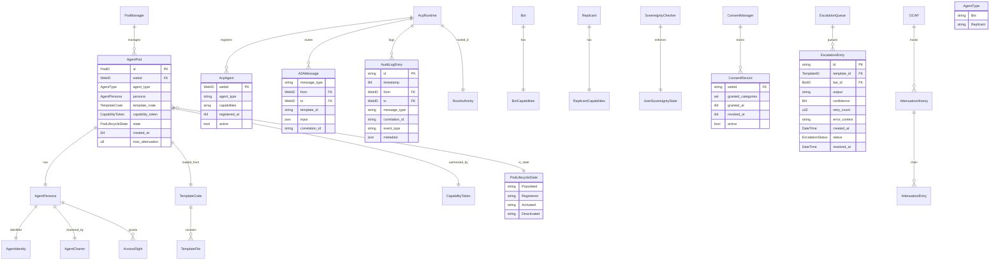
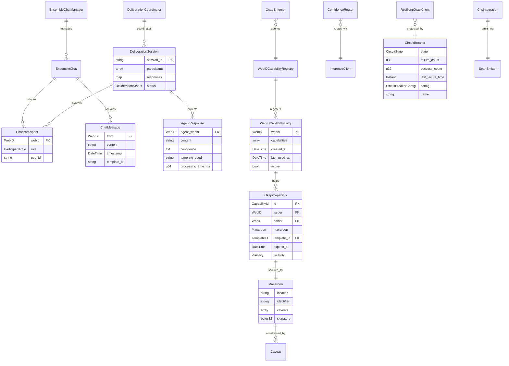
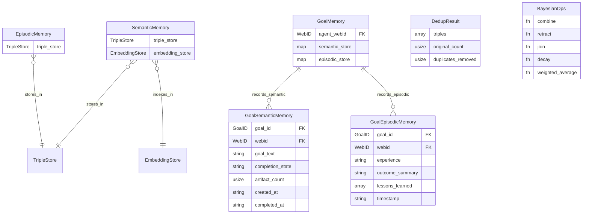
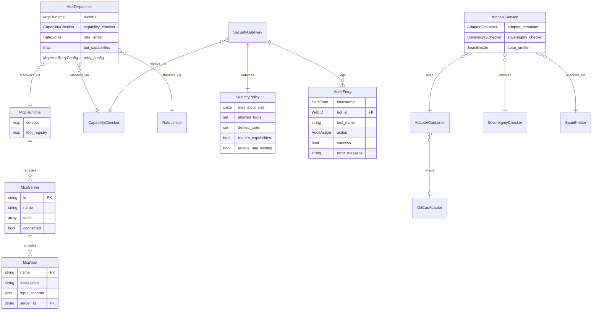
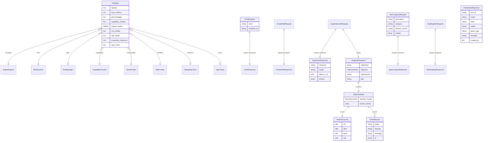
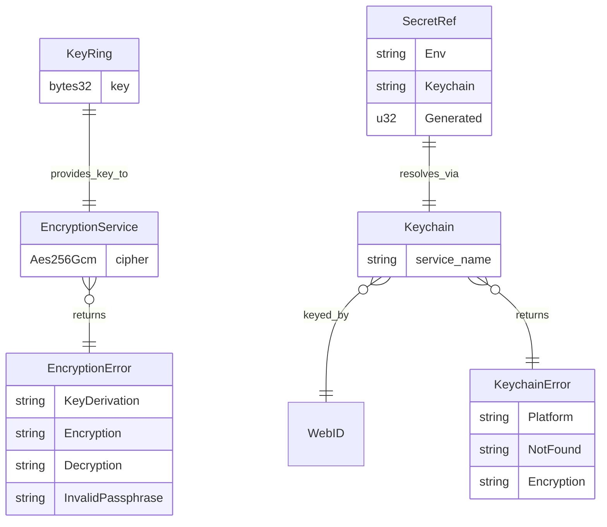
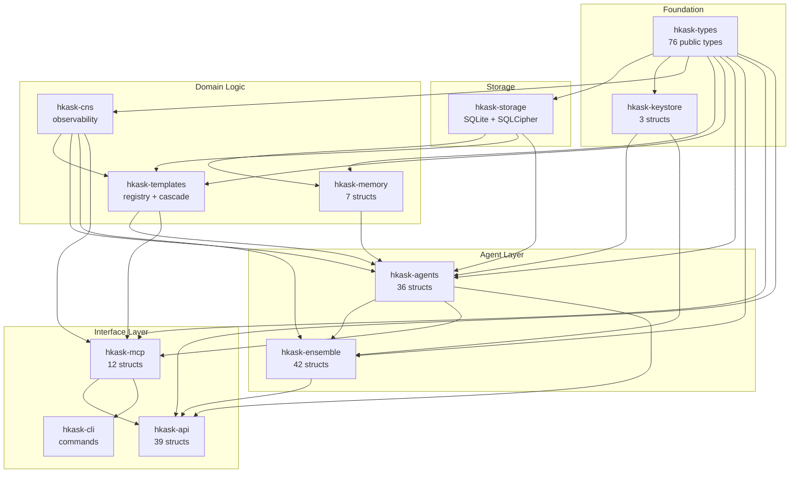

# hKask Subsystem Entity Relationship Diagrams

**Purpose:** Mermaid ERDs for all 11 core crates, grounded in actual Rust source types. Supplements [`hKask-erd.md`](hKask-erd.md) (conceptual model) and [`registry-erd.md`](registry-erd.md) (high-temp tables).

**Related:** [`hKask-erd.md`](hKask-erd.md), [`application-architecture.md`](application-architecture.md), [`data-architecture.md`](data-architecture.md)

---

## 1. hkask-types — Foundation Types

The type foundation: 76 public types across 16 modules. All ID types are newtype wrappers around `uuid::Uuid`.[^rust-newtype]

```mermaid
erDiagram
    WebID ||--o{ NuEvent : "observes"
    WebID ||--o{ CapabilityToken : "delegates"
    WebID ||--o{ Goal : "owns"
    WebID ||--o{ Bot : "identifies"
    WebID ||--o{ Replicant : "identifies"

    EventID ||--o{ NuEvent : "identifies"
    GoalID ||--o{ Goal : "identifies"
    GoalID ||--o{ GoalCriterion : "has"
    GoalID ||--o{ GoalArtifact : "produces"
    GoalID ||--o{ GoalCapabilityToken : "authorizes"

    SpecId ||--o{ Spec : "identifies"
    Spec ||--o{ GoalSpec : "contains"
    GoalSpec ||--o{ GoalSpec : "decomposes_into"
    GoalSpec ||--o{ Criterion : "requires"
    Spec ||--o{ SpecCurationRecord : "curated_by"

    TemplateID ||--o{ TemplateInvocation : "invokes"
    TemplateID ||--o{ CurationRecord : "evaluated_in"
    BotID ||--o{ TemplateInvocation : "invoked_by"

    NuEvent {
        EventID id PK
        DateTime timestamp
        WebID observer_webid FK
        Span span
        Phase phase
        json observation
        json regulation
        json outcome
        u8 recursion_depth
        EventID parent_event FK
        string visibility
    }

    Span {
        string Prompt
        string Tool
        string AgentPod
        string Connector
        string Pipeline
        string Energy
        string Review
        string Sovereignty
        string Goal
        string Spec
    }

    Phase {
        string Observe
        string Regulate
        string Outcome
    }

    Goal {
        GoalID id PK
        WebID webid FK
        string text
        GoalState state
        Visibility visibility
        DateTime created_at
        DateTime completed_at
        GoalID parent_goal_id FK
        u8 depth
    }

    GoalCriterion {
        string id
        GoalID goal_id FK
        string criterion_type
        string description
        bool satisfied
    }

    GoalArtifact {
        string id
        GoalID goal_id FK
        string artifact_ref
        string artifact_type
        DateTime created_at
    }

    CapabilityToken {
        string id PK
        CapabilityResource resource
        string resource_id
        CapabilityAction action
        WebID delegated_from FK
        WebID delegated_to FK
        string signature
        i64 expires_at
        u8 attenuation_level
        u8 max_attenuation
        string context_nonce
    }

    Spec {
        SpecId id PK
        string name
        SpecCategory category
        DomainAnchor domain_anchor
        GoalSpec goals
        WebID signed_by FK
        DateTime created_at
    }

    TemplateInvocation {
        TemplateID id PK
        TemplateID template_id FK
        BotID bot_id FK
        f32 temperature
        LLMParameters parameters
        json input
        json outputs
        usize selected_index
        TemplateOutcome outcome
        DateTime timestamp
    }

    LexiconTerm {
        string term PK
        Domain domain
        string definition
        string academic_citation
    }

    DataSovereigntyBoundary {
        SovereigntyId id PK
        set sovereign_data
        set shared_data
        set public_data
        AcquisitionResistance resistance
    }
```

<!-- DIAGRAM_ALIGNMENT
id: DIAG-SUBSYS-001
verified_date: 2026-05-24
verified_against: crates/hkask-types/src/id.rs; crates/hkask-types/src/event.rs; crates/hkask-types/src/goal.rs; crates/hkask-types/src/capability.rs; crates/hkask-types/src/spec.rs; crates/hkask-types/src/template.rs; crates/hkask-types/src/lexicon.rs; crates/hkask-types/src/sovereignty.rs
status: VERIFIED
-->

---

## 2. hkask-agents — Pod Lifecycle & ACP

Agent pods, ACP runtime, OCAP delegation, and sovereignty enforcement. 36 public structs, 12 enums, 9 traits.[^cockburn-hexagonal]

<!-- DIAGRAM_ALIGNMENT
id: DIAG-SUBSYS-002
verified_date: 2026-05-24
verified_against: crates/hkask-agents/src/pod.rs; crates/hkask-agents/src/acp.rs; crates/hkask-agents/src/bot.rs; crates/hkask-agents/src/replicant.rs; crates/hkask-agents/src/consent.rs; crates/hkask-agents/src/curator/escalation.rs
status: VERIFIED
-->

---

## 3. hkask-ensemble — Multi-Agent Chat & Deliberation

Chat coordination, deliberation sessions, confidence routing, macaroon capabilities, and Okapi integration. 42 structs, 19 enums, 6 traits.[^beer-vsm]

<!-- DIAGRAM_ALIGNMENT
id: DIAG-SUBSYS-003
verified_date: 2026-05-24
verified_against: crates/hkask-ensemble/src/chat.rs; crates/hkask-ensemble/src/deliberation.rs; crates/hkask-ensemble/src/macaroon.rs; crates/hkask-ensemble/src/capability.rs; crates/hkask-ensemble/src/webid_registry.rs; crates/hkask-ensemble/src/resilience.rs
status: VERIFIED
-->

---

## 4. hkask-memory — Episodic & Semantic Pipelines

Memory taxonomy grounded in Tulving's episodic/semantic distinction.[^tulving] 7 structs, 3 enums, 1 trait.

<!-- DIAGRAM_ALIGNMENT
id: DIAG-SUBSYS-004
verified_date: 2026-05-24
verified_against: crates/hkask-memory/src/episodic.rs; crates/hkask-memory/src/semantic.rs; crates/hkask-memory/src/goal_memory.rs; crates/hkask-memory/src/bayesian.rs; crates/hkask-memory/src/recall_dedup.rs
status: VERIFIED
-->

---

## 5. hkask-mcp — MCP Runtime & Dispatch

Tool registration, capability-gated dispatch, security gateway, and archival service. 12 structs, 1 enum.[^mcp-spec]

<!-- DIAGRAM_ALIGNMENT
id: DIAG-SUBSYS-005
verified_date: 2026-05-24
verified_against: crates/hkask-mcp/src/runtime.rs; crates/hkask-mcp/src/dispatch.rs; crates/hkask-mcp/src/security.rs; crates/hkask-mcp/src/adapter_container.rs; crates/hkask-mcp/src/archival_service.rs
status: VERIFIED
-->

---

## 6. hkask-api — HTTP API & OpenAPI

28+ request/response models served through axum with utoipa OpenAPI generation. 39 structs, 3 enums.[^utoipa]

<!-- DIAGRAM_ALIGNMENT
id: DIAG-SUBSYS-006
verified_date: 2026-05-24
verified_against: crates/hkask-api/src/lib.rs; crates/hkask-api/src/routes.rs; crates/hkask-api/src/openapi.rs
status: VERIFIED
-->

---

## 7. hkask-keystore — Keychain & Encryption

OS keychain integration and AES-256-GCM encryption with Argon2id key derivation. 3 structs, 2 enums.[^nist-sp800-132]

<!-- DIAGRAM_ALIGNMENT
id: DIAG-SUBSYS-007
verified_date: 2026-05-24
verified_against: crates/hkask-keystore/src/keychain.rs; crates/hkask-keystore/src/encryption.rs
status: VERIFIED
-->

---

## 8. Cross-Crate Dependency Graph

<!-- DIAGRAM_ALIGNMENT
id: DIAG-SUBSYS-008
verified_date: 2026-05-24
verified_against: Cargo.toml workspace dependencies; crates/*/src/lib.rs import analysis
status: VERIFIED
-->

---

## References

[^rust-newtype]: The Rust Project. (2024). *Rust API Guidelines — Newtype pattern*. <https://rust-lang.github.io/api-guidelines/type-safety.html#c-newtype>. The newtype pattern used for all ID types ensures type safety across UUID-based identifiers.

[^cockburn-hexagonal]: Cockburn, A. (2005). *Hexagonal Architecture*. <https://alistair.cockburn.us/hexagonal-architecture/>. The port/adapter pattern used throughout hkask-agents (GitCASPort, AcpPort, MemoryStoragePort, MCPRuntimePort, KeystorePort, SovereigntyPort).

[^beer-vsm]: Beer, S. (1972). *Brain of the Firm*. Penguin Books. Viable System Model — the ensemble crate's multi-agent deliberation maps to Beer's System 4 (intelligence) and System 5 (policy).

[^tulving]: Tulving, E. (1972). Episodic and Semantic Memory. In E. Tulving & W. Donaldson (Eds.), *Organization of Memory* (pp. 381–403). Academic Press. The episodic/semantic distinction governs hkask-memory's architecture.

[^mcp-spec]: Anthropic. (2024). *Model Context Protocol Specification*. <https://modelcontextprotocol.io/specification>. The MCP runtime implements tool discovery, invocation, and capability-gated dispatch per this specification.

[^utoipa]: utoipa Contributors. (2024). *utoipa: Compile-time OpenAPI documentation*. <https://crates.io/crates/utoipa>. Used for compile-time OpenAPI spec generation from Rust types.

[^nist-sp800-132]: NIST. (2010). *Recommendation for Password-Based Key Derivation*. NIST Special Publication 800-132. <https://csrc.nist.gov/publications/detail/sp/800-132/final>. Argon2id parameters in hkask-keystore follow NIST guidance for memory-hard KDFs.

---

*ℏKask — Planck's Constant of Agent Systems — v0.21.0*
*Every ERD grounded in Rust source. Every relationship verified against code.*
