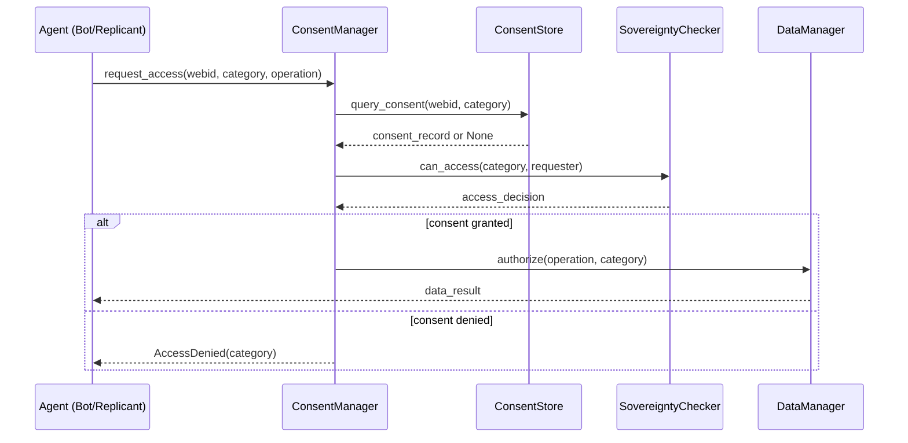
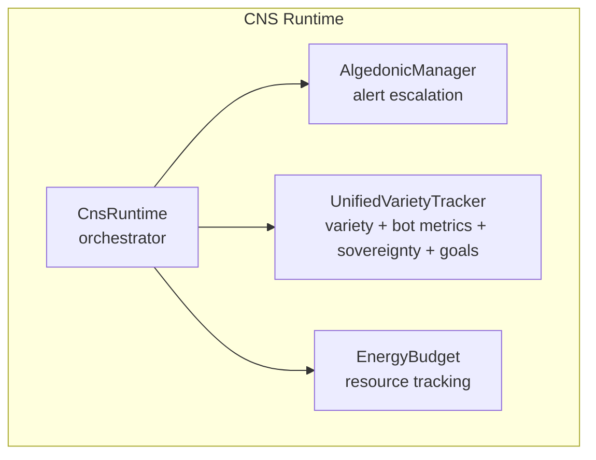
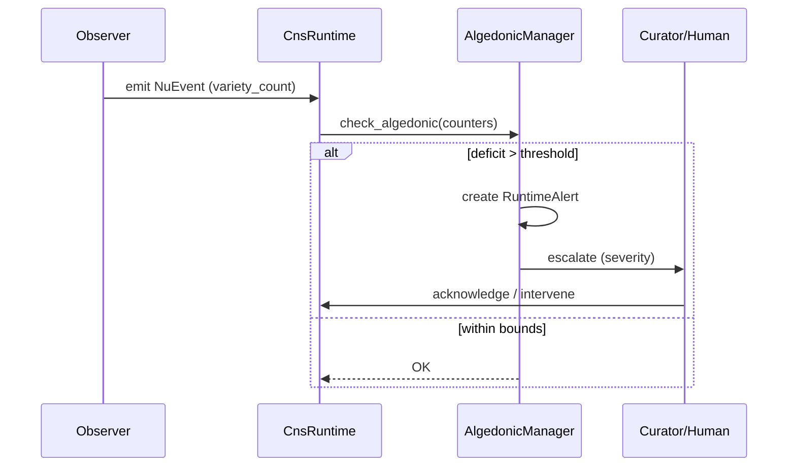

# hKask Trust, Security & Observability Specification

**Purpose:** Authoritative specification for security model, OCAP enforcement, encryption, CNS observability, and threat model. Single source of truth for DDMVSS categories **Trust & Security** and **Observability**.

**Related:** [`domain-and-capability.md`](domain-and-capability.md), [`interface-and-composition.md`](interface-and-composition.md), [`persistence-and-lifecycle.md`](persistence-and-lifecycle.md), [`magna-carta.md`](magna-carta.md)

**Verification:** `cargo check --workspace && cargo test -p hkask-types && cargo test -p hkask-cns`

---

## 1. Security Model

### 1.1 Zero-Trust Defaults

hKask implements a **zero-trust, capability-based security model**:[^miller-robust]

- **No hardcoded secrets** — all keys from environment or keystore
- **No ambient authority** — every operation requires explicit capability
- **Fail-closed** — denied by default
- **No wildcards** — `"*"` rejected at registration

[^miller-robust]: Miller, M. S. (2006). *Robust Composition*. Johns Hopkins University.

### 1.2 Single Capability Primitive

All access control uses `DelegationToken` (`crates/hkask-types/src/capability/mod.rs:327`; `CapabilityToken` is a type alias for `DelegationToken` — added for spec-code alignment in v0.27.0):

| Property | Implementation |
|----------|---------------|
| **Signing** | HMAC-SHA256 + `subtle::ConstantTimeEq` |
| **Scoping** | Resource + action pairs (`CapabilityResource`, `CapabilityAction`) |
| **Caveats** | Expiration, operation, template, visibility (`Caveat` struct — `pub(crate)` in `DelegationTokenBuilder`; not public API) |
| **Attenuation** | Max depth 7 (configurable) |
| **Revocation** | `HashSet<String>` inside `AcpRuntime` |
| **Secure memory** | Arc-wrapped, `Zeroizing` on drop |

**Full capability model:** [`domain-and-capability.md`](domain-and-capability.md) §5

### 1.3 Deterministic Identity

WebIDs derived from persona content via UUID v5:
- Same persona → same WebID (across processes, restarts)
- Root authority from fixed `"hkask-root-authority"` persona
- Namespace UUID: `686b6173-6b2d-7065-7273-6f6e612d6e73`

**Implementation:** `WebID::from_persona()` (`crates/hkask-types/src/id.rs:176`)

### 1.4 Encryption Stack

| Layer | Algorithm | Crate | Purpose |
|-------|-----------|-------|--------|
| Database at rest | SQLCipher (AES-256-CBC) | `rusqlite` + `bundled-sqlcipher` | Encrypted storage |
| Master key derivation | Argon2id → HKDF-SHA256 | `argon2` v0.5 + `hmac`/`sha2` | One passphrase → all internal secrets[^master-key] |
| Key derivation | Argon2id | `argon2` v0.5 | Passphrase → key[^argon2] |
| Sub-key expansion | HKDF-SHA256 (RFC 5869) | `hmac` + `sha2` | Master key → independent sub-keys |
| Capability signing | HMAC-SHA256 | `hmac` + `sha2` | Token integrity |
| Manifest signing | Ed25519 | `ed25519-dalek` v2 | Template provenance |
| Symmetric encryption | AES-256-GCM | `aes-gcm` v0.10 | Secret encryption |
| Content hashing | BLAKE3 | `blake3` v1 | Git CAS addressing |
| Memory protection | Zeroize on drop | `zeroize` + `zeroize_derive` | Prevent leakage |
| Secret wrapping | `secrecy` | `secrecy` crate | No accidental logging |

[^master-key]: The master key derivation chain uses Argon2id once (slow, memory-hard, ~100ms) to stretch the user's passphrase into a 256-bit master key, then HKDF-SHA256 (fast, deterministic, ~1μs each) to derive each internal secret. This ensures the same passphrase always produces the same secrets across restarts.

[^argon2]: Biryukov, A., Dinu, D., & Khovratovich, D. (2016). *Argon2: The Memory-Hard Function for Password Hashing*. Selected for GPU/ASIC resistance.

### 1.5 OCAP Enforcement Points

| Boundary | Enforcement | Implementation |
|----------|------------|----------------|
| MCP tool invocation | `GovernedTool` | `hkask-cns/src/governed_tool.rs:80` |
| Template execution | `GovernedTool` (runtime) / `CapabilityAwareValidator` (registration-time stub) | `hkask-cns/src/governed_tool.rs:80` (runtime); `hkask-templates/src/capability_validator.rs` (stub, FocusingAssumption: minimal stub — full implementation deferred) |
| ACP message routing | `SovereigntyPort` | `hkask-agents/src/sovereignty.rs` |
| Memory storage | `MemoryStoragePort` | `hkask-agents/src/pod/context.rs:50` |
| API requests | Capability in Authorization header | `hkask-api/src/lib.rs` |
| Pod creation | Root capability required | `hkask-agents/src/pod/manager.rs:266` |

### 1.6 Security Invariants

| Invariant | Enforcement |
|-----------|-------------|
| No wildcard capabilities | `AcpRuntime::register_agent` rejects `"*"` |
| No ambient authority | Every operation requires capability |
| Constant-time comparison | `subtle::ConstantTimeEq` |
| Persistent revocation | `HashSet<String>` in `AcpRuntime` survives restarts |
| Attenuation limit | `attenuation_level < max_attenuation` |
| Deterministic identity | UUID v5 from persona |
| Deterministic secrets | All internal secrets derived from master key via HKDF-SHA256 |
| No random secret fallback | `SecretRef::Generated` prohibited in production code paths |
| Secure memory | Secrets zeroized on drop |
| Async purity | No `block_in_place`/`block_on` |
| Typed errors | No `unwrap()` on hot paths |

### 1.7 Master Key Derivation

All internal secrets (ACP signing key, capability token key, MCP security key, OCAP secret) are derived deterministically from a single master passphrase using HKDF-SHA256. This eliminates the previous class of bugs where secrets were silently generated at random on each process start, invalidating all previously-issued tokens.

**Derivation chain:**

```
Master passphrase (user-provided, stored in OS keychain or env var HKASK_MASTER_KEY)
  │
  ├── Argon2id(passphrase, fixed_salt) → 256-bit master key  [~100ms, memory-hard]
  │
  ├── HKDF-SHA256(master_key, "hkask:acp-secret")     → ACP HMAC signing secret
  ├── HKDF-SHA256(master_key, "hkask:capability-key")  → API capability token key
  ├── HKDF-SHA256(master_key, "hkask:mcp-security-key") → MCP security gateway key
  └── HKDF-SHA256(master_key, "hkask:ocap-secret")     → OCAP signing secret
```

**Resolution priority:**

1. `SecretRef::Env` — Direct environment variable (for override)
2. `SecretRef::Keychain` — OS keychain entry (for override)
3. `SecretRef::Derived` — HKDF-SHA256 from master key (deterministic, restart-safe)
4. `SecretRef::Generated` — Random bytes (⚠️ not restart-safe; only for salts/nonces)

**Implementation:**

| Component | Location |
|-----------|----------|
| `SecretRef::Derived` variant | `crates/hkask-types/src/secret.rs` |
| `derivation_contexts` constants | `crates/hkask-types/src/secret.rs` |
| `derive_all_internal_secrets()` | `crates/hkask-keystore/src/master_key.rs` |
| `derive_sub_key()` (HKDF-SHA256) | `crates/hkask-keystore/src/master_key.rs` |
| `resolve()` extended for `Derived` | `crates/hkask-keystore/src/keychain.rs` |
| Call-site updates | `crates/hkask-agents/src/acp.rs`, `crates/hkask-mcp/src/security.rs`, `crates/hkask-api/src/lib.rs` |

**Security properties:**

- Same passphrase → same secrets (restart-safe, cluster-safe)
- Different contexts → cryptographically independent sub-keys
- Compromise of one sub-key does not compromise the master key or other sub-keys (HKDF extraction step)
- Master key never stored; only derived sub-keys are held in memory with `Zeroizing` protection
- Argon2id with OWASP parameters (64 MiB, 3 iterations, 4 lanes) resists GPU/ASIC attacks

### 1.8 Keystore Persistence

The MCP keystore server persists encrypted entries to a file-based vault at `~/.hkask/keystore/vault.json` (configurable via `HKASK_KEYSTORE_DIR`). Each entry is AES-256-GCM encrypted with a per-entry salt and serialized as JSON. The vault is loaded at startup and saved after each mutation using atomic writes (temp file + rename).

| Property | Implementation |
|----------|---------------|
| Encryption | AES-256-GCM with per-entry Argon2id-derived key |
| Access control | OCAP-gated: only owner WebID can read |
| Persistence | JSON vault file, atomic writes |
| Vault location | `~/.hkask/keystore/vault.json` or `HKASK_KEYSTORE_DIR` |
| Schema versioning | `Vault.version` field for forward compatibility |

---

## 2. STRIDE-lite Threat Model

| Threat | Category | Mitigation | hKask Primitive |
|--------|----------|-----------|-----------------|
| Template injection | Tampering | Jinja2 sandbox | `minijinja` sandboxing |
| Capability forgery | Spoofing | HMAC-SHA256 + constant-time | `DelegationToken` integrity |
| Capability escalation | Elevation | Attenuation enforcement | `DelegationTokenBuilder` attenuation |
| Replay attacks | Spoofing | Context nonce + expiry | `DelegationToken.context_nonce` |
| Data at rest exposure | Info Disclosure | SQLCipher | `hkask-storage` |
| Supply chain compromise | Tampering | Pinned versions, `cargo deny` | `Cargo.toml` |
| Path traversal | Elevation | Path validation | `hkask-storage` guards |
| Spec tampering | Tampering | Ed25519 signing | `hkask-keystore` |
| Master key compromise | Info Disclosure | Argon2id memory-hardness, `Zeroizing` protection | `hkask-keystore/master_key.rs` |
| Vault file read | Info Disclosure | AES-256-GCM encryption at rest | `hkask-mcp-keystore` |
| Audit log tampering | Repudiation | Append-only + git CAS | `GitCas` + `NuEventStore` |

[^shostack-threat]: Shostack, A. (2014). *Threat Modeling: Designing for Security*. Wiley. STRIDE methodology.

---

## 3. User Sovereignty (Magna Carta)

The Magna Carta principle enforces user sovereignty:[^westin-data]

| Right | Implementation |
|-------|---------------|
| **Data ownership** | All data local, SQLCipher encrypted |
| **No cross-machine sync** | Local-first, git backup only |
| **Capability revocation** | User can revoke any granted capability |
| **Visibility control** | Private/public gating per data category |
| **Consent management** | `ConsentManager` tracks authorization |
| **Consent management** | `ConsentManager` tracks scoped, versioned, expiring authorization |
| **Affirmative consent** | `requires_affirmative_consent: bool` — default deny, consent required |

**SovereigntyChecker** (`crates/hkask-agents/src/sovereignty.rs`):

A concrete struct (not a trait) enforcing user data boundaries. Each `AgentPod` holds a `SovereigntyChecker` initialized with the pod owner's `WebID`.

**Key operations:**
- `new(webid)` — create checker for a specific WebID owner
- `check_operation(operation, data_category)` — verify access authorization (2 args)
- `can_access(category, requester)` — boolean access check

Consent management is handled by `ConsentManager` (not SovereigntyChecker). Affirmative consent is handled by `DataSovereigntyBoundary::requires_affirmative_consent` (not SovereigntyChecker).

### 3.0.1 ConsentManager Authorization Flow

The ConsentManager mediates all data access decisions between agents and the user's data boundaries. Every read/write operation on episodic memory, semantic memory, or other data categories must pass through the consent gate.



<!-- DIAGRAM_ALIGNMENT
id: DIAG-TO-006-CM
verified_date: 2026-06-07
verified_against: crates/hkask-agents/src/consent.rs; crates/hkask-agents/src/sovereignty.rs; crates/hkask-storage/src/consent_store.rs
status: VERIFIED
-->

[^westin-data]: Westin, A. F. (1967). *Privacy and Freedom*. Atheneum. Informational self-determination.

---

## 4. CNS Observability

### 4.1 Cybernetic Nervous System

The CNS (`hkask-cns`, 2,039 LOC) provides runtime observability following Beer's Viable System Model:[^beer-vsm]



<!-- DIAGRAM_ALIGNMENT
id: DIAG-TSO-001
verified_date: 2026-06-07
verified_against: crates/hkask-cns/src/runtime.rs:39-55; crates/hkask-cns/src/unified_tracker.rs
status: VERIFIED
-->

[^beer-vsm]: Beer, S. (1972). *Brain of the Firm*. Wiley.

### 4.2 Span Namespaces

Every capability invocation emits a `NuEvent` with typed `Span` (`event.rs:87-103`). There are **20 canonical namespaces** (15 canonical + 5 hierarchical; authoritative source: PRINCIPLES.md \u00a71.4):

| Span | Variant | Covers |
|------|---------|--------|
| `cns.prompt.*` | `Prompt` | Template render, validate, outcome |
| `cns.tool.*` | `Tool` | Tool governance, invocation |
| `cns.inference.*` | `Inference` | Inference governance, energy budget |
| `cns.agent_pod.*` | `AgentPod` | Pod lifecycle, delegation |
| `cns.connector.*` | `Connector` | External I/O (LLM, embeddings) |
| `cns.pipeline.*` | `Pipeline` | Memory pipeline operations |
| `cns.gas.*` | `Gas` | Gas budget tracking |
| `cns.review.*` | `Review` | Review queue operations |
| `cns.template.*` | `Template` | Template lifecycle |
| `cns.curation.*` | `Curation` | Curation operations |
| `cns.variety.*` | `Variety` | Variety counter tracking |
| `cns.sovereignty.*` | `Sovereignty` | User sovereignty enforcement |
| `cns.goal.*` | `Goal` | Goal lifecycle operations |
| `cns.spec.*` | `Spec` | DDMVSS specification operations |
| `cns.test.*` | `Test` | Test harness and validation spans |
| `cns.hhh.gate.*` | `HHHGate` | HHH gate constraint checks |
| `cns.hhh.persona.*` | `HHHPersona` | Persona constraint enforcement |
| `cns.cybernetics.backpressure` | `Backpressure` | Communication queue depth regulation |
| `cns.memory.encode` | `MemoryEncode` | Memory encoding operations |
| `cns.memory.budget` | `MemoryBudget` | Memory budget tracking |

**Event structure:** `NuEvent` (`event.rs:27`) — id, timestamp, observer_webid, span, phase (Sense/Compute/Compare/Act; legacy aliases: Observe→Sense, Regulate→Compute, Outcome→Act), observation, regulation, outcome, recursion_depth, parent_event, visibility.

### 4.3 Variety Counters

Following Ashby's Law of Requisite Variety:[^ashby-law]

| Counter | Type | Purpose |
|---------|------|--------|
| `VarietyTracker` | `HashMap<String, u64>` + time window | Unique element count per category |
| `UnifiedVarietyTracker` | struct | Single SENSE point for domain variety (4.1), bot metrics (4.3), sovereignty events (4.4), and goal variety |

**Implementation:** `UnifiedVarietyTracker` (`unified_tracker.rs`), `VarietyTracker` (`variety.rs`)

[^ashby-law]: Ashby, W. R. (1956). *An Introduction to Cybernetics*. Wiley. "Only variety can absorb variety."

### 4.4 Algedonic Alerts

When variety deficit exceeds threshold, CNS escalates:



<!-- DIAGRAM_ALIGNMENT
id: DIAG-TSO-002
verified_date: 2026-06-07
verified_against: crates/hkask-cns/src/algedonic.rs:79; crates/hkask-types/src/cns.rs:62
status: VERIFIED
-->

| Severity | Trigger | Action |
|----------|---------|--------|
| Info | Variety within normal bounds | Log |
| Warning | Deficit > threshold/2 (default 50) | Escalate to Curator |
| Critical | Deficit > threshold (default 100) | Escalate to Human |

### 4.5 CNS Health

`CnsHealth` (`hkask-types/src/cns.rs:97`) provides aggregate status:
- `overall_deficit` — aggregate variety deficit
- `critical_count` — number of critical alerts
- `warning_count` — number of warning alerts
- `healthy` — `bool` indicating whether CNS is within normal bounds

**Accessible via:** `kask cns health` (CLI), `GET /api/v1/cns/health` (API), `cns_health()` (MCP)

### 4.4.1 CNS Span Emission and Algedonic Alert End-to-End Flow

This diagram shows the complete flow from CNS span emission through variety tracking to algedonic alert escalation, including the SpecDriftAlert pathway.

```mermaid
sequenceDiagram
    participant LOOP as CurationLoop
    participant SC as DefaultSpecCurator
    participant COMM as CommunicationLoop
    participant CYB as CyberneticsLoop
    participant ALG as AlgedonicManager
    participant EVT as NuEventStore

    Note over SC: Spec coherence evaluation
    SC->>SC: evaluate() detects drift
    SC->>COMM: LoopMessage(SpecDriftAlert)
    COMM->>LOOP: deliver to Curation inbox
    LOOP->>LOOP: sense() drains SpecDriftAlert

    Note over CYB: Periodic variety sensing
    CYB->>CYB: sense() collect variety counters
    CYB->>ALG: check_algedonic(counters)
    alt deficit > threshold/2
        ALG->>EVT: persist NuEvent(cns.variety.algedonic_alert)
        ALG-->>LOOP: escalate warning to Curator
    else deficit > threshold
        ALG->>EVT: persist NuEvent(cns.variety.critical)
        ALG-->>LOOP: escalate critical to Human
    else within bounds
        ALG-->>CYB: OK
    end
    CYB->>EVT: persist NuEvent(cns.cybernetics.*)
```

<!-- DIAGRAM_ALIGNMENT
id: DIAG-TO-006
verified_date: 2026-06-07
verified_against: crates/hkask-agents/src/curator_agent/spec_curator.rs; crates/hkask-cns/src/cybernetics_loop.rs; crates/hkask-cns/src/algedonic.rs
status: VERIFIED
-->

### 4.6 Rate Limiting

Rate limiting has been consolidated into gas budget enforcement. The `RateLimiter` and `CnsTokenBucket` types have been removed; resource exhaustion is now prevented via `GasBudget.consume()`, which gates all operations under a unified gas cap. `McpErrorKind::RateLimited` remains for external API HTTP 429 responses where downstream services impose rate limits.

### 4.7 Energy Budget

Gas tracking for resource-conscious execution:
- `GasBudget` (`crates/hkask-cns/src/energy.rs:26`) — allocation, consumption, and settlement
- `consume(gas)` — deduct gas from budget
- `can_proceed(gas)` — check whether budget allows the requested gas
- `reserve(gas)` — reserve gas for an operation
- `settle(reserved, actual)` — settle a reservation against actual consumption

---

## 5. Audit Trail

### 5.1 NuEvent Store

All CNS events persisted in `NuEventStore` (`hkask-storage/src/nu_event_store.rs:21`):
- Append-only event log with observer identity
- Queryable by span, time range, observer
- SQLCipher-encrypted SQLite

### 5.2 Git CAS Backup

Content-addressed storage via git (`hkask-agents/src/adapters/git_cas.rs`):
- BLAKE3 hashing for content addressing
- Git objects for immutable storage
- Provenance tracking via git history

### 5.3 Template Execution Audit

Template execution is audited through CNS `cns.template.*` spans emitted during the rendering pipeline. Each rendering records the template ID, execution timing, and capability tokens used. The `NuEvent` store persists these as append-only audit trail entries.

---

## Loop Assignment

This spec's content maps to the [6-loop authority model](loop-architecture.md) as follows:

| Spec Domain | Loop | Rationale |
|------------|------|-----------|
| Zero-trust model | Cybernetics (Loop 6) | Trust verification is regulatory — Cybernetics enforces the zero-trust membrane |
| OCAP enforcement | Cybernetics (Loop 6) | Capability verification is the Cybernetics regulation function |
| Master key derivation | Cybernetics (Loop 6) | Key management is a sovereignty/regulation concern |
| Encryption stack | Cybernetics (Loop 6) | Encryption boundaries are regulatory membranes |
| CNS spans | Cybernetics (Loop 6) | Observability is the Cybernetics sense function |
| Algedonic alerts | Cybernetics (Loop 6) + Curation (Loop 5) | Cybernetics detects; Curation receives escalation |
| Threat model | Cybernetics (Loop 6) | Threat response is regulatory |

---

## References

[^miller-robust]: Miller, M. S. (2006). *Robust Composition*. Johns Hopkins University.
[^beer-vsm]: Beer, S. (1972). *Brain of the Firm*. Wiley.
[^ashby-law]: Ashby, W. R. (1956). *An Introduction to Cybernetics*. Wiley.
[^shostack-threat]: Shostack, A. (2014). *Threat Modeling*. Wiley.
[^argon2]: Biryukov, A., et al. (2016). *Argon2*.
[^westin-data]: Westin, A. F. (1967). *Privacy and Freedom*. Atheneum.
