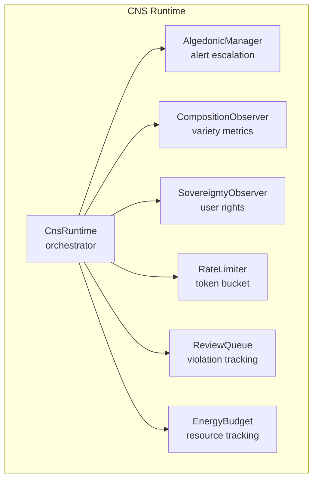
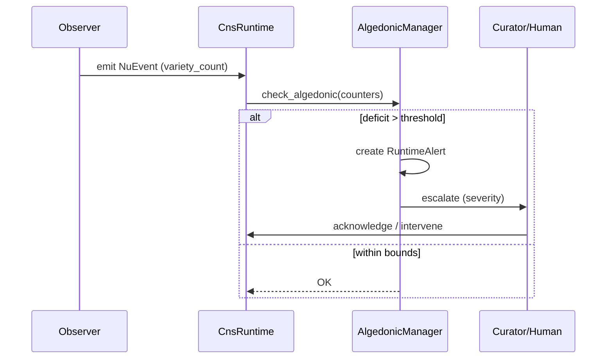

# hKask Trust, Security & Observability Specification

**Purpose:** Authoritative specification for security model, OCAP enforcement, encryption, CNS observability, and threat model. Single source of truth for DDMVSS categories **Trust & Security** and **Observability**.

**Related:** [`domain-and-capability.md`](domain-and-capability.md), [`interface-and-composition.md`](interface-and-composition.md), [`persistence-and-lifecycle.md`](persistence-and-lifecycle.md), [`magna-carta.md`](magna-carta.md)

**Verification:** `cargo check --workspace && cargo test -p hkask-types && cargo test -p hkask-cns`

---

## 1. Security Model

### 1.1 Zero-Trust Defaults

hKask implements a **zero-trust, capability-based security model**:[^miller-robust]

- **No hardcoded secrets** — all keys from environment or keystore
- **No ambient authority** — every operation requires explicit capability
- **Fail-closed** — denied by default
- **No wildcards** — `"*"` rejected at registration

[^miller-robust]: Miller, M. S. (2006). *Robust Composition*. Johns Hopkins University.

### 1.2 Single Capability Primitive

All access control uses `Capability` (`crates/hkask-types/src/visibility.rs:145`):

| Property | Implementation |
|----------|---------------|
| **Signing** | HMAC-SHA256 + `subtle::ConstantTimeEq` |
| **Scoping** | Resource + action pairs |
| **Caveats** | Expiration, operation, template, visibility |
| **Attenuation** | Max depth 7 (configurable) |
| **Revocation** | Persistent SQLite |
| **Secure memory** | `Arc<Zeroizing<Vec<u8>>>` |

**Full capability model:** [`domain-and-capability.md`](domain-and-capability.md) §5

### 1.3 Deterministic Identity

WebIDs derived from persona content via UUID v5:
- Same persona → same WebID (across processes, restarts)
- Root authority from fixed `"hkask-root-authority"` persona
- Namespace UUID: `686b6173-6b2d-7065-7273-6f6e612d6e73`

**Implementation:** `WebID::from_persona()` (`crates/hkask-types/src/id.rs:8`)

### 1.4 Encryption Stack

| Layer | Algorithm | Crate | Purpose |
|-------|-----------|-------|---------|
| Database at rest | SQLCipher (AES-256-CBC) | `rusqlite` + `bundled-sqlcipher` | Encrypted storage |
| Key derivation | Argon2id | `argon2` v0.5 | Passphrase → key[^argon2] |
| Capability signing | HMAC-SHA256 | `hmac` + `sha2` | Token integrity |
| Manifest signing | Ed25519 | `ed25519-dalek` v2 | Template provenance |
| Symmetric encryption | AES-256-GCM | `aes-gcm` v0.10 | Secret encryption |
| Content hashing | BLAKE3 | `blake3` v1 | Git CAS addressing |
| Memory protection | Zeroize on drop | `zeroize` + `zeroize_derive` | Prevent leakage |
| Secret wrapping | `secrecy` | `secrecy` crate | No accidental logging |

[^argon2]: Biryukov, A., Dinu, D., & Khovratovich, D. (2016). *Argon2: The Memory-Hard Function for Password Hashing*. Selected for GPU/ASIC resistance.

### 1.5 OCAP Enforcement Points

| Boundary | Enforcement | Implementation |
|----------|------------|----------------|
| MCP tool invocation | `SecurityGateway` | `hkask-mcp/src/security.rs:51` |
| Template execution | `CapabilityAwareValidator` | `hkask-templates/src/capability_validator.rs:21` |
| ACP message routing | `SovereigntyPort` | `hkask-agents/src/ports/sovereignty.rs:79` |
| Memory storage | `MemoryStoragePort` | `hkask-agents/src/pod.rs:685` |
| API requests | Capability in Authorization header | `hkask-api/src/lib.rs` |
| Pod creation | Root capability required | `hkask-agents/src/pod.rs:289` |

### 1.6 Security Invariants

| Invariant | Enforcement |
|-----------|-------------|
| No wildcard capabilities | `AcpRuntime::register_agent` rejects `"*"` |
| No ambient authority | Every operation requires capability |
| Constant-time comparison | `subtle::ConstantTimeEq` |
| Persistent revocation | `RevocationStore` survives restarts |
| Attenuation limit | `attenuation_level < max_attenuation` |
| Deterministic identity | UUID v5 from persona |
| Secure memory | Secrets zeroized on drop |
| Async purity | No `block_in_place`/`block_on` |
| Typed errors | No `unwrap()` on hot paths |

---

## 2. STRIDE-lite Threat Model

| Threat | Category | Mitigation | hKask Primitive |
|--------|----------|-----------|-----------------|
| Template injection | Tampering | Jinja2 sandbox | `minijinja` sandboxing |
| Capability forgery | Spoofing | HMAC-SHA256 + constant-time | `Capability::verify()` |
| Capability escalation | Elevation | Attenuation enforcement | `Capability::attenuate()` |
| Replay attacks | Spoofing | Context nonce + expiry | `Capability.context_nonce` |
| Data at rest exposure | Info Disclosure | SQLCipher | `hkask-storage` |
| Supply chain compromise | Tampering | Pinned versions, `cargo deny` | `Cargo.toml` |
| Path traversal | Elevation | Path validation | `hkask-storage` guards |
| Spec tampering | Tampering | Ed25519 signing | `hkask-keystore` |
| Audit log tampering | Repudiation | Append-only + git CAS | `GitCas` + `NuEventStore` |

[^shostack-threat]: Shostack, A. (2014). *Threat Modeling: Designing for Security*. Wiley. STRIDE methodology.

---

## 3. User Sovereignty (Magna Carta)

The Magna Carta principle enforces user sovereignty:[^westin-data]

| Right | Implementation |
|-------|---------------|
| **Data ownership** | All data local, SQLCipher encrypted |
| **No cross-machine sync** | Local-first, git backup only |
| **Capability revocation** | User can revoke any granted capability |
| **Visibility control** | Private/public gating per data category |
| **Consent management** | `ConsentManager` tracks authorization |
| **Acquisition resistance** | Default `Maximum` resistance level |
| **Kill-zone detection** | VC investment < 0.5 after acquisition attempt → CNS alert |

**SovereigntyPort** (`crates/hkask-agents/src/ports/sovereignty.rs:79`):

```rust
pub trait SovereigntyPort: Send + Sync {
    fn check(&self, operation: &SovereigntyOperation) -> SovereigntyCheckResult;
    fn revoke(&self, capability_id: &str) -> Result<(), SovereigntyError>;
    fn visibility(&self, category: &DataCategory) -> Visibility;
}
```

[^westin-data]: Westin, A. F. (1967). *Privacy and Freedom*. Atheneum. Informational self-determination.

---

## 4. CNS Observability

### 4.1 Cybernetic Nervous System

The CNS (`hkask-cns`, 2,039 LOC) provides runtime observability following Beer's Viable System Model:[^beer-vsm]



<!-- DIAGRAM_ALIGNMENT
id: DIAG-TSO-001
verified_date: 2026-05-25
verified_against: crates/hkask-cns/src/runtime.rs:30; algedonic.rs:79; observers/composition.rs:216
status: VERIFIED
-->

[^beer-vsm]: Beer, S. (1972). *Brain of the Firm*. Wiley.

### 4.2 Span Namespaces

Every capability invocation emits a `NuEvent` with typed `Span` (`event.rs:92`):

| Span | Variant | Covers |
|------|---------|--------|
| `cns.prompt.*` | `Prompt` | Template render, validate, outcome |
| `cns.tool.*` | `Tool` | Tool governance, invocation |
| `cns.agent_pod.*` | `AgentPod` | Pod lifecycle, delegation |
| `cns.connector.*` | `Connector` | External I/O (LLM, embeddings) |
| `cns.pipeline.*` | `Pipeline` | Memory pipeline operations |
| `cns.energy.*` | `Energy` | Energy budget tracking |
| `cns.review.*` | `Review` | Review queue operations |
| `cns.sovereignty.*` | `Sovereignty` | User sovereignty enforcement |
| `cns.goal.*` | `Goal` | Goal lifecycle operations |
| `cns.spec.*` | `Spec` | DDMVSS specification operations |

**Event structure:** `NuEvent` (`event.rs:27`) — span, phase (Observe/Regulate/Outcome), observer WebID, timestamp, JSON payload.

### 4.3 Variety Counters

Following Ashby's Law of Requisite Variety:[^ashby-law]

| Counter | Type | Purpose |
|---------|------|---------|
| `VarietyCounter` | `u64` wrapper | Unique element count per category |
| `CompositionMetrics` | struct | Template diversity, cascade depth |
| `VarietyMetrics` | struct | Aggregated variety across categories |

**Implementation:** `VarietyCounter` (`cns.rs:12`), `CompositionObserver` (`observers/composition.rs:216`)

[^ashby-law]: Ashby, W. R. (1956). *An Introduction to Cybernetics*. Wiley. "Only variety can absorb variety."

### 4.4 Algedonic Alerts

When variety deficit exceeds threshold, CNS escalates:



<!-- DIAGRAM_ALIGNMENT
id: DIAG-TSO-002
verified_date: 2026-05-25
verified_against: crates/hkask-cns/src/algedonic.rs:79; types/cns.rs:62
status: VERIFIED
-->

| Severity | Trigger | Action |
|----------|---------|--------|
| Info | Variety approaching threshold | Log |
| Warning | Deficit > 100 | Escalate to Curator |
| Critical | Deficit > 500 | Escalate to Human |

### 4.5 CNS Health

`CnsHealth` (`algedonic.rs:175`) provides aggregate status:
- Runtime status (active/degraded/down)
- Variety counter summary
- Active algedonic alerts
- Rate limiter status
- Review queue depth

**Accessible via:** `kask cns health` (CLI), `GET /api/v1/cns/health` (API), `cns_health()` (MCP)

### 4.6 Rate Limiting

Token bucket rate limiting prevents resource exhaustion:
- `CnsTokenBucket` (`rate_limit.rs:32`) — configurable capacity and refill
- `RateLimiter` (`rate_limit.rs:79`) — per-operation enforcement

### 4.7 Energy Budget

Energy tracking for resource-conscious execution:
- `EnergyBudget` (`energy.rs:55`) — allocation and consumption
- `EnergySpanType` (`energy.rs:25`) — operation categorization

---

## 5. Audit Trail

### 5.1 NuEvent Store

All CNS events persisted in `NuEventStore` (`hkask-storage/src/nu_event_store.rs:19`):
- Append-only event log with observer identity
- Queryable by span, time range, observer
- SQLCipher-encrypted SQLite

### 5.2 Git CAS Backup

Content-addressed storage via git (`hkask-storage/src/git_cas.rs:15`):
- BLAKE3 hashing for content addressing
- Git objects for immutable storage
- Provenance tracking via git history

### 5.3 Template Execution Audit

`AuditTrail` (`hkask-templates/src/audit.rs:87`) records:
- Template ID, version, rendering context
- Execution timing and outcome
- Capability tokens used
- Inference calls and model tier

---

## References

[^miller-robust]: Miller, M. S. (2006). *Robust Composition*. Johns Hopkins University.
[^beer-vsm]: Beer, S. (1972). *Brain of the Firm*. Wiley.
[^ashby-law]: Ashby, W. R. (1956). *An Introduction to Cybernetics*. Wiley.
[^shostack-threat]: Shostack, A. (2014). *Threat Modeling*. Wiley.
[^argon2]: Biryukov, A., et al. (2016). *Argon2*.
[^westin-data]: Westin, A. F. (1967). *Privacy and Freedom*. Atheneum.
