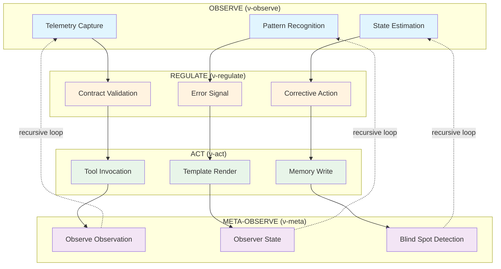
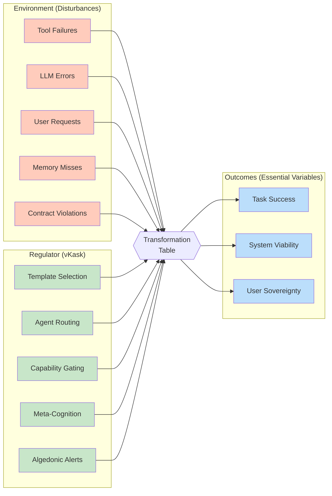
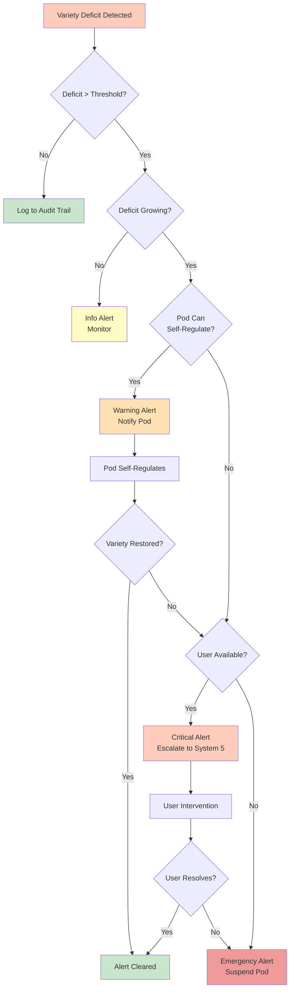
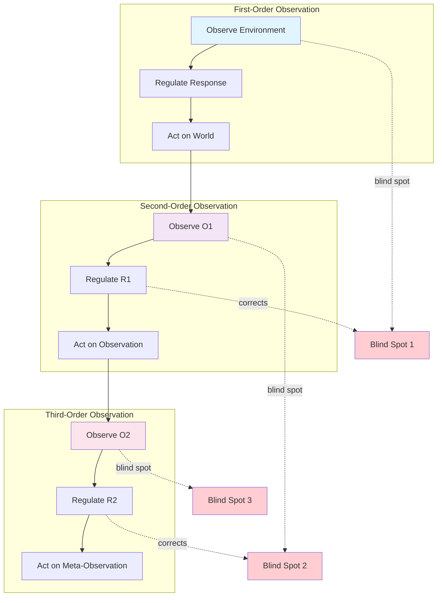
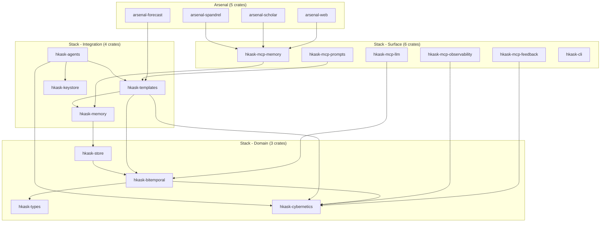
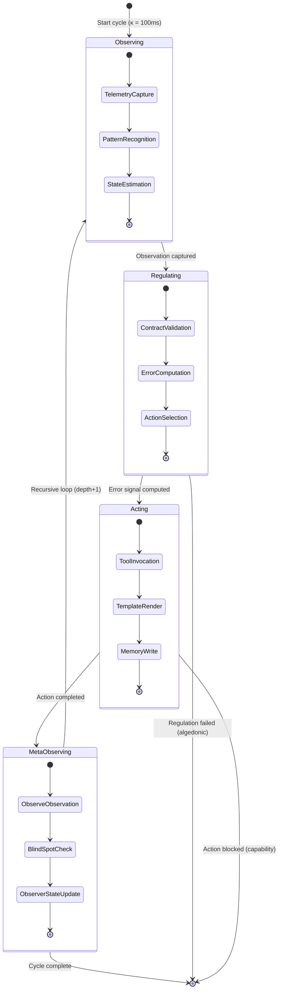

# νKask Entity Relationship Diagram

## The Cybernetic Triad — Core Flow



## νKask System Architecture

```mermaid
erDiagram
    %% ===========================================
    %% CYBERNETIC CORE
    %% ===========================================
    
    CYBERNETIC_EVENT ||--|| OBSERVER_REF : "produced_by"
    CYBERNETIC_EVENT ||--|| CYBERNETIC_PHASE : "in"
    CYBERNETIC_EVENT ||--|| OBSERVATION : "contains"
    CYBERNETIC_EVENT ||--o{ REGULATION : "computes"
    CYBERNETIC_EVENT ||--o{ ACTION : "triggers"
    CYBERNETIC_EVENT ||--o{ OUTCOME : "yields"
    CYBERNETIC_EVENT ||--o{ CYBERNETIC_EVENT : "parent_event"
    
    CYBERNETIC_PHASE: "Observe"
    CYBERNETIC_PHASE: "Regulate"
    CYBERNETIC_PHASE: "Act"
    CYBERNETIC_PHASE: "MetaObserve"
    
    OBSERVER_REF ||--|| POD_ID : "identifies"
    OBSERVER_REF ||--|| AGENT_WEB_ID : "sovereign_identity"
    OBSERVER_REF ||--o{ TEMPLATE_REF : "uses"
    OBSERVER_REF ||--|| OBSERVATION_CHANNEL : "senses_via"
    
    OBSERVATION_CHANNEL: "Telemetry"
    OBSERVATION_CHANNEL: "MemoryRecall"
    OBSERVATION_CHANNEL: "ToolOutput"
    OBSERVATION_CHANNEL: "UserInput"
    OBSERVATION_CHANNEL: "MetaCognition"
    
    OBSERVATION: "TelemetryCapture"
    OBSERVATION: "PatternRecognition"
    OBSERVATION: "StateEstimation"
    OBSERVATION: "ContractValidation"
    OBSERVATION: "Outcome"
    
    %% ===========================================
    %% VARIETY ENGINEERING
    %% ===========================================
    
    VARIETY_COUNTER ||--|| POD_ID : "tracks"
    VARIETY_COUNTER ||--|| VARIETY_DISTURBANCE : "measures"
    VARIETY_COUNTER ||--|| VARIETY_REGULATOR : "measures"
    VARIETY_COUNTER ||--|| VARIETY_REQUIRED : "computes"
    VARIETY_COUNTER ||--|| VARIETY_DEFICIT : "computes"
    
    VARIETY_DISTURBANCE: "V(D) — environmental"
    VARIETY_REGULATOR: "V(R) — regulatory"
    VARIETY_REQUIRED: "V(min) — Ashby's law"
    VARIETY_DEFICIT: "V(R) - V(required)"
    
    VARIETY_COUNTER ||--o{ ALGEDONIC_ALERT : "triggers"
    
    ALGEDONIC_ALERT ||--|| ALERT_LEVEL : "has"
    ALGEDONIC_ALERT ||--|| ALERT_CONTEXT : "contains"
    
    ALERT_LEVEL: "Info"
    ALERT_LEVEL: "Warning"
    ALERT_LEVEL: "Critical"
    ALERT_LEVEL: "Emergency"
    
    ALERT_CONTEXT ||--|| SUGGESTED_ACTION : "recommends"
    ALERT_CONTEXT ||--|| ESCALATION_PATH : "defines"
    
    ESCALATION_PATH: "Log → Pod → User → Suspend"
    
    %% ===========================================
    %% CYBERNETIC MONITOR
    %% ===========================================
    
    CYBERNETIC_MONITOR ||--o{ CYBERNETIC_EVENT : "records"
    CYBERNETIC_MONITOR ||--o{ VARIETY_COUNTER : "maintains"
    CYBERNETIC_MONITOR ||--|| ALGEDONIC_HANDLER : "invokes"
    CYBERNETIC_MONITOR ||--|| BITEMPORAL_STORE : "audits_to"
    CYBERNETIC_MONITOR ||--|| KAPPA : "enforces"
    
    KAPPA: "κ — cybernetic constant"
    KAPPA: "minimum cycle time (100ms default)"
    
    CYBERNETIC_MONITOR ||--o{ PASS_RATE_METRIC : "computes"
    CYBERNETIC_MONITOR ||--o{ REGRESSION_ALERT : "detects"
    
    PASS_RATE_METRIC ||--|| TEMPLATE_REF : "for"
    PASS_RATE_METRIC ||--|| TIME_WINDOW : "over"
    
    REGRESSION_ALERT ||--|| THRESHOLD_BREACH : "indicates"
    THRESHOLD_BREACH: "pass_rate drop > 10%"
    
    %% ===========================================
    %% VSM MAPPING (Beer's Viable System Model)
    %% ===========================================
    
    VSM_SYSTEM1 ||--|| MCP_TOOLS : "implements"
    VSM_SYSTEM1 ||--|| AGENT_PODS : "implements"
    VSM_SYSTEM1: "Operations — doing the work"
    
    VSM_SYSTEM2 ||--|| TEMPLATE_REGISTRY : "implements"
    VSM_SYSTEM2: "Coordination — preventing conflicts"
    
    VSM_SYSTEM3 ||--|| CYBERNETIC_MONITOR : "implements"
    VSM_SYSTEM3: "Control — here-and-now regulation"
    
    VSM_SYSTEM4 ||--|| META_COGNITION : "implements"
    VSM_SYSTEM4: "Intelligence — there-and-then adaptation"
    
    VSM_SYSTEM5 ||--|| USER_SOVEREIGNTY : "implements"
    VSM_SYSTEM5: "Policy — identity, ultimate authority"
    
    VSM_SYSTEM3 ||--|| VSM_SYSTEM1 : "controls"
    VSM_SYSTEM4 ||--|| VSM_SYSTEM3 : "advises"
    VSM_SYSTEM5 ||--|| VSM_SYSTEM4 : "directs"
    VSM_SYSTEM5 ||--|| VSM_SYSTEM1 : "policy_to"
    
    %% ===========================================
    %% RECURSION & META-COGNITION
    %% ===========================================
    
    CYBERNETIC_EVENT ||--|| RECURSION_DEPTH : "has"
    
    RECURSION_DEPTH: "0 = first-order"
    RECURSION_DEPTH: "1 = second-order"
    RECURSION_DEPTH: "2+ = higher-order"
    
    META_COGNITION ||--|| CYBERNETIC_EVENT : "observes"
    META_COGNITION ||--|| BLIND_SPOT_DETECTION : "performs"
    META_COGNITION ||--|| OBSERVER_STATE : "tracks"
    
    BLIND_SPOT_DETECTION: "not seeing that we do not see"
    
    OBSERVER_STATE ||--|| CONFIDENCE : "measures"
    OBSERVER_STATE ||--|| ATTENTION : "tracks"
    OBSERVER_STATE ||--|| BIAS : "detects"
    
    %% ===========================================
    %% AUTOPÔIETIC CLOSURE
    %% ===========================================
    
    TEMPLATE ||--o{ CYBERNETIC_EVENT : "generates"
    CYBERNETIC_EVENT ||--o{ OUTCOME : "produces"
    OUTCOME ||--o{ TEMPLATE : "updates_quality_of"
    
    AGENT_POD ||--o{ AGENT_POD : "creates_via_delegation"
    AGENT_POD ||--|| UCAN_TOKEN : "attenuates"
    
    CYBERNETIC_MONITOR ||--o{ CYBERNETIC_MONITOR : "self_configures"
    
    %% ===========================================
    %% BITEMPORAL AUDIT TRAIL
    %% ===========================================
    
    BITEMPORAL_STORE ||--o{ DATOM : "contains"
    DATOM ||--|| CYBERNETIC_EVENT : "audits"
    
    DATOM ||--|| ENTITY_ID : "identifies"
    DATOM ||--|| VALID_TIME : "valid_at"
    DATOM ||--|| TRANSACTION_TIME : "recorded_at"
    
    VALID_TIME: "when event occurred"
    TRANSACTION_TIME: "when recorded"
```

## Variety Engineering — Ashby's Law Visualization



## Algedonic Alert Escalation Path



## Second-Order Observation — Recursive Loop



## νKask Crate Dependency Graph



## Cybernetic Event Lifecycle


