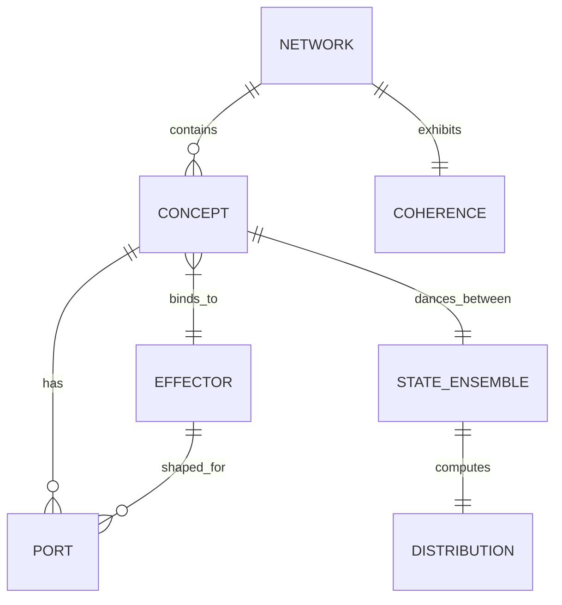

# Allosteric Thinking Tool — Enhanced Prompt V2

## Context

Build "Allosteric Thinking" — a **Generalized Monad Logic (GML)** KnowAct that applies the Monod-Wyman-Changeux (MWC) allosteric protein model to abstract concept recombination and regulation.

**Functional Category:** GML is a **KnowAct** (way of thinking), not a skill or prompt. It decomposes via cascade:
- **KnowAct (primary):** Allosteric reasoning pattern — recognize states, infer shifts, analogize across domains
- **FlowDef (supporting):** Process sequence — recognition → binding → equilibrium assessment
- **WordAct (surface):** Articulation of GML operations in inference requests and results

**Core hypothesis:** Ideas, like allosteric proteins, (1) have no single fixed shape but exist as probability distributions over conceptual conformations, (2) possess allosteric ports where other ideas bind to shift conceptual equilibrium, (3) recombine through structured interaction patterns beyond simple "idea sex."

**Mathematical kernel:** The MWC state function as Boltzmann distribution:

```
R̄ = (1 + α)ⁿ / ((1 + α)ⁿ + L·(1 + cα)ⁿ)
Z = Σᵢ exp(-Eᵢ/kT)  [partition function]
P(R) = exp(-E_R/kT) / Z
```

Where:
- `R̄` = fraction in active/relaxed state
- `L = exp(-(E_T - E_R)/kT)` = allosteric constant (Boltzmann factor)
- `c` = affinity ratio K_R/K_T (selectivity)
- `α` = normalized ligand concentration (contextual pressure)
- `n` = number of binding sites (cooperativity dimensionality)
- `n_H` = Hill coefficient (cooperativity measure)

---

## Task Sequence

### Task 0: Research — Extract MWC Formal Structure

**Process these sources in order:**
1. `file:///home/mdz-axolotl/Clones/Library/MAIA-Substack/posts/138855430.the-molecular-switch-signaling-and.html`
2. `file:///home/mdz-axolotl/Clones/Library/models/Combinatorial-Control-Allostery.pdf`
3. `file:///home/mdz-axolotl/Clones/Library/models/molecular-switch-first-44-pages.pdf`
4. `file:///home/mdz-axolotl/Clones/Library/models/Allosteric thinking.pdf`
5. https://www.rpgroup.caltech.edu/publications/index.html
6. https://en.wikipedia.org/wiki/Boltzmann_machine
7. https://en.wikipedia.org/wiki/Monod–Wyman–Changeux_model

**Deliverable:** 
- RDF triples defining MWC entities: `AllostericSystem`, `TState`, `RState`, `AllostericConstant`, `Cooperativity`, `Effector`, `PartitionFunction`, `Homeostasis`
- Mermaid ERD showing: T-state/R-state equilibrium, allosteric constant L, cooperativity, effector regulation, partition function Z as Boltzmann distribution, homeostasis as emergent network property

**Key relations to capture:**
```turtle
:AllostericSystem :hasState :TState, :RState .
:AllostericSystem :hasEquilibriumConstant :L .
:AllostericSystem :hasCooperativity :HillCoefficient .
:AllostericSystem :regulatedBy :Effector .
:PartitionFunction :computesFrom :EnergyStates .
:Homeostasis :emergesFrom :AllostericNetwork .
```

---

### Task 1: Generalize — Domain-Independent Allosteric Pattern (Kernel ERD)

**Strip biochemistry. Map to abstract domain:**

| Biochemical | Abstract/Conceptual |
|-------------|---------------------|
| Protein | **Concept** (node that dances between states) |
| Conformational states (T/R) | **Interpretation frames** (conservative/progressive, closed/open) |
| Allosteric site | **Port** (where another idea binds and shifts the frame) |
| Ligand/Effector | **Contextual modifier** (evidence, pressure, framing) |
| Cooperativity | **Amplification** between co-present ideas |
| Partition function Z | **Probability landscape** over interpretations |
| Homeostasis | **Self-reinforcing coherence** in idea-networks |

**Deliverable:** Lean Mermaid ERD, ≤7 entities:



**Entity definitions:**
- `CONCEPT` — idea with multiple interpretive states
- `PORT` — allosteric site where effectors bind
- `STATE_ENSEMBLE` — {T, R} interpretation pair
- `EFFECTOR` — contextual ligand that shifts equilibrium
- `DISTRIBUTION` — probability over states (R̄)
- `NETWORK` — interconnected concepts
- `COHERENCE` — homeostatic measure

This is the **kernel**. All subsequent tasks build on this ERD.

---

### Task 2: Formalize — The Six-Operation Algebra

**GML operations (capability-constrained):**

| Operation | Signature | Semantics | MWC Analog |
|-----------|-----------|-----------|------------|
| **`bind`** | `(concept, effector) → shifted_concept` | State shift via port coupling | Ligand binding shifts T/R equilibrium |
| **`equilibrium`** | `(concept) → distribution` | What states is this dancing between? | Compute R̄ from MWC equation |
| **`cooperate`** | `(a, b) → amplified` | Positive feedback between concepts | Cooperativity (n_H > 1) |
| **`inhibit`** | `(concept, inhibitor) → tense` | Close/suppress interpretation | Stabilize T-state |
| **`activate`** | `(concept, activator) → relaxed` | Open/generate interpretation | Stabilize R-state |
| **`homeostasis`** | `(network) → coherence` | Is network self-reinforcing? | Network-level equilibrium |

**Capability constraint:** Effectors bind only to ports they are shaped for (OCAP-enforced, Task 7).

**Mathematical specifications:**

```rust
/// bind: apply effector to concept, compute new equilibrium
pub fn bind(concept: &Concept, effector: &Effector) -> Concept {
    let new_alpha = concept.current_alpha + effector.concentration;
    let new_r_bar = mwc_state_function(concept.l, concept.c, concept.n, new_alpha);
    concept.with_alpha(new_alpha, new_r_bar)
}

/// equilibrium: compute state distribution
pub fn equilibrium(concept: &Concept) -> Distribution {
    Distribution {
        p_r: mwc_state_function(concept.l, concept.c, concept.n, concept.alpha),
        p_t: 1.0 - p_r,
    }
}

/// cooperate: compute amplification factor
pub fn cooperate(a: &Concept, b: &Concept) -> f64 {
    let n_h_a = hill_coefficient(a.l, a.c, a.n, a.alpha);
    let n_h_b = hill_coefficient(b.l, b.c, b.n, b.alpha);
    n_h_a * n_h_b  // amplification when both present
}

/// homeostasis: network coherence measure
pub fn homeostasis(network: &Network) -> Coherence {
    let concept_coherences = network.concepts.iter().map(|c| {
        1.0 - (c.current_r_bar - c.target_r_bar).abs()
    }).sum::<f64>() / network.concepts.len() as f64;
    Coherence { score: concept_coherences }
}
```

**Deliverable:** Algebra specification with type signatures, mathematical formulas, and test cases.

---

### Task 3: Implement as Cascade — KnowAct + FlowDef + WordAct

**GML lives in the soft layer via hKask cascade composition.**

**Cascade structure:**

```yaml
# gml-cascade.yaml
name: "gml-allosteric-reasoning"
type: KnowAct
lexicon_terms: [recognize, analogy, infer, sequence, probe, assert, bind, shift, equilibrate]

cascade:
  pre:
    - template: gml/recognize-ensemble.j2
      type: Cognition
      knowact: [recognize, discriminate, parse]
      # Identify: what concept, what ports, what current state-ensemble
      
  core:
    - template: gml/bind-effector.j2
      type: Cognition
      knowact: [analogy, infer, abduct]
      # Apply: bind effector, compute equilibrium shift, assess cooperativity
      
    - template: gml/compute-equilibrium.j2
      type: Cognition
      knowact: [calculate, compare, evaluate]
      # Compute: R̄ before/after, Hill coefficient, coherence measure
      
  post:
    - template: gml/assess-coherence.j2
      type: Cognition
      knowact: [evaluate, reflect, calibrate]
      # Assess: is the network more coherent? what shifted?
```

**Templates to author (all Jinja2, KnowAct-primary):**

| Template | Purpose | KnowAct Operations |
|----------|---------|-------------------|
| `gml/recognize-ensemble.j2` | Parse concept into states and ports | recognize, discriminate, parse |
| `gml/bind-effector.j2` | Apply effector to port, infer state-shift | analogy, infer, bind |
| `gml/compute-equilibrium.j2` | Calculate R̄, n_H, distribution | calculate, compare |
| `gml/assess-coherence.j2` | Evaluate network homeostasis | evaluate, reflect, calibrate |
| `gml/reframe-concept.j2` | Generate alternative interpretation frames | abduct, generate |

**FlowDef manifest:**

```yaml
# gml/gml-dispatch.yaml
process:
  name: "allosteric-reframing"
  type: FlowDef
  description: "Apply GML to shift conceptual interpretation under contextual pressure"
  
  inputs:
    - name: target_concept
      type: Concept
    - name: contextual_effectors
      type: List[Effector]
    - name: mwc_parameters
      type: MwcParameters
  
  steps:
    - id: recognize
      action: template.render
      template: gml/recognize-ensemble.j2
      input: $.target_concept
      output: concept_analysis
      
    - id: bind
      action: template.render
      template: gml/bind-effector.j2
      input:
        concept: $.concept_analysis
        effectors: $.contextual_effectors
      output: shifted_concept
      
    - id: equilibrate
      action: template.render
      template: gml/compute-equilibrium.j2
      input:
        before: $.concept_analysis
        after: $.shifted_concept
      output: equilibrium_shift
      
    - id: assess
      action: template.render
      template: gml/assess-coherence.j2
      input: $.equilibrium_shift
      output: coherence_analysis
      
  outputs:
    - name: coherence_analysis
      type: CoherenceReport
    - name: shifted_concept
      type: Concept
```

**WordAct surfaces** only in how templates phrase their inference requests — it is not the organizing category.

**Deliverable:** 
- Cascade YAML configuration
- Jinja2 template collection in `hkask-templates/gml/`
- FlowDef manifest `gml-dispatch.yaml`

---

### Task 4: Semantic Mapping — RDF Knowledge Graph

**Extend kernel ERD to full knowledge graph:**

```turtle
@prefix gml: <http://hkask.org/gml#> .
@prefix mwc: <http://hkask.org/mwc#> .

# Core entities
gml:Concept a rdfs:Class ;
    rdfs:subClassOf :AllostericSystem ;
    rdfs:comment "An idea with multiple interpretive states and contextual modulation" ;
    gml:properties (
        gml:hasInterpretiveStates
        gml:hasDefaultBias
        gml:hasContextualPorts
        gml:hasContextAffinityProfile
        gml:currentContextPressure
    ) .

gml:Port a rdfs:Class ;
    rdfs:comment "Allosteric site where effectors bind to shift interpretation" ;
    gml:properties (gml:portName, gml:effectorShape, gml:boundEffector) .

gml:Effector a rdfs:Class ;
    rdfs:comment "Contextual ligand that binds to ports and shifts equilibrium" ;
    gml:properties (gml:concentration, gml:affinity, gml:effectType) ;
    gml:effectTypeValues (gml:Activator, gml:Inhibitor, gml:Neutral) .

gml:StateEnsemble a rdfs:Class ;
    rdfs:comment "Pair of interpretive states (T-equivalent, R-equivalent)" ;
    gml:properties (gml:tState, gml:rState, gml:currentDistribution) .

gml:Network a rdfs:Class ;
    rdfs:comment "Interconnected concepts with allosteric relations" ;
    gml:properties (gml:concepts, gml:relations, gml:coherence) .

# Relations
gml:bindsTo a rdf:Property ;
    rdfs:domain gml:Effector ;
    rdfs:range gml:Port ;
    rdfs:comment "Effector binds to compatible port" .

gml:shiftsEquilibrium a rdf:Property ;
    rdfs:domain gml:Effector ;
    rdfs:range gml:StateEnsemble ;
    rdfs:comment "Effector shifts T/R distribution" .

gml:cooperatesWith a rdf:Property ;
    rdfs:domain gml:Concept ;
    rdfs:range gml:Concept ;
    rdfs:comment "Concepts exhibit positive cooperativity when co-present" .

gml:inhibits a rdf:Property ;
    rdfs:domain gml:Effector ;
    rdfs:range gml:Concept ;
    rdfs:comment "Effector stabilizes T-state (conservative interpretation)" .

gml:activates a rdf:Property ;
    rdfs:domain gml:Effector ;
    rdfs:range gml:Concept ;
    rdfs:comment "Effector stabilizes R-state (progressive interpretation)" .

# MWC parameters as measurable quantities
mwc:AllostericConstant a gml:Parameter ;
    rdfs:symbol "L" ;
    rdfs:range xsd:double ;
    gml:interpretation "Default T/R ratio without effectors" ;
    gml:formula "L = [T]_0 / [R]_0 = exp(-(E_T - E_R) / kT)" .

mwc:AffinityRatio a gml:Parameter ;
    rdfs:symbol "c" ;
    rdfs:range xsd:double ;
    gml:interpretation "Selectivity: how much effector favors R over T" ;
    gml:formula "c = K_R / K_T" .

mwc:BindingSites a gml:Parameter ;
    rdfs:symbol "n" ;
    rdfs:range xsd:integer ;
    gml:interpretation "Number of independent modifiable dimensions" .

mwc:LigandConcentration a gml:Parameter ;
    rdfs:symbol "α" ;
    rdfs:range xsd:double ;
    gml:interpretation "Normalized contextual pressure" ;
    gml:formula "α = [X] / K_R" .

mwc:HillCoefficient a gml:Measure ;
    rdfs:symbol "n_H" ;
    rdfs:range xsd:double ;
    gml:interpretation "Cooperativity measure: n_H>1=switch-like, n_H<1=graded" ;
    gml:formula "n_H = n * (1-c)/(1+c) * sqrt(α/(1+α))" .
```

**Deliverable:** Complete RDF schema in Turtle format; SPARQL query examples for graph traversal.

---

### Task 5: hKask Architecture Integration — Hexagonal Design

**Domain types (`hkask-gml-types` crate):**

```rust
/// Core MWC parameters
#[derive(Debug, Clone)]
pub struct MwcParameters {
    pub l: f64,        // allosteric constant [T]_0/[R]_0
    pub c: f64,        // affinity ratio K_R/K_T
    pub n: usize,      // number of binding sites
    pub alpha: f64,    // normalized ligand concentration
}

/// Interpretive state (T or R equivalent)
#[derive(Debug, Clone)]
pub struct Interpretation {
    pub id: InterpretationId,
    pub description: String,
    pub energy: f64,   // E_T or E_R for Boltzmann computation
}

/// Allosteric port where effectors bind
#[derive(Debug, Clone)]
pub struct AllostericPort {
    pub id: PortId,
    pub name: String,
    pub effector_shape: EffectorShape,  // what fits here
    pub bound_effector: Option<Effector>,
    pub affinity_c: f64,
}

/// Conceptual system with allosteric structure
#[derive(Debug, Clone)]
pub struct ConceptualSystem {
    pub id: ConceptId,
    pub name: String,
    pub t_state: Interpretation,
    pub r_state: Interpretation,
    pub l: f64,
    pub ports: Vec<AllostericPort>,
    pub current_alpha: f64,
    pub current_r_bar: f64,
}

/// Contextual effector/ligand
#[derive(Debug, Clone)]
pub struct Effector {
    pub id: EffectorId,
    pub name: String,
    pub concentration: f64,
    pub effect_type: EffectType,
    pub shape: EffectorShape,
}

#[derive(Debug, Clone)]
pub enum EffectType {
    Activator,   // stabilizes R-state
    Inhibitor,   // stabilizes T-state
    Neutral,     // shifts without preference
}
```

**Inbound ports (domain interface):**

```rust
/// GML algebra — what the tool provides
pub trait GmlAlgebra {
    fn bind(&self, concept: &ConceptualSystem, effector: &Effector) -> Result<ConceptualSystem>;
    fn equilibrium(&self, concept: &ConceptualSystem) -> Distribution;
    fn cooperate(&self, a: &ConceptualSystem, b: &ConceptualSystem) -> f64;
    fn inhibit(&self, concept: &ConceptualSystem, inhibitor: &Effector) -> Result<ConceptualSystem>;
    fn activate(&self, concept: &ConceptualSystem, activator: &Effector) -> Result<ConceptualSystem>;
    fn homeostasis(&self, network: &Network) -> Coherence;
    fn hill_coefficient(&self, params: &MwcParameters) -> f64;
}

/// Cascade execution
pub trait GmlCascade {
    fn recognize(&self, concept: &ConceptualSystem) -> Result<ConceptAnalysis>;
    fn bind_and_shift(&self, analysis: &ConceptAnalysis, effectors: &[Effector]) -> Result<ShiftedConcept>;
    fn assess_coherence(&self, shift: &ShiftedConcept) -> Result<CoherenceReport>;
}
```

**Outbound ports (infrastructure):**

```rust
/// Storage via hkask-storage
pub trait GmlStorage {
    fn save_concept(&self, concept: &ConceptualSystem) -> Result<()>;
    fn load_concept(&self, id: ConceptId) -> Result<ConceptualSystem>;
    fn query_by_cooperativity(&self, min_n_h: f64) -> Result<Vec<ConceptualSystem>>;
    fn save_network(&self, network: &Network) -> Result<()>;
}

/// Template rendering via hkask-templates
pub trait GmlTemplateEngine {
    fn render_recognize(&self, concept: &ConceptualSystem) -> Result<String>;
    fn render_bind(&self, concept: &ConceptualSystem, effector: &Effector) -> Result<String>;
    fn render_equilibrium(&self, before: &ConceptualSystem, after: &ConceptualSystem) -> Result<String>;
    fn render_coherence(&self, report: &CoherenceReport) -> Result<String>;
}

/// Embedding via hkask-mcp-embedding
pub trait ConceptEmbedding {
    fn compute_similarity(&self, a: &ConceptualSystem, b: &ConceptualSystem) -> f64;
    fn project_to_state_space(&self, concept: &ConceptualSystem) -> StateVector;
}
```

**Adapters:**
- **Storage adapter:** SQLite tables: `concepts`, `interpretations`, `ports`, `effectors`, `networks`, `network_edges`
- **Template adapter:** Jinja2 via `hkask-templates` with `gml/` namespace
- **Embedding adapter:** Okapi-backed via `hkask-mcp-embedding`
- **MCP server:** `hkask-mcp-gml` exposing GML operations

**Deliverable:** Crate structure; adapter implementations; MCP tool definitions.

---

### Task 6: Boltzmann Machine Integration — Statistical Mechanics Kernel

**Map MWC to Boltzmann machine architecture:**

```
P(state) = exp(-E_state/kT) / Z
Z = Σᵢ exp(-Eᵢ/kT)  [partition function]

For two-state (T/R) system:
P(R) = exp(-E_R/kT) / (exp(-E_R/kT) + exp(-E_T/kT))
     = 1 / (1 + exp((E_R - E_T)/kT))
     = 1 / (1 + L)  where L = exp(-(E_T - E_R)/kT)
```

**Energy-based conceptual model:**

```rust
#[derive(Debug, Clone)]
pub struct EnergyBasedConcept {
    pub e_t: f64,  // energy of tense interpretation
    pub e_r: f64,  // energy of relaxed interpretation
    pub ligand_binding_energies: Vec<f64>,  // ΔE for each port
}

impl EnergyBasedConcept {
    pub fn probability_active(&self, temperature: f64) -> f64 {
        let boltzmann_t = (-self.e_t / temperature).exp();
        let boltzmann_r = (-self.e_r / temperature).exp();
        boltzmann_r / (boltzmann_r + boltzmann_t)
    }
    
    pub fn allosteric_constant(&self, temperature: f64) -> f64 {
        ((self.e_t - self.e_r) / temperature).exp()
    }
}
```

**MWC-Boltzmann hybrid specification:**
- MWC provides **structural constraints** (symmetry, concerted transitions, port semantics)
- Boltzmann provides **statistical inference** (probability distributions, sampling, learning)
- Combined: **Allosteric Boltzmann Machine** with MWC kernel

**Deliverable:** Mathematical specification; prototype in `hkask-gml` crate.

---

### Task 7: Security & Capability Design — OCAP Enforcement

**Capability types for GML operations:**

```rust
/// Capability to perform GML operations
#[derive(Debug, Clone)]
pub struct GmlCapability {
    pub scope: CapabilityScope,
    pub operations: Vec<GmlOperation>,
    pub effector_budget: Option<f64>,  // max concentration that can be applied
    pub ports_allowed: Vec<PortId>,    // which ports can be bound
}

#[derive(Debug, Clone)]
pub enum CapabilityScope {
    Private,      // user's own concepts only
    SharedRead,   // read shared concepts
    SharedWrite,  // modify shared concepts (requires mutual consent)
    Public,       // operate on public concepts
}

#[derive(Debug, Clone)]
pub enum GmlOperation {
    Recognize,
    Bind,
    Equilibrate,
    Cooperate,
    Inhibit,
    Activate,
    Homeostasis,
}
```

**OCAP enforcement:**
- **No ambient authority:** GML operations require explicit capability token
- **Least privilege:** Default capability = Recognize only on private concepts
- **Attenuation:** Capabilities can be restricted (e.g., "Recognize + Bind, no Inhibit")
- **End-to-end:** Capabilities enforced at storage layer via SQLCipher row-level security

**Audit logging:**

```rust
#[derive(Debug)]
pub struct GmlAuditLog {
    pub timestamp: Timestamp,
    pub operation: GmlOperation,
    pub concept_id: ConceptId,
    pub capability_hash: String,
    pub effector_id: Option<EffectorId>,
    pub before_r_bar: Option<f64>,
    pub after_r_bar: Option<f64>,
}
```

**Deliverable:** Capability type definitions; OCAP enforcement adapters; audit schema.

---

### Task 8: Document — The Five Questions (User Method)

**User guide structured around five questions:**

| Question | GML Operations | Template |
|----------|----------------|----------|
| **1. "What states is this idea dancing between?"** | recognize + equilibrium | `recognize-ensemble.j2` |
| **2. "What are its ports — what could bind and shift it?"** | parse + discriminate | `recognize-ensemble.j2` |
| **3. "What ideas amplify each other when co-present?"** | analogy + cooperate | `compute-equilibrium.j2` |
| **4. "What is suppressing this idea's generative state?"** | detect + inhibit | `bind-effector.j2` |
| **5. "Is this idea-network self-reinforcing or decaying?"** | evaluate + homeostasis | `assess-coherence.j2` |

**Worked examples:**

| Concept | T-State | R-State | Effectors | Ports |
|---------|---------|---------|-----------|-------|
| **Freedom** | Negative liberty (freedom from) | Positive liberty (freedom to) | security_threats, economic_conditions | threat_response, resource_access |
| **Privacy** | Secrecy (hidden from view) | Control (agency over disclosure) | technology_change, social_norms | data_flow, consent_mechanism |
| **Intelligence** | Fixed trait (innate) | Malleable (developed) | evidence, feedback, challenge | learning_channel, assessment |
| **Security** | Protection (barriers) | Resilience (adaptation) | threat_level, trust | boundary, monitoring |

**Document limitations:**
- GML is a **thinking tool**, not truth machinery
- Parameter estimation (L, c, n) requires judgment
- Best used for **exploration**, not conclusion

**Deliverable:** User guide in `docs/gml-user-guide.md`; example library with worked problems.

---

### Task 9 (Future): Open Questions

**Underspecified aspects requiring further research:**

| # | Question | Research Direction |
|---|----------|-------------------|
| **9.1** | **What is the mathematical form of Z for idea-spaces?** Is `E = -∑wᵢⱼsᵢsⱼ` (Boltzmann machine) the right substrate with MWC logic governing topology? | Derive partition function for conceptual state spaces; test against empirical concept-shift data |
| **9.2** | **How do we measure cooperativity (Hill coefficient) for ideas empirically?** What observable corresponds to n_H? | Design experiments: present concepts with varying contextual pressures, measure interpretation shifts, fit MWC curve |
| **9.3** | **Does `bind` satisfy monad laws (associativity, identity) over concept-states?** Is GML categorically a monad? | Formal verification: prove bind(f, bind(g, x)) = bind(compose(f,g), x) and bind(identity, x) = x |
| **9.4** | **How do we estimate L, c, n parameters for abstract concepts?** | Approaches: user elicitation, behavioral inference, LLM-assisted estimation, Bayesian updating |
| **9.5** | **Multi-ligand dynamics:** Conceptual "ligands" may interact non-independently (synergy, antagonism) | Extended MWC with interaction terms: c_ij for effector i × effector j |
| **9.6** | **Temporal dynamics:** Current model is equilibrium; concepts evolve over time | Dynamical extension: dR̄/dt = f(R̄, α(t), L(t)) with time-dependent parameters |
| **9.7** | **Collective allostery:** How do allosteric concepts interact in networks? | Network science + MWC: conceptual cascades, homeostatic clusters, phase transitions |
| **9.8** | **Learning/adaptation:** Can GML systems learn better parameter estimates from usage? | Bayesian updating of L, c based on observed conceptual shifts; what constitutes "observation"? |
| **9.9** | **Integration with memory systems:** How does GML interact with hkask-memory semantic/episodic stores? | GML as query transformation layer; how allosteric state affects encoding/retrieval |
| **9.10** | **After applying GML to 100+ problems: which operations carry load and which are decorative?** | Empirical validation: track operation usage vs. user-reported insight quality; prune unused operations (P6) |

**Deliverable:** Research agenda document; backlog of enhancement issues; validation study design.

---

## Implementation Constraints

**hKask Alignment:**
- Use `hkask-types` for ID types (ConceptId, PortId, EffectorId)
- Use `hkask-storage` for persistence (SQLite + SQLCipher)
- Use `hkask-mcp-embedding` for vector operations
- Use `hkask-templates` for Jinja2 rendering
- Use `hkask-cns` for monitoring (cns.gml.* spans)
- Follow P1-P7 design principles (no unused traits, no stubs, delete over deprecate)
- Respect C1-C7 constraints (types worn before tailored)

**Security:**
- OCAP enforcement via `hkask-keystore`
- Row-level security in storage adapter
- Audit logging for all state-changing operations
- Capability attenuation (restrict operations, ports, effector budget)

**Simplicity:**
- Minimal parameter set (L, c, n, α)
- Single MWC kernel equation
- Six-operation algebra (no more)
- Recursive application (GML can analyze itself)

**Line Budget:**
- Target: ≤2,000 lines Rust for `hkask-gml-types` + `hkask-gml-core`
- Templates excluded from budget (soft layer)
- Tests in `hkask-testing` (excluded)

---

## Success Criteria

| Criterion | Verification |
|-----------|--------------|
| **Mathematical correctness** | MWC equations verified against reference (Wikipedia, Changeux papers) |
| **Conceptual fidelity** | GML produces interpretable results for 5+ test concepts |
| **Architectural fit** | GML integrates cleanly with hKask MCP server pattern |
| **Cascade composition** | KnowAct/FlowDef/WordAct cleanly separated |
| **User utility** | Five questions method produces novel insights in 3+ documented use cases |
| **Security compliance** | All operations capability-gated; audit trail functional |
| **Line budget** | `tokei` reports ≤2,000 lines Rust production code |

---

*Begin with Task 0. Proceed sequentially. Each task's deliverable becomes input for subsequent tasks. After Task 9, iterate based on empirical usage.*

*ℏKask — Planck's Constant of Agent Systems — GML v0.1.0*
*The second secret of life, generalized.*
