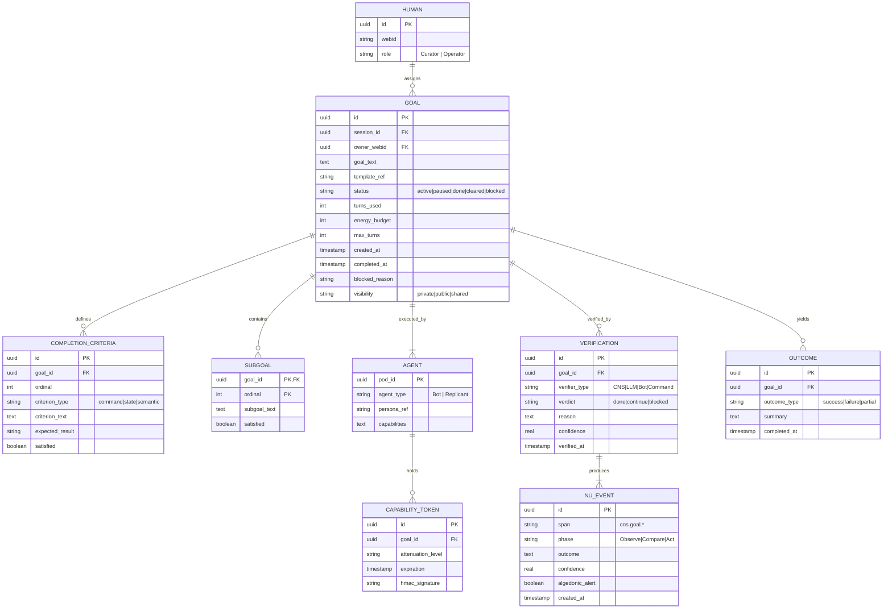

# Task 1: Semantic Mapping and Root Cause Analysis

## 1.1 Article Claims Extraction

**Source:** "The Ultimate Guide to /goal" by Shubham Saboo (The Unwind AI, May 17, 2026)

**Core Claims:**

| Claim | Evidence | Implication |
|-------|----------|-------------|
| `/goal` is a primitive, not a feature | Codex CLI, Claude Code, Hermes Agent all converged on same format | Primitive status = interoperability |
| `/goal` flips prompting to assigning | User writes "done" criteria once, agent works autonomously | Shift from steering to delegating |
| Verification makes goal a contract | Hermes runs `npm test`, `npm run build`, `git status` itself | Never trust agent self-report |
| Three roles emerge: Orchestrator, Builder, Reviewer | Hermes coordinates Codex (builder) + Claude Code (reviewer) | Goal enables multi-agent composition |
| Board makes goals visible | Kanban cards with status, PID, repo, done criteria | Auditability and traceability |

---

## 1.2 Implicit Assumptions Mapping

### Problem `goal` Solves

```turtle
# Goal Primitive Semantics — Turtle/RDF
@prefix : <http://hkask.org/goal#> .
@prefix rdf: <http://www.w3.org/1999/02/22-rdf-syntax-ns#> .
@prefix rdfs: <http://www.w3.org/2000/01/rdf-schema#> .
@prefix owl: <http://www.w3.org/2002/07/owl#> .
@prefix xsd: <http://www.w3.org/2001/XMLSchema#> .

# ──────────────────────────────────────────────────────────────
# Core Classes
# ──────────────────────────────────────────────────────────────

:Goal a owl:Class ;
    rdfs:comment "A persistent objective with defined completion criteria" ;
    rdfs:subClassOf :IntentionalState .

:Agent a owl:Class ;
    rdfs:comment "Entity capable of goal-directed action (Bot or Replicant)" .

:Human a owl:Class ;
    rdfs:comment "User who assigns goals and verifies outcomes" .

:CompletionCriteria a owl:Class ;
    rdfs:comment "Verifiable conditions that define 'done'" .

:Verification a owl:Class ;
    rdfs:comment "External check of goal satisfaction (never self-report)" .

:Authority a owl:Class ;
    rdfs:comment "Capability to act toward goal (OCAP-gated)" .

# ──────────────────────────────────────────────────────────────
# Goal Properties
# ──────────────────────────────────────────────────────────────

:hasOwner a owl:ObjectProperty ;
    rdfs:domain :Goal ;
    rdfs:range :Human .

:hasAgent a owl:ObjectProperty ;
    rdfs:domain :Goal ;
    rdfs:range :Agent .

:hasCompletionCriteria a owl:ObjectProperty ;
    rdfs:domain :Goal ;
    rdfs:range :CompletionCriteria .

:hasAuthority a owl:ObjectProperty ;
    rdfs:domain :Goal ;
    rdfs:range :Authority .

:hasStatus a owl:DatatypeProperty ;
    rdfs:domain :Goal ;
    rdfs:range xsd:string ;
    rdfs:comment "active | paused | done | cleared | blocked" .

:hasBudget a owl:DatatypeProperty ;
    rdfs:domain :Goal ;
    rdfs:range xsd:integer ;
    rdfs:comment "Maximum turns or energy units allowed" .

:hasOutcome a owl:ObjectProperty ;
    rdfs:domain :Goal ;
    rdfs:range :Outcome .

# ──────────────────────────────────────────────────────────────
# Root Causes (Why Goal Primitive Exists)
# ──────────────────────────────────────────────────────────────

:AgentDrift a :RootCause ;
    rdfs:comment "Agent loses objective alignment over multi-turn execution" ;
    :mitigatedBy :Goal .

:ScopeContainment a :RootCause ;
    rdfs:comment "Agent expands work beyond intended boundaries" ;
    :mitigatedBy :CompletionCriteria .

:Auditability a :RootCause ;
    rdfs:comment "Need traceable record of what was assigned and achieved" ;
    :mitigatedBy :GoalPersistence .

:HumanAgentContract a :RootCause ;
    rdfs:comment "Clarity on what 'done' means to both parties" ;
    :mitigatedBy :Verification .

# ──────────────────────────────────────────────────────────────
# Failure Modes Goal Prevents
# ──────────────────────────────────────────────────────────────

:InfiniteLoop a :FailureMode ;
    rdfs:comment "Agent continues working after goal achieved" ;
    :preventedBy :BudgetConstraint .

:ObjectiveMisalignment a :FailureMode ;
    rdfs:comment "Agent works toward wrong interpretation of goal" ;
    :preventedBy :ExplicitCompletionCriteria .

:AuthorityEscalation a :FailureMode ;
    rdfs:comment "Agent acts beyond granted capabilities" ;
    :preventedBy :OCAPEnforcement .

:SilentFailure a :FailureMode ;
    rdfs:comment "Agent fails but doesn't report" ;
    :preventedBy :ExternalVerification .

# ──────────────────────────────────────────────────────────────
# Authority Patterns
# ──────────────────────────────────────────────────────────────

:DelegatedAuthority a :Authority ;
    rdfs:comment "Authority granted via capability token (OCAP)" ;
    :attenuatesOnDelegation true .

:PersistentAuthority a :Authority ;
    rdfs:comment "Authority persists across turns until goal complete" ;
    :expiresOnCompletion true .

:ScopedAuthority a :Authority ;
    rdfs:comment "Authority limited to goal-specific actions" ;
    :scopeConstraint :GoalActions .

# ──────────────────────────────────────────────────────────────
# Verification Patterns
# ──────────────────────────────────────────────────────────────

:CommandVerification a :Verification ;
    rdfs:comment "Run command, check exit code" ;
    :example "npm test → exit 0" .

:StateVerification a :Verification ;
    rdfs:comment "Check filesystem/git state" ;
    :example "git status --porcelain" .

:LLMJudgement a :Verification ;
    rdfs:comment "Auxiliary model evaluates response against goal" ;
    :example "Hermes goal_judge" .

:CNSComparator a :Verification ;
    rdfs:comment "Cybernetic comparator (ν-event outcome vs. goal)" ;
    :example "hKask cns.goal.verify span" .
```

---

## 1.3 Entity Relationship Diagram



---

## 1.4 Root Cause Analysis Summary

| Root Cause | Mechanism | hKask Alignment |
|------------|-----------|-----------------|
| **Agent Drift** | Persistent goal text + continuation prompt | CNS `cns.goal.*` spans monitor drift |
| **Scope Containment** | Completion criteria + budget constraints | Variety counter detects scope expansion |
| **Auditability** | Goal persistence in SQLite | `goal_verifications` table for audit trail |
| **Human-Agent Contract** | Explicit "done" criteria + external verification | OCAP enforces contract boundaries |

---

## 1.5 Failure Modes Prevented

| Failure Mode | Prevention Mechanism | hKask Implementation |
|--------------|---------------------|---------------------|
| Infinite Loop | Budget constraint (max_turns) | `max_turns` + `energy_budget` fields |
| Objective Misalignment | Explicit completion criteria | `completion_criteria` table |
| Authority Escalation | OCAP capability tokens | `CapabilityToken` with attenuation |
| Silent Failure | External verification | CNS comparator + verifier bot |
| Goal Spam (Hermes #27585) | Consecutive parse failure limit | `consecutive_parse_failures` counter |
| Goal Hijacking | OCAP enforcement + visibility gating | `visibility` field + capability check |

---

*ℏKask — Planck's Constant of Agent Systems — v0.21.0*  
*Task 1 Complete: Semantic mapping establishes goal as first-class intentional state with verification-based completion.*