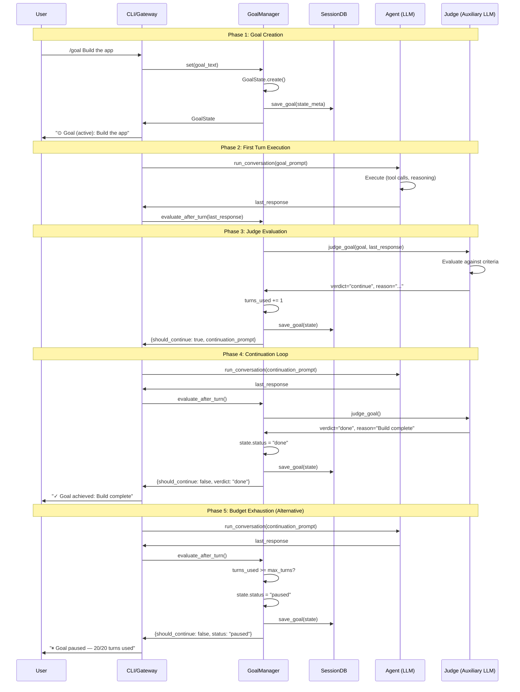

# Task 2: Hermes Agent Code Interrogation

**Source:** `hermes_cli/goals.py` (NousResearch/hermes-agent, PR #18262, May 2026)  
**Lines of Code:** ~650 LOC (core module + CLI integration)

---

## 2.1 Code Path Documentation

### File Structure

| File | Purpose | LOC |
|------|---------|-----|
| `hermes_cli/goals.py` | Core goal logic (GoalState, GoalManager, judge) | ~450 |
| `cli.py` | CLI command handler `_handle_goal_command` | ~80 |
| `gateway/run.py` | Gateway integration `_post_turn_goal_continuation` | ~60 |
| `hermes_cli/config.py` | Config defaults `goals.max_turns: 20` | ~10 |
| `tests/hermes_cli/test_goals.py` | Unit tests (26 tests) | ~260 |

---

### Data Flow: Goal Ingestion → Validation → Execution → Termination

```
┌──────────────┐     ┌──────────────┐     ┌──────────────┐     ┌──────────────┐
│   User       │     │  GoalManager │     │   Agent      │     │   Judge      │
│   Input      │     │              │     │  Execution   │     │  Evaluation  │
└──────┬───────┘     └──────┬───────┘     └──────┬───────┘     └──────┬───────┘
       │                    │                     │                    │
       │ /goal <text>       │                     │                    │
       │───────────────────>│                     │                    │
       │                    │                     │                    │
       │                    │ GoalState.create()  │                    │
       │                    │────────────┐        │                    │
       │                    │            │        │                    │
       │                    │<───────────┘        │                    │
       │                    │                     │                    │
       │                    │ save_goal()         │                    │
       │                    │ (SessionDB)         │                    │
       │                    │                     │                    │
       │                    │                     │                    │
       │                    │ run_conversation()  │                    │
       │                    │────────────────────>│                    │
       │                    │                     │                    │
       │                    │                     │ Execute turn       │
       │                    │                     │ (tool calls, etc.) │
       │                    │                     │                    │
       │                    │                     │                    │
       │                    │ last_response       │                    │
       │                    │<────────────────────│                    │
       │                    │                     │                    │
       │                    │                     │                    │
       │                    │ evaluate_after_turn()                    │
       │                    │─────────────────────────────────────────>│
       │                    │                     │                    │
       │                    │                     │                    │ judge_goal()
       │                    │                     │                    │ (auxiliary LLM)
       │                    │                     │                    │
       │                    │                     │                    │
       │                    │                     │                    │ verdict, reason
       │                    │<──────────────────────────────────────────│
       │                    │                     │                    │
       │                    │                     │                    │
       │                    │ Decision:           │                    │
       │                    │ - done → mark_done()│                    │
       │                    │ - continue → loop   │                    │
       │                    │ - blocked → pause() │                    │
       │                    │                     │                    │
       │                    │                     │                    │
       │                    │ continuation_prompt │                    │
       │                    │────────────────────>│                    │
       │                    │                     │                    │
       │<───────────────────│                     │                    │
       │  Status message    │                     │                    │
       │                    │                     │                    │
```

---

## 2.2 Key Functions Analysis

### `judge_goal()` — Lines 185-260

```python
def judge_goal(
    goal: str,
    last_response: str,
    *,
    timeout: float = DEFAULT_JUDGE_TIMEOUT,
    subgoals: Optional[List[str]] = None,
) -> Tuple[str, str, bool]:
    """Ask the auxiliary model whether the goal is satisfied.

    Returns ``(verdict, reason, parse_failed)`` where verdict is ``"done"``,
    ``"continue"``, or ``"skipped"`` (when the judge couldn't be reached).

    This is deliberately fail-open: any error returns ``("continue", "...", False)``
    so a broken judge doesn't wedge progress — the turn budget and the
    consecutive-parse-failures auto-pause are the backstops.
    """
```

**Security Concerns:**
1. **Fail-open design:** Judge errors → `continue` (prevents wedging, but enables spam loops)
2. **No input sanitization:** `goal` and `last_response` passed directly to LLM
3. **Timeout hardcoded:** `DEFAULT_JUDGE_TIMEOUT = 30.0` seconds
4. **Token budget:** `DEFAULT_JUDGE_MAX_TOKENS = 4096` (configurable via `auxiliary.goal_judge.max_tokens`)

**Known Bug (Issue #27585):**
```python
except Exception as exc:
    logger.info("goal judge: API call failed (%s) — falling through to continue", exc)
    return "continue", f"judge error: {type(exc).__name__}", False
```

When judge API errors AND agent response is terminal ("Goal is complete"), loop continues → spam.

---

### `GoalManager.evaluate_after_turn()` — Lines 380-480

```python
def evaluate_after_turn(
    self,
    last_response: str,
    *,
    user_initiated: bool = True,
) -> Dict[str, Any]:
    """Run the judge and update state. Return a decision dict.

    Decision keys:
      - ``status``: current goal status after update
      - ``should_continue``: bool — caller should fire another turn
      - ``continuation_prompt``: str or None
      - ``verdict``: "done" | "continue" | "skipped" | "inactive"
      - ``reason``: str
      - ``message``: user-visible one-liner to print/send
    """
```

**Lifecycle Logic:**
```python
# Count the turn that just finished.
state.turns_used += 1
state.last_turn_at = time.time()

verdict, reason, parse_failed = judge_goal(
    state.goal, last_response, subgoals=state.subgoals or None
)

# Track consecutive parse failures.
if parse_failed:
    state.consecutive_parse_failures += 1
else:
    state.consecutive_parse_failures = 0

if verdict == "done":
    state.status = "done"
    save_goal(self.session_id, state)
    return {"status": "done", "should_continue": False, ...}

# Auto-pause on consecutive parse failures.
if state.consecutive_parse_failures >= DEFAULT_MAX_CONSECUTIVE_PARSE_FAILURES:
    state.status = "paused"
    state.paused_reason = f"judge model returned unparseable output..."
    save_goal(self.session_id, state)
    return {"status": "paused", "should_continue": False, ...}

# Budget exhaustion.
if state.turns_used >= state.max_turns:
    state.status = "paused"
    state.paused_reason = f"turn budget exhausted ({state.turns_used}/{state.max_turns})"
    save_goal(self.session_id, state)
    return {"status": "paused", "should_continue": False, ...}

# Continue loop.
save_goal(self.session_id, state)
return {
    "status": "active",
    "should_continue": True,
    "continuation_prompt": self.next_continuation_prompt(),
    ...
}
```

---

### `GoalState` Dataclass — Lines 60-100

```python
@dataclass
class GoalState:
    """Serializable goal state stored per session."""

    goal: str
    status: str = "active"          # active | paused | done | cleared
    turns_used: int = 0
    max_turns: int = DEFAULT_MAX_TURNS
    created_at: float = 0.0
    last_turn_at: float = 0.0
    last_verdict: Optional[str] = None        # "done" | "continue" | "skipped"
    last_reason: Optional[str] = None
    paused_reason: Optional[str] = None
    consecutive_parse_failures: int = 0
    subgoals: List[str] = field(default_factory=list)
```

**Serialization:**
```python
def to_json(self) -> str:
    return json.dumps(asdict(self), ensure_ascii=False)

@classmethod
def from_json(cls, raw: str) -> "GoalState":
    data = json.loads(raw)
    # ... parsing with defaults ...
```

**Security Concern:** No integrity check on stored JSON — vulnerable to session DB tampering.

---

## 2.3 Sequence Diagram



---

## 2.4 Security Audit

### Attack Surface

| Vector | Risk | Mitigation (Hermes) | Mitigation (hKask Proposal) |
|--------|------|---------------------|----------------------------|
| **Goal Injection** | Malicious goal text | None | OCAP capability check |
| **Session DB Tampering** | Modify stored goal state | None | HMAC-signed state + SQLCipher |
| **Judge Model Poisoning** | Adversarial prompt in `last_response` | None | CNS comparator + sanitization |
| **Infinite Loop (DoS)** | Budget exhaustion | `max_turns: 20` | Turns + energy budget + variety counter |
| **Goal Spam** (Issue #27585) | Judge errors → repeated completions | Parse failure limit | Terminal phrase detection + auto-pause |
| **Capability Escalation** | Agent acts beyond goal scope | None | OCAP attenuation on delegation |
| **Privacy Leak** | Goal text visible to unauthorized | Session isolation | Visibility gating (private/public/shared) |
| **Audit Trail Bypass** | Delete goal history | None | Immutable `goal_verifications` table |

---

### What Can Go Wrong

#### 1. Judge Model Failures

**Scenario:** Judge API returns errors or unparseable output.

**Current Behavior:**
- Fail-open: `continue` (prevents wedging)
- Consecutive parse failures (≥3) → auto-pause

**Residual Risk:**
- Spam loops when agent reaches terminal response but judge errors
- Budget exhaustion before pause triggers

**hKask Improvement:**
- Terminal phrase detection ("Goal is complete", "I'm stopping")
- CNS comparator as fallback (deterministic checks)

---

#### 2. Goal Persistence Vulnerabilities

**Scenario:** Attacker modifies `SessionDB.state_meta`.

**Current Behavior:**
- JSON stored without integrity check
- No encryption at rest

**Residual Risk:**
- Goal hijacking
- Budget reset

**hKask Improvement:**
- HMAC-signed goal state
- SQLCipher encryption
- Visibility gating via OCAP

---

#### 3. Authority Escalation

**Scenario:** Agent uses goal as pretext for unauthorized actions.

**Current Behavior:**
- No capability enforcement
- Agent has full tool access

**Residual Risk:**
- Scope creep
- Privilege escalation

**hKask Improvement:**
- Goal-specific capability tokens
- Attenuation on delegation
- CNS span monitoring

---

#### 4. Multi-Agent Coordination Failures

**Scenario:** Multiple agents work on same goal → conflicts.

**Current Behavior:**
- Single-session model (no multi-agent support)

**Residual Risk:**
- N/A (not in scope for Hermes)

**hKask Improvement:**
- Goal ownership (WebID-based)
- Delegation with attenuation
- ACP message routing

---

## 2.5 Hermes Design Decisions (Lessons for hKask)

| Decision | Rationale | hKask Adaptation |
|----------|-----------|-----------------|
| **Fail-open judge** | Broken judge must not wedge progress | Keep, but add terminal phrase detection |
| **Turn budget** | Hard backstop on infinite loops | Keep, add energy budget |
| **Session persistence** | Resume after restart | Keep, add HMAC integrity |
| **Subgoals mid-loop** | User refines criteria dynamically | Keep, first-class `goal_subgoals` table |
| **Continuation as user message** | Preserves prompt caching | Keep, same pattern |
| **Parse failure counter** | Weak judge model detection | Keep, CNS algedonic alert on threshold |

---

## 2.6 Code Quality Assessment

| Metric | Hermes | hKask Target |
|--------|--------|--------------|
| **Test Coverage** | 26 unit tests | 40+ (unit + integration) |
| **Error Handling** | Fail-open with backstops | Fail-open + CNS alerts |
| **Documentation** | Docstrings, inline comments | Rust doc tests + architecture docs |
| **Configurability** | `max_turns`, judge model | Budget, visibility, attenuation |
| **Security** | Minimal (trust session DB) | OCAP + SQLCipher + HMAC |
| **Multi-Agent** | Not supported | First-class (ACP, WebID) |

---

*ℏKask — Planck's Constant of Agent Systems — v0.21.0*  
*Task 2 Complete: Hermes code interrogated — fail-open design with budget backstops, but lacks security model and multi-agent support.*