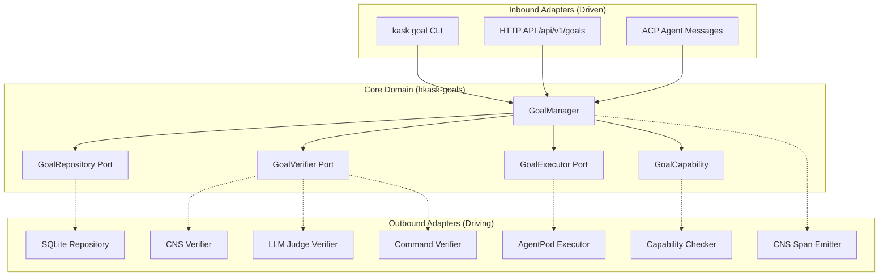

# Task 5: Architecture Design

## 5.1 Core Types (`hkask-types`)

```rust
// crates/hkask-types/src/goal.rs

use uuid::Uuid;
use serde::{Serialize, Deserialize};

/// Unique identifier for a goal
#[derive(Debug, Clone, Copy, PartialEq, Eq, Hash, Serialize, Deserialize)]
pub struct GoalId(pub Uuid);

impl GoalId {
    pub fn new() -> Self {
        Self(Uuid::new_v4())
    }
}

/// Goal state machine
#[derive(Debug, Clone, Serialize, Deserialize)]
#[serde(rename_all = "snake_case")]
pub enum GoalState {
    Active,
    Paused { reason: String },
    Done { reason: String },
    Cleared,
    Blocked { reason: String },
}

/// Goal specification (creation input)
#[derive(Debug, Clone, Serialize, Deserialize)]
pub struct GoalSpec {
    pub owner_webid: WebID,
    pub goal_text: String,
    pub template_ref: Option<String>,
    pub completion_criteria: Vec<CompletionCriterion>,
    pub max_turns: Option<u32>,
    pub energy_budget: Option<u64>,
    pub visibility: Visibility,
}

/// Completion criterion types
#[derive(Debug, Clone, Serialize, Deserialize)]
#[serde(tag = "type", rename_all = "snake_case")]
pub enum CompletionCriterion {
    Command {
        command: String,
        expected_exit_code: i32,
    },
    State {
        check: String,
        expected_pattern: String,
    },
    Semantic {
        evaluator: String,
        criteria: String,
    },
}

/// Goal entity (full representation)
#[derive(Debug, Clone, Serialize, Deserialize)]
pub struct Goal {
    pub id: GoalId,
    pub session_id: SessionId,
    pub owner_webid: WebID,
    pub goal_text: String,
    pub template_ref: Option<String>,
    pub state: GoalState,
    pub completion_criteria: Vec<CompletionCriterion>,
    pub subgoals: Vec<Subgoal>,
    pub turns_used: u32,
    pub energy_budget: Option<u64>,
    pub energy_used: u64,
    pub max_turns: u32,
    pub created_at: i64,
    pub last_turn_at: Option<i64>,
    pub completed_at: Option<i64>,
    pub visibility: Visibility,
}

/// Subgoal (user-added criteria)
#[derive(Debug, Clone, Serialize, Deserialize)]
pub struct Subgoal {
    pub ordinal: u32,
    pub text: String,
    pub satisfied: bool,
}

/// Goal outcome (execution result)
#[derive(Debug, Clone, Serialize, Deserialize)]
#[serde(tag = "outcome_type", rename_all = "snake_case")]
pub enum GoalOutcome {
    Success {
        summary: String,
        artifacts: Vec<String>,
    },
    Failure {
        reason: String,
        recoverable: bool,
    },
    Partial {
        summary: String,
        completed_criteria: Vec<usize>,
        failed_criteria: Vec<usize>,
    },
}

/// Verification verdict
#[derive(Debug, Clone, Serialize, Deserialize)]
#[serde(rename_all = "snake_case")]
pub enum Verdict {
    Done {
        reason: String,
        confidence: f64,
    },
    Continue {
        reason: String,
    },
    Blocked {
        reason: String,
        needs_human: bool,
    },
}

/// Visibility (OCAP-enforced)
#[derive(Debug, Clone, Copy, PartialEq, Eq, Serialize, Deserialize)]
#[serde(rename_all = "snake_case")]
pub enum Visibility {
    Private,
    Public,
    Shared,
}
```

---

## 5.2 Goal Capability Types

```rust
// crates/hkask-types/src/goal_capability.rs

use crate::goal::GoalId;
use crate::webid::WebID;
use hmac::{Hmac, Mac};
use sha2::Sha256;
use serde::{Serialize, Deserialize};

type HmacSha256 = Hmac<Sha256>;

/// Goal-specific capability token
#[derive(Debug, Clone, Serialize, Deserialize)]
pub struct GoalCapability {
    pub id: CapabilityId,
    pub goal_id: GoalId,
    pub owner_webid: WebID,
    pub holder_webid: WebID,
    pub allowed_actions: Vec<GoalAction>,
    pub attenuation_level: u8,
    pub max_attenuation: u8,
    pub expiration: i64,
    pub hmac_signature: Vec<u8>,
}

/// Actions specific to goal execution
#[derive(Debug, Clone, Serialize, Deserialize)]
#[serde(tag = "action_type", rename_all = "snake_case")]
pub enum GoalAction {
    ToolCall {
        mcp_server: String,
        tool_name: String,
    },
    ReadFile {
        path_pattern: String,  // Glob pattern
    },
    WriteFile {
        path_pattern: String,
    },
    ExecuteCommand {
        allowed_commands: Vec<String>,
    },
    DelegateGoal {
        max_attenuation: u8,
    },
}

impl GoalCapability {
    /// Create new capability with HMAC signature
    pub fn new(
        goal_id: GoalId,
        owner_webid: WebID,
        holder_webid: WebID,
        allowed_actions: Vec<GoalAction>,
        max_attenuation: u8,
        expiration: i64,
        secret_key: &[u8],
    ) -> Self {
        let id = CapabilityId::new();
        let mut mac = HmacSha256::new_from_slice(secret_key)
            .expect("HMAC can take key of any size");
        
        // Sign: id || goal_id || holder_webid || expiration
        mac.update(id.0.as_bytes());
        mac.update(goal_id.0.as_bytes());
        mac.update(holder_webid.as_bytes());
        mac.update(&expiration.to_be_bytes());
        
        let signature = mac.finalize().into_bytes().to_vec();
        
        Self {
            id,
            goal_id,
            owner_webid,
            holder_webid,
            allowed_actions,
            attenuation_level: 0,
            max_attenuation,
            expiration,
            hmac_signature: signature,
        }
    }
    
    /// Verify HMAC signature
    pub fn verify(&self, secret_key: &[u8]) -> Result<(), CapabilityError> {
        let mut mac = HmacSha256::new_from_slice(secret_key)
            .map_err(|_| CapabilityError::InvalidKey)?;
        
        mac.update(self.id.0.as_bytes());
        mac.update(self.goal_id.0.as_bytes());
        mac.update(self.holder_webid.as_bytes());
        mac.update(&self.expiration.to_be_bytes());
        
        mac.verify_slice(&self.hmac_signature)
            .map_err(|_| CapabilityError::InvalidSignature)
    }
    
    /// Attenuate capability on delegation
    pub fn delegate(&self, secret_key: &[u8]) -> Result<Self, DelegationError> {
        if self.attenuation_level >= self.max_attenuation {
            return Err(DelegationError::MaxAttenuationReached);
        }
        
        if self.expiration <= get_current_timestamp() {
            return Err(DelegationError::Expired);
        }
        
        // Attenuate actions (remove write permissions)
        let attenuated_actions = self.allowed_actions
            .iter()
            .filter(|action| {
                matches!(
                    action,
                    GoalAction::ReadFile { .. } | GoalAction::ToolCall { .. }
                )
            })
            .cloned()
            .collect();
        
        let mut child = Self::new(
            self.goal_id,
            self.owner_webid,
            self.holder_webid.clone(),  // Could be different holder
            attenuated_actions,
            self.max_attenuation,
            self.expiration / 2,  // Halve remaining time
            secret_key,
        );
        
        child.attenuation_level = self.attenuation_level + 1;
        Ok(child)
    }
}

#[derive(Debug, Clone, Copy, PartialEq, Eq)]
pub enum CapabilityError {
    InvalidKey,
    InvalidSignature,
    Expired,
}

#[derive(Debug, Clone, Copy, PartialEq, Eq)]
pub enum DelegationError {
    MaxAttenuationReached,
    Expired,
}
```

---

## 5.3 Port Traits (`hkask-goals`)

```rust
// crates/hkask-goals/src/ports.rs

use crate::goal::{Goal, GoalId, GoalSpec, GoalOutcome, Verdict};
use crate::capability::GoalCapability;
use hkask_cns::span::Span;
use hkask_cns::event::NuEvent;

/// Inbound port: Goal repository
pub trait GoalRepository {
    type Error;
    
    fn create(&self, spec: GoalSpec) -> Result<GoalId, Self::Error>;
    fn get(&self, id: GoalId) -> Result<Goal, Self::Error>;
    fn update(&self, id: GoalId, goal: Goal) -> Result<(), Self::Error>;
    fn delete(&self, id: GoalId) -> Result<(), Self::Error>;
    fn list_by_owner(&self, owner: WebID) -> Result<Vec<Goal>, Self::Error>;
    fn list_by_session(&self, session_id: SessionId) -> Result<Vec<Goal>, Self::Error>;
}

/// Inbound port: Goal executor
pub trait GoalExecutor {
    type Error;
    
    fn execute(
        &self,
        goal: Goal,
        capability: GoalCapability,
    ) -> Result<GoalOutcome, Self::Error>;
}

/// Inbound port: Goal verifier
pub trait GoalVerifier {
    type Error;
    
    fn verify(
        &self,
        goal: &Goal,
        outcome: &GoalOutcome,
    ) -> Result<Verdict, Self::Error>;
}

/// Inbound port: Goal manager (orchestration)
pub trait GoalManager {
    type Error;
    
    fn create_goal(&self, spec: GoalSpec) -> Result<GoalId, Self::Error>;
    fn pause_goal(&self, id: GoalId, reason: String) -> Result<(), Self::Error>;
    fn resume_goal(&self, id: GoalId) -> Result<(), Self::Error>;
    fn complete_goal(&self, id: GoalId, reason: String) -> Result<(), Self::Error>;
    fn block_goal(&self, id: GoalId, reason: String) -> Result<(), Self::Error>;
    fn delegate_goal(
        &self,
        id: GoalId,
        to_webid: WebID,
        max_attenuation: u8,
    ) -> Result<GoalCapability, Self::Error>;
    fn check_variety(&self, id: GoalId) -> Result<(), AlgedonicAlert>;
}

/// Outbound port: CNS span emitter
pub trait CNSSpanEmitter {
    type Error;
    
    fn emit(&self, span: Span, event: NuEvent) -> Result<(), Self::Error>;
}

/// Outbound port: Capability checker
pub trait CapabilityChecker {
    type Error;
    
    fn check(&self, capability: &GoalCapability, action: &GoalAction) -> Result<(), Self::Error>;
}

/// Outbound port: Goal storage
pub trait GoalStorage {
    type Error;
    
    fn store(&self, goal: &Goal) -> Result<(), Self::Error>;
    fn load(&self, id: GoalId) -> Result<Goal, Self::Error>;
    fn delete(&self, id: GoalId) -> Result<(), Self::Error>;
}
```

---

## 5.4 Adapter Implementations

### SQLite Goal Repository

```rust
// crates/hkask-storage/src/goal_repository.rs

use hkask_goals::ports::GoalRepository;
use hkask_types::goal::{Goal, GoalId, GoalSpec};
use hkask_types::webid::WebID;
use rusqlite::{Connection, params};

pub struct SqliteGoalRepository {
    conn: Connection,
}

impl GoalRepository for SqliteGoalRepository {
    type Error = StorageError;
    
    fn create(&self, spec: GoalSpec) -> Result<GoalId, Self::Error> {
        let id = GoalId::new();
        let now = get_current_timestamp();
        
        self.conn.execute(
            "INSERT INTO goals (
                id, session_id, owner_webid, goal_text, template_ref,
                state, turns_used, max_turns, created_at, visibility
            ) VALUES (?1, ?2, ?3, ?4, ?5, 'active', 0, ?6, ?7, ?8)",
            params![
                id.0.to_string(),
                spec.session_id.0.to_string(),
                spec.owner_webid.to_string(),
                spec.goal_text,
                spec.template_ref,
                spec.max_turns.unwrap_or(20),
                now,
                format!("{:?}", spec.visibility),
            ],
        )?;
        
        // Insert completion criteria
        for (ordinal, criterion) in spec.completion_criteria.iter().enumerate() {
            self.conn.execute(
                "INSERT INTO goal_completion_criteria (
                    goal_id, ordinal, criterion_type, criterion_data
                ) VALUES (?1, ?2, ?3, ?4)",
                params![
                    id.0.to_string(),
                    ordinal as u32,
                    self.criterion_type(&criterion),
                    serde_json::to_string(&criterion)?,
                ],
            )?;
        }
        
        Ok(id)
    }
    
    fn get(&self, id: GoalId) -> Result<Goal, Self::Error> {
        let mut stmt = self.conn.prepare(
            "SELECT * FROM goals WHERE id = ?1"
        )?;
        
        let goal = stmt.query_row(params![id.0.to_string()], |row| {
            // ... row mapping ...
        })?;
        
        Ok(goal)
    }
    
    // ... other methods ...
}
```

### CNS Verifier

```rust
// crates/hkask-cns/src/goal_verifier.rs

use hkask_goals::ports::GoalVerifier;
use hkask_types::goal::{Goal, GoalOutcome, Verdict};

pub struct CNSComparatorVerifier {
    variety_threshold: u64,
}

impl GoalVerifier for CNSComparatorVerifier {
    type Error = VerifierError;
    
    fn verify(&self, goal: &Goal, outcome: &GoalOutcome) -> Result<Verdict, Self::Error> {
        match outcome {
            GoalOutcome::Success { summary, .. } => {
                Ok(Verdict::Done {
                    reason: summary.clone(),
                    confidence: 1.0,
                })
            }
            GoalOutcome::Failure { reason, recoverable } => {
                if *recoverable {
                    Ok(Verdict::Continue {
                        reason: format!("Recoverable failure: {}", reason),
                    })
                } else {
                    Ok(Verdict::Blocked {
                        reason: reason.clone(),
                        needs_human: true,
                    })
                }
            }
            GoalOutcome::Partial { completed_criteria, failed_criteria, .. } => {
                if failed_criteria.is_empty() {
                    Ok(Verdict::Done {
                        reason: format!("{} criteria completed", completed_criteria.len()),
                        confidence: 0.9,
                    })
                } else if completed_criteria.is_empty() {
                    Ok(Verdict::Blocked {
                        reason: format!("{} criteria failed", failed_criteria.len()),
                        needs_human: false,
                    })
                } else {
                    Ok(Verdict::Continue {
                        reason: format!(
                            "{}/{} criteria completed, continuing",
                            completed_criteria.len(),
                            completed_criteria.len() + failed_criteria.len()
                        ),
                    })
                }
            }
        }
    }
}

impl CNSComparatorVerifier {
    pub fn check_variety(&self, goal: &Goal) -> Result<(), AlgedonicAlert> {
        let environmental_states = goal.estimate_complexity();
        let internal_states = 100;  // Agent capability count
        
        let deficit = environmental_states.saturating_sub(internal_states);
        
        if deficit > self.variety_threshold {
            Err(AlgedonicAlert::VarietyDeficit {
                goal_id: goal.id,
                deficit,
                environmental_states,
                internal_states,
            })
        } else {
            Ok(())
        }
    }
}
```

### LLM Judge Verifier

```rust
// crates/hkask-mcp-inference/src/goal_judge.rs

use hkask_goals::ports::GoalVerifier;
use hkask_types::goal::{Goal, GoalOutcome, Verdict};

pub struct LLMJudgeVerifier {
    client: InferenceClient,
    model: String,
    max_tokens: u32,
    timeout: Duration,
}

impl GoalVerifier for LLMJudgeVerifier {
    type Error = VerifierError;
    
    async fn verify(&self, goal: &Goal, outcome: &GoalOutcome) -> Result<Verdict, Self::Error> {
        let prompt = format!(
            "Goal:\n{}\n\nOutcome:\n{}\n\nIs the goal satisfied? Reply with JSON: {{\"done\": true/false, \"reason\": \"...\"}}",
            goal.goal_text,
            serde_json::to_string(outcome)?
        );
        
        let response = self.client.chat(
            &self.model,
            vec![
                Message::system(JUDGE_SYSTEM_PROMPT),
                Message::user(&prompt),
            ],
            InferenceOptions {
                max_tokens: self.max_tokens,
                temperature: 0.0,
                timeout: self.timeout,
            },
        ).await?;
        
        let verdict = parse_judge_response(&response)?;
        Ok(verdict)
    }
}

const JUDGE_SYSTEM_PROMPT: &str = r#"You are a strict judge evaluating whether an autonomous agent has achieved a user's stated goal.

A goal is DONE only when:
- The outcome explicitly confirms the goal was completed, OR
- The outcome clearly shows the final deliverable was produced, OR
- The outcome explains the goal is unachievable / blocked / needs user input

Otherwise the goal is NOT done — CONTINUE.

Reply ONLY with JSON: {"done": true/false, "reason": "..."}"#;
```

---

## 5.5 Security Model

### Capability Table

| Capability | Bot | Replicant | Curator | Human | Notes |
|------------|-----|-----------|---------|-------|-------|
| `goal:create` | ❌ | ✅ | ✅ | ✅ | Bots cannot create goals |
| `goal:read:own` | ✅ | ✅ | ✅ | ✅ | Read own goals |
| `goal:read:all` | ❌ | ✅ | ✅ | ✅ | Replicants/Curator read all |
| `goal:pause` | ❌ | ✅ | ✅ | ✅ | Bots cannot pause |
| `goal:resume` | ❌ | ✅ | ✅ | ✅ | Bots cannot resume |
| `goal:delegate` | ❌ | ✅ | ✅ | ✅ | Delegation requires authority |
| `goal:complete:self` | ✅ | ✅ | ❌ | ❌ | Agents can self-report |
| `goal:complete:verify` | ❌ | ✅ | ✅ | ✅ | Verification requires authority |
| `goal:cancel` | ❌ | ✅ | ✅ | ✅ | Cancellation requires authority |
| `goal:verify` | ❌ | ✅ | ✅ | ✅ | Verification is privileged |

### Audit Logging Requirements

```sql
CREATE TABLE goal_audit_log (
    id              UUID PRIMARY KEY,
    goal_id         UUID NOT NULL REFERENCES goals(id),
    actor_webid     TEXT NOT NULL,
    action          TEXT NOT NULL,  -- create|pause|resume|complete|block|delegate|cancel
    old_state       JSONB,
    new_state       JSONB,
    capability_id   UUID,           -- Capability used (if any)
    nu_event_id     UUID REFERENCES nu_events(id),
    created_at      INTEGER NOT NULL,
    
    INDEX idx_goal (goal_id),
    INDEX idx_actor (actor_webid),
    INDEX idx_created (created_at)
);
```

### SQLCipher Encryption

```sql
PRAGMA key = 'user_passphrase';
PRAGMA cipher = 'aes-256-cbc';
PRAGMA kdf_iter = 256000;
PRAGMA cipher_page_size = 4096;
PRAGMA cipher_use_hmac = ON;

-- Goals table encrypted at rest
CREATE TABLE goals (
    -- ... columns ...
);
```

---

## 5.6 Hexagonal Architecture Diagram



---

*ℏKask — Planck's Constant of Agent Systems — v0.21.0*  
*Task 5 Complete: Architecture designed with types, ports, adapters, and OCAP security model.*