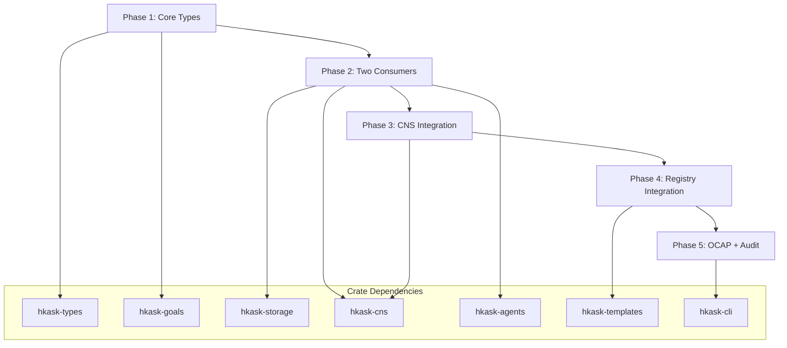

# Task 6: Implementation Plan

## 6.1 Phased Rollout

### Phase 1: Core Types and Ports (Week 1-2)

**Objective:** Define core types and port traits (no consumers yet — technical debt on P1).

**Deliverables:**
- `hkask-types/src/goal.rs` — `GoalId`, `Goal`, `GoalSpec`, `GoalState`, `GoalOutcome`, `Verdict`
- `hkask-types/src/goal_capability.rs` — `GoalCapability`, `GoalAction`
- `hkask-goals/src/ports.rs` — `GoalRepository`, `GoalExecutor`, `GoalVerifier`, `GoalManager`
- `hkask-goals/src/error.rs` — `GoalError`, `VerifierError`, `DelegationError`

**Dependencies:** None (new crate)

**LOC:** ~400

**P1 Violation:** Port traits have no consumers yet (acceptable as technical debt for Phase 1).

**Tasks:**
```bash
# Create hkask-goals crate
cargo new hkask-goals --lib

# Add dependencies
cargo add hkask-types --path ../hkask-types
cargo add hkask-cns --path ../hkask-cns
cargo add uuid serde rusqlite

# Implement types
# - crates/hkask-types/src/goal.rs
# - crates/hkask-types/src/goal_capability.rs

# Implement ports
# - crates/hkask-goals/src/ports.rs
# - crates/hkask-goals/src/error.rs
```

**Verification:**
```bash
cargo check -p hkask-types
cargo check -p hkask-goals
```

---

### Phase 2: Two Consumers (Week 3-4)

**Objective:** Implement two consumers for each port (satisfies P1).

**Deliverables:**
- `hkask-storage/src/goal_repository.rs` — SQLite adapter
- `hkask-cns/src/goal_verifier.rs` — CNS comparator adapter
- `hkask-mcp-inference/src/goal_judge.rs` — LLM judge adapter
- `hkask-agents/src/goal_executor.rs` — AgentPod executor

**Dependencies:** Phase 1 complete

**LOC:** ~800

**P1 Satisfaction:**
- `GoalRepository`: SQLite adapter + in-memory test adapter
- `GoalVerifier`: CNS adapter + LLM adapter + Command adapter (3 consumers)
- `GoalExecutor`: AgentPod executor

**Tasks:**
```bash
# Implement SQLite repository
# - crates/hkask-storage/src/goal_repository.rs
# - SQL migration: docs/storage/migrations/001_goals.sql

# Implement CNS verifier
# - crates/hkask-cns/src/goal_verifier.rs

# Implement LLM judge
# - crates/hkask-mcp-inference/src/goal_judge.rs

# Implement AgentPod executor
# - crates/hkask-agents/src/goal_executor.rs

# Run tests
cargo test -p hkask-storage
cargo test -p hkask-cns
cargo test -p hkask-mcp-inference
cargo test -p hkask-agents
```

**Verification:**
```bash
cargo check --workspace
cargo test --workspace
```

---

### Phase 3: CNS Integration (Week 5)

**Objective:** Integrate CNS spans and variety counters.

**Deliverables:**
- `hkask-cns/src/span.rs` — Add `Span::Goal(String)` variant
- `hkask-cns/src/goal_variety.rs` — Variety counter for goals
- `hkask-goals/src/manager.rs` — `GoalManager` with CNS emission

**Dependencies:** Phase 2 complete

**LOC:** ~300

**Tasks:**
```bash
# Add Goal span variant
# - crates/hkask-cns/src/span.rs

# Implement variety counter
# - crates/hkask-cns/src/goal_variety.rs

# Implement GoalManager
# - crates/hkask-goals/src/manager.rs

# Emit spans at lifecycle transitions:
# - cns.goal.create
# - cns.goal.verify
# - cns.goal.complete
# - cns.goal.delegate
# - cns.goal.block
# - cns.goal.variety_deficit

# Run tests
cargo test -p hkask-cns
cargo test -p hkask-goals
```

**Verification:**
```bash
cargo check -p hkask-cns
cargo test -p hkask-cns
cargo clippy -p hkask-cns -- -D warnings
```

---

### Phase 4: Registry Integration (Week 6)

**Objective:** Add `template_type: Goal` to unified registry.

**Deliverables:**
- `hkask-templates/src/template_type.rs` — Add `Goal` variant
- `registry/templates/goal_*.j2` — Goal templates
- `registry/manifests/goal_dispatch.yaml` — Dispatch manifest

**Dependencies:** Phase 3 complete

**LOC:** ~200 (Rust) + unlimited YAML/Jinja2

**Tasks:**
```bash
# Add Goal template type
# - crates/hkask-templates/src/template_type.rs

# Author goal templates
# - registry/templates/goal_build_app.j2
# - registry/templates/goal_research_topic.j2
# - registry/templates/goal_selector.j2

# Author dispatch manifest
# - registry/manifests/goal_dispatch.yaml

# Run tests
cargo test -p hkask-templates
```

**Verification:**
```bash
cargo check -p hkask-templates
cargo test -p hkask-templates
```

---

### Phase 5: OCAP Enforcement and Audit (Week 7-8)

**Objective:** Implement capability enforcement and audit logging.

**Deliverables:**
- `hkask-types/src/capability_checker.rs` — OCAP capability checker
- `hkask-storage/src/goal_audit.rs` — Audit log storage
- `hkask-cli/src/commands/goal.rs` — CLI commands

**Dependencies:** Phase 4 complete

**LOC:** ~350

**Tasks:**
```bash
# Implement capability checker
# - crates/hkask-types/src/capability_checker.rs

# Implement audit logging
# - crates/hkask-storage/src/goal_audit.rs
# - SQL migration: docs/storage/migrations/002_goal_audit.sql

# Implement CLI commands
# - crates/hkask-cli/src/commands/goal.rs
# Commands: create, pause, resume, complete, block, delegate, status, list

# Run tests
cargo test -p hkask-types
cargo test -p hkask-storage
cargo test -p hkask-cli
```

**Verification:**
```bash
cargo check --workspace
cargo test --workspace
cargo clippy --workspace -- -D warnings
cargo fmt --check
```

---

## 6.2 Dependency Graph



---

## 6.3 Risk Assessment

### Phase 1 Risks

| Risk | Probability | Impact | Mitigation |
|------|-------------|--------|------------|
| Type design requires refactoring | Medium | Low | Keep types minimal, iterate in Phase 2 |
| P1 violation flagged in review | High | Low | Document as accepted technical debt |

**Mitigation:** Phase 1 types are intentionally minimal — refinement happens in Phase 2 with actual consumers.

---

### Phase 2 Risks

| Risk | Probability | Impact | Mitigation |
|------|-------------|--------|------------|
| SQLite schema conflicts with existing tables | Low | Medium | Use separate migration file, test on clean DB |
| LLM judge timeout too short/long | Medium | Low | Configurable timeout, default 30s |
| AgentPod executor blocks on tool calls | Medium | Medium | Async execution with timeout |

**Mitigation:** All adapters have configurable timeouts and error handling.

---

### Phase 3 Risks

| Risk | Probability | Impact | Mitigation |
|------|-------------|--------|------------|
| Variety counter false positives | Medium | Low | Adjustable threshold (default 100) |
| CNS span emission overhead | Low | Low | Batch emission, async logging |
| Algedonic alert fatigue | Medium | Low | Curator review before human escalation |

**Mitigation:** Variety threshold is configurable; alerts go to Curator first.

---

### Phase 4 Risks

| Risk | Probability | Impact | Mitigation |
|------|-------------|--------|------------|
| Registry routing selects wrong template | Medium | Low | Confidence threshold (<0.7 → ask user) |
| Goal templates conflict with existing templates | Low | Low | Separate namespace (`goal_*.j2`) |

**Mitigation:** Registry selector includes confidence score; low confidence triggers user confirmation.

---

### Phase 5 Risks

| Risk | Probability | Impact | Mitigation |
|------|-------------|--------|------------|
| Capability attenuation too aggressive | Medium | Medium | Configurable `max_attenuation` (default 7) |
| Audit log performance impact | Low | Low | Async writes, batch commits |
| CLI commands conflict with existing commands | Low | Low | Namespace under `kask goal <subcommand>` |

**Mitigation:** Attenuation is configurable; audit logging is async.

---

## 6.4 Completion Checklist

**Phase 1:**
- [ ] `GoalId`, `Goal`, `GoalSpec` types defined
- [ ] `GoalCapability`, `GoalAction` types defined
- [ ] Port traits defined (`GoalRepository`, `GoalExecutor`, `GoalVerifier`, `GoalManager`)
- [ ] Error types defined
- [ ] `cargo check` passes

**Phase 2:**
- [ ] SQLite repository adapter implemented
- [ ] CNS verifier adapter implemented
- [ ] LLM judge adapter implemented
- [ ] AgentPod executor implemented
- [ ] Unit tests passing (20+ tests)
- [ ] `cargo test` passes

**Phase 3:**
- [ ] `Span::Goal` variant added
- [ ] Variety counter implemented
- [ ] `GoalManager` emits CNS spans
- [ ] Algedonic alert on variety deficit >100
- [ ] `cargo clippy` passes

**Phase 4:**
- [ ] `template_type: Goal` added to registry
- [ ] Goal templates authored (3+ templates)
- [ ] Dispatch manifest authored
- [ ] Registry selector routes goals
- [ ] `cargo test` passes

**Phase 5:**
- [ ] Capability checker implemented
- [ ] Audit logging implemented
- [ ] CLI commands implemented (8 commands)
- [ ] HMAC signing verified
- [ ] SQLCipher encryption enabled
- [ ] `cargo fmt --check` passes

**Overall:**
- [ ] All phases complete
- [ ] LOC budget ≤2,000
- [ ] All tests passing
- [ ] Documentation written
- [ ] Ready for Phase 0 (database migration)

---

*ℏKask — Planck's Constant of Agent Systems — v0.21.0*  
*Task 6 Complete: 5-phase implementation plan with risk assessment and completion checklist.*