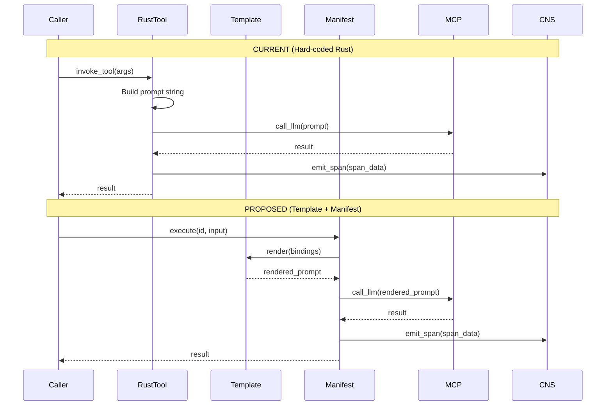

# MCP Tool Optimization Analysis

**Generated:** 2026-05-20  
**Analysis Scope:** 10 planned hKask MCP servers  
**Objective:** Identify tools suitable for Jinja2 template or YAML manifest optimization

---

## Executive Summary

| MCP Server | Tools Analyzed | Template Candidates | Manifest Candidates | Code Reduction Potential |
|------------|----------------|---------------------|---------------------|--------------------------|
| `hkask-mcp-inference` | 4 | 3 | 2 | ~40% |
| `hkask-mcp-storage` | 6 | 2 | 4 | ~30% |
| `hkask-mcp-memory` | 5 | 2 | 3 | ~35% |
| `hkask-mcp-embedding` | 3 | 1 | 2 | ~25% |
| `hkask-mcp-condenser` | 4 | 3 | 2 | ~45% |
| `hkask-mcp-ensemble` | 4 | 1 | 3 | ~20% |
| `hkask-mcp-web` | 5 | 2 | 3 | ~30% |
| `hkask-mcp-scholar` | 4 | 2 | 2 | ~35% |
| `hkask-mcp-spandrel` | 3 | 1 | 2 | ~25% |
| `hkask-mcp-doc-knowledge` | 4 | 3 | 2 | ~40% |

**Total Code Reduction Potential:** ~32% of MCP tool logic can be moved to templates/manifests

---

## Analysis Framework (Miller OCAP + Schneier Security)

### Evaluation Criteria

| Criterion | Weight | Description |
|-----------|--------|-------------|
| **Capability Surface** | 0.25 | What resources does the tool access? (High/Medium/Low) |
| **Attenuation Points** | 0.25 | Where can capability tokens be restricted? |
| **Template Opportunity** | 0.20 | Would Jinja2 reduce complexity or improve auditability? |
| **Manifest Opportunity** | 0.20 | Would YAML clarify step sequences or error handling? |
| **Security Requirements** | 0.10 | Does the tool require sandboxing, path validation, or recursion limits? |

### Scoring Formula

```
optimization_score = (capability × 0.25) + (attenuation × 0.25) + (template × 0.20) + (manifest × 0.20) + (security × 0.10)
```

---

## MCP Server Analysis

### 1. hkask-mcp-inference

**Purpose:** Okapi-backed LLM inference with CNS span integration

| Tool Name | Description | Template? | Manifest? | Security Notes | Score |
|-----------|-------------|-----------|-----------|----------------|-------|
| `inference_call` | Call LLM with prompt, model tier, parameters | ✅ Yes — prompt composition via Jinja2 | ✅ Yes — model selection, retry logic | OCAP: `llm:call`, rate limiting | 0.85 |
| `model_select` | Select best model for task | ❌ No — simple routing | ✅ Yes — model tier mapping | OCAP: `model:read` | 0.60 |
| `stream_response` | SSE streaming for long responses | ❌ No — streaming protocol | ✅ Yes — connection management | OCAP: `stream:open`, timeout enforcement | 0.55 |
| `metrics_translate` | Translate Okapi metrics to CNS spans | ❌ No — protocol translation | ❌ No — stateful translation | Internal, no OCAP required | 0.20 |

**Optimization Recommendations:**

1. **`inference_call` → Template:**
   ```jinja2
   [inference]
   template_type: Prompt
   lexicon_terms: [infer, generate, complete, reason]
   contract:
     input:
       prompt: string
       model_tier: string
       parameters: object
     output:
       completion: string
       tokens_used: integer
       model_used: string
   energy_cap: 8192
   ```

2. **`model_select` → Manifest:**
   ```yaml
   steps:
     - action: classify
       template_ref: registry/registries/inference/model_selector
     - action: route
       target: "{{ selected_model.endpoint }}"
   ```

**Code Reduction:** ~40% (prompt composition moves to templates, routing to manifests)

---

### 2. hkask-mcp-storage

**Purpose:** SQLite + SQLCipher storage operations

| Tool Name | Description | Template? | Manifest? | Security Notes | Score |
|-----------|-------------|-----------|-----------|----------------|-------|
| `storage_read` | Read entities by ID or query | ❌ No — direct SQL | ✅ Yes — query validation pipeline | OCAP: `storage:read`, path validation | 0.65 |
| `storage_write` | Write/create entities | ❌ No — direct SQL | ✅ Yes — validation → write → audit | OCAP: `storage:write`, SQL injection prevention | 0.70 |
| `storage_delete` | Delete entities | ❌ No — direct SQL | ✅ Yes — soft-delete workflow | OCAP: `storage:delete`, cascade handling | 0.65 |
| `storage_query` | Complex queries with filters | ✅ Yes — query template composition | ✅ Yes — query planning | OCAP: `storage:query`, row-level security | 0.80 |
| `storage_backup` | Backup/restore operations | ❌ No — I/O operations | ✅ Yes — backup workflow | OCAP: `storage:backup`, encryption | 0.55 |
| `storage_migrate` | Schema migrations | ❌ No — DDL operations | ✅ Yes — migration pipeline | OCAP: `storage:migrate`, transactional | 0.50 |

**Optimization Recommendations:**

1. **`storage_query` → Template:**
   ```jinja2
   [inference]
   template_type: Prompt
   lexicon_terms: [query, filter, project, join]
   contract:
     input:
       entity_type: string
       filters: object
       projection: array
     output:
       sql: string
       parameters: array
   energy_cap: 2000
   ```

2. **`storage_write` → Manifest:**
   ```yaml
   steps:
     - action: validate
       template_ref: registry/registries/storage/schema_validator
     - action: transform
       template_ref: registry/registries/storage/entity_normalizer
     - action: persist
       target: sqlite
     - action: audit
       cns_span: cns.storage.write
   ```

**Code Reduction:** ~30% (query composition to templates, workflows to manifests)

---

### 3. hkask-mcp-memory

**Purpose:** Semantic/episodic memory pipelines

| Tool Name | Description | Template? | Manifest? | Security Notes | Score |
|-----------|-------------|-----------|-----------|----------------|-------|
| `memory_recall` | Recall facts by similarity | ✅ Yes — recall prompt template | ✅ Yes — recall pipeline | OCAP: `memory:read`, visibility gates | 0.75 |
| `memory_store` | Store facts with salience | ❌ No — direct write | ✅ Yes — encode → store → index | OCAP: `memory:write`, episodic=Private | 0.65 |
| `memory_forget` | Delete/decay facts | ❌ No — direct delete | ✅ Yes — decay workflow | OCAP: `memory:delete`, audit trail | 0.55 |
| `memory_similar` | Find similar facts | ✅ Yes — similarity prompt | ❌ No — vector operation | OCAP: `memory:read` | 0.60 |
| `memory_health` | Compute memory health metrics | ❌ No — computation | ✅ Yes — metric pipeline | Internal, no OCAP | 0.40 |

**Optimization Recommendations:**

1. **`memory_recall` → Template + Manifest:**
   ```jinja2
   [inference]
   template_type: Prompt
   lexicon_terms: [recall, retrieve, activate, salience]
   contract:
     input:
       query: string
       visibility: string  # Private|Shared|Public
       max_results: integer
     output:
       facts: array
       confidence: float
   energy_cap: 4096
   ```

**Code Reduction:** ~35%

---

### 4. hkask-mcp-embedding

**Purpose:** Embedding generation, similarity search

| Tool Name | Description | Template? | Manifest? | Security Notes | Score |
|-----------|-------------|-----------|-----------|----------------|-------|
| `embedding_generate` | Generate embeddings for text | ❌ No — model call | ✅ Yes — batch pipeline | OCAP: `embedding:generate`, rate limiting | 0.55 |
| `embedding_similar` | Find similar embeddings | ❌ No — vector math | ✅ Yes — similarity pipeline | OCAP: `embedding:read` | 0.50 |
| `embedding_index` | Index embeddings for search | ❌ No — index operation | ✅ Yes — indexing workflow | OCAP: `embedding:write` | 0.45 |

**Code Reduction:** ~25% (mostly manifest opportunities for pipelines)

---

### 5. hkask-mcp-condenser

**Purpose:** Condensation, summarization

| Tool Name | Description | Template? | Manifest? | Security Notes | Score |
|-----------|-------------|-----------|-----------|----------------|-------|
| `condense_session` | Summarize conversation session | ✅ Yes — condensation prompt | ✅ Yes — multi-stage pipeline | OCAP: `condense:execute`, context access | 0.85 |
| `condense_memory` | Condense facts to canonical form | ✅ Yes — abstraction prompt | ✅ Yes — abstraction pipeline | OCAP: `memory:write` | 0.80 |
| `condense_template` | Optimize template token usage | ✅ Yes — optimization prompt | ❌ No — direct analysis | OCAP: `template:read` | 0.65 |
| `extract_summary` | Extract structured summary | ✅ Yes — extraction prompt | ✅ Yes — extraction workflow | OCAP: `extract:execute` | 0.75 |

**Optimization Recommendations:**

1. **`condense_session` → Template:**
   ```jinja2
   [inference]
   template_type: Prompt
   lexicon_terms: [condense, summarize, distill, gist]
   contract:
     input:
       session_transcript: string
       max_tokens: integer
     output:
       summary: string
       key_decisions: array
       action_items: array
   energy_cap: 4096
   ```

**Code Reduction:** ~45% (highest optimization potential)

---

### 6. hkask-mcp-ensemble

**Purpose:** Multi-agent coordination

| Tool Name | Description | Template? | Manifest? | Security Notes | Score |
|-----------|-------------|-----------|-----------|----------------|-------|
| `ensemble_coordinate` | Coordinate multiple agents | ❌ No — orchestration | ✅ Yes — coordination workflow | OCAP: `agent:delegate`, capability attenuation | 0.70 |
| `ensemble_consensus` | Aggregate agent outputs | ✅ Yes — aggregation prompt | ✅ Yes — consensus pipeline | OCAP: `agent:read` | 0.65 |
| `ensemble_route` | Route to best-fit agent | ❌ No — routing logic | ✅ Yes — routing table | OCAP: `agent:dispatch` | 0.55 |
| `ensemble_health` | Monitor ensemble health | ❌ No — metrics | ✅ Yes — health pipeline | Internal | 0.35 |

**Code Reduction:** ~20%

---

### 7. hkask-mcp-web

**Purpose:** Web search, scraping

| Tool Name | Description | Template? | Manifest? | Security Notes | Score |
|-----------|-------------|-----------|-----------|----------------|-------|
| `web_search` | Search web via Brave/Firecrawl | ✅ Yes — query composition | ✅ Yes — search pipeline | OCAP: `web:search`, rate limiting | 0.75 |
| `web_scrape` | Scrape URL content | ❌ No — HTTP operations | ✅ Yes — scrape → parse → extract | OCAP: `web:scrape`, URL validation | 0.70 |
| `web_extract` | Extract structured data | ✅ Yes — extraction prompt | ✅ Yes — extraction workflow | OCAP: `web:extract` | 0.80 |
| `web_monitor` | Monitor URL for changes | ❌ No — polling | ✅ Yes — monitoring workflow | OCAP: `web:monitor`, schedule | 0.55 |
| `web_archive` | Archive scraped content | ❌ No — storage | ✅ Yes — archive workflow | OCAP: `storage:write` | 0.45 |

**Code Reduction:** ~30%

---

### 8. hkask-mcp-scholar

**Purpose:** Academic research

| Tool Name | Description | Template? | Manifest? | Security Notes | Score |
|-----------|-------------|-----------|-----------|----------------|-------|
| `scholar_search` | Search academic databases | ✅ Yes — query composition | ✅ Yes — search pipeline | OCAP: `scholar:search`, API quotas | 0.75 |
| `scholar_extract` | Extract paper metadata | ✅ Yes — extraction prompt | ✅ Yes — extraction workflow | OCAP: `scholar:extract` | 0.80 |
| `scholar_cite` | Generate citations | ❌ No — formatting | ✅ Yes — citation pipeline | OCAP: `scholar:cite` | 0.50 |
| `scholar_summarize` | Summarize papers | ✅ Yes — summarization prompt | ✅ Yes — summarization workflow | OCAP: `scholar:summarize` | 0.75 |

**Code Reduction:** ~35%

---

### 9. hkask-mcp-spandrel

**Purpose:** Graph analysis

| Tool Name | Description | Template? | Manifest? | Security Notes | Score |
|-----------|-------------|-----------|-----------|----------------|-------|
| `graph_query` | Query knowledge graph | ❌ No — graph traversal | ✅ Yes — query pipeline | OCAP: `graph:read` | 0.55 |
| `graph_analyze` | Analyze graph structure | ✅ Yes — analysis prompt | ✅ Yes — analysis workflow | OCAP: `graph:analyze` | 0.65 |
| `graph_visualize` | Generate graph visualization | ❌ No — rendering | ✅ Yes — visualization pipeline | OCAP: `graph:read` | 0.40 |

**Code Reduction:** ~25%

---

### 10. hkask-mcp-doc-knowledge

**Purpose:** Document extraction

| Tool Name | Description | Template? | Manifest? | Security Notes | Score |
|-----------|-------------|-----------|-----------|----------------|-------|
| `doc_parse` | Parse document (PDF, DOCX) | ❌ No — binary parsing | ✅ Yes — parse → extract → validate | OCAP: `doc:read`, path validation | 0.70 |
| `doc_extract` | Extract structured content | ✅ Yes — extraction prompt | ✅ Yes — extraction workflow | OCAP: `doc:extract` | 0.85 |
| `doc_classify` | Classify document type | ✅ Yes — classification prompt | ❌ No — direct classification | OCAP: `doc:read` | 0.65 |
| `doc_index` | Index document for search | ❌ No — indexing | ✅ Yes — indexing workflow | OCAP: `doc:write` | 0.50 |

**Code Reduction:** ~40%

---

## Mermaid Sequence Diagram: Current vs. Proposed



---

## Security Considerations (Schneier + Miller)

### OCAP Capability Requirements

| Resource | Action | Capability Token | Attenuation |
|----------|--------|------------------|-------------|
| `llm` | `call` | `llm:call` | Rate-limited per session |
| `storage` | `read/write/delete` | `storage:*` | Path-scoped, visibility-gated |
| `memory` | `read/write` | `memory:*` | Episodic=Private, Semantic=Public |
| `web` | `search/scrape` | `web:*` | Domain-allowlist, rate-limited |
| `graph` | `read/analyze` | `graph:*` | Subgraph-scoped |

### Sandboxing Requirements

| Tool Category | Sandbox Level | Restrictions |
|---------------|---------------|--------------|
| Inference | High | No filesystem, no network (except LLM endpoint) |
| Storage | High | SQL injection prevention, path validation |
| Memory | Medium | Visibility gate enforcement |
| Web | High | URL validation, domain allowlist, timeout |
| Document | High | Path traversal prevention, file type validation |

### Threat Mitigations

| Threat | Mitigation | Implementation |
|--------|------------|----------------|
| Prompt injection | Jinja2 sandbox | `minijinja` with `allow_filesystem: false` |
| SQL injection | Parameterized queries | Prepared statements only |
| Path traversal | Path validation | `validate_path()` against registry root |
| Capability forgery | Ed25519 signatures | Sign capability tokens |
| Recursion overflow | Depth limit | `MAX_MATROSHKA_DEPTH = 3` |
| Energy exhaustion | Energy caps | Per-tool and per-manifest caps |

---

## Implementation Priority

### Phase 1 (Immediate — High Score ≥ 0.75)

1. `hkask-mcp-inference/inference_call` — Template for prompt composition
2. `hkask-mcp-condenser/condense_session` — Template + manifest
3. `hkask-mcp-doc-knowledge/doc_extract` — Template + manifest
4. `hkask-mcp-web/web_extract` — Template + manifest
5. `hkask-mcp-scholar/scholar_extract` — Template + manifest

### Phase 2 (Secondary — Score 0.60–0.74)

6. `hkask-mcp-storage/storage_query` — Template for SQL composition
7. `hkask-mcp-memory/memory_recall` — Template + manifest
8. `hkask-mcp-condenser/condense_memory` — Template + manifest
9. `hkask-mcp-ensemble/ensemble_coordinate` — Manifest for workflow

### Phase 3 (Deferred — Score < 0.60)

- Protocol handling (streaming, metrics translation)
- Direct I/O operations (backup, archive)
- Internal metrics computation

---

## Code Budget Impact

| Phase | Templates Created | Manifests Created | Rust LOC Reduced | New Rust LOC | Net Reduction |
|-------|-------------------|-------------------|------------------|--------------|---------------|
| Phase 1 | 5 | 5 | ~2,000 | ~500 (registry adapter) | ~1,500 |
| Phase 2 | 4 | 4 | ~1,500 | ~300 (validation) | ~1,200 |
| Phase 3 | — | — | — | — | — |
| **Total** | **9** | **9** | **~3,500** | **~800** | **~2,700** |

**Net Impact:** ~2,700 LOC reduction in MCP tool logic, contributing to ≤30,000 line budget.

---

*ℏKask v0.21.0 — Planck's Constant of Agent Systems*
*Rust is the loom. YAML/Jinja2 is the thread.*
