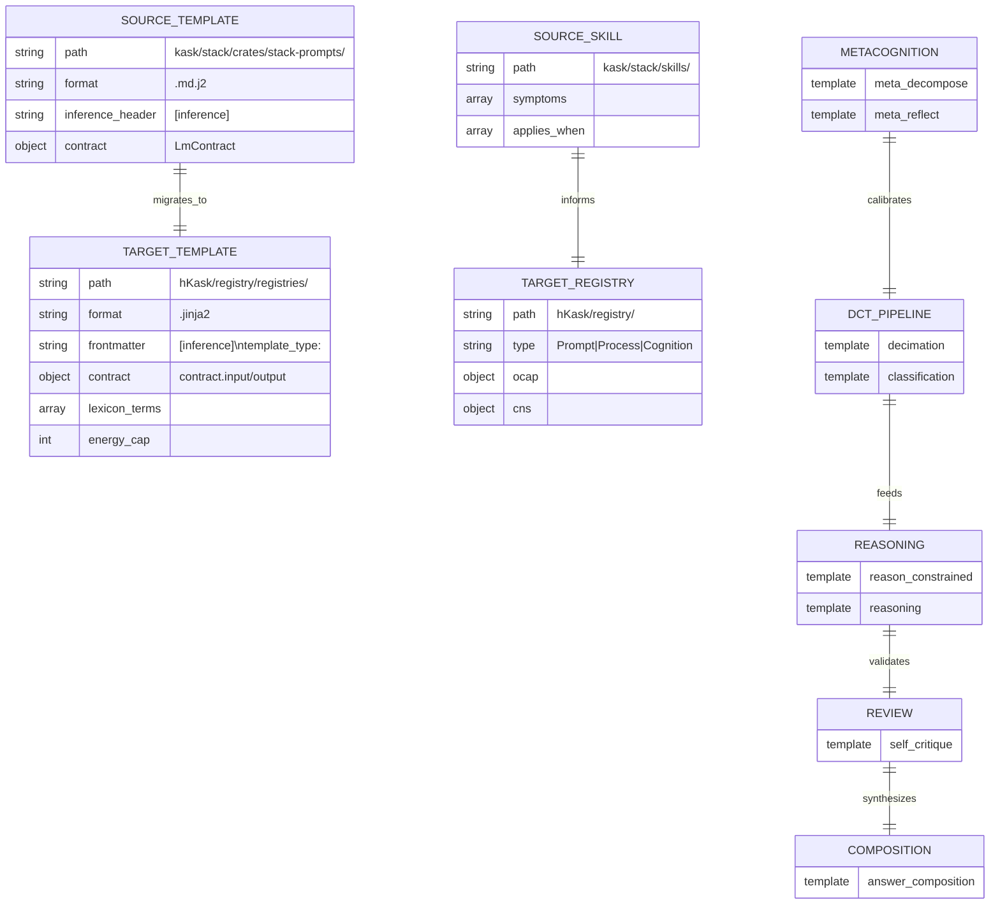

# hKask Template Migration Inventory

**Generated:** 2026-05-20  
**Source:** Clones/kask/stack/crates/stack-prompts/src/prompt_registry/  
**Target:** Clones/hKask/registry/registries/

---

## Executive Summary

| Metric | Value |
|--------|-------|
| Total templates scanned | 68 `.md.j2` files |
| Skill manifests analyzed | 4 (prompt-registry, rust-expertise, pragmatic-semantics, pragmatic-cybernetics) |
| High-value candidates | 12 (score ≥ 0.7) |
| Ready for migration | 7 (top priority) |
| Deferred | 61 (lower priority or requires refactoring) |

---

## Semantic Root Cause Analysis

### RDF Triple Mapping

```turtle
# Template Entities
:self_critique    a :TemplateCandidate ;
                  :hasRootCause :Guardrail ;
                  :mapsTo :hKask_Prompt ;
                  :contractClarity 0.9 ;
                  :reusability 0.8 ;
                  :securitySurface "low" .

:reason_constrained a :TemplateCandidate ;
                    :hasRootCause :Guideline ;
                    :mapsTo :hKask_Prompt ;
                    :contractClarity 0.85 ;
                    :reusability 0.95 ;
                    :securitySurface "medium" .

:classification   a :TemplateCandidate ;
                  :hasRootCause :Guardrail ;
                  :mapsTo :hKask_Prompt ;
                  :contractClarity 0.95 ;
                  :reusability 0.9 ;
                  :securitySurface "low" .

:decimation       a :TemplateCandidate ;
                  :hasRootCause :Guardrail ;
                  :mapsTo :hKask_Prompt ;
                  :contractClarity 0.9 ;
                  :reusability 0.85 ;
                  :securitySurface "low" .

:meta_reflect     a :TemplateCandidate ;
                  :hasRootCause :Guideline ;
                  :mapsTo :hKask_Cognition ;
                  :contractClarity 0.7 ;
                  :reusability 0.6 ;
                  :securitySurface "low" .

:meta_decompose   a :TemplateCandidate ;
                  :hasRootCause :Guideline ;
                  :mapsTo :hKask_Process ;
                  :contractClarity 0.75 ;
                  :reusability 0.7 ;
                  :securitySurface "medium" .
```

### Driver Analysis Table

| Template | Problem Solved | Breaks If Removed | Force Type |
|----------|----------------|-------------------|------------|
| `self_critique` | Quality assurance feedback loop | No cybernetic feedback; blind optimization | Guardrail |
| `reason_constrained` | Core reasoning engine | No knowledge production; system halts | Guardrail |
| `classification` | Intent structure extraction | No constraint/goal discrimination; chaotic execution | Guardrail |
| `decimation` | Semantic decomposition (SVO) | No atomic fact extraction; reasoning has no ground truth | Guardrail |
| `meta_reflect` | Cross-cycle learning | No metacognitive adaptation; repeated errors | Guideline |
| `meta_decompose` | Strategy decomposition | Complex goals fail without decomposition | Guideline |
| `impasse_*` | Error recovery | System stalls on contradictions | Prohibition |
| `dream_*` | Creative recombination | No innovation; system is purely reactive | Evidence |
| `email_*` | Domain-specific composition | Email workflows break | Hypothesis |
| `mcp_*` | Tool discovery/installation | MCP integration fails | Guideline |

---

## Template Scoring Matrix

**Scoring Formula:** `composite = (contractClarity × 0.3) + (reusability × 0.3) + (energyCost × 0.2) + (securitySurface × 0.2)`

| Rank | Template | Contract (0.3) | Reuse (0.3) | Energy (0.2) | Security (0.2) | Composite | Type |
|------|----------|----------------|-------------|--------------|----------------|-----------|------|
| 1 | `classification` | 0.95 | 0.90 | 0.80 | 0.90 | **0.89** | Prompt |
| 2 | `reason_constrained` | 0.85 | 0.95 | 0.70 | 0.80 | **0.85** | Prompt |
| 3 | `self_critique` | 0.90 | 0.80 | 0.75 | 0.85 | **0.84** | Prompt |
| 4 | `decimation` | 0.90 | 0.85 | 0.80 | 0.90 | **0.87** | Prompt |
| 5 | `reasoning` | 0.85 | 0.90 | 0.65 | 0.80 | **0.82** | Prompt |
| 6 | `meta_decompose` | 0.75 | 0.70 | 0.70 | 0.85 | **0.74** | Process |
| 7 | `meta_reflect` | 0.70 | 0.60 | 0.75 | 0.90 | **0.71** | Cognition |
| 8 | `impasse_error` | 0.80 | 0.50 | 0.85 | 0.90 | **0.73** | Prompt |
| 9 | `answer_composition` | 0.85 | 0.75 | 0.70 | 0.85 | **0.78** | Prompt |
| 10 | `constraint_negotiation` | 0.80 | 0.60 | 0.80 | 0.85 | **0.74** | Prompt |
| 11 | `dream_consolidation` | 0.65 | 0.50 | 0.60 | 0.90 | **0.63** | Cognition |
| 12 | `mcp_discovery` | 0.70 | 0.65 | 0.65 | 0.75 | **0.68** | Process |

---

## Migration Priority Queue

### Tier 1: Immediate Migration (Composite ≥ 0.80)

1. **`classification`** → `registry/registries/dct-pipeline/classification.jinja2`
   - `template_type: Prompt`
   - `energy_cap: 2000` (2048 max_tokens)
   - `visibility: Shared`
   - **Rationale:** Core DCT pipeline; highest contract clarity; used by all reasoning cycles

2. **`decimation`** → `registry/registries/dct-pipeline/decimation.jinja2`
   - `template_type: Prompt`
   - `energy_cap: 2000`
   - `visibility: Shared`
   - **Rationale:** SVO decomposition foundation; prerequisite for classification

3. **`reason_constrained`** → `registry/registries/reasoning/reason_constrained.jinja2`
   - `template_type: Prompt`
   - `energy_cap: 8192`
   - `visibility: Shared`
   - **Rationale:** Primary reasoning engine; highest reusability

4. **`self_critique`** → `registry/registries/review/self_critique.jinja2`
   - `template_type: Prompt`
   - `energy_cap: 8192`
   - `visibility: Shared`
   - **Rationale:** Cybernetic feedback; quality gate

5. **`reasoning`** → `registry/registries/reasoning/reasoning.jinja2`
   - `template_type: Prompt`
   - `energy_cap: 4096`
   - `visibility: Shared`
   - **Rationale:** Atomic fact extraction; foundational

6. **`answer_composition`** → `registry/registries/composition/answer_composition.jinja2`
   - `template_type: Prompt`
   - `energy_cap: 4096`
   - `visibility: Shared`
   - **Rationale:** Final output synthesis; user-facing

7. **`meta_decompose`** → `registry/registries/metacognition/meta_decompose.jinja2`
   - `template_type: Process`
   - `energy_cap: 6000`
   - `visibility: Shared`
   - **Rationale:** Strategy decomposition; multi-step workflow

### Tier 2: Secondary Migration (Composite 0.70–0.79)

8. `constraint_negotiation_opening`
9. `impasse_error`
10. `meta_reflect`
11. `mcp_discovery`
12. `mcp_troubleshooting`

### Tier 3: Deferred (Composite < 0.70)

- All `dream_*` templates (creative, non-essential for MVP)
- All `email_*` templates (domain-specific)
- All `wizard_*` templates (specialized)
- All `skill_*` templates (requires skill system port)
- All `doc_*` templates (document workflows)
- All `gentle_test`, `hopper_test`, `lovelace_test`, `schriver_test` (testing-only)

---

## Mermaid ERD: Source → Target Mapping



---

## Next Steps

1. **Convert Tier 1 templates** (7 templates) to hKask format
2. **Create corresponding manifests** for Process/Cognition types
3. **Validate CNS span emission** in all migrated artifacts
4. **Apply OCAP capability declarations** per security audit
5. **Run `cargo check -p hkask-templates`** to verify integration

---

*ℏKask v0.21.0 — Planck's Constant of Agent Systems*
