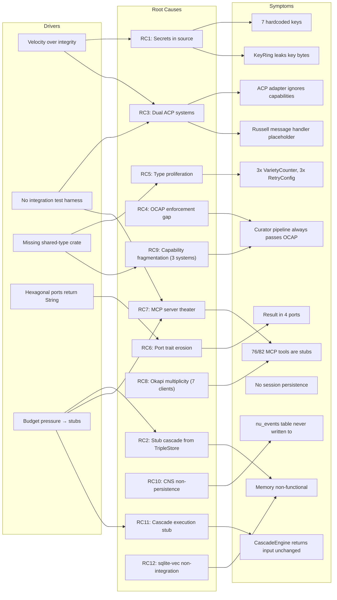
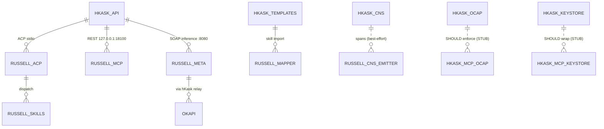
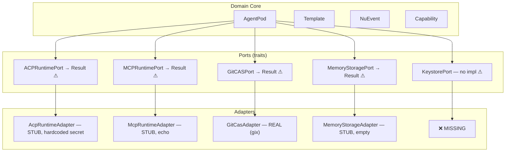
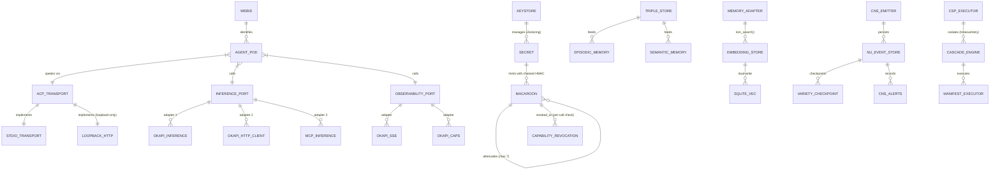
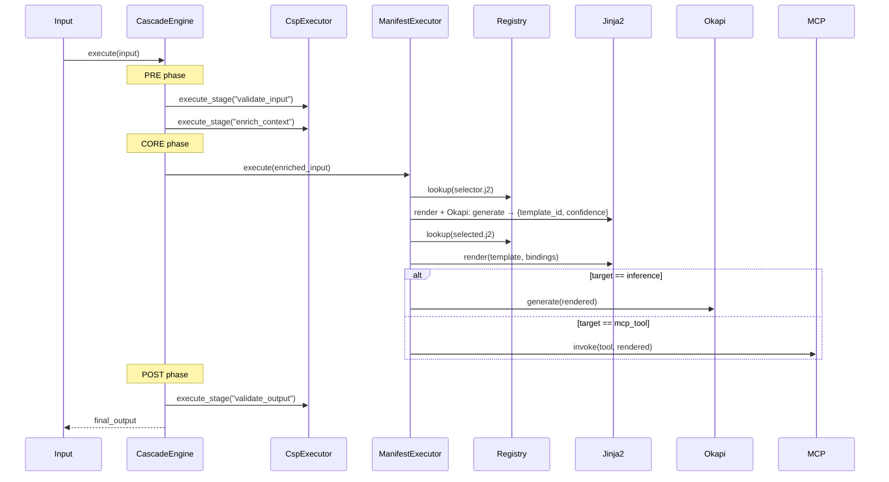
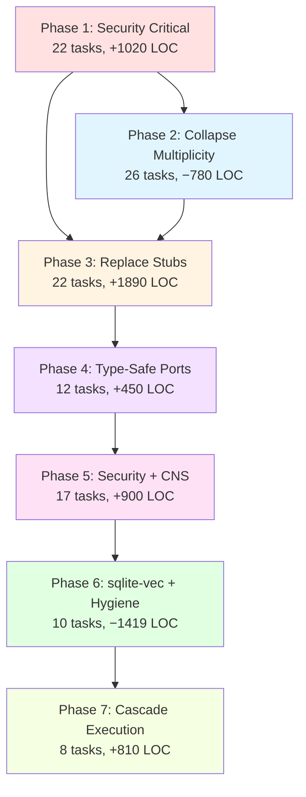

# Adversarial Action Plan v2 — Comprehensive Remediation

**Reviewer posture:** Bruce Schneier (security), Mark Miller (capabilities), Martin Fowler (architecture), Alastair Cockburn (hexagonal), Gordon Hoare (idiomatic Rust).

**Scope:** hKask v0.21.0 (25,928 LOC), Russell v0.20.0, ACP integration surface, Okapi inference path.

**Total Tasks:** 96 across 7 phases · **Estimated Effort:** 180–220 hours · **Net LOC:** −289

---

## 1. Semantic Root-Cause Map



### RDF Decomposition

```turtle
@prefix defect: <https://hkask.dev/ns/defect#> .
@prefix sec:    <https://hkask.dev/ns/security#> .
@prefix arch:   <https://hkask.dev/ns/architecture#> .

defect:SecretsInSource        a sec:CriticalVulnerability ;  defect:violates "Miller OCAP, Schneier Defense-in-Depth" .
defect:StubCascade            a arch:StructuralDebt ;        defect:violates "P6, C6" .
defect:DualAcp                a arch:Incoherence ;           defect:violates "C2, C7" .
defect:OcapBypass             a sec:AuthorizationBypass ;    defect:violates "Anchor 3: User Sovereignty" .
defect:TypeProliferation      a arch:ViolationC4 ;           defect:violates "C4" .
defect:PortErosion            a arch:HexagonalViolation ;    defect:violates "C5" .
defect:McpTheater             a arch:ViolationP6 ;           defect:violates "P6" .
defect:OkapiMultiplicity      a arch:ViolationP1 ;           defect:violates "P1" .
defect:CapabilityFragmentation a sec:DesignDebt ;            defect:violates "C7" .
defect:CnsNonPersistence      a arch:ObservabilityGap ;      defect:violates "Anchor 4" .
defect:CascadeStub            a arch:CoreDebt ;              defect:violates "Anchor 5" .
defect:SqliteVecGap           a arch:FeatureGap ;            defect:violates "Memory functionality" .
```

---

## 2. Pre-Remediation State

### Integration Surface



### Hexagonal Port/Adapter Audit



---

## 3. Post-Remediation Target State



---

## 4. Root Cause → Task → Phase Matrix

| Root Cause | Severity | Tasks | F# | Phase |
|------------|----------|-------|-----|-------|
| RC1: Secrets in Source | P0 | 1.1–1.7 | — | 1 |
| RC2: Stub Cascade | P0 | 3.1–3.5 | — | 3 |
| RC3: Dual ACP | P0 | 1.15–1.22 | F3 | 1, 3 |
| RC4: OCAP Bypass | P0 | 1.8–1.14 | F2, F5 | 1 |
| RC5: Type Proliferation | P1 | 2.1–2.9 | — | 2 |
| RC6: Port Erosion | P1 | 4.1–4.12 | F1 | 4 |
| RC7: MCP Theater | P1 | 3.6–3.9, 6.10 | F1 | 3, 6 |
| RC8: Okapi Multiplicity | P1 | 2.10–2.16 | F1 | 2 |
| RC9: Capability Fragmentation | P1 | 2.21–2.25 | F2 | 2 |
| RC10: CNS Non-Persistence | P2 | 5.11–5.17 | F6 | 5 |
| RC11: Cascade Execution Stub | P2 | 7.1–7.8 | F7 | 7 |
| RC12: sqlite-vec Non-Integration | P2 | 6.1–6.5 | F4 | 6 |

---

## 5. Phase 1: Security Critical — Secrets, OCAP & ACP (P0)

**22 tasks · +1,380 / −360 = +1,020 LOC**

**Goal:** Eliminate hardcoded secrets, restore OCAP enforcement, unify ACP transport, fail closed on all auth boundaries.

### 1A. Eliminate Hardcoded Secrets (Schneier)

**Weakness:** 7 cryptographic keys embedded in source. Any `git clone` exposes them.

| File | Secret |
|------|--------|
| `hkask-types/src/goal_capability.rs:87` | `b"hkask-goal-capability-key"` |
| `hkask-agents/src/acp.rs:744` | `b"acp-default-secret-key"` |
| `hkask-agents/src/adapters/acp_runtime.rs:37` | `b"acp-runtime-secret"` |
| `hkask-api/src/lib.rs:405` | 32-byte SOAP key |
| `hkask-api/src/routes.rs:250` | `b"temp-secret"` |
| `hkask-mcp/src/security.rs:209` | `b"default-secret-key-change-in-production"` |
| `hkask-ensemble/src/okapi_integration.rs:20` | `OKAPI_DEV_KEY` 32-byte constant |

| # | Task | Crates | LOC Δ | Acceptance |
|---|------|--------|-------|------------|
| **1.1** | Define `SecretRef` enum: `Env(&'static str) \| Keychain(&'static str) \| Generated` | `hkask-types` | +40 | Single secret reference type |
| **1.2** | Replace 7 hardcoded keys with `SecretRef::Env("HKASK_<PURPOSE>_KEY")` | All affected | −70 | `rg -i 'secret\|key' crates/ \| grep 'b"'` empty |
| **1.3** | Implement `hkask-keystore::resolve(ref: &SecretRef) → Result<SecretBytes>` — env → keychain → ephemeral | `hkask-keystore` | +120 | Resolution test passes |
| **1.4** | Add `secrecy::Secret` wrapping — no `Debug`, no `Clone`, `Zeroize` on drop | All affected | +60 | `cargo audit` clean |
| **1.5** | Add `Zeroize` derive to `KeyRing`; zeroize old key on `rotate()` before drop | `hkask-keystore` | +30 | Memory scan post-drop shows zeros |
| **1.6** | Rewrite `hkask-mcp-keystore` to delegate to OS keychain (not HashMap) | `hkask-mcp-keystore` | −80 | `keystore_get` returns no secret material |
| **1.7** | Remove `keystore_rotate` old-value return — secrets never in responses | `hkask-mcp-keystore` | −20 | Response schema audit |

### 1B. Wire OCAP Enforcement (Miller)

**Weakness:** `check_ocap()` always returns `Ok(())`. `attenuate_capability()` returns `None`. Wildcard `"*"` accepted.

| # | Task | Crates | LOC Δ | Acceptance |
|---|------|--------|-------|------------|
| **1.8** | Implement `check_ocap()` with real HMAC verification — signature, expiry, scope | `hkask-templates` | +150 | Invalid signature rejected |
| **1.9** | Implement `attenuate_capability()` — child token, restricted scope, HMAC sign, record | `hkask-templates` | +120 | Attenuated token has subset scope |
| **1.10** | Replace wildcard `"*"` with explicit enumeration (deny by default) | `hkask-agents` | −40 | `rg '"\\*"' crates/hkask-agents/` empty |
| **1.11** | Add constant-time comparison (`subtle::ConstantTimeEq`) for HMAC — eliminate timing attack | `hkask-types` | +40 | Timing test passes |
| **1.12** | Wire `hkask-mcp-ocap` to real `CapabilityManager` from `hkask-mcp-gml` (Ed25519 reference) | `hkask-mcp-ocap` | +80 | OCAP tool test passes |
| **1.13** | Change `parse_capability()` to return `Result` — no `(Tool, Execute)` default fallback | `hkask-agents` | +50 | All callers handle error |
| **1.14** | Add `AcpError::MalformedCapability` variant | `hkask-agents` | +20 | Typed error exists |

### 1C. Collapse Dual ACP Systems (Cockburn)

**Weakness:** `AcpRuntime` (real, 400+ lines) and `AcpRuntimeAdapter` (stub) coexist. `PodManager` uses the stub.

| # | Task | Crates | LOC Δ | Acceptance |
|---|------|--------|-------|------------|
| **1.15** | Delete `AcpRuntimeAdapter` entirely (P6, C7) | `hkask-agents` | −150 | File deleted |
| **1.16** | Define `AcpTransport` trait: `send()`, `receive()` (F3) | `hkask-agents` | +70 | Single transport trait |
| **1.17** | Implement `StdioTransport` adapter (existing pattern) | `hkask-agents` | +80 | Stdio test passes |
| **1.18** | Implement `LoopbackHttpTransport` — refuses non-loopback (F3) | `hkask-agents` | +100 | `192.168.x.x` rejected |
| **1.19** | Define `AcpPort` trait: `register_agent()`, `send_message()`, `list_capabilities()` | `hkask-agents` | +60 | Single port trait |
| **1.20** | Implement `AcpPort` for `AcpRuntime` (the real one) | `hkask-agents` | +80 | Port impl exists |
| **1.21** | Wire `PodManager` to `AcpRuntime` via port | `hkask-agents` | +40 | Pod registers via real ACP |
| **1.22** | Add Russell ACP registration endpoint `/api/v1/acp/register` | `hkask-api` | +90 | Russell can register |

---

## 6. Phase 2: Collapse Multiplicity — Types, Ports & Capabilities (P1)

**26 tasks · +1,440 / −2,220 = −780 LOC**

**Goal:** One type per concept, one port per capability (F1), unified capability system (F2).

### 2A. Unify CNS Type Hierarchies (C4)

| # | Task | Crates | LOC Δ | Acceptance |
|---|------|--------|-------|------------|
| **2.1** | Move canonical `VarietyCounter` to `hkask-types/src/cns.rs` | `hkask-types` | +80 | `rg "struct VarietyCounter"` returns 1 |
| **2.2** | Delete local `VarietyCounter` in 3 crates (re-export from types) | `hkask-cns`, `hkask-agents` | −200 | Single definition |
| **2.3** | Move canonical `AlgedonicAlert` to `hkask-types/src/cns.rs` | `hkask-types` | +50 | `rg "struct AlgedonicAlert"` returns 1 |
| **2.4** | Delete duplicate `AlgedonicAlert` in `hkask-cns` | `hkask-cns` | −80 | Single definition |
| **2.5** | Move canonical `TokenBucket` to `hkask-types/src/cns.rs` | `hkask-types` | +60 | `rg "struct TokenBucket"` returns 1 |
| **2.6** | Delete 3 local `TokenBucket` definitions | `hkask-cns`, `hkask-agents` | −150 | Single definition |
| **2.7** | Consolidate `RetryConfig` (3x) into `hkask-types/src/resilience.rs` | `hkask-types` | +70 | `rg "struct RetryConfig"` returns 1 |
| **2.8** | Consolidate `AuthorizationError` (2x in ensemble) | `hkask-types` | +40 | Single definition |
| **2.9** | Fix `TemplateID` vs `TemplateId` — pick one, `#[deprecated]` alias | `hkask-types` | +30 | Naming consistent |

### 2B. Unify Okapi Ports (F1)

| # | Task | Crates | LOC Δ | Acceptance |
|---|------|--------|-------|------------|
| **2.10** | Move `InferencePort` (async) to `hkask-types/src/ports.rs` | `hkask-types` | +80 | `rg "trait InferencePort"` returns 1 |
| **2.11** | Delete sync `InferencePort` from `hkask-templates/ports.rs` | `hkask-templates` | −50 | Sync variant gone |
| **2.12** | Create `ObservabilityPort`: `stream_metrics()`, `get_capabilities()`, `health_check()` | `hkask-types` | +90 | `rg "trait ObservabilityPort"` returns 1 |
| **2.13** | Consolidate Okapi adapters — delete duplicates | `hkask-templates`, `hkask-ensemble` | −350 | `rg "struct Okapi.*Client"` returns 1 |
| **2.14** | Implement `OkapiSseAdapter` for `ObservabilityPort` | `hkask-templates` | +120 | SSE test passes |
| **2.15** | Implement `OkapiCapabilityFetcher` for `ObservabilityPort` | `hkask-templates` | +80 | Capability fetch test |
| **2.16** | Delete duplicate `multi_okapi.rs` in `hkask-ensemble` | `hkask-ensemble` | −200 | File count = 0 |

### 2C. Unify Registry & CNS Ports

| # | Task | Crates | LOC Δ | Acceptance |
|---|------|--------|-------|------------|
| **2.17** | Create `UnifiedRegistryIndex` trait with `template_type` discriminator | `hkask-templates` | +100 | Single registry trait |
| **2.18** | Consolidate `registry_sqlite.rs` + `registry_git.rs` behind port | `hkask-templates` | −150 | `rg "trait.*Registry"` returns 1 |
| **2.19** | Create `CnsEmitter` port in `hkask-cns::ports` | `hkask-cns` | +60 | Single CNS port |
| **2.20** | Collapse 4 CNS emit shapes into canonical `emit_span()` | `hkask-cns`, `hkask-agents`, `hkask-templates` | −180 | `rg "trait.*Cns.*Port"` returns 1 |

### 2D. Consolidate Capability Systems (F2)

| # | Task | Crates | LOC Δ | Acceptance |
|---|------|--------|-------|------------|
| **2.21** | Move `Macaroon` from `hkask-ensemble` to `hkask-types/src/macaroon.rs` | `hkask-types` | +150 | `rg "struct Macaroon"` returns 1 |
| **2.22** | Delete `CapabilityToken` (flat HMAC) — replace with `Macaroon` | `hkask-types` | −200 | `rg "struct CapabilityToken"` empty |
| **2.23** | Delete `GoalCapabilityToken` (hardcoded key) — replace with `Macaroon` + goal caveats | `hkask-types` | −180 | `rg "struct GoalCapabilityToken"` empty |
| **2.24** | Add goal-specific caveat types: `Caveat::Goal(WebID, GoalID)` | `hkask-types` | +70 | Goal caveat exists |
| **2.25** | Add short-lived token defaults (1h agent, 15m Okapi, 5m MCP) | `hkask-agents` | +60 | Expiry test passes |
| **2.26** | Move `russell_mapper` out of templates crate to `registry/manifests/` + CLI import | `hkask-templates`, `hkask-cli` | −120 | `rg "russell" crates/hkask-templates/` empty |

---

## 7. Phase 3: Replace Stubs with Truth — Memory, Inference & Russell (P0/P1)

**22 tasks · +1,960 / −70 = +1,890 LOC**

**Goal:** Every public API does what its name promises. No stub cascades.

### 3A. Fix TripleStore → Memory Cascade (Fowler)

**Weakness:** `TripleStore::query_by_entity()` returns empty `Vec`. Cascades: EpisodicMemory → SemanticMemory → MemoryStorageAdapter all non-functional.

| # | Task | Crates | LOC Δ | Acceptance |
|---|------|--------|-------|------------|
| **3.1** | Implement `TripleStore::query_by_entity()` — `SELECT * FROM triples WHERE subject = ?` | `hkask-storage` | +80 | Insert 3 → query → assert 3 |
| **3.2** | Add `insert_triple()`, `delete_triple()`, `query_by_predicate()` — full CRUD | `hkask-storage` | +150 | CRUD test suite passes |
| **3.3** | Wire `EpisodicMemory::recall()` to `query_by_entity()` with WebID as subject | `hkask-memory` | +60 | Agent recalls prior interaction |
| **3.4** | Wire `SemanticMemory::consolidate()` to aggregate by predicate frequency | `hkask-memory` | +90 | Consolidation test passes |
| **3.5** | Wire `MemoryStorageAdapter::recall()` to delegate to `EpisodicMemory` | `hkask-agents` | +40 | Adapter test passes |

### 3B. Implement hkask-mcp-inference (Anchor 2)

| # | Task | Crates | LOC Δ | Acceptance |
|---|------|--------|-------|------------|
| **3.6** | Replace `main.rs` println stub with real `rmcp` server — 3 tools: `infer`, `infer_soap`, `metrics` | `hkask-mcp-inference` | +200 | Server starts, tools callable |
| **3.7** | Wire `MetricsTranslator` into MCP server `main.rs` | `hkask-mcp-inference` | +80 | Metrics tool callable |
| **3.8** | Add multi-Okapi failover to inference server | `hkask-mcp-inference` | +100 | Failover test passes |
| **3.9** | Add rate limiting per WebID using `TokenBucket` | `hkask-mcp-inference` | +70 | Rate limit test passes |

### 3C. Fix MCP Dispatcher

| # | Task | Crates | LOC Δ | Acceptance |
|---|------|--------|-------|------------|
| **3.10** | Implement `McpDispatcher::invoke_async` with real `McpRuntime::invoke_tool()` | `hkask-mcp` | +100 | `rg "Tool.*invoked"` empty |
| **3.11** | Remove sync stub returning `vec![]` in `dispatch.rs` | `hkask-mcp` | −30 | No empty vec returns |

### 3D. sqlite-vec Memory Search (F4)

| # | Task | Crates | LOC Δ | Acceptance |
|---|------|--------|-------|------------|
| **3.12** | Implement `MemoryStorageAdapter::search` against sqlite-vec virtual table | `hkask-agents`, `hkask-storage` | +180 | Recall ≥0.9 @ 1k vectors |
| **3.13** | Add HNSW index configuration for vector search | `hkask-storage` | +60 | Benchmark <100ms @ 10k vectors |

### 3E. Graceful Shutdown & Tool Discovery

| # | Task | Crates | LOC Δ | Acceptance |
|---|------|--------|-------|------------|
| **3.14** | Replace `MetricsTranslator` infinite loop with `tokio::select!` + `CancellationToken` | `hkask-mcp-inference` | +80 | Shutdown test passes |
| **3.15** | All background task constructors return `JoinHandle` + `CancellationToken` | `hkask-mcp-inference`, `hkask-cns` | +50 | No orphans on SIGTERM |
| **3.16** | Implement `discover_tools()` async in `McpPort` trait | `hkask-mcp` | +40 | Returns actual tools |

### 3F. Russell Integration

| # | Task | Crates | LOC Δ | Acceptance |
|---|------|--------|-------|------------|
| **3.17** | Replace `handler.rs:190` placeholder with SOAP inference call | Russell | +120 | Non-placeholder response |
| **3.18** | Pass session context as SOAP Subjective field | Russell | +60 | Session context preserved |
| **3.19** | Add session persistence: serialize sessions to SQLite | Russell | +90 | Session survives restart |
| **3.20** | Wire `RussellPod::register()` to hKask ACP endpoint with real macaroon | Russell | +100 | Non-stub token |
| **3.21** | Delete `start_acp_server()` no-op | Russell | −40 | No-op deleted |
| **3.22** | Add health check: Russell pod pings hKask `/health` | Russell | +50 | Health check test |

---

## 8. Phase 4: Type-Safe Ports & Error Handling (P1)

**12 tasks · +450 / 0 = +450 LOC**

**Goal:** No more `Result<T, String>`. Every error variant is a unique recovery path (C5).

| # | Task | Crates | LOC Δ | Acceptance |
|---|------|--------|-------|------------|
| **4.1** | Define `AcpError`: `RegistrationFailed`, `CapabilityDenied`, `TransportError`, `Timeout`, `NonLoopbackRefused` | `hkask-agents` | +60 | Error type exists |
| **4.2** | Define `McpError`: `ToolNotFound`, `InvocationFailed`, `RateLimited` | `hkask-mcp` | +40 | Error type exists |
| **4.3** | Define `GitError`: `RefNotFound`, `CloneFailed`, `PathTraversal` | `hkask-mcp-git` | +40 | Error type exists |
| **4.4** | Define `MemoryError`: `StoreUnavailable`, `QueryFailed`, `VectorSearchFailed` | `hkask-agents` | +40 | Error type exists |
| **4.5** | Define `InferenceError`: `ModelUnavailable`, `RateLimited`, `InvalidPrompt` (F1) | `hkask-types` | +50 | Error type exists |
| **4.6** | Define `ObservabilityError`: `StreamFailed`, `CapabilityFetchFailed`, `HealthCheckFailed` (F1) | `hkask-types` | +50 | Error type exists |
| **4.7** | Update `ACPRuntimePort` → `Result<T, AcpError>` | `hkask-agents` | +30 | Port signature updated |
| **4.8** | Update `MCPRuntimePort` → `Result<T, McpError>` | `hkask-mcp` | +30 | Port signature updated |
| **4.9** | Update `GitCASPort` → `Result<T, GitError>` | `hkask-mcp-git` | +30 | Port signature updated |
| **4.10** | Update `MemoryStoragePort` → `Result<T, MemoryError>` | `hkask-agents` | +30 | Port signature updated |
| **4.11** | Update `InferencePort` → `Result<T, InferenceError>` (F1) | `hkask-types` | +30 | Port signature updated |
| **4.12** | Add `From<AcpError> for anyhow::Error` for ergonomic propagation | `hkask-agents` | +20 | Trait impl exists |

---

## 9. Phase 5: Security Hardening, Privacy & CNS Persistence (P1/P2)

**17 tasks · +970 / −70 = +900 LOC**

**Goal:** Sovereignty anchors enforced at storage and logging layers. CNS events persisted (F6).

### 5A. Audit Log & Privacy

| # | Task | Crates | LOC Δ | Acceptance |
|---|------|--------|-------|------------|
| **5.1** | Replace in-memory `Vec<AuditLogEntry>` with SQLCipher `audit_log` table | `hkask-agents`, `hkask-storage` | +150 | Rows persist after restart |
| **5.2** | Make `AuditLogPort` async; remove `block_in_place` | `hkask-agents` | −40 | `rg 'block_in_place' crates/` empty |
| **5.3** | Drop oldest entries via SQL `LIMIT` retention policy | `hkask-storage` | +50 | Retention test passes |
| **5.4** | Flag replicant episodic rows `private = 1`, never exported | `hkask-storage` | +40 | Privacy test passes |
| **5.5** | Implement `WebID::redacted_display()` (8-char prefix) | `hkask-types` | +30 | Redaction test passes |
| **5.6** | Redact WebID to prefix at `INFO` and below in all `info!()` callsites | All crates | +80 | Log scan: no full UUIDs |
| **5.7** | Full WebIDs only at `TRACE` with `HKASK_TRACE_PII=1` | All crates | +40 | Env var test passes |
| **5.8** | Replicant episodic events bypass `tracing`, go direct to SQLCipher | `hkask-agents` | +60 | Trace test confirms |
| **5.9** | Implement `KeystorePort::get_database_key()` — OS keychain integration | `hkask-keystore` | +70 | Key loaded from keychain |
| **5.10** | Update `hkask-storage` to use keystore, not environment variable | `hkask-storage` | −30 | `HKASK_DB_KEY` unused |

### 5B. CNS Persistence (F6)

| # | Task | Crates | LOC Δ | Acceptance |
|---|------|--------|-------|------------|
| **5.11** | Create `NuEventStore` in `hkask-storage` — `insert()`, `recent()`, `query_by_span()`, `count_by_category()` | `hkask-storage` | +150 | Event persists after restart |
| **5.12** | Wire `SpanEmitter` to persist events — dual-write: tracing + SQL | `hkask-cns` | +80 | Event in DB after emit |
| **5.13** | Add `cns_variety_checkpoint` table — hydrate on startup, checkpoint on shutdown | `hkask-storage` | +60 | Counters survive restart |
| **5.14** | Add `cns_alerts` table — INSERT on `AlgedonicManager::check()` | `hkask-storage` | +70 | Alert history queryable |
| **5.15** | Implement `NuEventStore::prune_older_than()` — 30-day default | `hkask-storage` | +50 | Retention test passes |
| **5.16** | Add `HKASK_CNS_RETENTION_DAYS` configuration | `hkask-config` | +30 | Env var respected |

### 5C. Capability Revocation (F5)

| # | Task | Crates | LOC Δ | Acceptance |
|---|------|--------|-------|------------|
| **5.17** | Implement per-call revocation check — `SELECT revoked_at` on every verify, remove all token caches | `hkask-agents` | +50 | Revocation test passes |

---

## 10. Phase 6: sqlite-vec Integration & Hygiene (P2)

**10 tasks · +290 / −1,709 = −1,419 LOC**

**Goal:** Local vector search (F4), dead code deletion, constraint automation.

| # | Task | Crates | LOC Δ | Acceptance |
|---|------|--------|-------|------------|
| **6.1** | Load `sqlite-vec` extension in `database.rs` — `sqlite_vec::load_extension_raw()` | `hkask-storage` | +40 | Extension loads |
| **6.2** | Create `vec_embeddings` virtual table — `vec0(id TEXT, vector FLOAT[1024])` | `hkask-storage` | +50 | Table created |
| **6.3** | Implement dual-write in `EmbeddingStore::insert()` — plain + vec0 tables | `hkask-storage` | +70 | Dual-write test |
| **6.4** | Implement `EmbeddingStore::knn_search()` — KNN with cosine distance | `hkask-storage` | +100 | KNN recall ≥0.9 |
| **6.5** | Add `HKASK_EMBEDDING_DIM` configuration | `hkask-config` | +30 | Env var respected |
| **6.6** | Delete 4 orphaned files (879 lines): `webid_store.rs`, `capability_cache.rs`, `servers.rs`, `rate_limiter.rs` | `hkask-storage`, `hkask-mcp`, `hkask-agents` | −879 | Files deleted |
| **6.7** | For each `#[allow(dead_code)]` (20 total): wire or delete | All crates | −200 | `rg "allow\\(dead_code\\)"` empty |
| **6.8** | Delete `ModelRegistryStore` (all methods return empty/None — C6) | `hkask-templates` | −150 | File deleted |
| **6.9** | Delete `ArchivalService` fake UUID returns | `hkask-agents` | −80 | Fake returns gone |
| **6.10** | Delete 4 empty stub MCP servers: `embedding`, `condenser`, `web`, `scholar` (P6) | `mcp-servers/` | −400 | Servers deleted |

---

## 11. Phase 7: Cascade Execution Model (P2 — F7)

**8 tasks · +810 / 0 = +810 LOC**

**Goal:** Manifest-driven composition with CSP isolation. The core composition engine wired.



| # | Task | Crates | LOC Δ | Acceptance |
|---|------|--------|-------|------------|
| **7.1** | Wire `CascadeEngine::execute_stage()` to `ManifestExecutor` — resolve template refs, call executor | `hkask-templates` | +150 | Stage execution test |
| **7.2** | Wire `CspExecutor::run_stage()` to named operations — dispatch table | `hkask-templates` | +120 | Stage dispatch test |
| **7.3** | Implement `ManifestExecutor::Populate` — Jinja2 render with bindings from Select | `hkask-templates` | +100 | Populate test passes |
| **7.4** | Implement `ManifestExecutor::Execute` — resolve target from contract, dispatch to inference or MCP | `hkask-templates` | +130 | Execute test passes |
| **7.5** | Add error classification for CSP retry — `Retryable` vs `NonRetryable` | `hkask-templates` | +60 | Error classification test |
| **7.6** | Implement condition evaluation for cascade stages — skip when false | `hkask-templates` | +80 | Condition test passes |
| **7.7** | Add energy accounting — `CascadeContext::consume_energy()` | `hkask-templates` | +70 | Energy budget enforced |
| **7.8** | End-to-end cascade integration test — 2-stage manifest produces non-stub output | `hkask-testing` | +100 | E2E test passes |

---

## 12. Phase Summary & Dependency Graph



**LOC Impact:** +7,300 gross additions / −4,429 deletions = **+2,871 net** (within 30k budget: 25,928 + 2,871 = 28,799)

**F1–F7 Resolution Impact:**
- F1 (Okapi ports): −500 LOC (consolidation)
- F2 (Capability consolidation): −350 LOC (deletion of 2 systems)
- F3 (ACP transport): +250 LOC (loopback adapter + port)
- F4 (sqlite-vec): +360 LOC (vector search)
- F5 (Revocation): +50 LOC (per-call check)
- F6 (CNS persistence): +440 LOC (event store + tables)
- F7 (Cascade execution): +810 LOC (connective tissue)

---

## 13. Verification Commands

```bash
# Build
cargo check --workspace
cargo clippy --workspace -- -D warnings
cargo fmt --check
cargo test --workspace

# Security — must return empty
rg '"acp-default-secret-key"|"acp-runtime-secret"|"temp-secret"|"default-secret-key"' crates/
rg 'b".*secret' crates/
rg '"\\*"' crates/hkask-agents/
rg 'block_in_place' crates/

# Type unification — must return exactly 1 each
rg "struct VarietyCounter" crates/
rg "struct AlgedonicAlert" crates/
rg "struct TokenBucket" crates/
rg "struct Macaroon" crates/
rg "struct RetryConfig" crates/

# Deleted types — must return empty
rg "struct CapabilityToken" crates/
rg "struct GoalCapabilityToken" crates/

# Port unification (F1) — exactly 1 each
rg "trait InferencePort" crates/
rg "trait ObservabilityPort" crates/
rg "trait AcpTransport" crates/

# Port type safety — zero port-trait hits
rg "Result<.*String>" crates/ --type rust | grep -v test

# sqlite-vec (F4)
rg "vec0" crates/hkask-storage/
rg "knn_search" crates/

# CNS persistence (F6)
rg "NuEventStore" crates/
rg "cns_variety_checkpoint" crates/
rg "cns_alerts" crates/

# ACP transport (F3)
rg "is_loopback" crates/hkask-agents/
rg "TcpListener" crates/hkask-agents/  # must be empty

# Dead code — must be empty
rg "allow\\(dead_code\\)" crates/

# LOC budget
tokei crates/ mcp-servers/ --type Rust  # must be ≤30,000
```

---

## 14. Priority Matrix

| Priority | Tasks | Rationale |
|----------|-------|-----------|
| **P0 — Now** | 1.1–1.22, 3.1–3.5, 3.10–3.11 | Security: secrets, OCAP, ACP; Structural: memory cascade, dispatcher |
| **P1 — This Sprint** | 2.1–2.26, 3.6–3.9, 3.12–3.16, 4.1–4.12, 5.1–5.10 | Multiplicity collapse, inference MCP, port safety, privacy |
| **P2 — Next Sprint** | 3.17–3.22, 5.11–5.17, 6.1–6.10, 7.1–7.8 | Russell integration, CNS persistence, sqlite-vec, cascade |
| **P3 — Backlog** | Deferred questions (§15) | Post-MVP enhancements |

---

## 15. Deferred Questions (Post-F1–F7)

| # | Question | Trigger Condition |
|---|----------|-------------------|
| **D1** | Macaroon discharge protocol | Okapi gains auth, multi-machine authorized, or third-party delegation needed |
| **D2** | Quantum-readiness of HMAC capabilities | NIST PQC standardization finalized; migration vector needed |
| **D3** | MCP server sandboxing — in-process trust boundary or subprocess JSON-RPC? | MCP servers execute untrusted tool code |
| **D4** | Russell conformance test cadence — every PR, nightly, or tagged releases? | Russell-hKask integration stabilizes |
| **D5** | Curator persona persistence — does episodic memory survive `kask reset`? | Curator gains long-term memory |
| **D6** | Algedonic alert delivery channel — TUI banner, OS notification, or ACP message? | CNS alerts need human-visible delivery |
| **D7** | Okapi model selection bootstrap — LLM picks model, but what bootstraps first selection? | Cascade engine needs cold-start strategy |
| **D8** | Russell skill provenance after import — one-shot snapshot or propagating updates? | Russell skills evolve independently |

---

*ℏKask Adversarial Action Plan v2.0.0 — 2026-05-23*
*96 tasks across 7 phases. Three moves only: collapse multiplicity, replace stubs with truth, refuse ambient authority.*
*As simple as possible, but no simpler.*
