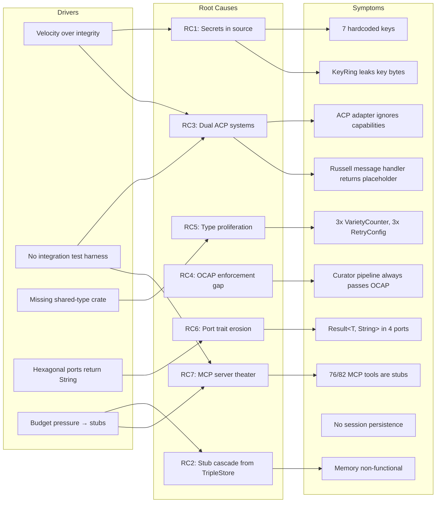
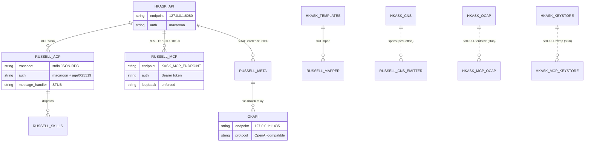
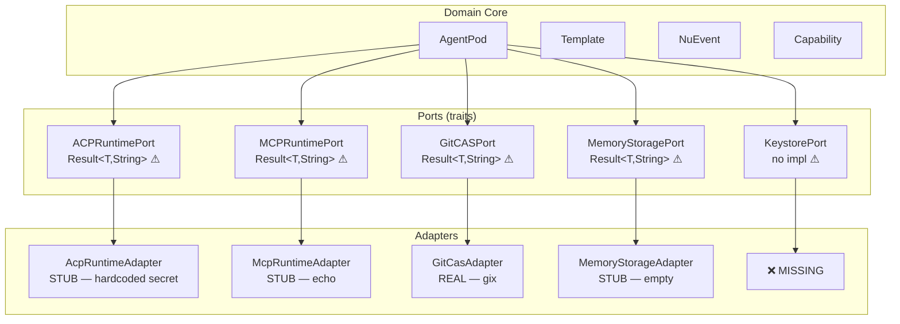

# Adversarial Multi-Perspective Review — Action Plan

**Reviewer posture:** Bruce Schneier (security), Mark Miller (capabilities), Martin Fowler (architecture), Alastair Cockburn (hexagonal), Gordon Hoare (idiomatic Rust).

**Scope:** hKask v0.21.0 (25,928 LOC), Russell v0.20.0, ACP integration surface, Okapi inference path.

---

## 1. Semantic Root-Cause Map



### RDF Decomposition (Lean Triples)

```
hkask:SecretInSource     rdfs:subClassOf  sec:CriticalVulnerability .
hkask:StubCascade        rdfs:subClassOf  arch:StructuralDebt .
hkask:DualAcp            rdfs:subClassOf  arch:Incoherence .
hkask:OcapBypass         rdfs:subClassOf  sec:AuthorizationBypass .
hkask:TypeProliferation  rdfs:subClassOf  arch:ViolationC4 .
hkask:PortErosion        rdfs:subClassOf  arch:HexagonalViolation .
hkask:McpTheater         rdfs:subClassOf  arch:ViolationP6 .

hkask:SecretInSource     owl:equivalentClass  [ owl:intersectionOf ( sec:HardcodedKey sec:NoZeroize ) ] .
hkask:StubCascade        prov:wasGeneratedBy  hkask:TripleStoreStub .
hkask:DualAcp            arch:violates        hKask:C2 .
hkask:OcapBypass         arch:violates        hKask:Anchor3 .
hkask:TypeProliferation  arch:violates        hKask:C4 .
hkask:PortErosion        arch:violates        hKask:C5 .
hkask:McpTheater         arch:violates        hKask:P6 .
```

---

## 2. Entity Relationship — Integration Surface



---

## 3. Hexagonal Port/Adapter Audit



---

## 4. Remediation Plan

### Task 1: Eliminate Hardcoded Secrets (CRITICAL — Schneier)

**Weakness:** 7 cryptographic keys embedded in source code. Any `git clone` exposes them.

| # | File | Secret |
|---|------|--------|
| 1 | `hkask-types/src/goal_capability.rs:87` | `b"hkask-goal-capability-key"` |
| 2 | `hkask-agents/src/acp.rs:744` | `b"acp-default-secret-key"` |
| 3 | `hkask-agents/src/adapters/acp_runtime.rs:37` | `b"acp-runtime-secret"` |
| 4 | `hkask-api/src/lib.rs:405` | 32-byte SOAP key |
| 5 | `hkask-api/src/routes.rs:250` | `b"temp-secret"` |
| 6 | `hkask-mcp/src/security.rs:209` | `b"default-secret-key-change-in-production"` |
| 7 | `hkask-ensemble/src/okapi_integration.rs:20` | `OKAPI_DEV_KEY` 32-byte constant |

**Remediation:**
1. Define `SecretRef` enum in `hkask-types`: `Env(&'static str) | Keychain(&'static str) | Generated`.
2. Replace each hardcoded `&[u8]` with `SecretRef::Env("HKASK_<PURPOSE>_KEY")`.
3. Add `hkask-keystore::resolve(ref: &SecretRef) -> Result<SecretBytes>` that reads from env, then OS keychain, then generates ephemeral.
4. Add `secrecy::Secret` wrapping — no `Debug`, no `Clone`, `Zeroize` on drop.
5. Audit: `rg -n 'b"' crates/ mcp-servers/ | grep -i 'secret\|key\|hmac'` must return zero hits in non-test code.

**Verification:** `cargo test --workspace` + new test asserting `SecretRef::Env` panics if env var unset in production profile.

---

### Task 2: Connect or Collapse Dual ACP Systems (CRITICAL — Cockburn)

**Weakness:** `AcpRuntime` (full, 400+ lines) and `AcpRuntimeAdapter` (stub, ignores capabilities) coexist. `PodManager` uses the stub. Russell's `acp/session.message` returns `"[Forwarding to hKask: ...]"`.

**Remediation:**
1. Delete `AcpRuntimeAdapter` entirely (P6, C7).
2. Define `AcpPort` trait in `hkask-agents/src/ports.rs`:
   ```rust
   pub trait AcpPort: Send + Sync {
       fn register_agent(&self, pod: &AgentPod) -> Result<AgentToken, AcpError>;
       fn send_message(&self, session: &SessionId, msg: &str) -> Result<AcpResponse, AcpError>;
       fn list_capabilities(&self, agent: &WebID) -> Result<Vec<Capability>, AcpError>;
   }
   ```
3. Implement `AcpPort` for `AcpRuntime` (the real one).
4. Wire `PodManager` to `AcpRuntime` via the port.
5. In Russell: replace `handler.rs:190` placeholder with actual SOAP inference call to hKask's `/api/llm/infer` endpoint, using the existing `russell-meta::help` module.

**Verification:** Integration test: create pod → register → send message → receive non-stub response.

---

### Task 3: Wire OCAP Enforcement in CuratorPipeline (CRITICAL — Miller)

**Weakness:** `check_ocap()` in `curator_pipeline.rs:170` is a stub that always returns `Ok(())`. `attenuate_capability()` returns `None`. The entire capability delegation chain is non-functional.

**Remediation:**
1. Implement `check_ocap()` using `CapabilityChecker` from `hkask-types/src/capability.rs` — verify HMAC signature, check expiry, check scope.
2. Implement `attenuate_capability()` — derive child token with restricted scope, sign with parent's HMAC key, record in `CapabilityStore`.
3. Replace wildcard `"*"` acceptance in `has_capability` with explicit enumeration (Schneier: deny by default).
4. Add constant-time comparison (`subtle::ConstantTimeEq`) for HMAC verification — eliminate timing attack.
5. Wire `hkask-mcp-ocap` server to use real `CapabilityManager` from `hkask-mcp-gml` (the only server with real Ed25519 OCAP) as the reference implementation.

**Verification:** Test: attenuated token with scope `[read]` must fail verification for `write` operation.

---

### Task 4: Fix TripleStore → Memory Cascade (HIGH — Fowler)

**Weakness:** `TripleStore::query_by_entity()` returns empty `Vec`. This cascades: `EpisodicMemory` non-functional → `SemanticMemory` non-functional → `MemoryStorageAdapter::recall()` returns empty → agents have no memory.

**Remediation:**
1. Implement `query_by_entity()` using the existing `triples` table schema — `SELECT * FROM triples WHERE subject = ?`.
2. Add `insert_triple()`, `delete_triple()`, `query_by_predicate()` — full CRUD.
3. Wire `EpisodicMemory::recall()` to call `query_by_entity()` with the agent's WebID as subject.
4. Wire `SemanticMemory::consolidate()` to aggregate episodic triples by predicate frequency.
5. Wire `MemoryStorageAdapter::recall()` to delegate to `EpisodicMemory`.

**Verification:** Test: insert 3 triples → query by entity → assert 3 results. Integration: agent recalls prior interaction.

---

### Task 5: Unify CNS Type Hierarchies (HIGH — C4)

**Weakness:** Three `VarietyCounter` types, two `AlgedonicAlert` types, three `TokenBucket` types across crates.

**Remediation:**
1. Move canonical `VarietyCounter`, `AlgedonicAlert`, `TokenBucket` to `hkask-types/src/cns.rs`.
2. Delete local definitions in `hkask-cns/src/variety.rs`, `hkask-cns/src/observers/composition.rs`, `hkask-cns/src/rate_limit.rs`, `hkask-agents/src/security.rs`, `hkask-agents/src/adapters/rate_limiter.rs`.
3. Re-export from `hkask-cns` for convenience: `pub use hkask_types::cns::VarietyCounter;`.
4. Consolidate `RetryConfig` (defined 3x) into `hkask-types/src/resilience.rs`.
5. Consolidate `AuthorizationError` (defined 2x in ensemble) into one definition.
6. Fix `TemplateID` vs `TemplateId` — pick one, alias the other with `#[deprecated]`.

**Verification:** `cargo check --workspace` with zero duplicate type warnings. `rg "struct VarietyCounter"` returns exactly 1 hit.

---

### Task 6: Type-Safe Port Traits (HIGH — Cockburn, C5)

**Weakness:** `ACPRuntimePort`, `MCPRuntimePort`, `GitCASPort`, `MemoryStoragePort` all return `Result<T, String>` — loses error context, violates C5.

**Remediation:**
1. Define typed error enums per port:
   ```rust
   pub enum AcpError { RegistrationFailed(String), CapabilityDenied(WebID), TransportError(String), Timeout }
   pub enum McpError { ToolNotFound(String), InvocationFailed(String), RateLimited }
   pub enum GitError { RefNotFound(String), CloneFailed(String), PathTraversal }
   pub enum MemoryError { StoreUnavailable, QueryFailed(String) }
   ```
2. Update all port traits to use these errors.
3. Update all adapters to map underlying errors into typed variants.
4. Add `From<AcpError> for anyhow::Error` for ergonomic propagation at the API boundary.

**Verification:** `rg "Result<.*String>" crates/` returns zero port-trait hits.

---

### Task 7: Secure the Keystore (HIGH — Schneier)

**Weakness:** `KeyRing` holds `[u8; 32]` without `Zeroize`. `rotate()` doesn't zeroize old key. `hkask-mcp-keystore` stores secrets in plaintext `HashMap`.

**Remediation:**
1. Add `#[derive(Zeroize, ZeroizeOnDrop)]` to `KeyRing` inner struct.
2. In `rotate()`, call `old_key.zeroize()` before dropping.
3. Rewrite `hkask-mcp-keystore` to delegate to `hkask-keystore::Keychain` (OS keychain + AES-256-GCM) instead of `HashMap`.
4. Remove `keystore_rotate`'s old-value return — secrets must never appear in tool responses.
5. Add `keystore_get` response that returns only `{"exists": true, "length": N}` — never the value.

**Verification:** Test: after `KeyRing::drop()`, memory scan shows zero bytes at key location. Integration: `keystore_get` response contains no secret material.

---

### Task 8: Delete Orphaned and Dead Code (MEDIUM — P6, C2, C3)

**Weakness:** 4 orphaned files (879 lines), 20 `#[allow(dead_code)]` annotations, multiple functionally dead components.

**Remediation:**
1. Delete orphaned files:
   - `crates/hkask-storage/src/webid_store.rs` (261 lines)
   - `crates/hkask-storage/src/capability_cache.rs` (277 lines)
   - `crates/hkask-mcp/src/servers.rs` (251 lines)
   - `crates/hkask-agents/src/adapters/rate_limiter.rs` (90 lines)
2. For each `#[allow(dead_code)]`: either wire the field/method or delete it.
   - `AcpRuntime::rate_limiter` → wire into `register_agent()` rate check.
   - `BlobStore::conn` → delete `BlobStore` (no methods, P6).
   - `GoalVarietyCounter` → delete (entire struct dead).
3. Delete `ModelRegistryStore` (all methods return empty/None — C6).
4. Delete `ArchivalService` fake UUID returns — replace with `todo!()` gated behind feature flag or delete.
5. Remove `MockRegistry` from `resolver.rs` outside `#[cfg(test)]`.

**Verification:** `rg "allow\\(dead_code\\)" crates/` returns zero hits. `cargo check --workspace` clean.

---

### Task 9: Fix NuEvent Type Safety (MEDIUM — Hoare)

**Weakness:** `NuEvent.visibility` is `String` not `Visibility` enum. `WebID::from_string` silently generates new UUID on parse failure.

**Remediation:**
1. Change `NuEvent.visibility: String` → `NuEvent.visibility: Visibility`.
2. Change `WebID::from_string` → `WebID::parse(s: &str) -> Result<WebID, ParseError>` (fallible, C5).
3. Same for `GoalID::from_string`, `BotID::from_string` — all ID types get fallible `parse()`.
4. Add `impl Display` for all ID types (already have `to_string()` via UUID).

**Verification:** `cargo clippy --workspace -- -D warnings` — no `unwrap()` on ID parsing in non-test code.

---

### Task 10: Fix Panic Sites (MEDIUM — Hoare)

**Weakness:** `deliberation.rs:172` panics on NaN confidence. `resilience.rs:230` has reachable `unreachable!()`.

**Remediation:**
1. Replace `partial_cmp().unwrap()` with `partial_cmp().unwrap_or(Ordering::Equal)` or filter NaN before sort.
2. Replace `unreachable!()` after retry loop with proper `Err(RetryExhausted)` return.
3. Audit all `.unwrap()` in non-test code: `rg "\\.unwrap\\(\\)" crates/ --include '*.rs' | grep -v '#\\[cfg\\(test\\)\\]' | grep -v 'test'`.

**Verification:** `cargo test --workspace` — no panics in production paths. New test: NaN confidence → graceful degradation.

---

### Task 11: Implement hkask-mcp-inference (MEDIUM — Anchor 2)

**Weakness:** The inference MCP server — the primary Okapi integration surface — has 0 tools registered. `metrics_translator.rs` is real but unwired.

**Remediation:**
1. Wire `MetricsTranslator` into the MCP server `main.rs`.
2. Add 3 MCP tools:
   - `infer` — send prompt to Okapi, return completion (use `OkapiInference` from `hkask-templates`).
   - `infer_soap` — SOAP-format inference for Russell (use existing `hkask-api` SOAP endpoint logic).
   - `metrics` — expose Okapi metrics from `MetricsTranslator`.
3. Add multi-Okapi failover (already implemented in `hkask-templates::okapi_config.rs`).
4. Add rate limiting per WebID using `TokenBucket` from `hkask-types`.

**Verification:** `cargo run -p hkask-mcp-inference` starts MCP server. Tool call `infer` returns Okapi completion.

---

### Task 12: Russell ACP Message Forwarding (HIGH — Integration)

**Weakness:** `handler.rs:190` returns `"[Forwarding to hKask: ...]"` — the primary ACP conversational interface is non-functional.

**Remediation:**
1. In `russell-acp-server/src/handler.rs`, replace placeholder with actual call to `russell-meta::help::run_help_with_endpoint()`.
2. Pass session context (prior messages) as SOAP Subjective field.
3. Use existing `russell-meta` offline fallback when hKask unreachable.
4. Add session persistence: serialize `HashMap<String, Session>` to SQLite on close, restore on start.

**Verification:** Integration test: `acp/session.message` with real hKask running returns non-placeholder response.

---

### Task 13: Russell Pod Registration (MEDIUM — Integration)

**Weakness:** `RussellPod::register()` creates hardcoded stub token. `start_acp_server()` spawns no-op.

**Remediation:**
1. Wire `RussellPod::register()` to call hKask's ACP registration endpoint (or use shared `acp-runtime` crate).
2. Replace stub token with real macaroon from `russell-acp-server::auth::MacaroonAuth`.
3. Delete `start_acp_server()` no-op — the real server runs as systemd service, not in-process.
4. Add health check: Russell pod periodically pings hKask `/health` and records in proprioception.

**Verification:** `RussellPod::register()` returns non-stub token. `cargo test -p russell-agent` passes.

---

### Task 14: Documentation Budget Compliance (LOW — Governance)

**Weakness:** 46,854 lines of markdown — 4.7× over the 10,000-line budget.

**Remediation:**
1. Move completed session reports to `docs/archive/`.
2. Consolidate research documents into single comprehensive reports.
3. Delete TODO files for completed work.
4. Move `cybernetic-health-harness.md` (62,396 lines alone) to archive or Russell repo.
5. Target: ≤10,000 lines working documentation.

**Verification:** `find . -path ./target -prune -o -type f -name "*.md" -print | xargs wc -l` ≤ 10,000 (excluding TOGAF masters, user guides, READMEs, archive).

---

### Task 15: MCP Server Consolidation (MEDIUM — P6, P7)

**Weakness:** 76 of 82 MCP tools are stubs. 4 servers are empty `println!`. 3 are commented out.

**Remediation:**
1. Delete empty stub servers per P6: `hkask-mcp-embedding`, `hkask-mcp-condenser`, `hkask-mcp-web`, `hkask-mcp-scholar`.
2. Delete commented-out servers: `hkask-mcp-storage`, `hkask-mcp-memory`, `hkask-mcp-ensemble`.
3. For remaining functional stubs (`ocap`, `keystore`, `cns`, `registry`, `github`, `fmp`, `telnyx`, `fal`, `rss-reader`): either wire to real backends (Tasks 3, 7, 11 cover `ocap`, `keystore`, `cns`, `inference`) or delete per P6.
4. Keep only servers with real implementations: `gml` (production), `git` (semi-real), `inference` (after Task 11).
5. Update `Cargo.toml` workspace members to reflect deletions.

**Verification:** Every remaining MCP server has ≥1 tool with real implementation (not echo/stub). `cargo check --workspace` clean.

---

### Task 16: CNS Span Reception Endpoint (LOW — Integration)

**Weakness:** Russell emits CNS spans via HTTP POST to `HKASK_CNS_ENDPOINT`, but hKask has no visible receiver endpoint. Spans are fire-and-forget.

**Remediation:**
1. Add `POST /api/v1/cns/observe` endpoint to `hkask-api` that accepts `NuEvent` JSON and feeds into `CnsRuntime`.
2. Add macaroon authentication on the endpoint.
3. Add retry logic in Russell's `CnsEmitter` (currently fire-and-forget via `tokio::spawn`).
4. Correlate span IDs with ACP session IDs for end-to-end tracing.

**Verification:** Russell emits span → hKask receives → visible in `kask cns health` output.

---

### Task 17: Shared Protocol Types (LOW — D3)

**Weakness:** Russell and hKask have zero shared Rust types. Protocol drift is undetectable at compile time.

**Remediation:**
1. Create `hkask-protocol` crate (or use existing `hkask-types`) with:
   - ACP message types (`JsonRpcRequest`, `AcpResponse`, `SkillInfo`)
   - MCP tool types (`ToolDefinition`, `ToolCallResult`)
   - Shared enums (`Visibility`, `RiskBand`)
2. Russell depends on `hkask-protocol` via git dependency (JR-6: "reuse, don't depend" — git dep is reuse without version coupling).
3. Migrate `russell-acp-server` and `russell-mcp` to use shared types.

**Verification:** Changing an ACP message field in `hkask-protocol` causes compile error in both Russell and hKask.

---

## 5. Priority Matrix

| Priority | Tasks | Rationale |
|----------|-------|-----------|
| **P0 — Now** | 1, 2, 3 | Security-critical: secrets, auth bypass, OCAP stub |
| **P1 — This Sprint** | 4, 5, 6, 7 | Structural: memory cascade, type unification, port safety, keystore |
| **P2 — Next Sprint** | 8, 9, 10, 11, 12 | Hygiene + integration: dead code, type safety, panics, inference MCP, Russell ACP |
| **P3 — Backlog** | 13, 14, 15, 16, 17 | Consolidation: pod registration, docs, MCP cleanup, CNS reception, shared types |

---

## 6. Future — Open Questions

**F1: Okapi as First-Class Port.** Should Okapi inference be a hexagonal port (`InferencePort`) in `hkask-types`, with `hkask-templates::OkapiInference` and `hkask-ensemble::OkapiHttpClient` as two adapters? Currently Okapi is accessed via 3 different HTTP clients with no shared abstraction. This would satisfy P1 (two consumers) and unify the inference path.

**F2: Macaroon Discharge Protocol.** Russell's `AttenuationKind::DischargeChain` variant exists but no discharge protocol is implemented. Should hKask implement a discharge endpoint (`/mcp/v1/discharge`) that Okapi calls to verify third-party caveats? This is required for the full macaroon security model but may be premature before MVP.

**F3: ACP over Network.** Both hKask and Russell use stdio-only ACP transport. Should `acp-runtime` support TCP/WebSocket for multi-machine agent pods? The architecture explicitly excludes cross-machine sync, but the ACP protocol should not preclude it.

**F4: sqlite-vec Integration.** `sqlite-vec` is declared as a workspace dependency but `EmbeddingStore` only implements `insert()` — no vector similarity search. Should the memory subsystem use sqlite-vec for semantic search, or delegate to an external embedding service?

**F5: Capability Revocation Propagation.** When a capability is revoked in `hkask-mcp-ocap`, how does the revocation propagate to running agent pods that may have cached the token? A CRL (Certificate Revocation List) or short-lived tokens with mandatory re-verification are both viable approaches.

**F6: CNS as Event Store.** The CNS currently uses in-memory `HashMap` for variety counters and tracing spans for events. Should CNS observations be persisted to SQLite for post-incident analysis and variety trend tracking? Russell's journal provides this for the sentinel domain; hKask lacks an equivalent.

**F7: Template Cascade Execution.** `CascadeEngine::execute_stage()` and `CspExecutor::run_stage()` both return input unchanged. These are the composition engine — the core of Anchor 5. What is the execution model? Jinja2 rendering? CSP constraint solving? LLM-in-the-loop? This is the most underspecified component relative to its architectural importance.

---

*ℏKask Adversarial Review v1.0.0 — 2026-05-23*
*As simple as possible, but no simpler.*
