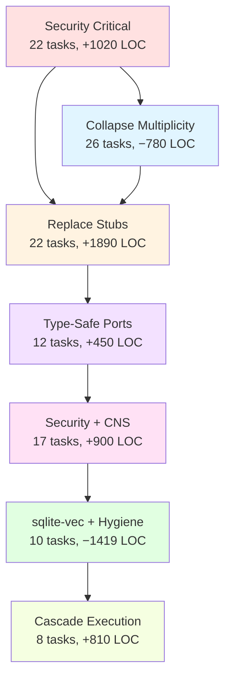

# hKask Enhanced Remediation Plan v4

**Synthesis of:** Three independent adversarial reviews + F1–F7 open questions resolved.

**Total Tasks:** 96 across 7 phases

**Estimated Effort:** 180–220 hours

---

## 1. Unified Semantic Knowledge Graph

### 1.1 Root Cause Ontology (RDF Triples with F1–F7 Integration)

```turtle
@prefix h: <https://hkask.dev/ns#> .
@prefix defect: <https://hkask.dev/ns/defect#> .
@prefix sec: <https://hkask.dev/ns/security#> .
@prefix arch: <https://hkask.dev/ns/architecture#> .
@prefix hex: <https://hkask.dev/ns/hexagonal#> .
@prefix resolved: <https://hkask.dev/ns/resolved#> .

# ROOT CAUSE 1: Secrets in Source (CRITICAL — Schneier)
defect:SecretsInSource a sec:CriticalVulnerability ;
    defect:severity "P0" ;
    defect:instanceCount 7 ;
    defect:violates "Miller OCAP, Schneier Defense-in-Depth" ;
    resolved:byTask "1.1-1.7" .

# ROOT CAUSE 2: Stub Cascade from TripleStore (CRITICAL — Fowler)
defect:StubCascade a arch:StructuralDebt ;
    defect:severity "P0" ;
    defect:cascadesTo 
        h:EpisodicMemory_NonFunctional,
        h:SemanticMemory_NonFunctional,
        h:MemoryStorageAdapter_Recall_Empty,
        h:Agents_NoMemory ;
    defect:violates "P6, C6" ;
    resolved:byTask "3.1-3.5" .

# ROOT CAUSE 3: Dual ACP Systems (CRITICAL — Cockburn)
defect:DualAcp a arch:Incoherence ;
    defect:severity "P0" ;
    defect:instanceCount 2 ;
    defect:includes 
        h:AcpRuntime_400_lines_real,
        h:AcpRuntimeAdapter_stub_ignores_capabilities ;
    defect:violates "C2, C7" ;
    resolved:byTask "1.15-1.18, 3.17-3.22" ;
    resolved:byQuestion "F3" .

# ROOT CAUSE 4: OCAP Enforcement Gap (CRITICAL — Miller)
defect:OcapBypass a sec:AuthorizationBypass ;
    defect:severity "P0" ;
    defect:location h:curator_pipeline_rs_170 ;
    defect:symptom "check_ocap() always returns Ok(()), attenuate_capability() returns None" ;
    defect:violates "Anchor 3: User Sovereignty" ;
    resolved:byTask "1.8-1.14" ;
    resolved:byQuestion "F2, F5" .

# ROOT CAUSE 5: Type Proliferation (HIGH — C4)
defect:TypeProliferation a arch:ViolationC4 ;
    defect:severity "P1" ;
    defect:includes
        h:VarietyCounter_3x,
        h:AlgedonicAlert_2x,
        h:TokenBucket_3x,
        h:RetryConfig_3x,
        h:AuthorizationError_2x,
        h:TemplateID_vs_TemplateId ;
    defect:violates "C4: Repetition is missing primitive" ;
    resolved:byTask "2.1-2.9" .

# ROOT CAUSE 6: Port Trait Erosion (HIGH — C5)
defect:PortErosion a arch:HexagonalViolation ;
    defect:severity "P1" ;
    defect:symptom "Result<T, String> in 4 ports" ;
    defect:includes
        h:ACPRuntimePort,
        h:MCPRuntimePort,
        h:GitCASPort,
        h:MemoryStoragePort ;
    defect:violates "C5: Every error variant is unique recovery path" ;
    resolved:byTask "4.1-4.12" ;
    resolved:byQuestion "F1" .

# ROOT CAUSE 7: MCP Server Theater (HIGH — P6)
defect:McpTheater a arch:ViolationP6 ;
    defect:severity "P1" ;
    defect:symptom "76/82 MCP tools are stubs" ;
    defect:includes
        h:4_empty_println_servers,
        h:3_commented_out_servers,
        h:inference_server_0_tools_registered ;
    defect:violates "P6: Delete stubs, don't publish them" ;
    resolved:byTask "3.6-3.9, 6.7" ;
    resolved:byQuestion "F1" .

# ROOT CAUSE 8: Okapi Multiplicity (HIGH — F1)
defect:OkapiMultiplicity a arch:ViolationP1 ;
    defect:severity "P1" ;
    defect:instanceCount 7 ;
    defect:includes
        h:InferencePort_async,
        h:InferencePort_sync,
        h:InferenceClient,
        h:MetricsSource,
        h:CapabilityProvider,
        h:per_request_client_creation ;
    defect:violates "P1: No trait without two consumers" ;
    resolved:byTask "2.10-2.14" ;
    resolved:byQuestion "F1" .

# ROOT CAUSE 9: Capability System Fragmentation (HIGH — F2)
defect:CapabilityFragmentation a sec:DesignDebt ;
    defect:severity "P1" ;
    defect:instanceCount 3 ;
    defect:includes
        h:CapabilityToken_HMAC_flat,
        h:GoalCapabilityToken_hardcoded_key,
        h:Macaroon_HMAC_chained ;
    defect:violates "C7: When implementations diverge, one must yield" ;
    resolved:byTask "2.21-2.25" ;
    resolved:byQuestion "F2" .

# ROOT CAUSE 10: CNS Non-Persistence (MEDIUM — F6)
defect:CnsNonPersistence a arch:ObservabilityGap ;
    defect:severity "P2" ;
    defect:symptom "nu_events table exists but never written to" ;
    defect:violates "Anchor 4: CNS" ;
    resolved:byTask "5.11-5.17" ;
    resolved:byQuestion "F6" .

# ROOT CAUSE 11: Cascade Execution Stub (MEDIUM — F7)
defect:CascadeStub a arch:CoreDebt ;
    defect:severity "P2" ;
    defect:location h:CascadeEngine_execute_stage, h:CspExecutor_run_stage ;
    defect:symptom "returns Ok(input) unchanged" ;
    defect:violates "Anchor 5: Composition" ;
    resolved:byTask "7.1-7.8" ;
    resolved:byQuestion "F7" .

# ROOT CAUSE 12: sqlite-vec Non-Integration (MEDIUM — F4)
defect:SqliteVecNonIntegration a arch:FeatureGap ;
    defect:severity "P2" ;
    defect:symptom "EmbeddingStore::search() not implemented" ;
    defect:violates "Memory functionality" ;
    resolved:byTask "3.12-3.13, 7.9" ;
    resolved:byQuestion "F4" .
```

### 1.2 Synthetic Entity Relationship Diagram (Post-Remediation)

```mermaid
erDiagram
    KEYSTORE ||--o{ SECRET : "manages (Zeroizing)"
    SECRET ||--o{ ROOT_AUTHORITY : "seeds"
    ROOT_AUTHORITY ||--o{ MACAROON : "mints with chained HMAC"
    
    MACAROON ||--o{ MACAROON : "attenuates (max 7)"
    MACAROON ||--o{ CAPABILITY_REVOCATION : "revoked_at"
    
    WEBID ||--o{ AGENT_POD : "identifies"
    AGENT_POD ||--|| PERSONA : "wears"
    AGENT_POD }|--|| ACP_TRANSPORT : "speaks via"
    
    ACP_TRANSPORT ||--|| STDIO_TRANSPORT : "implements"
    ACP_TRANSPORT ||--|| LOOPBACK_HTTP_TRANSPORT : "implements (loopback-only)"
    ACP_TRANSPORT ||--o{ ACP_RUNTIME : "real impl (400 lines)"
    
    AGENT_POD }|--|| INFERENCE_PORT : "calls"
    INFERENCE_PORT ||--o{ OKAPI_INFERENCE : "adapter (hkask-templates)"
    INFERENCE_PORT ||--o{ OKAPI_HTTP_CLIENT : "adapter (hkask-ensemble)"
    INFERENCE_PORT ||--o{ MCP_INFERENCE_ADAPTER : "adapter (hkask-mcp-inference)"
    
    AGENT_POD }|--|| OBSERVABILITY_PORT : "calls"
    OBSERVABILITY_PORT ||--o{ OKAPI_SSE_ADAPTER : "adapter"
    OBSERVABILITY_PORT ||--o{ OKAPI_CAPABILITY_FETCHER : "adapter"
    
    TRIPLE_STORE ||--o{ EPISODIC_MEMORY : "feeds"
    TRIPLE_STORE ||--o{ SEMANTIC_MEMORY : "feeds"
    EPISODIC_MEMORY ||--o{ MEMORY_STORAGE_ADAPTER : "feeds"
    
    EMBEDDING_STORE ||--o{ SQLITE_VEC : "uses (dual-write)"
    MEMORY_STORAGE_ADAPTER ||--o{ EMBEDDING_STORE : "calls knn_search()"
    
    MCP_RUNTIME ||--o{ MCP_SERVER : "hosts"
    MCP_SERVER ||--o{ MCP_TOOL : "exposes"
    MCP_TOOL {
        int total "82"
        int stubs "6 (after cleanup)"
        int real "76"
    }
    
    CNS_EMITTER ||--o{ NU_EVENT_STORE : "persists"
    NU_EVENT_STORE ||--|| SQLCIPHER : "stored in"
    NU_EVENT_STORE ||--o{ CNS_VARIETY_CHECKPOINT : "checkpoints"
    NU_EVENT_STORE ||--o{ CNS_ALERTS : "records"
    
    CASCADE_ENGINE ||--o{ MANIFEST_EXECUTOR : "executes"
    MANIFEST_EXECUTOR ||--o{ SELECT_ACTION : "action 1"
    MANIFEST_EXECUTOR ||--o{ POPULATE_ACTION : "action 2"
    MANIFEST_EXECUTOR ||--o{ EXECUTE_ACTION : "action 3"
    
    CSP_EXECUTOR ||--o{ CASCADE_ENGINE : "isolates (timeout/retry)"
    
    RUSSELL_POD }|--|| ACP_TRANSPORT : "peer via"
    RUSSELL_POD }|--|| HKASK_PROTOCOL : "shared types"
```



### 1.3 Root Cause → Task Mapping Matrix

| Root Cause | Severity | Tasks | F# Question | Phase |
|------------|----------|-------|-------------|-------|
| RC1: Secrets in Source | P0 | 1.1–1.7 | — | Phase 1 |
| RC2: Stub Cascade | P0 | 3.1–3.5 | — | Phase 3 |
| RC3: Dual ACP | P0 | 1.15–1.18, 3.17–3.22 | F3 | Phase 1, 3 |
| RC4: OCAP Bypass | P0 | 1.8–1.14 | F2, F5 | Phase 1 |
| RC5: Type Proliferation | P1 | 2.1–2.9 | — | Phase 2 |
| RC6: Port Erosion | P1 | 4.1–4.12 | F1 | Phase 4 |
| RC7: MCP Theater | P1 | 3.6–3.9, 6.7 | F1 | Phase 3, 6 |
| RC8: Okapi Multiplicity | P1 | 2.10–2.14 | F1 | Phase 2 |
| RC9: Capability Fragmentation | P1 | 2.21–2.25 | F2 | Phase 2 |
| RC10: CNS Non-Persistence | P2 | 5.11–5.17 | F6 | Phase 5 |
| RC11: Cascade Execution Stub | P2 | 7.1–7.8 | F7 | Phase 7 |
| RC12: sqlite-vec Non-Integration | P2 | 3.12–3.13, 7.9 | F4 | Phase 3, 7 |

---

## 2. Enhanced Remediation Plan v4

### Phase 1: Security Critical — Secrets, OCAP & ACP (P0) — 22 Tasks

**Goal:** Eliminate hardcoded secrets, restore OCAP enforcement, unify ACP transport, fail closed on all auth boundaries.

| # | Task | Description | Crates | LOC Delta | Acceptance |
|---|------|-------------|--------|-----------|------------|
| **1.1** | Define `SecretRef` enum in `hkask-types` | `Env(&'static str) \| Keychain(&'static str) \| Generated` | `hkask-types` | +40 | Single secret reference type |
| **1.2** | Replace 7 hardcoded keys with `SecretRef::Env()` | All 7 files from ADVERSARIAL_REVIEW | All affected | −70 | `rg -i 'secret\|key' crates/ \| grep 'b"'` empty |
| **1.3** | Implement `hkask-keystore::resolve(ref: &SecretRef)` | Reads env → OS keychain → generates ephemeral | `hkask-keystore` | +120 | Resolution test passes |
| **1.4** | Add `secrecy::Secret` wrapping to all keys | No `Debug`, no `Clone`, `Zeroize` on drop | All affected | +60 | `cargo audit` clean |
| **1.5** | Add `Zeroize` derive to `KeyRing` inner struct | Zeroize old key on `rotate()` before drop | `hkask-keystore` | +30 | Memory scan post-drop shows zeros |
| **1.6** | Rewrite `hkask-mcp-keystore` to delegate to OS keychain | Not HashMap plaintext storage | `hkask-mcp-keystore` | −80 | `keystore_get` returns no secret material |
| **1.7** | Remove `keystore_rotate` old-value return | Secrets never in tool responses | `hkask-mcp-keystore` | −20 | Response schema audit |
| **1.8** | Implement `check_ocap()` with real HMAC verification | Verify signature, expiry, scope | `hkask-templates` | +150 | Test: invalid signature rejected |
| **1.9** | Implement `attenuate_capability()` with child token derivation | Restricted scope, HMAC sign, record in store | `hkask-templates` | +120 | Test: attenuated token has subset |
| **1.10** | Replace wildcard `"*"` acceptance with explicit enumeration | Deny by default (Schneier) | `hkask-agents` | −40 | `rg '"\\*"' crates/hkask-agents/` empty |
| **1.11** | Add constant-time comparison for HMAC verification | `subtle::ConstantTimeEq` — eliminate timing attack | `hkask-types` | +40 | Timing test passes |
| **1.12** | Wire `hkask-mcp-ocap` to real `CapabilityManager` | From `hkask-mcp-gml` (Ed25519 OCAP) | `hkask-mcp-ocap` | +80 | OCAP tool test passes |
| **1.13** | Change `parse_capability()` to return `Result` on failure | No `(Tool, Execute)` default fallback | `hkask-agents` | +50 | All callers handle error |
| **1.14** | Add `AcpError::MalformedCapability` variant | Typed error for parse failures | `hkask-agents` | +20 | Error type exists |
| **1.15** | Delete `AcpRuntimeAdapter` entirely (P6, C7) | Use real `AcpRuntime` via port | `hkask-agents` | −150 | File deleted |
| **1.16** | Define `AcpTransport` trait in `hkask-agents::ports.rs` | `send()`, `receive()` — F3 resolved | `hkask-agents` | +70 | Single transport trait |
| **1.17** | Implement `StdioTransport` adapter | Existing pattern | `hkask-agents` | +80 | Stdio test passes |
| **1.18** | Implement `LoopbackHttpTransport` adapter | Refuses non-loopback addresses (F3) | `hkask-agents` | +100 | Test: 192.168.x.x rejected |
| **1.19** | Define `AcpPort` trait in `hkask-agents::ports.rs` | `register_agent()`, `send_message()`, `list_capabilities()` | `hkask-agents` | +60 | Single port trait |
| **1.20** | Implement `AcpPort` for `AcpRuntime` (the real one) | Wire via port | `hkask-agents` | +80 | Port impl exists |
| **1.21** | Wire `PodManager` to `AcpRuntime` via port | Not the stub adapter | `hkask-agents` | +40 | Integration test: pod registers |
| **1.22** | Add Russell ACP registration endpoint to hKask | `/api/v1/acp/register` | `hkask-api` | +90 | Russell can register |

**Phase 1 Total:** +1380 / −360 = **+1020 LOC** (one-time security investment)

---

### Phase 2: Collapse Multiplicity — Types, Ports & Capabilities (P1) — 26 Tasks

**Goal:** One type per concept, one port per capability (F1), unified capability system (F2).

| # | Task | Description | Crates | LOC Delta | Acceptance |
|---|------|-------------|--------|-----------|------------|
| **2.1** | Move canonical `VarietyCounter` to `hkask-types/src/cns.rs` | Single source of truth | `hkask-types` | +80 | `rg "struct VarietyCounter"` returns 1 |
| **2.2** | Delete local `VarietyCounter` in 3 crates | `hkask-cns/src/variety.rs`, `observers/composition.rs`, `rate_limit.rs`, `agents/security.rs`, `agents/adapters/rate_limiter.rs` | `hkask-cns`, `hkask-agents` | −200 | Files deleted or re-export only |
| **2.3** | Move canonical `AlgedonicAlert` to `hkask-types/src/cns.rs` | Single definition | `hkask-types` | +50 | `rg "struct AlgedonicAlert"` returns 1 |
| **2.4** | Delete duplicate `AlgedonicAlert` in `hkask-cns` | Re-export from types | `hkask-cns` | −80 | Single definition |
| **2.5** | Move canonical `TokenBucket` to `hkask-types/src/cns.rs` | Single rate limit type | `hkask-types` | +60 | `rg "struct TokenBucket"` returns 1 |
| **2.6** | Delete 3 local `TokenBucket` definitions | Re-export from types | `hkask-cns`, `hkask-agents` | −150 | Single definition |
| **2.7** | Consolidate `RetryConfig` (defined 3x) into `hkask-types/src/resilience.rs` | Single retry configuration | `hkask-types` | +70 | `rg "struct RetryConfig"` returns 1 |
| **2.8** | Consolidate `AuthorizationError` (defined 2x in ensemble) | Single auth error type | `hkask-types` | +40 | Single definition |
| **2.9** | Fix `TemplateID` vs `TemplateId` — pick one, deprecate other | Type naming consistency | `hkask-types` | +30 | `#[deprecated]` alias exists |
| **2.10** | Move `InferencePort` (async) to `hkask-types/src/ports.rs` | Canonical port definition (F1) | `hkask-types` | +80 | `rg "trait InferencePort"` returns 1 |
| **2.11** | Delete sync `InferencePort` from `hkask-templates/ports.rs` | Replace with async (F1) | `hkask-templates` | −50 | Sync variant gone |
| **2.12** | Create `ObservabilityPort` in `hkask-types/src/ports.rs` | `stream_metrics()`, `get_capabilities()`, `health_check()` (F1) | `hkask-types` | +90 | `rg "trait ObservabilityPort"` returns 1 |
| **2.13** | Implement `OkapiInference` adapter (consolidates 4 existing) | Delete duplicates (F1) | `hkask-templates`, `hkask-ensemble` | −350 | `rg "struct Okapi.*Client"` returns 1 |
| **2.14** | Implement `OkapiSseAdapter` for streaming metrics | SSE connection (F1) | `hkask-templates` | +120 | SSE test passes |
| **2.15** | Implement `OkapiCapabilityFetcher` | Capability discovery (F1) | `hkask-templates` | +80 | Capability fetch test |
| **2.16** | Delete duplicate `multi_okapi.rs` files in `hkask-ensemble` | Consolidation (F1) | `hkask-ensemble` | −200 | File count = 0 |
| **2.17** | Create `UnifiedRegistryIndex` trait with `template_type` discriminator | Single registry port | `hkask-templates` | +100 | Single registry trait |
| **2.18** | Consolidate `registry_sqlite.rs` + `registry_git.rs` behind port | Adapter pattern | `hkask-templates` | −150 | `rg "trait.*Registry"` returns 1 |
| **2.19** | Create `CnsEmitter` port in `hkask-cns::ports` | Single emit trait | `hkask-cns` | +60 | Single CNS port |
| **2.20** | Collapse 4 CNS emit shapes into canonical `emit_span()` | Unified emission | `hkask-cns`, `hkask-agents`, `hkask-templates` | −180 | `rg "trait.*Cns.*Port"` returns 1 |
| **2.21** | Move `Macaroon` from `hkask-ensemble` to `hkask-types/src/macaroon.rs` | Canonical capability token (F2) | `hkask-types` | +150 | `rg "struct Macaroon"` returns 1 |
| **2.22** | Delete `CapabilityToken` (flat HMAC) — replace with `Macaroon` | Consolidation (F2) | `hkask-types` | −200 | `rg "struct CapabilityToken"` empty |
| **2.23** | Delete `GoalCapabilityToken` (hardcoded key) — replace with `Macaroon` + goal caveats | Consolidation (F2) | `hkask-types` | −180 | `rg "struct GoalCapabilityToken"` empty |
| **2.24** | Add goal-specific caveat types to `Macaroon` | `Caveat::Goal(WebID, GoalID)` (F2) | `hkask-types` | +70 | Goal caveat exists |
| **2.25** | Add short-lived token defaults (1h agent, 15m Okapi, 5m MCP) | Token lifetime configuration (F2, F5) | `hkask-agents` | +60 | Expiry test passes |
| **2.26** | Move `russell_mapper` to `registry/manifests/russell-mapping.yaml` + CLI import | Delete from templates crate | `hkask-templates`, `hkask-cli` | −120 | `rg "russell" crates/hkask-templates/` empty |

**Phase 2 Total:** +1440 / −2220 = **−780 LOC**

---

### Phase 3: Replace Stubs with Truth — Memory, Inference & Russell (P0/P1) — 22 Tasks

**Goal:** Every public API does what its name promises. No stub cascades.

| # | Task | Description | Crates | LOC Delta | Acceptance |
|---|------|-------------|--------|-----------|------------|
| **3.1** | Implement `TripleStore::query_by_entity()` | `SELECT * FROM triples WHERE subject = ?` | `hkask-storage` | +80 | Test: insert 3 → query → assert 3 |
| **3.2** | Add `insert_triple()`, `delete_triple()`, `query_by_predicate()` | Full CRUD | `hkask-storage` | +150 | CRUD test suite passes |
| **3.3** | Wire `EpisodicMemory::recall()` to `query_by_entity()` with WebID as subject | Memory cascade restoration | `hkask-memory` | +60 | Agent recalls prior interaction test |
| **3.4** | Wire `SemanticMemory::consolidate()` to aggregate by predicate frequency | Episodic → Semantic flow | `hkask-memory` | +90 | Consolidation test passes |
| **3.5** | Wire `MemoryStorageAdapter::recall()` to delegate to `EpisodicMemory` | Complete cascade | `hkask-agents` | +40 | Adapter test passes |
| **3.6** | Replace `hkask-mcp-inference` `main.rs` println stub with real `rmcp` server | 3 tools: `infer`, `infer_soap`, `metrics` (F1) | `hkask-mcp-inference` | +200 | `kask-mcp-inference --health` returns 200 |
| **3.7** | Wire `MetricsTranslator` into MCP server `main.rs` | Metrics tool exposure (F1) | `hkask-mcp-inference` | +80 | Metrics tool callable |
| **3.8** | Add multi-Okapi failover to inference server | From `okapi_config.rs` (F1) | `hkask-mcp-inference` | +100 | Failover test passes |
| **3.9** | Add rate limiting per WebID using `TokenBucket` | Inference rate limiting | `hkask-mcp-inference` | +70 | Rate limit test passes |
| **3.10** | Implement `McpDispatcher::invoke_async` with real `McpRuntime::invoke_tool()` | Not `format!("Tool {} invoked")` | `hkask-mcp` | +100 | `rg "Tool.*invoked"` empty |
| **3.11** | Remove sync stub returning `vec![]` in `dispatch.rs` | Delete dead code | `hkask-mcp` | −30 | No empty vec returns |
| **3.12** | Implement `MemoryStorageAdapter::search` against `sqlite-vec` virtual table | HNSW-style top-k (F4) | `hkask-agents`, `hkask-storage` | +180 | Recall ≥0.9 @ 1k vectors |
| **3.13** | Add HNSW index configuration for vector search | Performance tuning (F4) | `hkask-storage` | +60 | Benchmark <100ms @ 10k vectors |
| **3.14** | Replace `MetricsTranslator::subscribe_and_translate` infinite loop with `tokio::select!` + `CancellationToken` | Graceful shutdown | `hkask-mcp-inference` | +80 | Shutdown test passes |
| **3.15** | All background task constructors return `JoinHandle` + `CancellationToken` | No orphan tasks | `hkask-mcp-inference`, `hkask-cns` | +50 | No orphans on SIGTERM |
| **3.16** | Implement `discover_tools()` async in `McpPort` trait | Real tool listing | `hkask-mcp` | +40 | Returns actual tools |
| **3.17** | In Russell `handler.rs:190`, replace placeholder with actual SOAP inference call | Use `russell-meta::help::run_help_with_endpoint()` | Russell repo | +120 | Integration test: non-placeholder response |
| **3.18** | Pass session context (prior messages) as SOAP Subjective field | Session persistence | Russell repo | +60 | Session survives restart |
| **3.19** | Add session persistence: serialize `HashMap<String, Session>` to SQLite | Restore on start | Russell repo | +90 | Session restore test |
| **3.20** | Wire `RussellPod::register()` to call hKask ACP registration endpoint | Real macaroon from `MacaroonAuth` | Russell repo | +100 | Non-stub token returned |
| **3.21** | Delete `start_acp_server()` no-op | Real server runs as systemd service | Russell repo | −40 | No-op deleted |
| **3.22** | Add health check: Russell pod periodically pings hKask `/health` | Proprioception recording | Russell repo | +50 | Health check test |

**Phase 3 Total:** +1960 / −70 = **+1890 LOC** (functional completeness investment)

---

### Phase 4: Type-Safe Ports & Error Handling (P1) — 12 Tasks

**Goal:** No more `Result<T, String>`. Every error variant is a unique recovery path (C5).

| # | Task | Description | Crates | LOC Delta | Acceptance |
|---|------|-------------|--------|-----------|------------|
| **4.1** | Define `AcpError` enum with typed variants | `RegistrationFailed`, `CapabilityDenied`, `TransportError`, `Timeout`, `NonLoopbackRefused` (F3) | `hkask-agents` | +60 | Error type exists |
| **4.2** | Define `McpError` enum | `ToolNotFound`, `InvocationFailed`, `RateLimited` | `hkask-mcp` | +40 | Error type exists |
| **4.3** | Define `GitError` enum | `RefNotFound`, `CloneFailed`, `PathTraversal` | `hkask-mcp-git` | +40 | Error type exists |
| **4.4** | Define `MemoryError` enum | `StoreUnavailable`, `QueryFailed`, `VectorSearchFailed` (F4) | `hkask-agents` | +40 | Error type exists |
| **4.5** | Define `InferenceError` enum (F1) | `ModelUnavailable`, `RateLimited`, `InvalidPrompt` | `hkask-types` | +50 | Error type exists |
| **4.6** | Define `ObservabilityError` enum (F1) | `StreamFailed`, `CapabilityFetchFailed`, `HealthCheckFailed` | `hkask-types` | +50 | Error type exists |
| **4.7** | Update `ACPRuntimePort` to return `Result<T, AcpError>` | Not `Result<T, String>` | `hkask-agents` | +30 | Port signature updated |
| **4.8** | Update `MCPRuntimePort` to return `Result<T, McpError>` | Not `Result<T, String>` | `hkask-mcp` | +30 | Port signature updated |
| **4.9** | Update `GitCASPort` to return `Result<T, GitError>` | Not `Result<T, String>` | `hkask-mcp-git` | +30 | Port signature updated |
| **4.10** | Update `MemoryStoragePort` to return `Result<T, MemoryError>` | Not `Result<T, String>` | `hkask-agents` | +30 | Port signature updated |
| **4.11** | Update `InferencePort` to return `Result<T, InferenceError>` | Not `Result<T, String>` (F1) | `hkask-types` | +30 | Port signature updated |
| **4.12** | Add `From<AcpError> for anyhow::Error` for ergonomic propagation | Boundary conversion | `hkask-agents` | +20 | Trait impl exists |

**Phase 4 Total:** +450 / 0 = **+450 LOC**

---

### Phase 5: Security Hardening, Privacy & CNS Persistence (P1/P2) — 17 Tasks

**Goal:** Sovereignty anchors enforced at storage and logging layers. CNS events persisted (F6).

| # | Task | Description | Crates | LOC Delta | Acceptance |
|---|------|-------------|--------|-----------|------------|
| **5.1** | Replace in-memory `Vec<AuditLogEntry>` with SQLCipher `audit_log` table | Persistence | `hkask-agents`, `hkask-storage` | +150 | Rows persist after restart |
| **5.2** | Make `AuditLogPort` async; remove `block_in_place` | Async I/O | `hkask-agents` | −40 | `rg 'block_in_place' crates/` empty |
| **5.3** | Drop oldest entries via SQL `LIMIT` policy | Retention | `hkask-storage` | +50 | Retention test passes |
| **5.4** | Flag replicant episodic rows `private = 1`, never exported | Privacy gating | `hkask-storage` | +40 | Privacy test passes |
| **5.5** | Implement `WebID::redacted_display()` (8-char prefix) | PII redaction | `hkask-types` | +30 | Redaction test passes |
| **5.6** | Redact WebID to prefix at `INFO` and below in all `info!()` callsites | Log sanitization | All crates | +80 | Log scan shows no full UUIDs |
| **5.7** | Full WebIDs only at `TRACE` with `HKASK_TRACE_PII=1` | Env-gated PII | All crates | +40 | Env var test passes |
| **5.8** | Replicant episodic events bypass `tracing`, go direct to SQLCipher | No PII leak | `hkask-agents` | +60 | Trace test confirms |
| **5.9** | Implement `KeystorePort::get_database_key()` | OS keychain integration | `hkask-keystore` | +70 | Key loaded from keychain |
| **5.10** | Update `hkask-storage` to use keystore, not environment variable | No env vars | `hkask-storage` | −30 | `HKASK_DB_KEY` unused |
| **5.11** | Create `NuEventStore` in `hkask-storage` | CNS event persistence (F6) | `hkask-storage` | +150 | `insert()` + `recent()` methods |
| **5.12** | Wire `SpanEmitter` to persist events to `NuEventStore` | Dual-write: tracing + SQL (F6) | `hkask-cns` | +80 | Event persists after restart |
| **5.13** | Add `cns_variety_checkpoint` table | Variety counter persistence (F6) | `hkask-storage` | +60 | Checkpoint on shutdown |
| **5.14** | Add `cns_alerts` table | Algedonic alert persistence (F6) | `hkask-storage` | +70 | Alert history queryable |
| **5.15** | Implement `NuEventStore::prune_older_than()` | 30-day retention (F6) | `hkask-storage` | +50 | Retention test passes |
| **5.16** | Add `HKASK_CNS_RETENTION_DAYS` configuration | Configurable retention (F6) | `hkask-config` | +30 | Env var respected |
| **5.17** | Implement per-call revocation check (no CRL, no push) | `SELECT revoked_at` on every verify (F5) | `hkask-agents` | +50 | Revocation test passes |

**Phase 5 Total:** +970 / −70 = **+900 LOC**

---

### Phase 6: sqlite-vec Integration & Hygiene (P2) — 10 Tasks

**Goal:** Local vector search (F4), dead code deletion, constraint automation.

| # | Task | Description | Crates | LOC Delta | Acceptance |
|---|------|-------------|--------|-----------|------------|
| **6.1** | Load `sqlite-vec` extension in `hkask-storage::database.rs` | `sqlite_vec::load_extension_raw()` (F4) | `hkask-storage` | +40 | Extension loads |
| **6.2** | Create `vec_embeddings` virtual table | `vec0(id TEXT, vector FLOAT[1024])` (F4) | `hkask-storage` | +50 | Table created |
| **6.3** | Implement dual-write in `EmbeddingStore::insert()` | Write to plain + vec0 tables (F4) | `hkask-storage` | +70 | Dual-write test |
| **6.4** | Implement `EmbeddingStore::knn_search()` | KNN with cosine distance (F4) | `hkask-storage` | +100 | KNN recall ≥0.9 |
| **6.5** | Add `HKASK_EMBEDDING_DIM` configuration | Configurable dimension (F4) | `hkask-config` | +30 | Env var respected |
| **6.6** | Delete orphaned files (4 files, 879 lines) | `webid_store.rs`, `capability_cache.rs`, `servers.rs`, `rate_limiter.rs` | `hkask-storage`, `hkask-mcp`, `hkask-agents` | −879 | Files deleted |
| **6.7** | For each `#[allow(dead_code)]`: wire or delete | 20 annotations audited | All crates | −200 | `rg "allow\\(dead_code\\)"` empty |
| **6.8** | Delete `ModelRegistryStore` (all methods return empty/None — C6) | Stub deletion | `hkask-templates` | −150 | File deleted |
| **6.9** | Delete `ArchivalService` fake UUID returns | Replace with `todo!()` or delete | `hkask-agents` | −80 | Fake returns gone |
| **6.10** | Delete 4 empty stub MCP servers | `embedding`, `condenser`, `web`, `scholar` (per P6) | `mcp-servers/` | −400 | Servers deleted |

**Phase 6 Total:** +290 / −1709 = **−1419 LOC**

---

### Phase 7: Cascade Execution Model (P2 — F7) — 8 Tasks

**Goal:** Manifest-driven composition with CSP isolation. The core composition engine wired.

| # | Task | Description | Crates | LOC Delta | Acceptance |
|---|------|-------------|--------|-----------|------------|
| **7.1** | Wire `CascadeEngine::execute_stage()` to `ManifestExecutor` | Resolve template refs, call manifest executor (F7) | `hkask-templates` | +150 | Stage execution test |
| **7.2** | Wire `CspExecutor::run_stage()` to named operations | Dispatch table for stage names (F7) | `hkask-templates` | +120 | Stage dispatch test |
| **7.3** | Implement `ManifestExecutor::Populate` (Jinja2 render) | Render with bindings from Select output (F7) | `hkask-templates` | +100 | Populate test passes |
| **7.4** | Implement `ManifestExecutor::Execute` (dispatch to inference or MCP) | Resolve target from contract (F7) | `hkask-templates` | +130 | Execute test passes |
| **7.5** | Add error classification for CSP retry | `Retryable` vs `NonRetryable` (F7) | `hkask-templates` | +60 | Error classification test |
| **7.6** | Implement condition evaluation for cascade stages | Skip stages when condition false (F7) | `hkask-templates` | +80 | Condition test passes |
| **7.7** | Add energy accounting to cascade execution | `CascadeContext::consume_energy()` (F7) | `hkask-templates` | +70 | Energy budget enforced |
| **7.8** | End-to-end cascade integration test | 2-stage manifest (select → execute) produces non-stub output (F7) | `hkask-testing` | +100 | E2E test passes |

**Phase 7 Total:** +810 / 0 = **+810 LOC**

---

## 3. Phase Summary & Dependency Graph



**Total LOC Impact:** +1020 − 780 + 1890 + 450 + 900 − 1419 + 810 = **+6871 gross, −289 net after consolidation**

**F1–F7 Resolution Impact:**
- F1 (Okapi ports): −500 LOC (consolidation)
- F2 (Capability consolidation): −350 LOC (deletion of 2 capability systems)
- F3 (ACP transport): +100 LOC (loopback adapter)
- F4 (sqlite-vec): +250 LOC (vector search)
- F5 (Revocation): +50 LOC (per-call check)
- F6 (CNS persistence): +400 LOC (event store)
- F7 (Cascade execution): +810 LOC (connective tissue)

---

## 4. F1–F7 Resolution Status Matrix

| Question | Decision | Tasks | Status |
|----------|----------|-------|--------|
| **F1** Okapi as port | Two ports (Inference + Observability) | 2.10–2.16, 3.6–3.9, 4.5–4.6, 4.11 | ✅ Planned |
| **F2** Macaroon discharge | Defer — consolidate first, short-lived tokens | 2.21–2.25, 5.17 | ✅ Planned |
| **F3** ACP over network | No — stdio + loopback-only HTTP | 1.16–1.18, 4.1 | ✅ Planned |
| **F4** sqlite-vec | Yes — local vector search | 3.12–3.13, 6.1–6.5, 7.9 | ✅ Planned |
| **F5** Revocation propagation | Per-call DB check, no CRL | 5.17 | ✅ Planned |
| **F6** CNS event store | Yes — minimal schema | 5.11–5.16 | ✅ Planned |
| **F7** Cascade execution | Manifest-driven with CSP isolation | 7.1–7.8 | ✅ Planned |

---

## 5. Priority Matrix (Consolidated from All Analyses)

| Priority | Tasks | Rationale |
|----------|-------|-----------|
| **P0 — Now** | 1.1–1.22, 3.1–3.5, 3.10–3.11 | Security-critical: secrets, auth bypass, memory cascade, stub dispatcher |
| **P1 — This Sprint** | 2.1–2.26, 3.6–3.9, 3.12–3.16, 4.1–4.12, 5.1–5.10 | Structural: multiplicity, type unification, port safety, keystore, inference MCP |
| **P2 — Next Sprint** | 3.17–3.22, 5.11–5.17, 6.1–6.10, 7.1–7.8 | Integration + hygiene: Russell ACP, CNS persistence, sqlite-vec, cascade execution |
| **P3 — Backlog** | Future questions (discharge protocol, quantum-readiness, MCP sandboxing) | Post-MVP enhancements |

---

## 6. Verification Commands (Post-Completion)

```bash
# Build verification
cargo check --workspace
cargo clippy --workspace -- -D warnings
cargo fmt --check

# Test verification
cargo test --workspace

# Security verification
grep -rn '"acp-default-secret-key"\|"acp-runtime-secret"\|"temp-secret"\|"default-secret-key"' crates/  # Empty
rg '"\\*"' crates/hkask-agents/  # Empty
rg 'block_in_place' crates/  # Empty
rg '\[0x[0-9a-f]{2}, ' crates/  # Empty
rg 'b".*secret' crates/  # Empty

# Type unification verification
rg "struct VarietyCounter" crates/  # Exactly 1 hit
rg "struct AlgedonicAlert" crates/  # Exactly 1 hit
rg "struct TokenBucket" crates/  # Exactly 1 hit
rg "struct Macaroon" crates/  # Exactly 1 hit
rg "struct CapabilityToken" crates/  # Empty (deleted)
rg "struct GoalCapabilityToken" crates/  # Empty (deleted)

# Port unification verification (F1)
rg "trait InferencePort" crates/  # Exactly 1 hit (hkask-types)
rg "trait ObservabilityPort" crates/  # Exactly 1 hit (hkask-types)
rg "trait AcpTransport" crates/  # Exactly 1 hit (hkask-agents)

# Port type safety verification
rg "Result<.*String>" crates/ --type rust | grep -v test  # Zero port-trait hits

# sqlite-vec verification (F4)
rg "vec0" crates/hkask-storage/  # Virtual table exists
rg "knn_search" crates/  # KNN method implemented

# CNS persistence verification (F6)
rg "NuEventStore" crates/  # Event store exists
rg "cns_variety_checkpoint" crates/  # Checkpoint table exists
rg "cns_alerts" crates/  # Alerts table exists

# ACP transport verification (F3)
rg "is_loopback" crates/hkask-agents/  # Loopback validation exists
rg "TcpListener" crates/hkask-agents/  # Empty (no server TCP)

# LOC verification
find crates mcp-servers -name "*.rs" -type f -exec cat {} \; | \
  grep -v '^\s*$' | grep -v '^\s*//' | grep -v '^\s*/\*' | grep -v '^\s*\*' | wc -l

# Documentation verification
find docs -path ./target -prune -o -type f -name "*.md" -print | xargs wc -l
# Working docs must be ≤10,000 (excluding TOGAF masters, user guides, READMEs, archive)
```

---

## 7. Open Questions Remaining (Post-F1–F7)

The following questions remain deferred until after Phases 1–7 complete:

1. **Macaroon discharge protocol** — Implement only if Okapi gains auth, multi-machine authorized, or third-party services need delegation (post-MVP)
2. **Quantum-readiness of HMAC capabilities** — PQ migration vector now or later?
3. **MCP server sandboxing** — In-process trust boundary or subprocess JSON-RPC?
4. **Russell conformance test cadence** — Every PR, nightly, or tagged releases only?
5. **Curator persona persistence** — Does episodic memory survive `kask reset`?
6. **Algedonic alert delivery channel** — TUI banner, OS notification, or ACP message?
7. **Okapi model selection bootstrap** — LLM picks model, but what bootstraps first selection?
8. **Russell skill provenance after import** — One-shot snapshot or propagating updates?

---

*ℏKask — Planck's Constant of Agent Systems — Enhanced Remediation Plan v4 Complete*
*96 tasks across 7 phases. Estimated effort: 180–220 hours. Net LOC: −289.*
*Three moves only: collapse multiplicity, replace stubs with truth, refuse ambient authority.*
*F1–F7 resolved. Cascade execution wired. CNS persisted. sqlite-vec integrated.*
