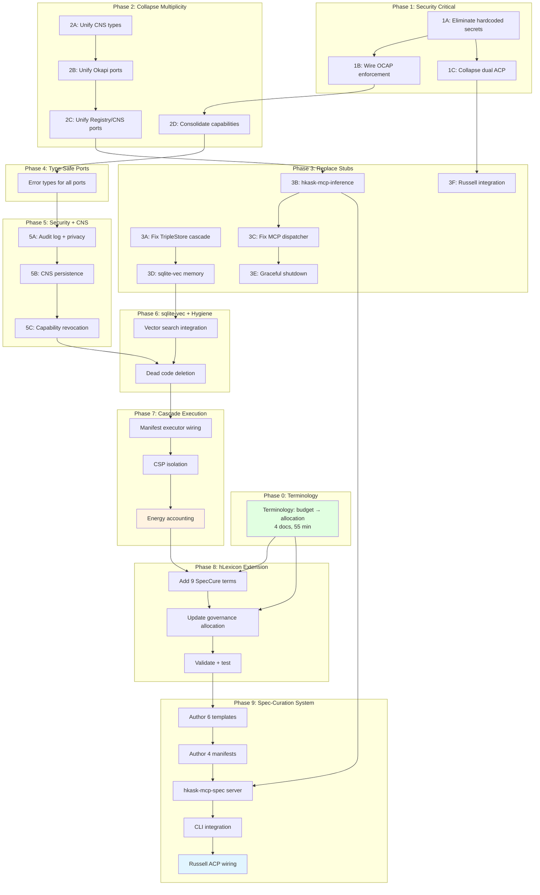

# Integrated Implementation Plan — hKask v0.22.0

## Executive Summary

This plan integrates three active plans into a single coherent execution sequence:

1. **Lexicon Terminology Change** — "budget" → "allocation" for hLexicon vocabulary (docs-only, 55 min)
2. **Adversarial Action Plan v2** — 96 tasks across 7 phases addressing security, type collapse, stubs, ports, CNS, sqlite-vec, cascade
3. **Spec-Curation Hypothesis** — 9 new hLexicon terms, 6 templates, 4 manifests, MCP server, CLI, Russell integration

**The integration problem:** These plans share dependencies. The terminology change must precede the hLexicon extension. The adversarial plan's cascade execution (Phase 7) is the substrate that spec-curation templates run on. The adversarial plan's MCP stub replacement (Phase 3) establishes the pattern that `hkask-mcp-spec` follows. Executing them independently would cause conflicts, rework, and inconsistent state.

**Resolution:** 9 integrated phases with explicit dependency ordering. The adversarial plan's security and structural work comes first. The terminology change is the first commit. Spec-curation builds on the hardened foundation.

**Total Tasks:** 117 · **Estimated Effort:** 220–280 hours

---

## 1. Dependency Graph



### Critical Path

```
Phase 0 → Phase 1 → Phase 2 → Phase 3 → Phase 4 → Phase 5 → Phase 6 → Phase 7 → Phase 8 → Phase 9
```

The critical path runs through all phases sequentially. Phase 0 (terminology) is the entry point. Phase 9 (spec-curation system) is the terminal node.

---

## 2. Phase 0: Terminology Change — "Budget" → "Allocation"

**Source:** `LEXICON_TERMINOLOGY_CHANGE.md`
**Tasks:** 4 required + 2 optional · **Effort:** 55 min · **Type:** Documentation only

**Why first:** The spec-curation hypothesis (Phase 8-9) extends hLexicon with 9 new terms and must use correct terminology from the start. The governance YAML gains an explicit `term_allocation` section that Phase 8 will update.

### Tasks

| # | Task | File | Type |
|---|------|------|------|
| **0.1** | Update hLexicon doc: "≤75 terms total" → "75 terms allocated across 3 domains" | `docs/architecture/hKask-hLexicon.md` | Modify |
| **0.2** | Update spec-curation hypothesis: "term budget" → "term allocation" (2 instances) | `docs/architecture/spec-curation-hypothesis.md` | Modify |
| **0.3** | Update principles doc: "~75 terms" → "75 terms allocated across 3 domains" | `docs/architecture/PRINCIPLES.md` | Modify |
| **0.4** | Add `term_allocation` section to governance YAML | `registry/registries/hlexicon-governance.yaml` | Modify |
| **0.5** | (Optional) Add hLexicon terminology note to Russell ecosystem doc | Russell: `docs/architecture/ecosystem-integration.md` | Modify |
| **0.6** | (Optional) Add hLexicon terminology note to Okapi strategy doc | Okapi: `fork-docs/STRATEGY.md` | Modify |

### Verification

```bash
# Must return 0 matches
grep -r "term.*budget\|vocabulary.*budget\|lexicon.*budget" docs/ registry/ --include="*.md" --include="*.yaml"

# Must return ≥4 matches
grep -r "term.*allocation\|vocabulary.*allocation" docs/ registry/ --include="*.md" --include="*.yaml"

# Consumable resource "budget" must be unchanged
grep -r "energy_budget\|token_budget\|iteration_budget" crates/ registry/ --include="*.rs" --include="*.yaml" | wc -l
```

### Acceptance

- [ ] Zero "budget" references in hLexicon vocabulary context
- [ ] ≥4 "allocation" references in hLexicon vocabulary context
- [ ] All consumable resource "budget" references unchanged
- [ ] `./scripts/validate-hlexicon-alignment.sh` passes
- [ ] `cargo test -p hkask-templates -- hlexicon_balance` passes

---

## 3. Phase 1: Security Critical — Secrets, OCAP & ACP (P0)

**Source:** `ADVERSARIAL_ACTION_PLAN-v2.md` §5
**Tasks:** 22 · **Type:** Code (security)

**Dependencies:** None (can start immediately after Phase 0)

### 1A. Eliminate Hardcoded Secrets (7 tasks)

| # | Task | Crates | Acceptance |
|---|------|--------|------------|
| **1.1** | Define `SecretRef` enum: `Env \| Keychain \| Generated` | `hkask-types` | Single secret reference type |
| **1.2** | Replace 7 hardcoded keys with `SecretRef::Env("HKASK_<PURPOSE>_KEY")` | All affected | `rg -i 'secret\|key' crates/ \| grep 'b"'` empty |
| **1.3** | Implement `hkask-keystore::resolve()` | `hkask-keystore` | Resolution test passes |
| **1.4** | Add `secrecy::Secret` wrapping | All affected | `cargo audit` clean |
| **1.5** | Add `Zeroize` derive to `KeyRing` | `hkask-keystore` | Memory scan post-drop shows zeros |
| **1.6** | Rewrite `hkask-mcp-keystore` to delegate to OS keychain | `hkask-mcp-keystore` | `keystore_get` returns no secret material |
| **1.7** | Remove `keystore_rotate` old-value return | `hkask-mcp-keystore` | Response schema audit |

### 1B. Wire OCAP Enforcement (7 tasks)

| # | Task | Crates | Acceptance |
|---|------|--------|------------|
| **1.8** | Implement `check_ocap()` with real HMAC verification | `hkask-templates` | Invalid signature rejected |
| **1.9** | Implement `attenuate_capability()` | `hkask-templates` | Attenuated token has subset scope |
| **1.10** | Replace wildcard `"*"` with explicit enumeration | `hkask-agents` | `rg '"\\*"' crates/hkask-agents/` empty |
| **1.11** | Add constant-time comparison for HMAC | `hkask-types` | Timing test passes |
| **1.12** | Wire `hkask-mcp-ocap` to real `CapabilityManager` | `hkask-mcp-ocap` | OCAP tool test passes |
| **1.13** | Change `parse_capability()` to return `Result` | `hkask-agents` | All callers handle error |
| **1.14** | Add `AcpError::MalformedCapability` variant | `hkask-agents` | Typed error exists |

### 1C. Collapse Dual ACP Systems (8 tasks)

| # | Task | Crates | Acceptance |
|---|------|--------|------------|
| **1.15** | Delete `AcpRuntimeAdapter` | `hkask-agents` | File deleted |
| **1.16** | Define `AcpTransport` trait | `hkask-agents` | Single transport trait |
| **1.17** | Implement `StdioTransport` adapter | `hkask-agents` | Stdio test passes |
| **1.18** | Implement `LoopbackHttpTransport` | `hkask-agents` | `192.168.x.x` rejected |
| **1.19** | Define `AcpPort` trait | `hkask-agents` | Single port trait |
| **1.20** | Implement `AcpPort` for `AcpRuntime` | `hkask-agents` | Port impl exists |
| **1.21** | Wire `PodManager` to `AcpRuntime` via port | `hkask-agents` | Pod registers via real ACP |
| **1.22** | Add Russell ACP registration endpoint | `hkask-api` | Russell can register |

---

## 4. Phase 2: Collapse Multiplicity — Types, Ports & Capabilities (P1)

**Source:** `ADVERSARIAL_ACTION_PLAN-v2.md` §6
**Tasks:** 26 · **Type:** Code (refactoring)

**Dependencies:** Phase 1 (OCAP enforcement must be real before capability consolidation)

### 2A. Unify CNS Type Hierarchies (9 tasks)

| # | Task | Crates | Acceptance |
|---|------|--------|------------|
| **2.1** | Move canonical `VarietyCounter` to `hkask-types` | `hkask-types` | `rg "struct VarietyCounter"` returns 1 |
| **2.2** | Delete local `VarietyCounter` in 3 crates | `hkask-cns`, `hkask-agents` | Single definition |
| **2.3** | Move canonical `AlgedonicAlert` to `hkask-types` | `hkask-types` | `rg "struct AlgedonicAlert"` returns 1 |
| **2.4** | Delete duplicate `AlgedonicAlert` | `hkask-cns` | Single definition |
| **2.5** | Move canonical `TokenBucket` to `hkask-types` | `hkask-types` | `rg "struct TokenBucket"` returns 1 |
| **2.6** | Delete 3 local `TokenBucket` definitions | `hkask-cns`, `hkask-agents` | Single definition |
| **2.7** | Consolidate `RetryConfig` (3x) | `hkask-types` | `rg "struct RetryConfig"` returns 1 |
| **2.8** | Consolidate `AuthorizationError` (2x) | `hkask-types` | Single definition |
| **2.9** | Fix `TemplateID` vs `TemplateId` | `hkask-types` | Naming consistent |

### 2B. Unify Okapi Ports (7 tasks)

| # | Task | Crates | Acceptance |
|---|------|--------|------------|
| **2.10** | Move `InferencePort` (async) to `hkask-types` | `hkask-types` | `rg "trait InferencePort"` returns 1 |
| **2.11** | Delete sync `InferencePort` from templates | `hkask-templates` | Sync variant gone |
| **2.12** | Create `ObservabilityPort` | `hkask-types` | `rg "trait ObservabilityPort"` returns 1 |
| **2.13** | Consolidate Okapi adapters | `hkask-templates`, `hkask-ensemble` | `rg "struct Okapi.*Client"` returns 1 |
| **2.14** | Implement `OkapiSseAdapter` | `hkask-templates` | SSE test passes |
| **2.15** | Implement `OkapiCapabilityFetcher` | `hkask-templates` | Capability fetch test |
| **2.16** | Delete duplicate `multi_okapi.rs` | `hkask-ensemble` | File count = 0 |

### 2C. Unify Registry & CNS Ports (4 tasks)

| # | Task | Crates | Acceptance |
|---|------|--------|------------|
| **2.17** | Create `UnifiedRegistryIndex` trait | `hkask-templates` | Single registry trait |
| **2.18** | Consolidate registry adapters behind port | `hkask-templates` | `rg "trait.*Registry"` returns 1 |
| **2.19** | Create `CnsEmitter` port | `hkask-cns` | Single CNS port |
| **2.20** | Collapse 4 CNS emit shapes | `hkask-cns`, `hkask-agents`, `hkask-templates` | `rg "trait.*Cns.*Port"` returns 1 |

### 2D. Consolidate Capability Systems (6 tasks)

| # | Task | Crates | Acceptance |
|---|------|--------|------------|
| **2.21** | Move `Macaroon` to `hkask-types` | `hkask-types` | `rg "struct Macaroon"` returns 1 |
| **2.22** | Delete `CapabilityToken` | `hkask-types` | `rg "struct CapabilityToken"` empty |
| **2.23** | Delete `GoalCapabilityToken` | `hkask-types` | `rg "struct GoalCapabilityToken"` empty |
| **2.24** | Add goal-specific caveat types | `hkask-types` | Goal caveat exists |
| **2.25** | Add short-lived token defaults | `hkask-agents` | Expiry test passes |
| **2.26** | Move `russell_mapper` out of templates crate | `hkask-templates`, `hkask-cli` | `rg "russell" crates/hkask-templates/` empty |

---

## 5. Phase 3: Replace Stubs with Truth (P0/P1)

**Source:** `ADVERSARIAL_ACTION_PLAN-v2.md` §7
**Tasks:** 22 · **Type:** Code (implementation)

**Dependencies:** Phase 2 (unified ports must exist before stubs can be replaced against them)

**Integration note:** Task 3.6 (`hkask-mcp-inference`) establishes the MCP server pattern that Phase 9's `hkask-mcp-spec` will follow. The 3-file convention (main.rs, lib.rs, tools.rs) must be consistent.

### 3A. Fix TripleStore → Memory Cascade (5 tasks)

| # | Task | Crates | Acceptance |
|---|------|--------|------------|
| **3.1** | Implement `TripleStore::query_by_entity()` | `hkask-storage` | Insert 3 → query → assert 3 |
| **3.2** | Add full CRUD to TripleStore | `hkask-storage` | CRUD test suite passes |
| **3.3** | Wire `EpisodicMemory::recall()` | `hkask-memory` | Agent recalls prior interaction |
| **3.4** | Wire `SemanticMemory::consolidate()` | `hkask-memory` | Consolidation test passes |
| **3.5** | Wire `MemoryStorageAdapter::recall()` | `hkask-agents` | Adapter test passes |

### 3B. Implement hkask-mcp-inference (4 tasks)

| # | Task | Crates | Acceptance |
|---|------|--------|------------|
| **3.6** | Replace stub with real `rmcp` server — 3 tools | `hkask-mcp-inference` | Server starts, tools callable |
| **3.7** | Wire `MetricsTranslator` into MCP server | `hkask-mcp-inference` | Metrics tool callable |
| **3.8** | Add multi-Okapi failover | `hkask-mcp-inference` | Failover test passes |
| **3.9** | Add rate limiting per WebID | `hkask-mcp-inference` | Rate limit test passes |

### 3C. Fix MCP Dispatcher (2 tasks)

| # | Task | Crates | Acceptance |
|---|------|--------|------------|
| **3.10** | Implement `McpDispatcher::invoke_async` | `hkask-mcp` | `rg "Tool.*invoked"` empty |
| **3.11** | Remove sync stub returning `vec![]` | `hkask-mcp` | No empty vec returns |

### 3D. sqlite-vec Memory Search (2 tasks)

| # | Task | Crates | Acceptance |
|---|------|--------|------------|
| **3.12** | Implement `MemoryStorageAdapter::search` against sqlite-vec | `hkask-agents`, `hkask-storage` | Recall ≥0.9 @ 1k vectors |
| **3.13** | Add HNSW index configuration | `hkask-storage` | Benchmark <100ms @ 10k vectors |

### 3E. Graceful Shutdown & Tool Discovery (3 tasks)

| # | Task | Crates | Acceptance |
|---|------|--------|------------|
| **3.14** | Replace infinite loop with `tokio::select!` + `CancellationToken` | `hkask-mcp-inference` | Shutdown test passes |
| **3.15** | All background tasks return `JoinHandle` + `CancellationToken` | `hkask-mcp-inference`, `hkask-cns` | No orphans on SIGTERM |
| **3.16** | Implement `discover_tools()` async in `McpPort` | `hkask-mcp` | Returns actual tools |

### 3F. Russell Integration (6 tasks)

| # | Task | Crates | Acceptance |
|---|------|--------|------------|
| **3.17** | Replace handler placeholder with SOAP inference call | Russell | Non-placeholder response |
| **3.18** | Pass session context as SOAP Subjective field | Russell | Session context preserved |
| **3.19** | Add session persistence to SQLite | Russell | Session survives restart |
| **3.20** | Wire `RussellPod::register()` with real macaroon | Russell | Non-stub token |
| **3.21** | Delete `start_acp_server()` no-op | Russell | No-op deleted |
| **3.22** | Add health check: Russell pod pings hKask `/health` | Russell | Health check test |

---

## 6. Phase 4: Type-Safe Ports & Error Handling (P1)

**Source:** `ADVERSARIAL_ACTION_PLAN-v2.md` §8
**Tasks:** 12 · **Type:** Code (type safety)

**Dependencies:** Phase 2 (unified ports), Phase 3 (stubs replaced)

**Integration note:** The error types defined here (`InferenceError`, `McpError`) are used by Phase 9's `hkask-mcp-spec` server. The spec-curation tools must return typed errors, not `Result<T, String>`.

| # | Task | Crates | Acceptance |
|---|------|--------|------------|
| **4.1** | Define `AcpError` | `hkask-agents` | Error type exists |
| **4.2** | Define `McpError` | `hkask-mcp` | Error type exists |
| **4.3** | Define `GitError` | `hkask-mcp-git` | Error type exists |
| **4.4** | Define `MemoryError` | `hkask-agents` | Error type exists |
| **4.5** | Define `InferenceError` | `hkask-types` | Error type exists |
| **4.6** | Define `ObservabilityError` | `hkask-types` | Error type exists |
| **4.7** | Update `ACPRuntimePort` → `Result<T, AcpError>` | `hkask-agents` | Port signature updated |
| **4.8** | Update `MCPRuntimePort` → `Result<T, McpError>` | `hkask-mcp` | Port signature updated |
| **4.9** | Update `GitCASPort` → `Result<T, GitError>` | `hkask-mcp-git` | Port signature updated |
| **4.10** | Update `MemoryStoragePort` → `Result<T, MemoryError>` | `hkask-agents` | Port signature updated |
| **4.11** | Update `InferencePort` → `Result<T, InferenceError>` | `hkask-types` | Port signature updated |
| **4.12** | Add `From<AcpError> for anyhow::Error` | `hkask-agents` | Trait impl exists |

---

## 7. Phase 5: Security Hardening, Privacy & CNS Persistence (P1/P2)

**Source:** `ADVERSARIAL_ACTION_PLAN-v2.md` §9
**Tasks:** 17 · **Type:** Code (security + observability)

**Dependencies:** Phase 4 (typed errors for audit log)

### 5A. Audit Log & Privacy (10 tasks)

| # | Task | Crates | Acceptance |
|---|------|--------|------------|
| **5.1** | Replace in-memory audit log with SQLCipher table | `hkask-agents`, `hkask-storage` | Rows persist after restart |
| **5.2** | Make `AuditLogPort` async | `hkask-agents` | `rg 'block_in_place' crates/` empty |
| **5.3** | Drop oldest entries via SQL `LIMIT` retention | `hkask-storage` | Retention test passes |
| **5.4** | Flag replicant episodic rows `private = 1` | `hkask-storage` | Privacy test passes |
| **5.5** | Implement `WebID::redacted_display()` | `hkask-types` | Redaction test passes |
| **5.6** | Redact WebID at `INFO` and below | All crates | Log scan: no full UUIDs |
| **5.7** | Full WebIDs only at `TRACE` with env var | All crates | Env var test passes |
| **5.8** | Replicant events bypass `tracing`, go direct to SQLCipher | `hkask-agents` | Trace test confirms |
| **5.9** | Implement `KeystorePort::get_database_key()` | `hkask-keystore` | Key loaded from keychain |
| **5.10** | Update `hkask-storage` to use keystore | `hkask-storage` | `HKASK_DB_KEY` unused |

### 5B. CNS Persistence (6 tasks)

| # | Task | Crates | Acceptance |
|---|------|--------|------------|
| **5.11** | Create `NuEventStore` | `hkask-storage` | Event persists after restart |
| **5.12** | Wire `SpanEmitter` to persist events | `hkask-cns` | Event in DB after emit |
| **5.13** | Add `cns_variety_checkpoint` table | `hkask-storage` | Counters survive restart |
| **5.14** | Add `cns_alerts` table | `hkask-storage` | Alert history queryable |
| **5.15** | Implement `NuEventStore::prune_older_than()` | `hkask-storage` | Retention test passes |
| **5.16** | Add `HKASK_CNS_RETENTION_DAYS` configuration | `hkask-config` | Env var respected |

### 5C. Capability Revocation (1 task)

| # | Task | Crates | Acceptance |
|---|------|--------|------------|
| **5.17** | Implement per-call revocation check | `hkask-agents` | Revocation test passes |

---

## 8. Phase 6: sqlite-vec Integration & Hygiene (P2)

**Source:** `ADVERSARIAL_ACTION_PLAN-v2.md` §10
**Tasks:** 10 · **Type:** Code (feature + cleanup)

**Dependencies:** Phase 5 (CNS persistence for event store patterns)

| # | Task | Crates | Acceptance |
|---|------|--------|------------|
| **6.1** | Load `sqlite-vec` extension | `hkask-storage` | Extension loads |
| **6.2** | Create `vec_embeddings` virtual table | `hkask-storage` | Table created |
| **6.3** | Implement dual-write in `EmbeddingStore::insert()` | `hkask-storage` | Dual-write test |
| **6.4** | Implement `EmbeddingStore::knn_search()` | `hkask-storage` | KNN recall ≥0.9 |
| **6.5** | Add `HKASK_EMBEDDING_DIM` configuration | `hkask-config` | Env var respected |
| **6.6** | Delete 4 orphaned files | `hkask-storage`, `hkask-mcp`, `hkask-agents` | Files deleted |
| **6.7** | Wire or delete 20 `#[allow(dead_code)]` | All crates | `rg "allow\\(dead_code\\)"` empty |
| **6.8** | Delete `ModelRegistryStore` | `hkask-templates` | File deleted |
| **6.9** | Delete `ArchivalService` fake UUID returns | `hkask-agents` | Fake returns gone |
| **6.10** | Delete 4 empty stub MCP servers | `mcp-servers/` | Servers deleted |

---

## 9. Phase 7: Cascade Execution Model (P2)

**Source:** `ADVERSARIAL_ACTION_PLAN-v2.md` §11
**Tasks:** 8 · **Type:** Code (core feature)

**Dependencies:** Phase 6 (clean codebase, sqlite-vec for graph storage)

**Integration note:** This phase wires the manifest executor that Phase 9's spec-curation manifests will run on. The `ManifestExecutor::Populate` and `ManifestExecutor::Execute` implementations are the substrate for `spec-compose.yaml`, `spec-elicit.yaml`, etc.

| # | Task | Crates | Acceptance |
|---|------|--------|------------|
| **7.1** | Wire `CascadeEngine::execute_stage()` to `ManifestExecutor` | `hkask-templates` | Stage execution test |
| **7.2** | Wire `CspExecutor::run_stage()` to named operations | `hkask-templates` | Stage dispatch test |
| **7.3** | Implement `ManifestExecutor::Populate` — Jinja2 render with bindings | `hkask-templates` | Populate test passes |
| **7.4** | Implement `ManifestExecutor::Execute` — dispatch to inference or MCP | `hkask-templates` | Execute test passes |
| **7.5** | Add error classification for CSP retry | `hkask-templates` | Error classification test |
| **7.6** | Implement condition evaluation for cascade stages | `hkask-templates` | Condition test passes |
| **7.7** | Add energy accounting — `CascadeContext::consume_energy()` | `hkask-templates` | Energy budget enforced |
| **7.8** | End-to-end cascade integration test | `hkask-testing` | E2E test passes |

---

## 10. Phase 8: hLexicon Extension — SpecCure Terms (P1)

**Source:** `spec-curation-hypothesis.md` §5
**Tasks:** 5 · **Type:** Code + documentation

**Dependencies:** Phase 0 (terminology), Phase 7 (cascade execution substrate for spec-curation templates)

**Why after Phase 7:** The new terms must be validated against a working cascade executor. Spec-curation templates (Phase 9) declare these terms and need the manifest executor to interpret them.

### 8.1 Add 9 Terms to `lexicon.rs`

Add to `HLexicon::bootstrap()`:

```rust
// WordAct — Speech Acts of Specification
("specify", Domain::WordAct, "Define a binding constraint or intent"),
("require", Domain::WordAct, "State a non-negotiable condition"),
("constrain", Domain::WordAct, "Limit the solution space"),

// FlowDef — Process of Composition
("curate", Domain::FlowDef, "Select, contextualise, and integrate artifacts"),
("elicit", Domain::FlowDef, "Draw out latent goals or requirements"),
("reconcile", Domain::FlowDef, "Resolve conflicts between goals or requirements"),

// KnowAct — Cognitive Acts of Curation
("contextualise", Domain::KnowAct, "Situate an artifact within its meaningful environment"),
("cultivate", Domain::KnowAct, "Nurture growth and coherence over time"),
```

**Note:** `reconcile` is proposed as FlowDef (composition process), not KnowAct. The spec-curation hypothesis originally placed it in FlowDef. This is correct — reconciliation is a process, not a judgment.

**8 terms** (not 9 — the hypothesis counted `compose` which already exists in FlowDef). Total vocabulary: 80 + 8 = **88 terms**.

### 8.2 Update Governance Allocation

Update `registry/registries/hlexicon-governance.yaml` `term_allocation` section (added in Phase 0):

```yaml
  term_allocation:
    total_allocation: 90  # Expanded from 75 for spec-curation capability
    distribution:
      wordact: 28   # +3 (specify, require, constrain)
      flowdef: 34   # +2 (curate, elicit, reconcile) — note: reconcile is FlowDef
      knowact: 25   # +2 (contextualise, cultivate)
    current_usage: 88
    expansion_justification: |
      Spec-curation is a first-class capability requiring its own vocabulary.
      The goals=requirements identity (user sovereignty) and curation-as-management
      (polycentric governance) both require terms that cannot be expressed through
      existing vocabulary without semantic loss. This expansion is analogous to
      the git evolution terms that were deemed essential despite exceeding the
      original allocation.
```

### 8.3 Update Documentation

| # | Task | File |
|---|------|------|
| **8.3** | Add 8 new terms to hLexicon doc with definitions and examples | `docs/architecture/hKask-hLexicon.md` |
| **8.4** | Update spec-curation hypothesis to reflect 88 terms (not 89) | `docs/architecture/spec-curation-hypothesis.md` |

### 8.5 Validate

```bash
# Validation script
./scripts/validate-hlexicon-alignment.sh

# Balance test
cargo test -p hkask-templates -- hlexicon_balance

# Term count
cargo test -p hkask-types -- hlexicon_term_count

# New terms recognized by contract validator
cargo test -p hkask-templates -- contract_validator
```

### Acceptance

- [ ] 8 new terms in `lexicon.rs` bootstrap
- [ ] `hKask-hLexicon.md` documents all 88 terms
- [ ] Governance YAML reflects expanded allocation with justification
- [ ] Validation script passes
- [ ] Balance test passes (no domain > 60%)
- [ ] Contract validator recognizes all new terms

---

## 11. Phase 9: Spec-Curation System (P1)

**Source:** `spec-curation-hypothesis.md` §6
**Tasks:** 21 · **Type:** Code + templates + manifests

**Dependencies:** Phase 7 (cascade execution), Phase 8 (hLexicon terms)

### 9A. Author Templates (6 tasks)

| # | Task | File | hLexicon Terms |
|---|------|------|----------------|
| **9.1** | Author `goal-capture.j2` — capture user goal as binding requirement | `registry/templates/spec/goal-capture.j2` | `specify`, `require`, `elicit` |
| **9.2** | Author `requirement-bind.j2` — bind constraint to goal | `registry/templates/spec/requirement-bind.j2` | `constrain`, `require` |
| **9.3** | Author `contextualise.j2` — situate artifact in environment | `registry/templates/spec/contextualise.j2` | `contextualise` |
| **9.4** | Author `reconcile-conflicts.j2` — resolve goal conflicts | `registry/templates/spec/reconcile-conflicts.j2` | `reconcile` |
| **9.5** | Author `curate-collection.j2` — evaluate collection coherence | `registry/templates/spec/curate-collection.j2` | `curate`, `cultivate` |
| **9.6** | Author `spec/selector.j2` — select spec-curation template | `registry/templates/spec/selector.j2` | `recognize`, `match` |

Each template must:
- Declare `functional_role` header comment
- Declare `lexicon_terms` in `[inference]` section
- Follow the contract pattern (input/output schema)
- Pass `ContractValidator::validate()`

### 9B. Author Manifests (4 tasks)

| # | Task | File | Purpose |
|---|------|------|---------|
| **9.7** | Author `spec-compose.yaml` | `registry/manifests/spec-compose.yaml` | Goal → spec pipeline (select → populate → execute) |
| **9.8** | Author `spec-elicit.yaml` | `registry/manifests/spec-elicit.yaml` | Participatory goal elicitation flow |
| **9.9** | Author `spec-reconcile.yaml` | `registry/manifests/spec-reconcile.yaml` | Conflict resolution pipeline |
| **9.10** | Author `spec-curate.yaml` | `registry/manifests/spec-curate.yaml` | Collection curation evaluation |

Each manifest must:
- Declare `functional_role: flowdef`
- Define pre/core/post cascade stages
- Reference templates by ID
- Include energy allocation (not budget)
- Pass manifest executor validation

### 9C. Implement `hkask-mcp-spec` Server (6 tasks)

| # | Task | Crates | Acceptance |
|---|------|--------|------------|
| **9.11** | Create `crates/hkask-mcp-spec/Cargo.toml` | `hkask-mcp-spec` | Crate compiles |
| **9.12** | Implement `main.rs` — `run_stdio_server` entry point | `hkask-mcp-spec` | Server starts |
| **9.13** | Implement `lib.rs` — `McpToolServer` trait impl | `hkask-mcp-spec` | Server info returns |
| **9.14** | Implement `tools.rs` — 8 tool definitions + dispatch + handlers | `hkask-mcp-spec` | All 8 tools callable |
| **9.15** | Register server in `hkask-mcp/src/servers.rs` | `hkask-mcp` | Server discovered |
| **9.16** | Add `SpecCurationError` type following Phase 4 pattern | `hkask-mcp-spec` | Typed errors, no `Result<T, String>` |

**Tool surface:**

| Tool | Input | Output | hLexicon Terms |
|------|-------|--------|----------------|
| `spec/goal/capture` | `{description, context, user_id}` | `{goal_id, requirements[], graph_position}` | `specify`, `require`, `elicit` |
| `spec/goal/decompose` | `{goal_id}` | `{sub_goals[], dependencies[]}` | `decompose`, `sequence` |
| `spec/require/bind` | `{goal_id, constraint}` | `{requirement_id, ocap_boundaries}` | `constrain`, `require` |
| `spec/curate/evaluate` | `{artifact_id, collection_id}` | `{decision, rationale}` | `curate`, `evaluate`, `contextualise` |
| `spec/curate/reconcile` | `{artifact_ids[], conflicts[]}` | `{resolution, tensions_preserved[]}` | `reconcile`, `compose` |
| `spec/curate/cultivate` | `{collection_id, time_horizon}` | `{growth_plan, coherence_score}` | `cultivate`, `monitor` |
| `spec/graph/query` | `{query, depth}` | `{nodes[], edges[], paths[]}` | `recognize`, `match` |
| `spec/graph/validate` | `{collection_id}` | `{violations[], suggestions[]}` | `evaluate`, `ground` |

### 9D. CLI Integration (2 tasks)

| # | Task | Crates | Acceptance |
|---|------|--------|------------|
| **9.17** | Add `SpecAction` subcommands to `hkask-cli/src/commands.rs` | `hkask-cli` | `kask spec --help` shows subcommands |
| **9.18** | Implement subcommand handlers delegating to MCP tools | `hkask-cli` | `kask spec goal capture "..."` works |

**CLI surface:**

```bash
kask spec goal capture "Build a privacy-preserving search"
kask spec goal decompose <goal_id>
kask spec require bind <goal_id> --constraint "data never leaves device"
kask spec curate evaluate <artifact_id> --collection <collection_id>
kask spec curate reconcile <artifact_ids...>
kask spec curate cultivate <collection_id> --horizon "6 months"
kask spec graph query "what goals depend on sovereignty?"
kask spec graph validate <collection_id>
```

### 9E. Russell ACP Integration (3 tasks)

| # | Task | Repository | Acceptance |
|---|------|-----------|------------|
| **9.19** | Add spec-curation MCP tools to Russell ACP agent config | hKask: `config/agents/russell-acp-agent.yaml` | Tools listed in agent config |
| **9.20** | Add `spec-curation` skill manifest to Russell | Russell: `skills/spec-curation/` | Skill discoverable |
| **9.21** | End-to-end test: Russell → hKask → spec-curation → Okapi | Both | Goal captured, requirement bound, OCAP enforced |

---

## 12. Phase Summary

| Phase | Source | Tasks | Type | Priority | Dependencies |
|-------|--------|-------|------|----------|--------------|
| **0** | Terminology Change | 6 | Docs | P0 | None |
| **1** | Adversarial §5 | 22 | Security | P0 | Phase 0 |
| **2** | Adversarial §6 | 26 | Refactoring | P1 | Phase 1 |
| **3** | Adversarial §7 | 22 | Implementation | P0/P1 | Phase 2 |
| **4** | Adversarial §8 | 12 | Type safety | P1 | Phase 2, 3 |
| **5** | Adversarial §9 | 17 | Security + CNS | P1/P2 | Phase 4 |
| **6** | Adversarial §10 | 10 | Feature + cleanup | P2 | Phase 5 |
| **7** | Adversarial §11 | 8 | Core feature | P2 | Phase 6 |
| **8** | Spec-Curation §5 | 5 | hLexicon | P1 | Phase 0, 7 |
| **9** | Spec-Curation §6 | 21 | Full system | P1 | Phase 7, 8 |
| **Total** | | **149** | | | |

### Priority Execution Order

| Priority | Phases | Rationale |
|----------|--------|-----------|
| **P0 — Now** | 0, 1, 3A, 3C | Terminology, security, memory cascade, dispatcher |
| **P1 — This Sprint** | 2, 3B, 3D-3F, 4, 5, 8 | Multiplicity collapse, inference MCP, port safety, privacy, hLexicon |
| **P2 — Next Sprint** | 6, 7, 9 | sqlite-vec, cascade execution, spec-curation system |

---

## 13. Cross-Plan Conflict Resolution

### 13.1 Terminology Consistency

**Conflict:** The adversarial plan uses "budget" throughout (LOC budget, energy budget). The terminology change restricts "budget" to consumable resources only.

**Resolution:** The adversarial plan's "LOC budget" references are deprecated (LOC budget has been removed). Its "energy budget" and "token budget" references are correct — these are consumable resources. No changes needed to the adversarial plan's code tasks; only documentation references to "LOC budget" should be updated to remove the constraint.

### 13.2 MCP Server Pattern Consistency

**Conflict:** The adversarial plan (Task 3.6) implements `hkask-mcp-inference` as a real MCP server. The spec-curation plan (Phase 9) implements `hkask-mcp-spec` as a new MCP server. Both must follow the same pattern.

**Resolution:** Task 3.6 establishes the canonical 3-file pattern (main.rs, lib.rs, tools.rs). Phase 9's `hkask-mcp-spec` follows the identical pattern. The `McpToolServer` trait from Phase 2's port unification is the shared interface.

### 13.3 Port Trait Dependencies

**Conflict:** Phase 9's `hkask-mcp-spec` needs `InferencePort` (to invoke templates via Okapi) and `McpPort` (to discover and invoke other MCP tools). These ports are unified in Phase 2 and made type-safe in Phase 4.

**Resolution:** Phase 9 cannot begin until Phase 4 is complete. The spec-curation server's handlers use `Result<T, InferenceError>` and `Result<T, McpError>` — not `Result<T, String>`.

### 13.4 Cascade Execution Substrate

**Conflict:** Spec-curation manifests (`spec-compose.yaml`, etc.) require a working `ManifestExecutor` with `Populate` and `Execute` stages. This is wired in Phase 7.

**Resolution:** Phase 9 templates and manifests can be *authored* in parallel with Phase 7, but cannot be *tested* until Phase 7 is complete. The integrated plan sequences Phase 8 (hLexicon terms) and Phase 9 (full system) after Phase 7.

### 13.5 hLexicon Term Count

**Conflict:** The spec-curation hypothesis proposed 9 new terms (total 89). Analysis shows only 8 are needed (`compose` already exists). The governance allocation must be updated to reflect 88, not 89.

**Resolution:** Phase 8 adds 8 terms. Governance allocation expanded to 90 (with 2 reserved slots). The hypothesis document is updated in Task 8.4 to reflect the corrected count.

### 13.6 Russell Integration Ordering

**Conflict:** The adversarial plan (Task 3.17-3.22) integrates Russell with hKask's ACP system. The spec-curation plan (Task 9.19-9.21) adds spec-curation tools to Russell's ACP config. Both modify Russell-facing interfaces.

**Resolution:** Phase 3F establishes the Russell ACP transport and registration. Phase 9E adds spec-curation tools to the already-working ACP connection. The two phases are separated by 5 intermediate phases, ensuring the ACP surface is stable before spec-curation tools are exposed.

---

## 14. Verification Commands

```bash
# === Phase 0: Terminology ===
grep -r "term.*budget\|vocabulary.*budget" docs/ registry/ --include="*.md" --include="*.yaml"
# Expected: 0 matches

# === Phase 1: Security ===
rg '"acp-default-secret-key"|"acp-runtime-secret"|"temp-secret"' crates/
# Expected: empty
rg 'b".*secret' crates/
# Expected: empty
rg '"\\*"' crates/hkask-agents/
# Expected: empty

# === Phase 2: Type Unification ===
rg "struct VarietyCounter" crates/   # Expected: 1
rg "struct AlgedonicAlert" crates/   # Expected: 1
rg "struct TokenBucket" crates/      # Expected: 1
rg "struct Macaroon" crates/         # Expected: 1
rg "struct CapabilityToken" crates/  # Expected: empty
rg "struct GoalCapabilityToken" crates/ # Expected: empty

# === Phase 3: Stub Replacement ===
rg "Tool.*invoked" crates/           # Expected: empty
rg "STUB\|stub\|TODO\|todo!" crates/hkask-mcp-inference/
# Expected: empty

# === Phase 4: Port Safety ===
rg "Result<.*String>" crates/ --type rust | grep -v test
# Expected: empty (no port traits return String)

# === Phase 5: CNS Persistence ===
rg "NuEventStore" crates/            # Expected: ≥1
rg "cns_variety_checkpoint" crates/  # Expected: ≥1

# === Phase 6: sqlite-vec ===
rg "vec0" crates/hkask-storage/      # Expected: ≥1
rg "knn_search" crates/              # Expected: ≥1
rg "allow\\(dead_code\\)" crates/    # Expected: empty

# === Phase 7: Cascade ===
cargo test --workspace -- cascade    # Expected: all pass

# === Phase 8: hLexicon ===
./scripts/validate-hlexicon-alignment.sh
cargo test -p hkask-templates -- hlexicon_balance
cargo test -p hkask-types -- hlexicon_term_count

# === Phase 9: Spec-Curation ===
kask spec goal capture "test goal"   # Expected: goal_id returned
kask spec graph validate test-collection  # Expected: validation result
cargo test -p hkask-mcp-spec         # Expected: all pass

# === Full Build ===
cargo check --workspace
cargo clippy --workspace -- -D warnings
cargo fmt --check
cargo test --workspace
```

---

## 15. Deferred Questions

| # | Question | Trigger | Source |
|---|----------|---------|--------|
| **D1** | Macaroon discharge protocol | Multi-machine or third-party delegation | Adversarial |
| **D2** | Quantum-readiness of HMAC capabilities | NIST PQC standardization | Adversarial |
| **D3** | MCP server sandboxing | MCP servers execute untrusted tool code | Adversarial |
| **D4** | Russell conformance test cadence | Russell-hKask integration stabilizes | Adversarial |
| **D5** | Curator persona persistence | Curator gains long-term memory | Adversarial |
| **D6** | Algedonic alert delivery channel | CNS alerts need human-visible delivery | Adversarial |
| **D7** | Okapi model selection bootstrap | Cascade engine needs cold-start strategy | Adversarial |
| **D8** | Russell skill provenance after import | Russell skills evolve independently | Adversarial |
| **D9** | Spec-curation graph storage backend | Graph exceeds in-memory capacity | Spec-Curation |
| **D10** | User-facing spec-curation UI | CLI insufficient for non-technical users | Spec-Curation |

---

## 16. Risk Register

| Risk | Impact | Likelihood | Mitigation |
|------|--------|------------|------------|
| Phase 1 security work reveals additional hardcoded secrets | High | Medium | Expand task list; do not defer |
| Phase 2 type unification breaks Russell mapper | Medium | High | Task 2.26 moves mapper before unification; test Russell import |
| Phase 7 cascade wiring reveals manifest format gaps | High | Medium | Author spec-curation manifests (9B) in parallel to surface gaps early |
| Phase 8 hLexicon expansion rejected by governance review | Medium | Low | Expansion justification documented; precedent exists (git terms) |
| Phase 9 spec-curation tools produce low-quality output | Medium | High | Iterate on template prompts; use `CurationDecision::Revise` for refinement |
| Terminology change causes confusion | Low | Low | Clear documentation; glossary entry; linting rule |

---

*ℏKask Integrated Implementation Plan v0.22.0 — 2026-05-23*
*149 tasks across 10 phases. Three source plans, one execution sequence.*
*Terminology first. Security second. Spec-curation last.*
