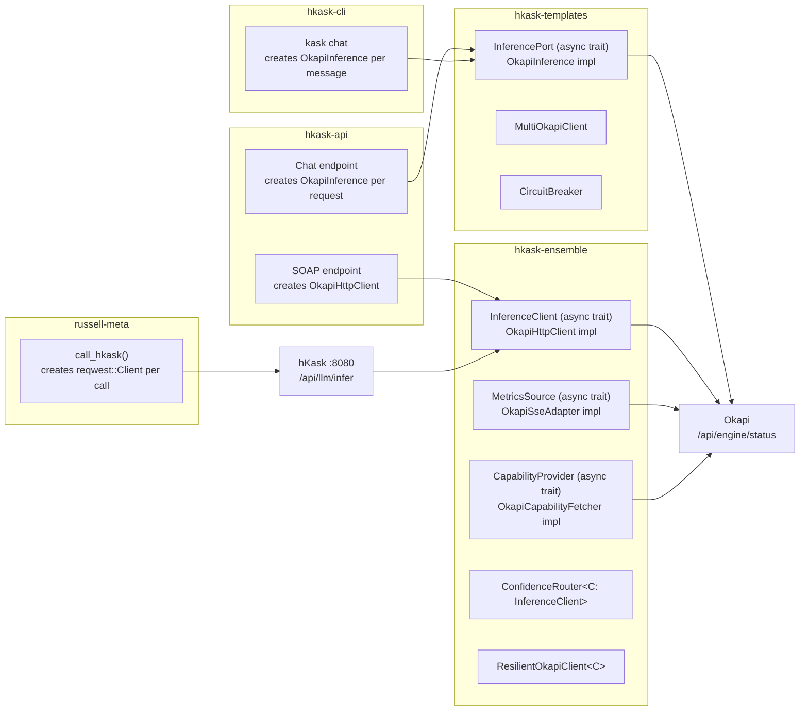
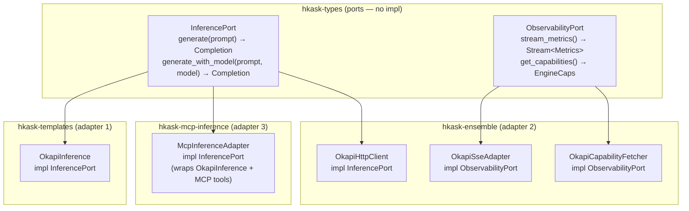
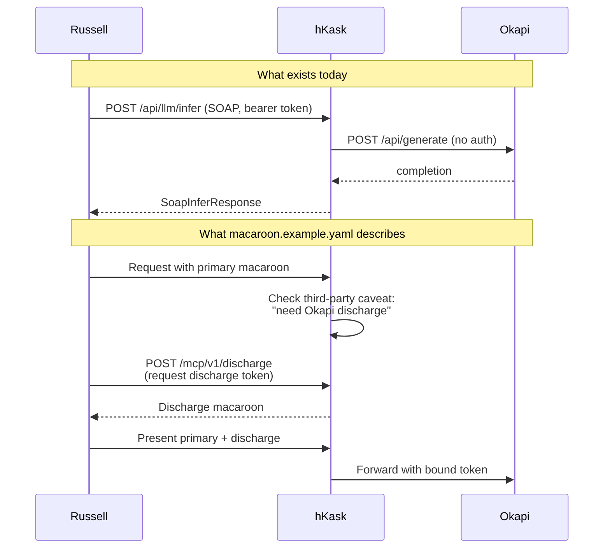
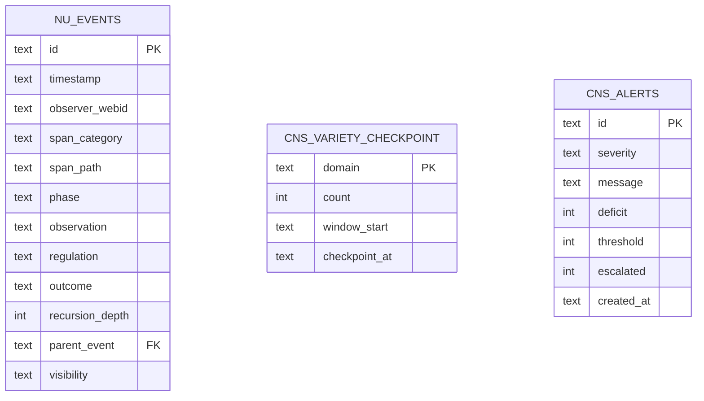
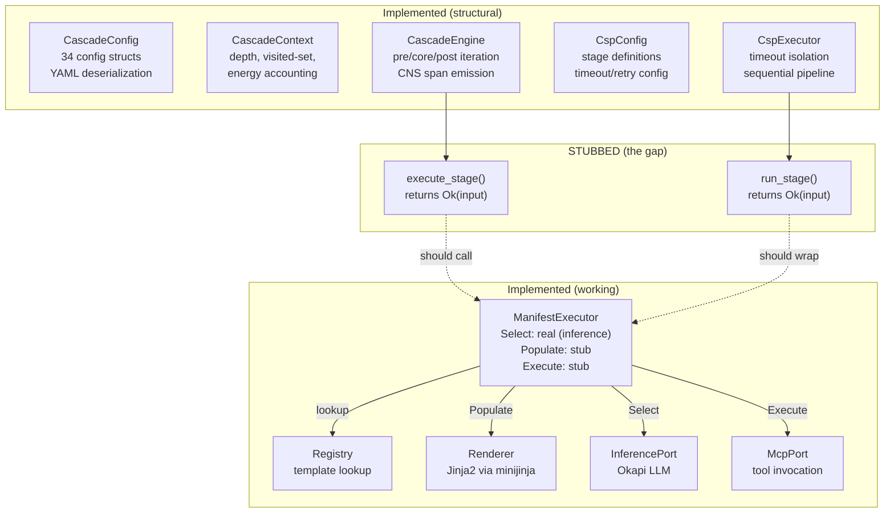
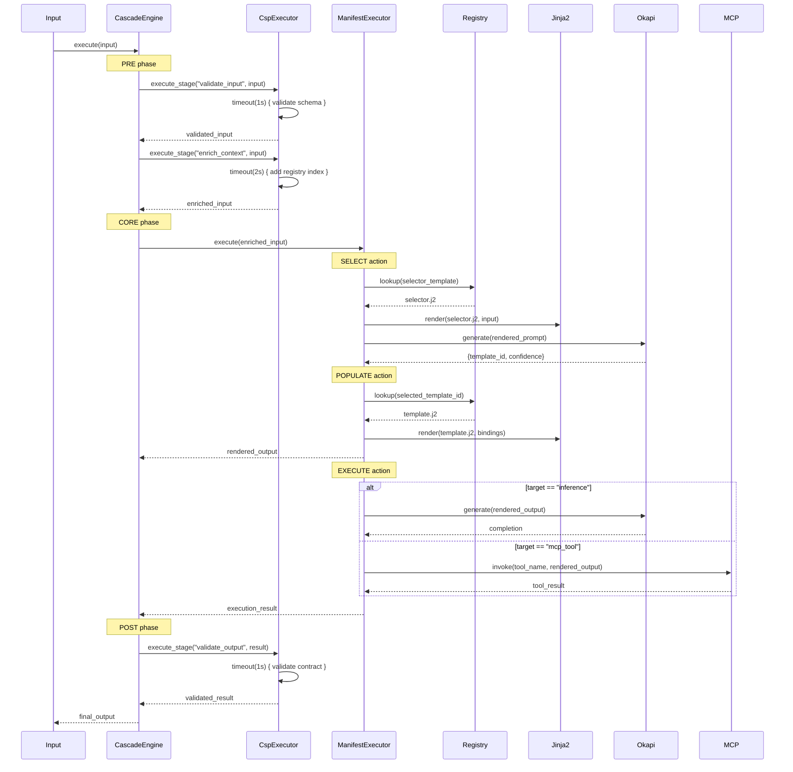
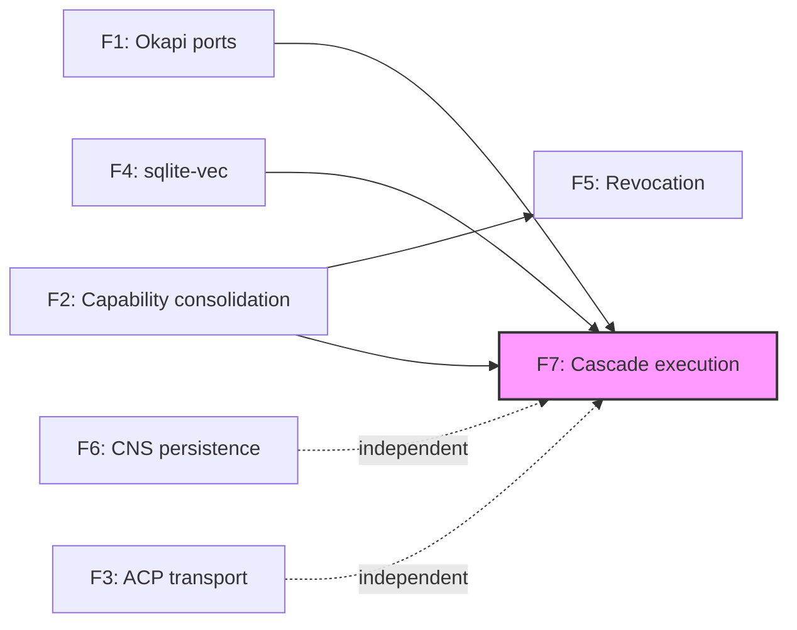

# Open Questions Resolved — F1 through F7

**Parent document:** [`ADVERSARIAL_REVIEW_ACTION_PLAN.md`](ADVERSARIAL_REVIEW_ACTION_PLAN.md) §6

---

## F1: Okapi as First-Class Hexagonal Port

### Current State (Inventory)

Okapi is accessed through **7 distinct HTTP client instances** across 4 crates:



**Three trait families exist:**

| Trait | Crate | Methods | Consumers |
|-------|-------|---------|-----------|
| `InferencePort` (async) | hkask-templates | `generate()`, `generate_with_model()`, `generate_n()` | ManifestExecutor, CuratorPipeline |
| `InferencePort` (sync) | hkask-templates/ports.rs | `call(model_tier, prompt, config)` | ManifestExecutorImpl |
| `InferenceClient` | hkask-ensemble | `generate()`, `chat()` | ConfidenceRouter, ResilientOkapiClient |
| `MetricsSource` | hkask-ensemble | `stream_metrics()` | MetricsTranslator |
| `CapabilityProvider` | hkask-ensemble | `get_capabilities()` | CapabilityRouter |

### Decision: **Yes — Unify, but as two ports, not one.**

**Rationale (Cockburn + Fowler):** Okapi serves two fundamentally different roles that should not be collapsed:

1. **Inference** — generate text from prompts (the LLM)
2. **Observability** — stream metrics, discover capabilities (the infrastructure)

Collapsing these into one port violates the Interface Segregation Principle. A template renderer should not see metrics methods; a health checker should not see generate methods.

### Resolution Architecture



### Implementation Steps

1. **Move `InferencePort` (async) to `hkask-types/src/ports.rs`** — the canonical port definition. No implementation, just the trait.

2. **Delete the sync `InferencePort`** from `hkask-templates/src/ports.rs` — replace with `async fn` on the async trait. The sync variant exists only because `ManifestExecutorImpl` was written before async was adopted.

3. **Create `ObservabilityPort` in `hkask-types/src/ports.rs`:**
   ```rust
   #[async_trait]
   pub trait ObservabilityPort: Send + Sync {
       async fn stream_metrics(&self) -> Result<impl Stream<Item = MetricsSnapshot>, ObsError>;
       async fn get_capabilities(&self) -> Result<EngineCapabilities, ObsError>;
       async fn health_check(&self) -> Result<HealthStatus, ObsError>;
   }
   ```

4. **Re-export from consuming crates:** `hkask-templates` and `hkask-ensemble` both `pub use hkask_types::ports::InferencePort;` — no local trait definitions.

5. **Unify request/response types:** Move `OkapiRequest`, `OkapiResponse`, `Completion`, `MetricsSnapshot` to `hkask-types`. Both adapters implement against the same types.

6. **Share the resilience layer:** Move `CircuitBreaker`, `RetryConfig`, `ResilientClient<C>` to `hkask-types/src/resilience.rs`. Both `OkapiInference` and `OkapiHttpClient` wrap with the same `ResilientClient<C: InferencePort>`.

7. **Fix per-request client creation:** `hkask-api` chat endpoint and `hkask-cli` both create a new `OkapiInference` per request/message. Replace with `Arc<dyn InferencePort>` injected at startup.

### RDF Decomposition

```
hkask:InferencePort     a            hex:Port ;
                        hex:hasAdapter hkask:OkapiInference , hkask:OkapiHttpClient , hkask:McpInferenceAdapter .

hkask:ObservabilityPort a            hex:Port ;
                        hex:hasAdapter hkask:OkapiSseAdapter , hkask:OkapiCapabilityFetcher .

hkask:OkapiInference    hex:connectsTo okapi:GenerateEndpoint .
hkask:OkapiSseAdapter   hex:connectsTo okapi:MetricsStream .
```

### Verification

- `rg "trait InferencePort" crates/` returns exactly 1 hit (in hkask-types).
- `rg "trait ObservabilityPort" crates/` returns exactly 1 hit (in hkask-types).
- `rg "reqwest::Client::new()" crates/hkask-api/ crates/hkask-cli/` returns zero hits (clients injected, not created).
- P1 satisfied: `InferencePort` has 3 adapters (templates, ensemble, mcp-inference). `ObservabilityPort` has 2 adapters (SSE, capability fetcher).

---

## F2: Macaroon Discharge Protocol

### Current State



**What exists in code:**
- Russell: `AttenuationKind::DischargeChain` enum variant (dead code)
- hKask config: `macaroon.example.yaml` defines discharge service at `/mcp/v1/discharge`
- Russell config: discharge client pointing to hKask's endpoint
- **No `/mcp/v1/discharge` endpoint handler** in hKask-api
- **No third-party caveat type** in hKask's `Macaroon::verify_caveats()`
- **No discharge macaroon binding** logic anywhere

**Three parallel capability systems** compound the problem:

| System | Location | Crypto | Discharge support |
|--------|----------|--------|-------------------|
| `CapabilityToken` | hkask-types | HMAC-SHA256 flat | None |
| `GoalCapabilityToken` | hkask-types | HMAC-SHA256 (hardcoded key) | None |
| `Macaroon` + `OkapiCapability` | hkask-ensemble | HMAC-SHA256 chained | Enum variant only |

### Decision: **Defer discharge protocol. Consolidate capability systems first.**

**Rationale (Schneier + Miller):** Implementing a discharge protocol on top of three divergent capability systems would be building a cathedral on sand. The discharge protocol is a *composition* of capabilities — it requires one coherent capability model to be meaningful.

The correct order of operations:

1. **Consolidate** the three capability systems into one (this sprint)
2. **Short-lived tokens** with mandatory re-verification (next sprint)
3. **Discharge protocol** only if the consolidated system demands it (post-MVP)

### Phase 1: Capability System Consolidation

**Keep:** `hkask-ensemble::macaroon::Macaroon` — it is the only implementation with proper chained HMAC construction (each `add_caveat()` re-signs the entire token). This is the Miller-style capability: unforgeable, attenuable, composable.

**Delete:** `hkask-types::capability::CapabilityToken` — replace all usages with `Macaroon`. The CRDT/Zombie/Paxos features are speculative (no distributed deployment exists; architecture excludes cross-machine sync).

**Delete:** `hkask-types::goal_capability::GoalCapabilityToken` — replace with `Macaroon` + goal-specific caveats. The hardcoded key alone disqualifies it.

**Migration path:**

```rust
// Before (CapabilityToken)
let token = CapabilityToken::new(resource, action, secret);
token.attenuate(child_resource, child_action)?;

// After (Macaroon)
let token = Macaroon::new(location, identifier, root_key);
token.add_caveat(Caveat::Operation(action))?;
token.add_caveat(Caveat::Resource(resource))?;
token.add_caveat(Caveat::Expiration(Utc::now() + Duration::hours(1)))?;
```

### Phase 2: Short-Lived Tokens (replaces discharge for MVP)

Instead of third-party discharge, use **short-lived tokens with mandatory re-verification:**

| Token type | Lifetime | Re-verification |
|------------|----------|-----------------|
| Agent pod token | 1 hour | Every API call |
| Okapi inference token | 15 minutes | Every inference call |
| Russell ACP session token | Session duration | Every ACP message |
| MCP tool invocation token | 5 minutes | Every tool call |

This is Schneier's pragmatic approach: short-lived tokens make revocation a matter of waiting, not propagation. The 15-minute Okapi token lifetime means a compromised token has a bounded blast radius without requiring a discharge ceremony.

### Phase 3: Discharge Protocol (Post-MVP, Conditional)

Implement only if:
- Okapi gains its own authentication layer (currently runs unauthenticated on localhost)
- Multi-machine deployment is authorized (currently excluded)
- Third-party services (GitHub, Telnyx, FAL) need delegated access

**If triggered, implement the standard macaroon discharge protocol:**

1. Add `Caveat::ThirdParty { location, key_id, verification_id }` to `Macaroon`
2. Add `POST /api/v1/auth/discharge` endpoint to `hkask-api`
3. Discharge service verifies the third-party caveat, issues a discharge macaroon bound to the primary
4. Verifier checks both primary and discharge signatures

### RDF Decomposition

```
hkask:Macaroon          a            sec:CapabilityToken ;
                        sec:usesCrypto sec:HMAC-SHA256-Chained ;
                        sec:supportsAttenuation true ;
                        sec:supportsDischarge false .

hkask:CapabilityToken   owl:deprecated true ;
                        owl:replacedBy hkask:Macaroon .

hkask:GoalCapabilityToken owl:deprecated true ;
                          owl:replacedBy hkask:Macaroon .
```

### Verification

- `rg "struct CapabilityToken" crates/` returns zero hits (deleted).
- `rg "struct GoalCapabilityToken" crates/` returns zero hits (deleted).
- `rg "struct Macaroon" crates/` returns exactly 1 hit (in hkask-types, moved from hkask-ensemble).
- All Okapi inference calls use tokens with ≤15-minute expiry.
- `rg "DischargeChain" crates/` returns zero hits (deleted until Phase 3).

---

## F3: ACP over Network

### Current State

| Component | Transport | Binding |
|-----------|-----------|---------|
| hKask `AcpRuntime` | In-process (Rust function calls) | N/A |
| hKask `AcpRuntimeAdapter` | Stub | N/A |
| Russell `russell-acp-server` | JSON-RPC over **stdio** | Launched by parent process |
| Russell `russell-mcp` | REST over HTTP | `127.0.0.1:18100` (loopback enforced) |
| `acp-runtime` crate | In-process library | N/A |

**Architectural constraint:** hKask explicitly excludes cross-machine sync (Hallucinations list). Russell is single-host by design (JR principle).

### Decision: **No. Stdio is correct for the threat model. Add a loopback-only HTTP adapter for the Russell pattern.**

**Rationale (Schneier):** The stdio transport is not a limitation — it is a **security boundary**. Stdio provides:

1. **No network exposure** — no port to scan, no socket to hijack
2. **Process isolation** — the parent process controls the child's lifetime
3. **Inherited permissions** — the child runs with the parent's UID, no additional auth needed
4. **Audit trail** — all messages pass through the parent's stdin/stdout

Adding TCP/WebSocket would:
- Introduce a network attack surface that contradicts the single-host threat model
- Require authentication (macaroon? TLS?) that adds complexity without security benefit on localhost
- Create a protocol fork (stdio ACP vs network ACP) that violates C7

**However**, the Russell pattern (HTTP on loopback) is legitimate for a specific use case: **agent pods that outlive their parent process** (systemd-managed services). For this, add a loopback-only HTTP adapter:

### Implementation

```rust
// In hkask-agents/src/ports.rs
#[async_trait]
pub trait AcpTransport: Send + Sync {
    async fn send(&self, msg: &AcpMessage) -> Result<AcpResponse, AcpError>;
    async fn receive(&self) -> Result<AcpMessage, AcpError>;
}

// Adapter 1: Stdio (existing pattern)
pub struct StdioTransport { child: Child }

// Adapter 2: Loopback HTTP (new, for systemd-managed pods)
pub struct LoopbackHttpTransport {
    endpoint: SocketAddr,  // validated: must be 127.0.0.1 or ::1
    client: reqwest::Client,
}

impl LoopbackHttpTransport {
    pub fn new(endpoint: SocketAddr) -> Result<Self, AcpError> {
        if !endpoint.ip().is_loopback() {
            return Err(AcpError::NonLoopbackRefused(endpoint.ip()));
        }
        // ...
    }
}
```

**Key constraint:** `LoopbackHttpTransport::new()` **refuses non-loopback addresses** — the same structural enforcement Russell uses in `russell-mcp::config::validate_endpoint()`. This is a compile-time guarantee that ACP never leaves the machine.

### RDF Decomposition

```
hkask:AcpTransport      a            hex:Port ;
                        hex:hasAdapter hkask:StdioTransport , hkask:LoopbackHttpTransport .

hkask:LoopbackHttpTransport sec:networkConstraint sec:LoopbackOnly .
hkask:StdioTransport       sec:networkConstraint sec:NoNetwork .
```

### Verification

- `rg "is_loopback" crates/hkask-agents/` returns ≥1 hit (transport validation).
- `rg "TcpListener" crates/hkask-agents/` returns zero hits (no server-side TCP).
- Test: `LoopbackHttpTransport::new("192.168.1.1:8080".parse().unwrap())` returns `Err(NonLoopbackRefused)`.

---

## F4: sqlite-vec Integration

### Current State

| Aspect | Status |
|--------|--------|
| `sqlite-vec = "0.1"` in workspace deps | Declared |
| Extension loaded via `load_extension()` | **No** |
| `vec0` virtual table created | **No** (only in architecture doc) |
| Plain `embeddings` table | Yes (BLOB storage, no search) |
| `EmbeddingStore::insert()` | Yes (stores vector as BLOB) |
| `EmbeddingStore::search()` / `knn()` | **No** |
| `MemoryStorageAdapter::recall()` | Returns empty `Vec` (stub) |
| `hkask-mcp-embedding` | Empty `println!` stub |

### Decision: **Yes — sqlite-vec for local semantic search. No external embedding service.**

**Rationale (Fowler + minimalism):** sqlite-vec keeps the entire stack within SQLite — no additional service to manage, no network call for similarity search, no serialization overhead. This is consistent with hKask's "single SQLite database" philosophy and Russell's journal pattern.

External embedding services (Qdrant, Weaviate, Pinecone) would:
- Add a network dependency that contradicts the single-host model
- Require synchronization between SQLite and the vector store
- Add operational complexity disproportionate to the use case

### Implementation

**Step 1: Load the extension and create the virtual table.**

```rust
// In hkask-storage/src/database.rs, after existing migrations:
fn init_vector_search(conn: &Connection) -> Result<(), StorageError> {
    unsafe {
        sqlite_vec::load_extension_raw(conn.handle())?;
    }
    conn.execute_batch(
        "CREATE VIRTUAL TABLE IF NOT EXISTS vec_embeddings USING vec0(
            id TEXT PRIMARY KEY,
            vector FLOAT[1024]
        );"
    )?;
    Ok(())
}
```

**Step 2: Dual-write on insert.**

```rust
impl EmbeddingStore {
    pub fn insert(&self, embedding: &Embedding) -> Result<(), StorageError> {
        // Existing: store in plain table (for metadata queries)
        self.conn.execute(
            "INSERT INTO embeddings (id, entity_ref, vector, dimensions, model)
             VALUES (?1, ?2, ?3, ?4, ?5)",
            params![...],
        )?;
        // New: store in vec0 table (for similarity search)
        self.conn.execute(
            "INSERT INTO vec_embeddings (id, vector) VALUES (?1, ?2)",
            params![embedding.id, embedding.vector_bytes()],
        )?;
        Ok(())
    }
}
```

**Step 3: Implement KNN search.**

```rust
impl EmbeddingStore {
    pub fn knn_search(&self, query: &[f32], k: usize) -> Result<Vec<EmbeddingMatch>, StorageError> {
        let mut stmt = self.conn.prepare(
            "SELECT e.id, e.entity_ref, e.model, v.distance
             FROM vec_embeddings v
             JOIN embeddings e ON e.id = v.id
             WHERE v.vector MATCH ?1 AND k = ?2
             ORDER BY v.distance"
        )?;
        // ... map rows to EmbeddingMatch
    }
}
```

**Step 4: Wire `MemoryStorageAdapter::recall()`.**

```rust
fn recall(&self, query: &str, token: &CapabilityToken) -> Result<Vec<Value>, String> {
    // 1. Embed the query text (via InferencePort or local embedding model)
    let query_vec = self.embedder.embed(query)?;
    // 2. KNN search
    let matches = self.embedding_store.knn_search(&query_vec, 10)?;
    // 3. Return as JSON values
    Ok(matches.into_iter().map(|m| serde_json::to_value(m).unwrap()).collect())
}
```

**Step 5: Dimension configuration.**

The `vec0` table requires a fixed dimension at creation time. Default to 1024 (common for embedding models). Make configurable via `HKASK_EMBEDDING_DIM` env var, validated at startup.

### RDF Decomposition

```
hkask:EmbeddingStore    a            hex:Adapter ;
                        hex:implements hex:MemoryStoragePort ;
                        hex:usesStorage sqlite:Vec0 .

hkask:MemoryStoragePort a            hex:Port ;
                        hex:hasAdapter hkask:EmbeddingStore .
```

### Verification

- `EmbeddingStore::insert()` followed by `knn_search()` returns the inserted embedding.
- `MemoryStorageAdapter::recall("test query")` returns non-empty results when embeddings exist.
- `cargo test -p hkask-storage` includes vector search tests.

---

## F5: Capability Revocation Propagation

### Current State

| Mechanism | Persistence | Propagation |
|-----------|-------------|-------------|
| `RevocationList` (hkask-types/visibility.rs) | In-memory `HashSet<String>` | None |
| `ocap_revoke` (hkask-mcp-ocap) | In-memory `Vec<String>` | None |
| Pod deactivation | SQLite (status field) | Implicit (pod stops processing) |
| Token expiry | Embedded in token | Automatic (time-based) |
| Consent revocation | SQLite (`sovereignty_boundaries`) | Checked on next access |

**The gap:** If a token is revoked while an agent pod has it cached in memory, the pod continues to use it until expiry. There is no push notification and no pull-based re-verification.

### Decision: **Short-lived tokens + per-call verification. No CRL, no push.**

**Rationale (Schneier — "the simplest thing that could possibly work"):**

A CRL (Certificate Revocation List) solves a problem hKask does not have: distributed nodes that cannot communicate. hKask is single-host. All pods share the same SQLite database. This means:

1. **Revocation is a database write** — `UPDATE capabilities SET revoked_at = datetime('now') WHERE id = ?`
2. **Verification is a database read** — `SELECT revoked_at FROM capabilities WHERE id = ?`
3. **No propagation needed** — the next API call reads from the same database

The only risk is **in-memory token caching** by pods. Solution: **don't cache tokens.** Verify on every call. The database is local SQLite — a single `SELECT` by primary key takes microseconds.

### Implementation

**Step 1: Add `revoked_at` to capability storage.**

```sql
ALTER TABLE capabilities ADD COLUMN revoked_at TEXT;
CREATE INDEX idx_capabilities_revoked ON capabilities(revoked_at) WHERE revoked_at IS NOT NULL;
```

**Step 2: Per-call verification.**

```rust
// In hkask-agents/src/security.rs
pub fn verify_capability(&self, token: &Macaroon) -> Result<(), SecurityError> {
    // 1. Cryptographic verification (existing)
    token.verify(&self.root_key)?;

    // 2. Expiry check (existing)
    self.expiry_enforcer.check(token)?;

    // 3. Revocation check (new — single indexed SELECT)
    if self.capability_store.is_revoked(token.identifier())? {
        return Err(SecurityError::Revoked(token.identifier().to_string()));
    }

    Ok(())
}
```

**Step 3: Remove all in-memory token caches.**

Delete `granted_tokens: Vec<String>` from `McpRuntimeAdapter`. Delete any `HashMap<String, CapabilityToken>` caches. Tokens are verified, not cached.

**Step 4: Short default lifetimes.**

| Token type | Default lifetime | Rationale |
|------------|-----------------|-----------|
| Agent pod | 1 hour | Limits blast radius of compromised pod |
| Okapi inference | 15 minutes | Inference calls are frequent; short life = fast revocation |
| MCP tool | 5 minutes | Tool calls are the most granular operation |
| ACP session | Session duration | Tied to session lifecycle, not clock |

### RDF Decomposition

```
hkask:CapabilityVerification sec:verificationStrategy sec:PerCallDatabaseCheck ;
                              sec:cachingPolicy sec:NoCache ;
                              sec:maxTokenLifetime "PT1H"^^xsd:duration .

hkask:RevocationList owl:deprecated true ;
                     rdfs:comment "Replaced by per-call database check. Single-host architecture makes CRL unnecessary." .
```

### Verification

- `rg "granted_tokens" crates/` returns zero hits (caches removed).
- Test: revoke token → next `verify_capability()` call returns `Err(Revoked)`.
- Benchmark: `verify_capability()` with revocation check adds <100μs (indexed SQLite SELECT).

---

## F6: CNS as Event Store

### Current State

| Component | Storage | Lifetime |
|-----------|---------|----------|
| `SpanEmitter::emit()` | `tracing::info!` log line | Lost when log rotates |
| `VarietyMonitor` | `HashMap<String, VarietyCounter>` | Lost on process restart |
| `AlgedonicManager` | `Vec<AlgedonicAlert>` | Lost on process restart |
| `GoalVarietyMonitor` | `HashMap<WebID, GoalVarietyCounter>` | Lost on process restart |
| `nu_events` table | SQLite schema exists | **Never written to** |

**Russell's journal** (for comparison): 6 SQLite tables, hash-chained events, EWMA baselines, forward-only migrations, read/write port separation. Mature and battle-tested.

### Decision: **Yes — persist CNS events, but with a minimal schema. Adopt Russell's journal pattern, not its full implementation.**

**Rationale:** CNS observations are the **audit trail of the agent platform.** Without persistence:
- Post-incident analysis is impossible (what did the agent see before it failed?)
- Variety trend tracking is impossible (is the system becoming more or less diverse over time?)
- Algedonic alert history is lost (how often does the system escalate?)
- The `nu_events` table already exists — it was designed for this purpose but never wired

**However**, hKask should NOT replicate Russell's full journal (hash chains, EWMA baselines, scope discrimination). hKask's CNS is an **observer of agent behavior**, not a host health monitor. The schema should be minimal.

### Implementation

**Step 1: Wire `SpanEmitter` to persist events.**

```rust
pub struct SpanEmitter {
    span_category: Span,
    event_store: Option<Arc<NuEventStore>>,  // None = tracing-only mode
}

impl SpanEmitter {
    pub fn emit(&self, observation: &str, regulation: Option<&str>, outcome: Option<&str>) -> NuEvent {
        let event = NuEvent::new(/* ... */);

        // Always: tracing log (existing behavior)
        tracing::info!(target: "cns", ...);

        // New: persist if store is configured
        if let Some(store) = &self.event_store {
            if let Err(e) = store.insert(&event) {
                tracing::warn!("CNS event persistence failed: {}", e);
                // Non-fatal: tracing log still captured
            }
        }

        event
    }
}
```

**Step 2: Create `NuEventStore` in `hkask-storage`.**

```rust
// hkask-storage/src/nu_event_store.rs
pub struct NuEventStore {
    conn: Arc<Mutex<Connection>>,
}

impl NuEventStore {
    pub fn insert(&self, event: &NuEvent) -> Result<(), StorageError> {
        self.conn.lock().execute(
            "INSERT INTO nu_events (id, timestamp, observer_webid, span_category,
             span_path, phase, observation, regulation, outcome,
             recursion_depth, parent_event, visibility)
             VALUES (?1, ?2, ?3, ?4, ?5, ?6, ?7, ?8, ?9, ?10, ?11, ?12)",
            params![event.id.to_string(), event.timestamp.to_rfc3339(), ...],
        )?;
        Ok(())
    }

    pub fn recent(&self, limit: usize) -> Result<Vec<NuEvent>, StorageError> { ... }
    pub fn query_by_span(&self, span: &Span, since: DateTime<Utc>) -> Result<Vec<NuEvent>, StorageError> { ... }
    pub fn count_by_category(&self, since: DateTime<Utc>) -> Result<HashMap<String, usize>, StorageError> { ... }
}
```

**Step 3: Persist variety counters on checkpoint.**

Add a `cns_variety_checkpoint` table:

```sql
CREATE TABLE IF NOT EXISTS cns_variety_checkpoint (
    domain TEXT NOT NULL,
    count INTEGER NOT NULL,
    window_start TEXT NOT NULL,
    checkpoint_at TEXT DEFAULT (datetime('now')),
    PRIMARY KEY (domain)
);
```

On `CnsRuntime` startup: hydrate from checkpoint. On graceful shutdown (or periodic 60s timer): write current counters. This replaces `Instant`-based windowing with wall-clock timestamps for the persistable subset.

**Step 4: Persist algedonic alerts.**

Add a `cns_alerts` table:

```sql
CREATE TABLE IF NOT EXISTS cns_alerts (
    id TEXT PRIMARY KEY,
    severity TEXT NOT NULL CHECK (severity IN ('info', 'warning', 'critical')),
    message TEXT NOT NULL,
    deficit INTEGER NOT NULL,
    threshold INTEGER NOT NULL,
    escalated INTEGER NOT NULL DEFAULT 0,
    created_at TEXT DEFAULT (datetime('now'))
);
```

On `AlgedonicManager::check()`: INSERT new alerts. On startup: hydrate active (non-escalated) alerts.

**Step 5: Retention policy.**

CNS events grow unbounded. Add a retention cleanup:

```rust
pub fn prune_older_than(&self, days: u32) -> Result<usize, StorageError> {
    self.conn.lock().execute(
        "DELETE FROM nu_events WHERE timestamp < datetime('now', ?1 || ' days')",
        params![-(days as i32)],
    )
}
```

Default retention: 30 days. Configurable via `HKASK_CNS_RETENTION_DAYS`.

### Schema ERD



### RDF Decomposition

```
hkask:NuEventStore      a            hex:Adapter ;
                        hex:implements hex:CnsWritePort , hex:CnsReadPort ;
                        hex:usesStorage sqlite:MainDb .

hkask:CnsWritePort      a            hex:Port ;
                        hex:method "insert(NuEvent) → ()" ;
                        hex:method "checkpoint_variety(domain, count) → ()" ;
                        hex:method "record_alert(Alert) → ()" .

hkask:CnsReadPort       a            hex:Port ;
                        hex:method "recent(limit) → Vec<NuEvent>" ;
                        hex:method "query_by_span(span, since) → Vec<NuEvent>" ;
                        hex:method "alert_history(since) → Vec<Alert>" .
```

### Verification

- `SpanEmitter::emit()` followed by `NuEventStore::recent(1)` returns the emitted event.
- `CnsRuntime` restart: variety counters restored from checkpoint.
- `kask cns history --since 24h` returns persisted events.
- Retention: events older than 30 days are pruned.

---

## F7: Template Cascade Execution Model

### Current State

The cascade and CSP systems have **complete configuration** but **no execution logic:**



**The gap is ~200-400 lines of connective tissue** that would wire:
- `CascadeEngine::execute_stage()` → resolve template refs → call `ManifestExecutor`
- `CspExecutor::run_stage()` → dispatch by stage name → apply retry/timeout
- `ManifestExecutor::Populate` → Jinja2 render with bindings
- `ManifestExecutor::Execute` → resolve target from contract → dispatch to MCP or inference

### Decision: **The execution model is Manifest-Driven Composition with CSP isolation.**

**The model, in one sentence:** A cascade is a sequence of manifest executions, where each manifest's three actions (Select → Populate → Execute) run inside CSP-isolated stages with timeout, retry, and error classification.

### Execution Model (Detailed)



### Implementation Steps

**Step 1: Wire `CascadeEngine::execute_stage()` to `ManifestExecutor`.**

```rust
impl CascadeEngine {
    async fn execute_stage(
        &self,
        stage: &CascadeStage,
        input: CascadeValue,
        ctx: &mut CascadeContext,
    ) -> Result<CascadeValue, CascadeError> {
        self.emitter.emit("cascade.stage", &stage.name);

        // 1. Check condition (if stage has one)
        if let Some(condition) = &stage.condition {
            if !self.evaluate_condition(condition, &input)? {
                return Ok(input); // skip stage
            }
        }

        // 2. Resolve template references
        let templates = self.resolve_templates(&stage.templates, ctx)?;

        // 3. Execute each template via ManifestExecutor
        let mut current = input;
        for template_id in templates {
            let manifest = self.registry.get_manifest(&template_id)?;
            current = self.manifest_executor.execute(&manifest, current).await?;
            ctx.consume_energy(stage.energy_per_template)?;
        }

        Ok(current)
    }
}
```

**Step 2: Wire `CspExecutor::run_stage()` to named operations.**

```rust
impl CspExecutor {
    async fn run_stage(
        &self,
        stage_name: &str,
        input: StageValue,
        config: &StageConfig,
    ) -> Result<StageValue, CspError> {
        let operation = self.dispatch_table.get(stage_name)
            .ok_or(CspError::UnknownStage(stage_name.to_string()))?;

        // Apply retry if configured
        if config.retry_on_failure {
            self.retry_with_backoff(config, || operation.execute(input.clone())).await
        } else {
            operation.execute(input).await
        }
    }
}

// Dispatch table maps stage names to operations:
// "validate_input"  → InputValidator
// "sanitize"        → InputSanitizer
// "enrich_context"  → ContextEnricher (adds registry index)
// "template_render" → ManifestExecutor (Select + Populate)
// "execute_action"  → ManifestExecutor (Execute)
// "validate_output" → OutputValidator (contract check)
// "emit_cns_span"   → SpanEmitter
// "cache_result"    → ResultCache
```

**Step 3: Implement `ManifestExecutor::Populate` (Jinja2 render).**

```rust
Action::Populate { template_ref } => {
    let template_id = self.renderer.render_string(&template_ref, &state.bindings)?;
    let template = self.registry.get_template(&template_id)?;
    let rendered = self.renderer.render_template(&template, &state.bindings)?;
    state.output = Some(rendered);
    Ok(state)
}
```

**Step 4: Implement `ManifestExecutor::Execute` (dispatch to inference or MCP).**

```rust
Action::Execute { target } => {
    let rendered = state.output.as_ref()
        .ok_or(ManifestError::NoOutputFromPopulate)?;

    match target.resolve(&state.template_contract)? {
        ExecutionTarget::Inference(model_tier) => {
            let completion = self.inference.call(model_tier, rendered, &config).await?;
            state.result = Some(completion);
        }
        ExecutionTarget::McpTool(tool_name) => {
            let result = self.mcp.invoke(&tool_name, rendered).await?;
            state.result = Some(result);
        }
    }
    Ok(state)
}
```

**Step 5: Error classification for CSP retry.**

```rust
fn classify_error(err: &CspError) -> ErrorClass {
    match err {
        CspError::Timeout => ErrorClass::Retryable,
        CspError::ChannelError(_) => ErrorClass::Retryable,
        CspError::TransientFailure(_) => ErrorClass::Retryable,
        CspError::ValidationError(_) => ErrorClass::NonRetryable,
        CspError::CapabilityDenied(_) => ErrorClass::NonRetryable,
        CspError::InvalidInput(_) => ErrorClass::NonRetryable,
    }
}
```

### RDF Decomposition

```
hkask:CascadeEngine     a            arch:CompositionEngine ;
                        arch:executionModel arch:ManifestDrivenComposition ;
                        arch:phases ( arch:PrePhase arch:CorePhase arch:PostPhase ) .

hkask:CspExecutor       a            arch:IsolationLayer ;
                        arch:wraps hkask:ManifestExecutor ;
                        arch:provides arch:TimeoutIsolation , arch:RetryWithBackoff , arch:ErrorClassification .

hkask:ManifestExecutor  a            arch:ActionDispatcher ;
                        arch:actions ( arch:Select arch:Populate arch:Execute ) ;
                        arch:Select   arch:uses hkask:InferencePort ;
                        arch:Populate arch:uses hkask:Jinja2Renderer ;
                        arch:Execute  arch:uses hkask:InferencePort , hkask:McpPort .
```

### Verification

- Integration test: cascade with 2-stage manifest (select → execute) produces non-stub output.
- CSP test: stage with 100ms timeout and 500ms operation → `Timeout` error → retry → success on second attempt.
- Manifest test: Populate action renders Jinja2 template with bindings from Select output.
- Manifest test: Execute action with `target: inference` calls `InferencePort::call()`.
- End-to-end: `kask chat "hello"` → cascade → manifest → Okapi → response (no stubs in the path).

---

## Summary of Decisions

| Question | Decision | Rationale | Effort |
|----------|----------|-----------|--------|
| **F1** Okapi as port | **Yes** — two ports (InferencePort + ObservabilityPort) in hkask-types | Interface segregation; P1 compliance | ~200 lines moved, ~50 lines new |
| **F2** Macaroon discharge | **Defer** — consolidate capability systems first, use short-lived tokens for MVP | Three divergent systems must converge before discharge is meaningful | Phase 1: ~300 lines deleted, ~100 lines new |
| **F3** ACP over network | **No** — stdio + loopback HTTP only | Single-host threat model; loopback is a security boundary | ~80 lines new (LoopbackHttpTransport) |
| **F4** sqlite-vec | **Yes** — local vector search, no external service | Single-database philosophy; no network dependency | ~150 lines new |
| **F5** Revocation propagation | **Per-call DB check, no CRL, no push** | Single-host = shared SQLite; caching is the bug, not the feature | ~50 lines new, ~30 lines deleted |
| **F6** CNS event store | **Yes** — minimal schema, adopt Russell's journal pattern | Audit trail is load-bearing; `nu_events` table already exists | ~250 lines new |
| **F7** Cascade execution | **Manifest-driven composition with CSP isolation** | The architecture is already designed; only the connective tissue is missing | ~350 lines new |

### Dependency Order



F7 (Cascade Execution) is the convergence point — it depends on F1 (inference port), F2 (capability tokens for OCAP checks), and F4 (memory recall for context enrichment). Implement F1, F2, F4 first; then F7 wires everything together.

---

*ℏKask Open Questions Resolved v1.0.0 — 2026-05-23*
*As simple as possible, but no simpler.*
