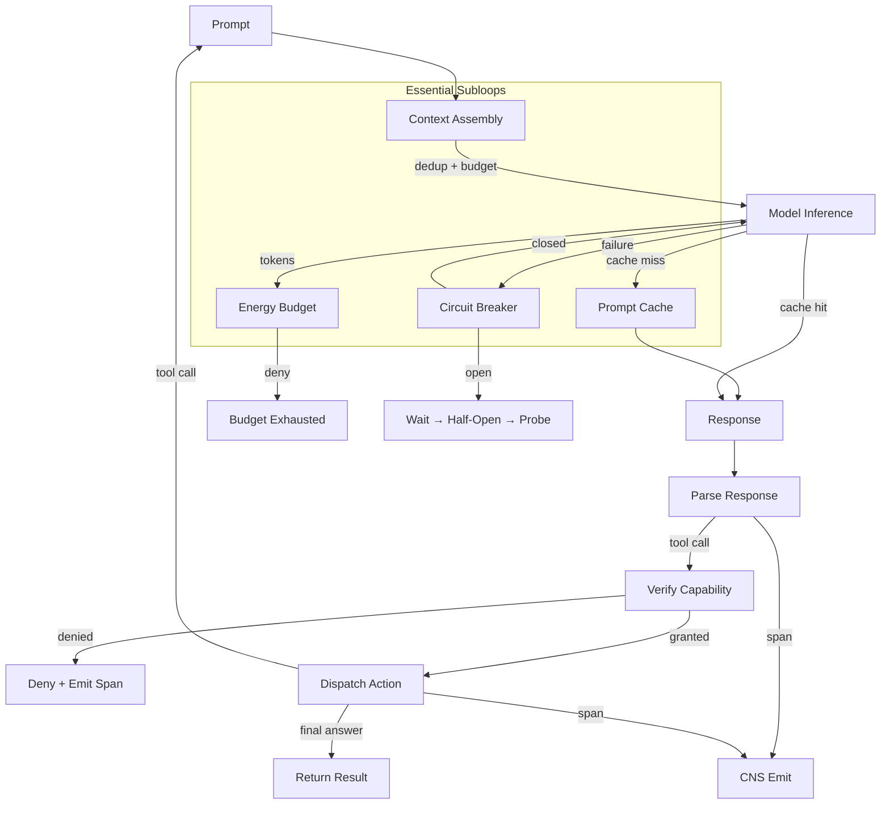
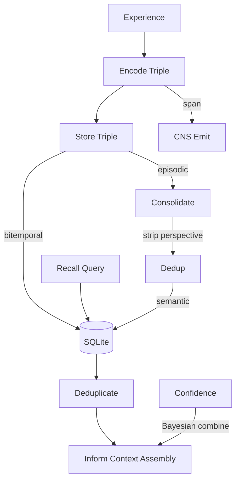
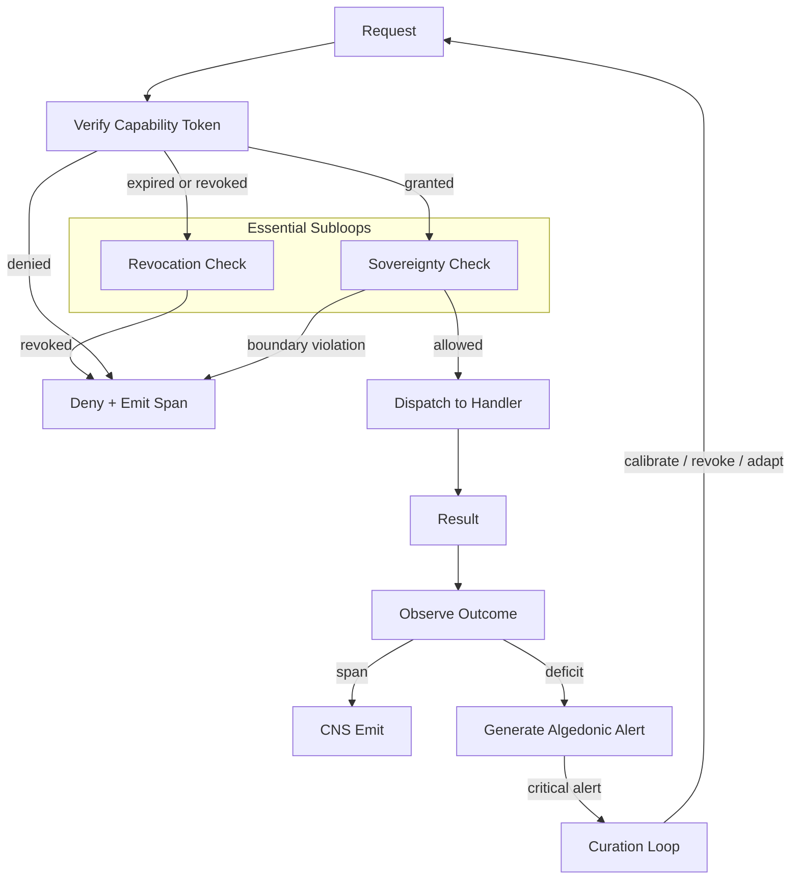
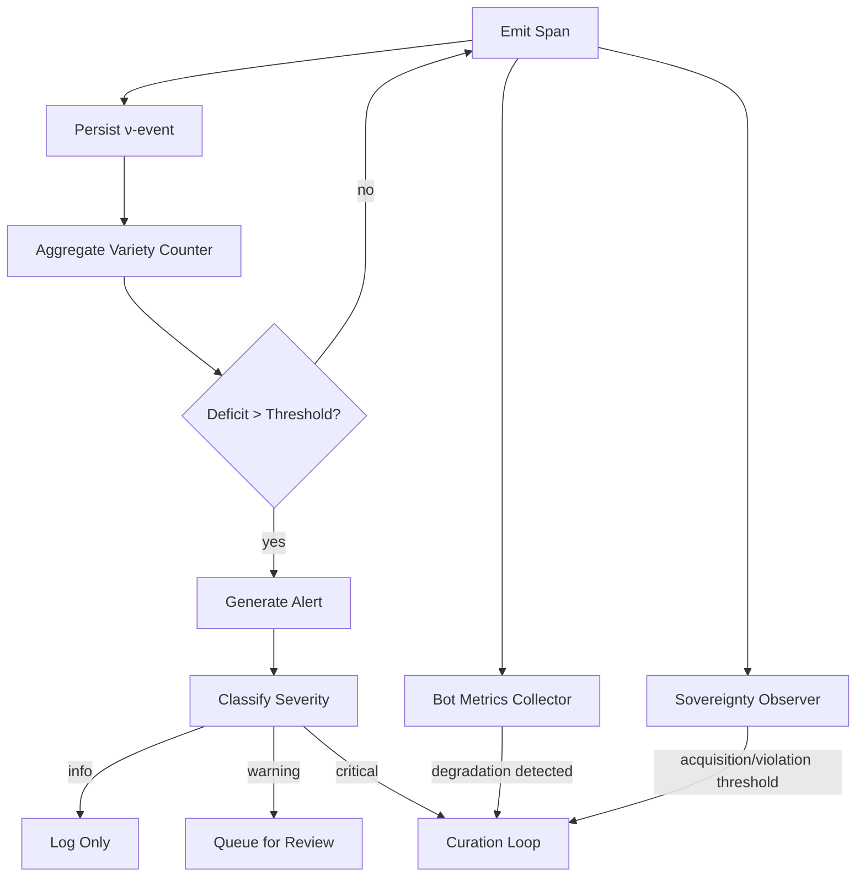
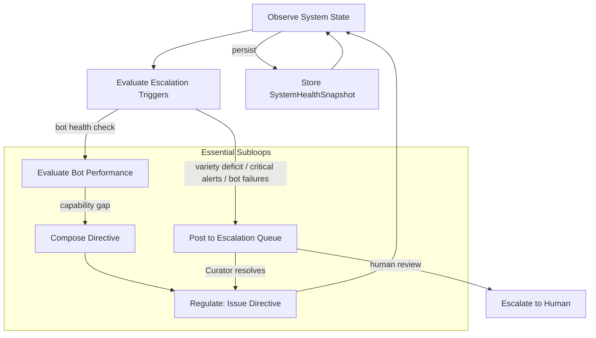

# Task 2: Core Loops

Each macro-loop is a closed feedback cycle. Each macro-loop contains **essential subloops** — smaller cycles that are constitutive of the macro-loop's ability to function. Removing a subloop doesn't just degrade performance; it prevents the macro-loop from closing at all.

**Criterion for essentiality:** if removing it prevents the macro-loop from functioning in practice, it's essential.

---

## Loop 1: Inference Loop

*prompt → context → model → response → parse → act*

### Essential Functions

| Step | Function | Input | Output | Subloop |
|------|----------|-------|--------|---------|
| Render prompt | `render_template` | Template + context | Rendered prompt string | — |
| Assemble context | `assemble_context` | Recalled triples + budget | Deduplicated, budget-constrained prompt | Context assembly |
| Check cache | `get_or_infer` | Prompt hash + budget | Cached result or fresh inference | Prompt cache |
| Model inference | `infer` | Prompt + model config + capability token | Response text + probabilities | — |
| Energy gate | `try_consume` | Token count + budget | Approved or denied | Energy budget |
| Circuit break | `with_circuit_breaker` | Inference call | Result or circuit-open error | Circuit breaker |
| Parse response | `parse_response` | Raw response | Structured action | — |
| Dispatch action | `dispatch_action` | Parsed action + capability token | Action result | — |
| Observe | `emit_span` | Span + phase + outcome | ν-event persisted | — |

### Essential Subloops

**Context Assembly** — recall → hash → dedup → budget-enforce → inject into prompt
- Without deduplication, identical facts inflate the prompt until budget exhaustion
- Without budget enforcement, the context window overflows
- Without assembly, the model has no memories — inference produces nothing grounded

**Prompt Cache** — check cache → miss → infer → cache result; LRU eviction when >100MB
- Without caching, repeated identical prompts burn tokens and energy on redundant inference
- On a finite budget, the inference loop eventually cannot afford to run — it starves

**Circuit Breaker** — call → fail → count failures → open circuit → wait → half-open → probe → close
- Without circuit breaking, a flaky model endpoint causes cascading failures
- Every request is attempted, every one fails, and the caller never adapts
- The loop enters a degenerate state: infinite failing calls with no escape

**Energy Budget** — estimate cost → check budget → approve/deny → observe consumption → emit Regulate span
- Without energy budgeting, there is no limit on resource consumption
- No adaptive feedback on budget pressure, no mechanism to deny operations exceeding budget
- Inference runs until external resource exhaustion rather than self-governing

---

## Loop 2: Memory Loop

*experience → encode → store → recall → dedup → consolidate → inform inference*

### Essential Functions

| Step | Function | Input | Output | Subloop |
|------|----------|-------|--------|---------|
| Encode | `encode_triple` | Entity + attribute + value + perspective | Triple | — |
| Store | `store_triple` | Triple + visibility | Persisted triple | — |
| Recall | `query_triples` | Entity + optional perspective | Vec<Triple> | — |
| Deduplicate | `dedup_triples` | Vec<Triple> | Vec<Triple> (unique) | Deduplication |
| Consolidate | `consolidate` | Episodic triples | Semantic triples | Consolidation |
| Combine | `combine_confidences` | Two confidence scores | Combined confidence | Bayesian combination |
| Retract | `retract_confidence` | Prior + retraction | Reduced confidence | Bayesian combination |
| Decay | `decay_confidence` | Confidence + time + rate | Decayed confidence | Bayesian combination |
| Inform | `assemble_context` | Recalled triples + budget | Prompt context | Context assembly |

### Essential Subloops

**Deduplication** — recall → hash → check duplicates → return unique
- Without deduplication, storage grows unboundedly and recall returns duplicates
- Context assembly receives duplicate facts, wasting token budget on redundant content
- The model sees repeated information, degrading response quality

**Consolidation** — episodic → strip perspective → dedup → store semantic
- Without consolidation, agents cannot generalize from experience
- Episodic memories are first-person and perspective-bound; they cannot be shared across agents
- Each agent must re-learn everything from scratch

**Bayesian Confidence Combination** — observe conf₁ → observe conf₂ → combine → update
- Without confidence combination, conflicting memories cannot be reconciled
- No decay of stale knowledge, no retraction mechanism for superseded facts
- The memory loop accumulates contradictions without resolution

---

## Loop 3: Governance Loop

*request → authorize → dispatch → observe → adapt policy*

### Essential Functions

| Step | Function | Input | Output | Subloop |
|------|----------|-------|--------|---------|
| Authorize | `verify_capability` | Token + resource + action | Granted/denied + caveat check | — |
| Check revocation | `is_revoked` | Token ID | Revoked or valid | Revocation |
| Attenuate | `attenuate_token` | Parent token + restrictions | Attenuated child token | — |
| Revoke | `revoke_capability` | Token ID + reason | Revocation recorded | Revocation |
| Check visibility | `check_visibility` | Holder + category + visibility | Allowed/denied | Sovereignty |
| Dispatch | `dispatch` | Authorized request + handler | Result | — |
| Energy gate | `try_consume` | Token count + budget | Approved or denied | Energy budget |
| Observe | `check_variety` | Domain + variety counter | Alert or no-op | — |
| Generate alert | `process_alert` | Runtime alert | Escalation action (Log / Queue / EscalateToCurator) | — |
| Apply calibration | `calibrate_threshold` | Domain + new threshold | Updated threshold | — |

> **Note:** `process_alert` classifies severity and determines the escalation action. When the action is `EscalateToCurator`, the Curation loop (Loop 5) receives the alert and decides whether to calibrate, coach, or escalate to human. `calibrate_threshold` is a Governance function *invoked by* the Curation loop — Governance applies the policy change that Curation decides.
| Enforce goal state | `can_transition_to` | Current state + target state | Valid or invalid | Goal state machine |

### Essential Subloops

**Revocation** — revoke token → persist → deny future use
- Without revocation, compromised capabilities cannot be withdrawn
- A leaked or misused capability token continues to grant access indefinitely
- The governance loop can grant but never revoke — any compromise is permanent

**Sovereignty Checking** — request → check data category → enforce boundary → log violation → detect pattern → escalate
- Without sovereignty checking, data category boundaries are unenforceable
- Private episodic memories can be accessed by any agent
- Acquisition patterns (repeated probing of boundaries) go undetected

**Goal State Machine** — transition request → validate → apply or deny
- Without state machine enforcement, invalid transitions corrupt goals
- A Pending goal could jump to Completed without work
- Goal coordination degrades to meaninglessness

---

## Loop 4: Observability Loop

*emit span → aggregate → detect anomaly → escalate*

> The Observability loop **detects** anomalies and **generates** alerts. It does not decide what to do about them — that is the Curation loop's role (Loop 5). The previous version of this diagram included a "Calibrate → adjusted threshold → Aggregate" feedback arc, but calibration is a Curation→Observability cross-loop dependency, not an internal Observability subloop.

### Essential Functions

| Step | Function | Input | Output | Subloop |
|------|----------|-------|--------|---------|
| Emit | `emit_event` | Span + phase + outcome + confidence | ν-event | — |
| Persist | `insert` | ν-event | Persisted row | — |
| Aggregate | `increment_variety` | Domain key | Updated counter | Variety tracking |
| Check | `check_variety` | Domain + threshold | Alert or no-op | Variety tracking |
| Classify | `determine_severity` | Deficit + threshold | Severity level | — |
| Classify | `determine_severity` | Deficit + threshold | Severity level | Algedonic alert generation |
| Generate alert | `process_alert` | Runtime alert | Escalation action | Algedonic alert generation |
| Record | `record_calibration` | Calibration record | Updated thresholds | — |
| Collect bot metrics | `evaluate_bot` | WebID + metrics | Health status + gaps | Bot metrics collection |
| Observe sovereignty | `process_sovereignty_event` | Sovereignty event | Alert or log | Sovereignty observation |

### Essential Subloops

**Variety Tracking** — increment → deficit → threshold → alert → escalate
- Without variety tracking, there is no mechanism to detect that the system is stuck in a rut
- The algedonic mechanism is explicitly cybernetic: variety deficit → pain signal → escalation → adaptation
- Without this, the observability loop is blind — it can collect spans but cannot interpret them

**Algedonic Alert Generation** — detect deficit → classify severity → generate alert → route to Curator
- Without alert generation, the Observability loop collects spans but cannot interpret them
- Variety deficit goes undetected; the system has no "pain signal" to trigger adaptation
- The loop is broken at "aggregate" — data is collected but never acted upon
- **Note:** What happens *after* the alert is routed to the Curator is the Curation loop (Loop 5)

**Bot Metrics Collection** — observe bot → collect metrics → detect degradation → alert
- Without bot metrics, bot degradation goes undetected
- A bot with 40% success rate, 500+ variety deficit, or 3+ sovereignty violations is silently failing
- The Observability loop detects; the Curation loop evaluates and responds

**Sovereignty Observation** — sovereignty event → count per WebID → threshold → algedonic alert
- Without sovereignty observation, acquisition patterns go undetected
- A WebID probing sovereign data boundaries makes repeated attempts that never trigger an alert
- Kill zone conditions (VC investment-level acquisition) are invisible

---

## Loop 5: Curation Loop

*observe → evaluate → compose → regulate*

The Curator is the user's agent counterpart — the meta-agent that observes system state, evaluates health and goal progress, composes adaptations, and regulates system behavior by issuing directives. It is the **only** agent that reads from ALL other loops and writes policy back into them. Without the Curation loop, the other four loops can detect anomalies but cannot decide what to do about them.

**Implementation:** `hkask-agents/src/curator/metacognition.rs` — `MetacognitionLoop`

### Essential Functions

| Step | Function | Input | Output | Subloop |
|------|----------|-------|--------|---------|
| Observe | `run_cycle` | CnsRuntimeAdapter + bot_reports | SystemHealthSnapshot | Health observation |
| Evaluate triggers | `check_escalation_triggers` | SystemHealthSnapshot + thresholds | Escalations posted or no-op | Escalation routing |
| Evaluate bot | `evaluate_bot` | WebID + BotEvaluationMetrics | EvaluationResult + RecommendedAction | Bot evaluation |
| Identify gap | `identify_capability_gap` | EvaluationResult | KataDirective | Bot evaluation |
| Compose | `direct_bot` | BotDirective | Directive delivered | Directive issuance |
| Persist | `save_snapshot` | StoredHealthSnapshot | Persisted row | Health observation |

### Essential Subloops

**Escalation Routing** — alert received → post to EscalationQueue → Curator resolves or dismisses
- Without this, Observability generates alerts but nobody acts on them
- The EscalationQueue persists across restarts — escalations are not lost
- The loop is broken at "detect" if there is no mechanism to receive, evaluate, and resolve

**Bot Evaluation** — collect metrics → assess health → identify capability gaps → recommend action
- Without bot evaluation, degradation is detected (Observability) but never corrected
- The evaluation produces a `RecommendedAction`: None, Monitor, Coach, Calibrate, or Escalate
- Capability gaps map to specific `KataType` coaching protocols

**Kata Coaching** — gap identified → select kata type → issue directive → observe improvement
- Without coaching, capability gaps are identified but no remediation protocol exists
- Three kata types: Improvement (4-step systematic), Coaching (5-question dialogue), Starter (3-routine practice)
- The coaching cycle closes when bot metrics improve after directive issuance

**Threshold Calibration** — chronic deficit detected → adjust threshold → observe effect on detection rate
- Without calibration, the system's sensitivity is fixed at compile time and cannot adapt
- The Curation loop decides WHEN to calibrate; the Governance loop applies the change
- Calibration closes when the adjusted threshold produces more accurate detection

### Directive Types (from `DirectiveType`)

| Directive | Target Loop | Effect |
|----------|-------------|--------|
| `CalibrateThreshold` | Governance → Observability | Adjusts variety deficit detection sensitivity |
| `AdjustEnergyBudget` | Inference | Changes token budget for agent |
| `TriggerKata` | Inference → Governance | Initiates coaching cycle for capability gap |
| `UpdateCapabilities` | Governance | Adds or removes capability grants |
| `EscalateToHuman` | Human administrator | Routes critical issue beyond system autonomy |

---

## Cross-Loop Dependencies

The five loops compose through capability-restricted handles:

| From Loop | To Loop | Data/Control Crossing | Handle |
|-----------|---------|----------------------|--------|
| Inference → Memory | `assemble_context()` | Recalled triples filtered by visibility | `MemoryReadHandle` |
| Inference → Memory | `store_episodic()` | Experience triples stored after inference | `MemoryWriteHandle` |
| Inference → Governance | `verify_capability()` | Every action requires capability check | `GovernanceHandle` |
| Inference → Observability | `emit_span()` | Every inference emits a span | `CnsWriteHandle` |
| Memory → Observability | `emit_span()` | Store/recall operations emit spans | `CnsWriteHandle` |
| Governance → Observability | `emit_span()` | Denials emit sovereignty spans | `CnsWriteHandle` |
| Observability → Curation | AlgedonicAlert + variety counters + bot metrics | Alerts and system state | `CnsGovernReadHandle` |
| Governance → Curation | Sovereignty violations + revocation events | Policy violation data | `GovernanceHandle` (read) |
| Inference → Curation | Energy budget status + bot health reports | System health data | `EnergyBudgetHandle` (read) |
| Curation → Governance | `calibrate_threshold()`, `update_capabilities()` | Policy changes | `GovernanceHandle` (write) |
| Curation → Inference | `adjust_energy_budget()`, `trigger_kata()` | Resource and coaching directives | `EnergyBudgetAdminHandle` |
| Curation → Observability | Threshold changes affect detection sensitivity | Calibration writes | `CnsGovernWriteHandle` |
| Curation → Memory | Persist snapshots, coaching results | Metacognition data | `MemoryWriteHandle` |
| Governance → Inference | Energy budget denial | Budget exhaustion rejects inference calls | `EnergyBudgetHandle` |
| Memory → Inference | `assemble_context()` | Recalled memory informs prompt context | `MemoryReadHandle` |

Each handle grants exactly the authority its loop needs — no more. The type system enforces that `MemoryReadHandle` cannot store triples, `CnsWriteHandle` cannot reset alerts, and `EnergyBudgetHandle` cannot set the cap. **Curation holds write handles to Governance and Observability** — it is the only loop authorized to regulate the other loops. Governance holds read handles from Observability — it enforces but does not set policy.