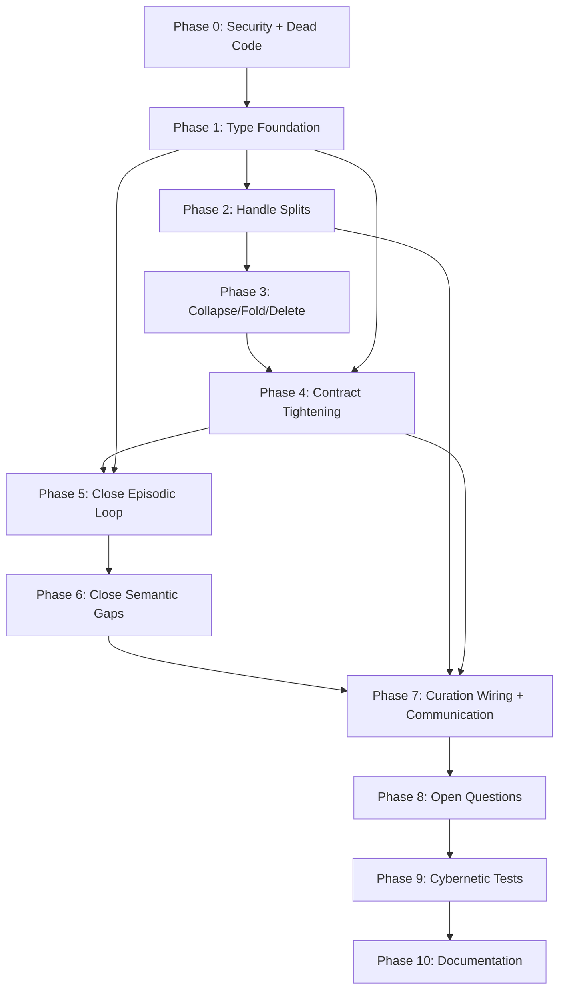

# Task 8: Implementation Plan — Revised for 7-Loop Architecture

**Status:** Revised — supersedes previous TASK8
**Derived from:** TASK5 (simplified core), TASK7 (open questions), TASK9 (7-loop structure)
**Key change:** Memory loop split into Episodic (2a) + Semantic (2b) with Consolidation Bridge; Communication elevated to master loop with messenger functions.

**Key principles:**
1. **Capability handles defined first** (additive, no breakage), then existing code migrated (refactoring, breakage managed by feature flags).
2. **Episodic loop closes first** — it currently doesn't close at all (no decay, no retraction, no temporal attention, no storage budget, no encoding, no context assembly).
3. **Curation loop already exists** in `hkask-agents::curator` — we're wiring it with proper type boundaries, not building from scratch.
4. **Communication layer comes last** — it wraps capability handles as transport boundaries, so handles must exist first.

**Verification gate after every phase:** `cargo check --workspace && cargo test --workspace && cargo clippy --workspace -- -D warnings && cargo fmt --check`

---

## Phase 0: Pre-requisites (security + dead code)

*Unchanged from previous TASK8. Can be parallelized.*

| PR | Title | What | From | Affected Crates |
|:--:|-------|------|------|-----------------|
| 0a | **Fix admin passphrase timing attack** | Replace `==` with `subtle::ConstantTimeEq` in `verify_admin_passphrase`. Add `subtle` to `hkask-keystore/Cargo.toml`. | TASK7 Q6 | `hkask-keystore` |
| 0b | **Wire or remove dead session fields** | Wire `consensus_required`, `orchestration_model`, `auto_start`, `voting` to runtime behavior, or remove them and `SessionRules` struct. | TASK7 Q7 | `hkask-ensemble` |
| 0c | **Prune dead code** | Delete `BotHealthStatus::Unresponsive`, `EnergyError::InvalidCost` + `Deficit`, `KeychainError::Encryption`, `services/sovereignty.rs` stub, `McpMcpRetryConfig`. | TASK4 D1–D6 | `hkask-agents`, `hkask-templates`, `hkask-keystore`, `hkask-api`, `hkask-mcp` |

---

## Phase 1: Type Foundation (capability handles + episodic/semantic split)

Define all handle types as struct definitions in `hkask-types/src/loops/`. Additive only — no existing code changes.

**Change from previous TASK8:** Memory handles split into `EpisodicReadHandle`, `EpisodicWriteHandle`, `SemanticReadHandle`, `SemanticWriteHandle` instead of `MemoryReadHandle`, `MemoryWriteHandle`. Add `LoopMessage`, `MessagePriority`, `LoopOrigin`, `LoopPayload` for the Communication layer. Add `TraceId` for correlation.

| PR | Title | What | From | Affected Crates |
|:--:|-------|------|------|-----------------|
| 1a | **Define loop module structure** | Create `hkask-types/src/loops/mod.rs` re-exporting the 7 loop modules. Create stub files for `inference.rs`, `episodic.rs`, `semantic.rs`, `governance.rs`, `observability.rs`, `curation.rs`, `dispatch.rs`. | TASK9 | `hkask-types` |
| 1b | **Define capability handle types** | Implement all 13 handle structs: `InferenceHandle`, `EnergyBudgetHandle`, `RateLimiterHandle`, `EpisodicReadHandle`, `EpisodicWriteHandle`, `SemanticReadHandle`, `SemanticWriteHandle`, `GovernanceHandle`, `CuratorHandle`, `CnsWriteHandle`, `CnsGovernReadHandle`, `CnsGovernWriteHandle`, `CnsAdminHandle`. Include Hoare triple annotations on all methods. | TASK5, TASK9 | `hkask-types` |
| 1c | **Define `DataCategory` visibility enum** | Add `DataCategory { Public, Shared, EpisodicMemory, SemanticMemory, Private, PersonalContext, CapabilityTokens, OcpBoundaries, TemplateInvocations, HlexiconTerms, TemplateRegistry }` with HKDF key derivation mapping. | TASK7 Q2, TASK9 | `hkask-types` |
| 1d | **Define Communication types** | Add `LoopMessage`, `MessagePriority { Critical, Warning, Info }`, `LoopOrigin`, `LoopPayload`, `TraceId` in `hkask-types/src/loops/dispatch.rs`. Stub only — no runtime behavior. | TASK9 | `hkask-types` |

**Verification gate:** `cargo check -p hkask-types && cargo test -p hkask-types && cargo clippy -p hkask-types -- -D warnings`

---

## Phase 2: CnsGovernHandle Split + Memory Handle Split

The two most invasive refactors. Split `CnsRuntime` into four handles AND migrate `MemoryReadHandle`/`MemoryWriteHandle` to episodic/semantic split.

| PR | Title | What | From | Affected Crates |
|:--:|-------|------|------|-----------------|
| 2a | **Split CnsRuntime into four handles** | Replace `CnsRuntime` with `CnsWriteHandle`, `CnsGovernReadHandle`, `CnsGovernWriteHandle`, `CnsAdminHandle`. Migrate all consumers. | TASK3 #3, TASK5 | `hkask-cns`, `hkask-agents`, `hkask-ensemble`, `hkask-templates`, `hkask-mcp` |
| 2b | **Wire Governance to CnsGovernReadHandle** | Change `GovernanceHandle.cns` from `CnsRuntime` to `CnsGovernReadHandle`. Governance can read variety and process sovereignty events but cannot calibrate thresholds. | TASK5 | `hkask-agents` |
| 2c | **Wire Curation to CnsGovernWriteHandle** | Change `MetacognitionLoop` to use `CnsGovernWriteHandle` for threshold calibration and `CuratorHandle` for all cross-loop writes. | TASK5, TASK2 Loop 5 | `hkask-agents` |
| 2d | **Split Memory handles into Episodic/Semantic** | Replace `MemoryReadHandle`/`MemoryWriteHandle` with `EpisodicReadHandle`, `EpisodicWriteHandle`, `SemanticReadHandle`, `SemanticWriteHandle`. Migrate `PodContext` to use both. `InferenceHandle.memory` becomes `InferenceHandle.episodic` + `InferenceHandle.semantic`. | TASK9 §9 | `hkask-types`, `hkask-agents`, `hkask-memory` |

**Verification gate:** `cargo check --workspace && cargo test --workspace && cargo clippy --workspace -- -D warnings`

---

## Phase 3: Collapse, Fold, Delete

*Unchanged from previous TASK8 except 3e (new PR for context assembly split).*

| PR | Title | What | From | Affected Crates | Lines |
|:--:|-------|------|------|-----------------|:-----:|
| 3a | **Collapse CnsSpan + Span** | Unify into `Span { category: SpanCategory, path: String }`. Delete `CnsSpan`. Update all consumers. | TASK4 C1 | `hkask-types`, `hkask-cns`, `hkask-agents`, `hkask-ensemble` | ~−300 |
| 3b | **Collapse BotCapabilities + ReplicantCapabilities** | Unify into `AgentCapabilities { can_invoke_tools, can_dispatch_templates, can_escalate, memory_access: MemoryAccess }` where `MemoryAccess { can_access_episodic, can_access_semantic }`. | TASK4 C2, TASK9 | `hkask-agents`, `hkask-types` | ~−100 |
| 3c | **Collapse remaining pairs** | C3: `ContractValidator + CapabilityAwareValidator`. C4: `OkapiHttpClient + OkapiImprovClient`. C5: `SystemHealthSnapshot + StoredHealthSnapshot`. C6: `EnsembleChatManager + DeliberationCoordinator`. C7: `AgentPersonaInput + AgentPersona`. | TASK4 C3–C7 | `hkask-templates`, `hkask-agents`, `hkask-ensemble` | ~−400 |
| 3d | **Fold delegation wrappers** | F1–F15: inline all 15 delegation wrappers. Most impactful: `BayesianOps::new()` → free functions, `SpanEmitter::emit_*()` → `emit_with_phase()`, `CnsRuntime::new()` → `with_threshold()`. | TASK4 F1–F15 | `hkask-memory`, `hkask-cns`, `hkask-templates`, `hkask-keystore` | ~−250 |
| 3e | **Split ContextAssembler into episodic + semantic** | Replace single `assemble_context` with `assemble_episodic_context` (temporal-ordered, recency-weighted) and `assemble_semantic_context` (deduplicated, confidence-combined). Both feed into a merged context for the prompt. | TASK9 §3, TASK5 4e | `hkask-templates` | ~+150/−50 |

**Verification gate:** `cargo check --workspace && cargo test --workspace && cargo clippy --workspace -- -D warnings && cargo fmt --check`

---

## Phase 4: Contract Tightening

*Updated to reflect episodic/semantic split.*

| PR | Title | What | From | Affected Crates |
|:--:|-------|------|------|-----------------|
| 4a | **Make CapabilityToken depth a const** | Change `MAX_ATTENUATION_DEPTH` from runtime-configurable to `const MAX_ATTENUATION_DEPTH: u32 = 7;`. | TASK5 Contract Tightening | `hkask-types`, `hkask-agents` |
| 4b | **SecurityGateway.authorize() returns token** | Change return type from `Result<()>` to `Result<CapabilityToken>` — the attenuated token used for the call. Enables audit chaining. | TASK5 Contract Tightening | `hkask-mcp`, `hkask-agents` |
| 4c | **AgentPod state machine guards** | Add `can_transition_to(current, target) → bool` with explicit allowed transitions. Invalid transitions return `Err`. | TASK5 Contract Tightening | `hkask-agents` |
| 4d | **Make required_capabilities non-optional** | `TemplateEntry.required_capabilities: Vec<String>` — `Vec::new()` means public. Every template declares its OCAP requirements explicitly. | TASK5 Contract Tightening | `hkask-templates` |
| 4e | **Collapse ContextAssembler to 4 priorities** | Reduce from 7 fragment priorities to: System, User, Memory, Tool. `perspective` field discriminates episodic vs semantic within Memory. (Updated: episodic context gets `Memory(Episodic)`, semantic context gets `Memory(Semantic)`.) | TASK5 Contract Tightening, TASK9 | `hkask-templates` |
| 4f | **Align schema naming** | Rename spec references from `subject/predicate/object` to `entity/attribute/value`. Adopt uni-temporal `valid_from` instead of claiming bitemporal. | TASK5 Contract Tightening | `hkask-storage`, `hkask-types`, docs |
| 4g | **Wire BayesianOps as free functions** | Remove `BayesianOps` struct; make `combine`, `retract`, `decay`, `join`, `weighted_average` free functions in `hkask-memory::bayesian`. Wire `decay` and `retract` into episodic recall path. | TASK4 F1, TASK9 §2a | `hkask-memory` |

**Verification gate:** `cargo check --workspace && cargo test --workspace && cargo clippy --workspace -- -D warnings`

---

## Phase 5: Close the Episodic Loop (NEW — highest impact)

The episodic loop currently does not close. Experience goes in and comes out unchanged — no decay, no retraction, no temporal weighting, no storage budget, no proper encoding, no episodic context assembly. This phase closes the loop.

| PR | Title | What | From | Affected Crates |
|:--:|-------|------|------|-----------------|
| 5a | **Wire confidence decay into episodic recall** | Call `bayesian::decay()` in `EpisodicMemory::query_for_deduped()` and `query_deduped()`. Use `valid_from` timestamp and configurable decay rate. Confidence decays with time since storage. | TASK9 §2a (2a.3) | `hkask-memory` |
| 5b | **Wire confidence retraction into episodic memory** | Add `retract_triple(entity, attribute, retraction_confidence)` to `EpisodicMemory` that reduces confidence of matching triples without deleting them. Wire `bayesian::retract()`. | TASK9 §2a (2a.4) | `hkask-memory` |
| 5c | **Implement temporal attention in episodic recall** | Weight recalled episodic triples by recency: `weight = e^(-λ × time_since_storage)`. Apply in `EpisodicMemory::query_for()` before returning. Most recent experience gets highest weight in context. | TASK9 §2a (2a.2) | `hkask-memory` |
| 5d | **Implement episodic storage budget** | Add per-agent storage limit to `EpisodicWriteHandle`. When exceeded, mark oldest/lowest-confidence triples for consolidation or decay. Emit `cns.memory.budget` span. | TASK9 §2a (2a.5) | `hkask-memory`, `hkask-agents` |
| 5e | **Enhance experience encoding** | Extend `PodContext.store_memory()` to accept confidence, outcome, and experience classification. Emit `cns.memory.encode` span. Default confidence from experience type (success=0.9, failure=0.3, observation=0.7). | TASK9 §2a (2a.1) | `hkask-agents` |
| 5f | **Implement episodic context assembly** | In `hkask-templates/src/context_assembly.rs`, add `assemble_episodic_context()` that preserves temporal ordering (`valid_from ASC`), applies recency weighting, and budget-constrains with recency priority (keep recent, drop old). | TASK9 §2a (2a.6) | `hkask-templates` |

**Verification gate:** `cargo check --workspace && cargo test --workspace && cargo clippy --workspace -- -D warnings`

---

## Phase 6: Close the Semantic Gaps + Consolidation Bridge

| PR | Title | What | From | Affected Crates |
|:--:|-------|------|------|-----------------|
| 6a | **Wire semantic indexing** | Wire `EmbeddingStore` for similarity-based recall alongside entity-key recall. Add `SemanticMemory::query_similar(entity, embedding, k)` that merges embedding results with entity results. | TASK9 §2b (2b.3) | `hkask-memory`, `hkask-storage` |
| 6b | **Wire confidence combination in semantic recall** | Call `bayesian::combine()` in `SemanticMemory::recall()` when multiple triples match the same entity/attribute. Corroborating observations strengthen belief. | TASK9 §2b (2b.2) | `hkask-memory` |
| 6c | **Implement consolidation priority and trigger** | Add automatic consolidation trigger: when episodic storage budget exceeds threshold, or on time-based schedule. Classify consolidation priority by confidence and recency. | TASK9 §Bridge (B.1) | `hkask-agents`, `hkask-memory` |
| 6d | **Implement confidence promotion in consolidation** | During consolidation, seed semantic confidence from episodic confidence using `bayesian::combine(episodic_conf, prior=0.5)` rather than raw copy. | TASK9 §Bridge (B.4) | `hkask-memory` |
| 6e | **Implement semantic storage budget** | Add per-entity storage limit to `SemanticWriteHandle`. When exceeded, mark lowest-confidence triples for retraction. Emit `cns.memory.semantic_budget` span. | TASK9 §2b (2b.4) | `hkask-memory`, `hkask-agents` |

**Verification gate:** `cargo check --workspace && cargo test --workspace && cargo clippy --workspace -- -D warnings`

---

## Phase 7: Curation Loop Wiring + Communication Foundation

| PR | Title | What | From | Affected Crates |
|:--:|-------|------|------|-----------------|
| 7a | **Wire MetacognitionLoop to CuratorHandle** | Replace `Arc<CnsRuntimeAdapter>` with `CuratorHandle` (CnsGovernWriteHandle + GovernanceHandle + EscalationQueue + SemanticWriteHandle). Note: `MemoryWriteHandle` replaced by `SemanticWriteHandle` for Curation's memory writes (Curation persists to semantic, not episodic). | TASK5 Module 5, TASK9 | `hkask-agents` |
| 7b | **Wire Curation → Governance directive delivery** | Implement `DirectiveType::CalibrateThreshold` and `UpdateCapabilities` as calls through `GovernanceHandle`. Implement `AdjustEnergyBudget` through `EnergyBudgetAdminHandle`. | TASK2 Loop 5 | `hkask-agents`, `hkask-types` |
| 7c | **Wire Curation → Observability threshold calibration** | `CnsGovernWriteHandle.calibrate_threshold()` feeds threshold changes back to variety detection. | TASK2 Loop 5, TASK3 | `hkask-agents`, `hkask-cns` |
| 7d | **Implement LoopMessage dispatch** | Add `dispatch.send(LoopMessage)` with priority queuing. Wrap `EscalationQueue` pattern as the first DISPATCH instance. Add `TraceId` propagation to all inter-loop calls. | TASK9 §6 (6.1, 6.2) | `hkask-types`, `hkask-agents` |
| 7e | **Implement DAMPEN on feedback edges** | Add dampening to Curation→Governance→Observability→Curation feedback cycle. Same directive within a configurable time window is suppressed. | TASK9 §6 (6.3) | `hkask-agents` |

**Verification gate:** `cargo check --workspace && cargo test --workspace && cargo clippy --workspace -- -D warnings`

---

## Phase 8: Implementation-Phase Open Questions

*Unchanged from previous TASK8.*

| PR | Title | What | From | Affected Crates |
|:--:|-------|------|------|-----------------|
| 8a | **Priority-tagged lock in storage** | Implement `LockPriority` enum in `hkask-storage`. Critical/High priority writes preempt Normal/Low reads. | TASK7 Q1 | `hkask-storage` |
| 8b | **DataCategory visibility enforcement** | Implement `DataCategory` caveats in `EpisodicReadHandle.query_visible()` and `SemanticReadHandle.query_visible()` using keystore key-derivation scheme. | TASK7 Q2, TASK9 | `hkask-memory`, `hkask-keystore` |
| 8c | **Minimum CNS: unify VarietyTracker** | Collapse `SovereigntyObserver`, `GoalVarietyMonitor`, `BotMetricsCollector` into single `VarietyTracker` keyed by `(domain, observer_webid)`. Implement 4 essential functions. | TASK7 Q3 | `hkask-cns` |

---

## Phase 9: Cybernetic Unit Tests

Write all tests from TASK6, plus new tests for episodic/semantic split and communication.

| PR | Title | What | From | Affected Crates |
|:--:|-------|------|------|-----------------|
| 9a | **Inference loop cybernetic tests** | Tests 1–5b: loop closing, capability boundary, energy budget, circuit breaker, context assembly, rate limiter. | TASK6 | `hkask-types` (test) |
| 9b | **Episodic memory cybernetic tests** | Tests: loop closing, episodic write/read boundary, episodic visibility boundary, temporal attention (recency weighting), confidence decay, confidence retraction, episodic storage budget. | TASK6, TASK9 | `hkask-memory` (test) |
| 9c | **Semantic memory cybernetic tests** | Tests: loop closing, semantic read/write boundary, semantic visibility boundary, deduplication, consolidation (perspective stripping), confidence combination, semantic indexing. | TASK6, TASK9 | `hkask-memory` (test) |
| 9d | **Consolidation bridge cybernetic tests** | Tests: consolidation strips perspective, consolidation dedup prevents duplicates, consolidation priority selects high-confidence experiences, confidence promotion seeds semantic confidence. | TASK9 | `hkask-memory` (test) |
| 9e | **Governance loop cybernetic tests** | Tests 11–14: loop closing, attenuation, revocation, algedonic escalation. | TASK6 | `hkask-agents` (test) |
| 9f | **Observability loop cybernetic tests** | Tests 15–17: loop closing, write/cannot-govern boundary, span emission. | TASK6 | `hkask-cns` (test) |
| 9g | **Curation loop cybernetic tests** | Tests 18–22: loop closing, escalation routing, bot evaluation, kata coaching, threshold calibration with read/write handle verification. | TASK6 | `hkask-agents` (test) |
| 9h | **Communication cybernetic tests** | Tests: LoopMessage dispatch with priority, TraceId correlation across loop boundaries, DAMPEN suppresses duplicate directives within window. | TASK9 | `hkask-types` (test) |

**Verification gate:** `cargo test cyber_ --workspace && cargo clippy --workspace -- -D warnings`

---

## Phase 10: Documentation & Verification

Final cross-reference between TASK9 specification and implementation.

| PR | Title | What | From | Affected Crates |
|:--:|-------|------|------|-----------------|
| 10a | **Update architecture docs** | Cross-reference all 7 loop diagrams (TASK9) against actual `pub` APIs. Update `docs/architecture/hKask-architecture-master.md` with 7-loop structure, episodic/semantic split, communication messenger functions, and updated handle matrix. | TASK9 | docs |
| 10b | **CNS span audit** | Verify `cns.review.*` and `cns.energy.*` consumers. Keep if essential sub-loop artifact; remove if dead. Verify all remaining spans map to a core loop. Add `cns.memory.encode`, `cns.memory.decay`, `cns.memory.retract`, `cns.memory.budget` spans for new episodic subloops. | Alternative Task 6, TASK9 | `hkask-cns` |
| 10c | **BotMetricsCollector investigation** | Verify `BotMetricsCollector` is consumed by Curation loop (via `evaluate_bot`). If no consumer, dead code. If consumed, keep. | Alternative Task 5 | `hkask-cns` |

---

## Dependency Graph

Phases 0a–0c can run in parallel. Within Phase 3, 3a must land before 3b (C2 depends on C1). Phase 5 (Episodic) and Phase 6 (Semantic) can partially overlap — 5a–5c (wiring existing functions) can run before 6a–6c (new functionality), but 5f (episodic context assembly) should land before 6a (semantic indexing) because the context assembly tests need both paths.

---

## Risk Assessment

| Risk | Phase | Mitigation |
|------|-------|------------|
| CnsRuntime split breaks many consumers | 2 | Phase 2a is the highest-risk PR. Gate with `cargo check --workspace`. Create `CnsRuntime` wrapper that delegates to handles for backward compatibility during migration. |
| Memory handle split breaks PodContext and agents | 2 | Phase 2d changes `MemoryReadHandle`/`MemoryWriteHandle` to episodic/semantic pairs. The old handles can be kept as type aliases during migration. |
| BayesianOps wiring changes recall behavior | 4 | Phase 4g makes decay/retraction/combination active in recall paths. Add `enable_decay`/`enable_combination` flags so behavior is opt-in during testing. |
| Episodic subloops are new code with no existing tests | 5 | Phase 9b writes comprehensive cybernetic tests for all 6 episodic subloops. Phase 5 PRs should include unit tests alongside implementation. |
| Context assembly split changes prompt composition | 3 | Phase 3e and 4e change how context is assembled. Run regression tests on `hkask-templates` context assembly. The `perspective` field discriminates episodic vs semantic within Memory priority. |
| Curation loop wiring may not match existing `MetacognitionLoop` | 7 | The `MetacognitionLoop` already exists in `hkask-agents::curator`. Phase 7 wraps it with `CuratorHandle` — implementation works, adding type boundaries. Note: `MemoryWriteHandle` replaced by `SemanticWriteHandle` since Curation writes to semantic memory (snapshots, coaching results), not episodic. |
| Cybernetic tests may not compile until handles are implemented | 9 | Tests use `new_test()` constructors that need implementation in Phase 1b. Write tests in Phase 9 but stub constructors in Phase 1b. |

---

## Estimated Effort

| Phase | PRs | Estimated Lines Changed | Time |
|-------|-----|:-----------------------:|------|
| 0 | 3 | −200 / +50 | 1 day |
| 1 | 4 | +1,000 / −50 | 2–3 days |
| 2 | 4 | +400 / −500 | 4–5 days |
| 3 | 5 | −900 / +150 | 3–5 days |
| 4 | 7 | +300 / −150 | 2–3 days |
| 5 | 6 | +800 / −50 | 3–4 days |
| 6 | 5 | +600 / −200 | 2–3 days |
| 7 | 5 | +500 / −200 | 3–5 days |
| 8 | 3 | +300 / −300 | 2–3 days |
| 9 | 8 | +800 / −0 | 2–3 days |
| 10 | 3 | ±150 | 1 day |
| **Total** | **53** | **~+3,750 / −1,750** | **~5–6 weeks** |

Net change: approximately +2,000 lines added. The codebase gains episodic subloops, communication infrastructure, and semantic indexing, while losing approximately 1,750 lines through collapses and folds.

---

## Change Summary from Previous TASK8

| What Changed | Why |
|-------------|-----|
| Phase 1 expanded (4 PRs → 4 PRs) | Added `1d: Define Communication types` for `LoopMessage`, `MessagePriority`, `TraceId` |
| Phase 2 expanded (3 PRs → 4 PRs) | Added `2d: Split Memory handles into Episodic/Semantic` |
| Phase 3 expanded (4 PRs → 5 PRs) | Added `3e: Split ContextAssembler into episodic + semantic` |
| Phase 4 expanded (6 PRs → 7 PRs) | Added `4g: Wire BayesianOps as free functions` (was F1 fold, now also wires into episodic recall) |
| **Phase 5 is NEW** | Closes the episodic loop: decay, retraction, temporal attention, storage budget, encoding, context assembly |
| **Phase 6 is NEW** | Closes semantic gaps: semantic indexing, confidence combination in recall, consolidation priority, confidence promotion, storage budget |
| Phase 5→6→7 (was Phase 5) | Curation wiring moved to Phase 7; Communication foundation added to Phase 7 |
| Phase 6 (was open questions) → Phase 8 | Renumbered |
| Phase 7 (was tests) → Phase 9 | Expanded: added episodic tests, semantic tests, consolidation bridge tests, communication tests |
| Phase 8 (was docs) → Phase 10 | Updated for 7-loop structure |
| Total PRs: 33 → 53 | Reflects episodic loop closure, semantic gap closure, and communication infrastructure |
| Estimated time: ~3 weeks → ~5–6 weeks | Reflects the scope increase from closing the episodic loop and building communication foundations |

*ℏKask — Implementation Plan v2 — 10 Phases, 53 PRs, 7 Loops*