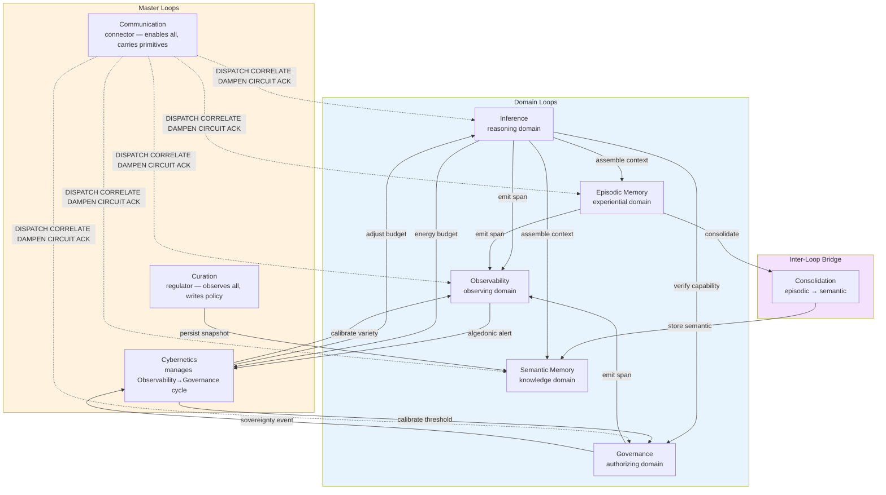
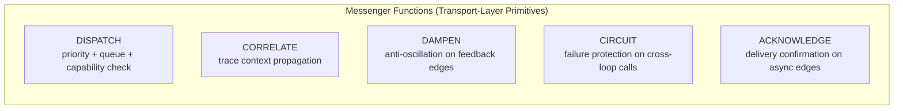
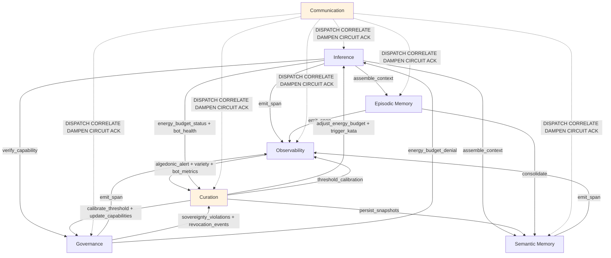

# Task 9: Loop Structure — Eight Loops, Control Primitives, and Subloop Organization

**Status:** Canonical reference
**Derived from:** TASK2 (core loops), TASK3 (composition), TASK5 (simplified core), architectural analysis
**Replaces:** TASK2 core loop definitions for Memory (now split into 2a/2b)
**Version:** 1.0.0

---

## 1. Architecture Overview

hKask has **8 loops**: 4 independent domain loops, 1 paired domain loop (Episodic/Semantic Memory with a consolidation bridge), and 3 master loops (Curation, Communication, Cybernetics).

### Structural Roles

| Loop | Type | Role | VSM System |
|------|------|------|------------|
| Inference | Domain | How the system reasons | System 1 (Operations) |
| Episodic Memory | Domain | How the system remembers experience | System 1 (Operations) |
| Semantic Memory | Domain | How the system shares knowledge | System 1 (Operations) |
| Governance | Domain | How the system authorizes | System 3 (Control) |
| Observability | Domain | How the system observes itself | System 3\* (Audit) |
| Curation | Master (regulator) | What the system decides about itself | Systems 3–5 (Control/Intelligence/Policy) |
| Communication | Master (connector) | How the system's parts talk to each other | System 2 (Coordination) |

### Key Structural Insight

**Subloops are domain-specific instances of control primitives.** Every subloop follows one of 9 abstract patterns (GUARD, FILTER, CACHE, CIRCUIT, RECONCILE, SENSE, ROUTE, WITHDRAW, ADAPT). The primitive is the pattern; the subloop is the instantiation.

**The Communication loop has no subloops of its own** because all subloops are communication pattern instances. Communication delivers messenger functions (DISPATCH, CORRELATE, DAMPEN, CIRCUIT, ACKNOWLEDGE) that sit on every inter-loop edge — these are transport-layer instances of the same control primitives.

**Memory is a paired domain loop** — Episodic and Semantic share an origin (experience) but immediately diverge. They are connected by a one-way bridge (Consolidation) that transforms private experience into shared knowledge.

---

## 2. Control Primitives

Nine abstract patterns that every subloop instantiates:

| # | Primitive | Abstract Pattern | When a Loop Needs It |
|---|-----------|-----------------|---------------------|
| 1 | **GUARD** | `request → check condition → allow or deny` | Loop processes requests that could exceed limits or violate policy |
| 2 | **FILTER** | `stream → remove undesired → pass through` | Loop processes streams that could contain noise or redundancy |
| 3 | **CACHE** | `request → hit? → return / miss → compute + store` | Loop makes expensive calls that may be repeated |
| 4 | **CIRCUIT** | `call → fail → count → threshold → open → wait → half-open → probe → close` | Loop calls services that can fail |
| 5 | **RECONCILE** | `conflict A, conflict B → combine → resolved` | Loop processes information that can be contradictory |
| 6 | **SENSE** | `state → measure → signal` | Loop needs to detect conditions requiring action |
| 7 | **ROUTE** | `signal → classify → deliver to consumer` | Loop produces signals that need to reach specific handlers |
| 8 | **WITHDRAW** | `grant → revoke → persist → deny future` | Loop grants capabilities that may need to be taken back |
| 9 | **ADAPT** | `outcome → compare to desired → adjust parameter` | Loop needs to tune its own operation based on results |

**Completeness condition:** A loop is subloop-complete when, for each primitive it requires, there exists at least one subloop instance delivering that primitive. A primitive is required when removing it prevents the macro-loop from functioning in practice.

---

## 3. Domain Loops

### Loop 1: Inference

*`prompt → context → model → response → parse → act`*

| # | Subloop | Primitive | Cycle | Essentiality |
|---|---------|-----------|-------|-------------|
| 1.1 | Context Assembly | FILTER | recall → hash → dedup → budget-enforce → inject | Without it, the model has no grounded context and duplicate facts inflate the prompt |
| 1.2 | Prompt Cache | CACHE | check cache → hit: return / miss → infer → store result | Without it, identical prompts burn tokens on redundant inference |
| 1.3 | Circuit Breaker | CIRCUIT | call → fail → count → open → half-open → probe → close | Without it, a flaky model endpoint causes cascading failures with no adaptation |
| 1.4 | Energy Budget | GUARD | estimate cost → check budget → approve/deny → observe consumption | Without it, inference runs to external resource exhaustion |
| 1.5 | Rate Limiting | GUARD | check bucket → consume slot → deny when empty | Without it, runaway loops exhaust resources even within energy budget |

**Identified gaps (not yet implemented):**

| Gap | Primitive | Essentiality |
|-----|-----------|-------------|
| Response Validation | VALIDATE (extension of FILTER) | High — no semantic quality gate between parse and dispatch |
| Inference Outcome Sensing | SENSE | High — no loop closure on inference quality |
| Intent Disambiguation | RECONCILE | Medium — model may produce ambiguous tool calls |

---

### Loop 2a: Episodic Memory

*`experience → encode → store (private, perspective) → recall → temporal attention → context`*

Episodic memory is first-person, perspective-bound, private, and time-sensitive. Its subloops close the loop by feeding experience quality and recency back into what gets stored and prioritized.

| # | Subloop | Primitive | Cycle | Essentiality |
|---|---------|-----------|-------|-------------|
| 2a.1 | Experience Encoding | FILTER | raw experience → structure as triple → assign initial confidence → classify → store | Without it, experience is captured without context, quality signal, or outcome tagging |
| 2a.2 | Temporal Attention | ADAPT | recall → weight by recency → prioritize recent experience → budget-constrain | Without it, old and new experience have equal weight; the agent cannot distinguish recent from ancient |
| 2a.3 | Confidence Decay | RECONCILE | old triple → apply exponential decay → reduce confidence | Without it, stale experience never fades; context fills with ancient history at full confidence |
| 2a.4 | Confidence Retraction | RECONCILE | mistaken experience → reduce confidence of specific triple | Without it, mistakes are permanent and uncorrectable; contradictions accumulate without resolution |
| 2a.5 | Episodic Storage Budget | GUARD | check storage growth → enforce bound → trigger consolidation or decay | Without it, private memory grows without limit; stale experience crowds relevant context |
| 2a.6 | Episodic Context Assembly | FILTER + ADAPT | recalled episodic triples → preserve temporal ordering → weight by recency → budget-constrain → inject into prompt | Without it, episodic context loses the narrative structure that makes experience useful |

**Key distinction from semantic subloops:** Episodic subloops deal with first-person, time-sensitive, private experience. Confidence **decays** (experience becomes less reliable over time). Recall is **recency-weighted** (recent experience matters more). Context assembly **preserves temporal ordering** (what happened in sequence matters).

**Current state in code:** `EpisodicMemory` is a passthrough CRUD wrapper around `TripleStore`. It has `store()` and `query()` but no decay, no retraction, no temporal weighting, no storage budget, no context assembly, and no experience encoding beyond bare triple construction. The loop does not close — experience goes in and comes out unchanged.

---

### Loop 2b: Semantic Memory

*`consolidated knowledge → store (public, no perspective) → index → recall → dedup → combine → context`*

Semantic memory is third-person, perspective-free, public, and time-independent. Its subloops close the loop by corroborating and strengthening knowledge across sources.

| # | Subloop | Primitive | Cycle | Essentiality |
|---|---------|-----------|-------|-------------|
| 2b.1 | Semantic Deduplication | FILTER | recall → hash (without perspective) → check duplicates → return unique | Without it, storage grows unboundedly and recall returns duplicate knowledge from different sources |
| 2b.2 | Confidence Combination | RECONCILE | observe conf₁ → observe conf₂ → Bayesian combine → update | Without it, corroborating knowledge from multiple sources doesn't strengthen belief |
| 2b.3 | Semantic Indexing | CACHE | encode embedding → store in vector index → query by similarity → merge with entity recall | Without it, recall is entity-key-only; related knowledge using different terminology is invisible |
| 2b.4 | Semantic Storage Budget | GUARD | check shared knowledge growth → enforce bound → deduplicate more aggressively | Without it, shared knowledge grows without limit |
| 2b.5 | Semantic Context Assembly | FILTER | recalled semantic triples → dedup → combine confidence → budget-constrain → inject into prompt | Without it, shared context contains duplicates and contradictions |

**Key distinction from episodic subloops:** Semantic subloops deal with shared, perspective-free, time-independent knowledge. Confidence **combines** (corroboration strengthens belief). Recall is **entity-based** (what is known about X, regardless of when). Context assembly **deduplicates** (the same fact from multiple sources counts once).

**Current state in code:** `SemanticMemory` has `store()`, `query()`, `query_deduped()`, `store_embedding()`, `consolidate()`, and `recall()`. Bayesian confidence functions exist (`BayesianOps::combine`, `decay`, `retract`) but are never called. Embedding store exists (`EmbeddingStore`) but semantic indexing (similarity search) is not wired. No storage budget. Context assembly is not in `SemanticMemory` — it's in `hkask-templates/src/context_assembly.rs`.

---

### Consolidation Bridge (2a → 2b)

The one-way transformation from episodic experience to semantic knowledge. This is not a subloop of either memory loop — it is an **inter-loop bridge** that sits on the communication edge between Loop 2a and Loop 2b.

| # | Function | Primitive | Essentiality |
|---|----------|-----------|-------------|
| B.1 | Consolidation Priority | DISPATCH (ROUTE + GUARD) | Classify which experiences to consolidate first; without it, consolidation is ad-hoc and untriggered |
| B.2 | Perspective Stripping | FILTER | Remove WebID, set visibility to public; without it, private experience cannot become shared knowledge |
| B.3 | Consolidation Dedup | FILTER | Don't consolidate what's already semantic; without it, repeated consolidation creates duplicates |
| B.4 | Confidence Promotion | RECONCILE | Episodic confidence seeds semantic confidence; without it, consolidated knowledge starts at 1.0 regardless of source reliability |

**Current state in code:** `SemanticMemory::consolidate()` exists and strips perspective, deduplicates, and stores. But there's no trigger mechanism (consolidation happens only when manually called), no priority classification, and no confidence promotion (consolidated triples get `with_confidence(t.confidence)` — raw copy, not Bayesian seeding). The bridge is half-built.

---

### Loop 3: Governance

*`request → authorize → dispatch → observe → adapt policy`*

| # | Subloop | Primitive | Cycle | Essentiality |
|---|---------|-----------|-------|-------------|
| 3.1 | Revocation | WITHDRAW | revoke token → persist → deny future use | Without it, compromised capabilities cannot be withdrawn; any compromise is permanent |
| 3.2 | Sovereignty Checking | GUARD | request → check data category → enforce boundary → log violation → detect pattern → escalate | Without it, data category boundaries are unenforceable and acquisition patterns go undetected |
| 3.3 | Goal State Machine | RECONCILE | transition request → validate → apply or deny | Without it, invalid goal transitions corrupt coordination |

**Identified gaps:**

| Gap | Primitive | Essentiality |
|-----|-----------|-------------|
| Authorization Circuit | CIRCUIT | Medium — prevents cascading authorization failures |
| Intent Disambiguation | RECONCILE | Medium — same capability, different intent |

---

### Loop 4: Observability

*`emit span → aggregate → detect anomaly → escalate`*

| # | Subloop | Primitive | Cycle | Essentiality |
|---|---------|-----------|-------|-------------|
| 4.1 | Variety Tracking | SENSE | increment → deficit → threshold → alert | Without it, the system cannot detect it's stuck in a rut |
| 4.2 | Algedonic Alert Generation | ROUTE | detect deficit → classify severity → generate alert → route to Curator | Without it, spans are collected but never interpreted; no pain signal |
| 4.3 | Bot Metrics Collection | SENSE | observe bot → collect metrics → detect degradation → alert | Without it, bot degradation goes undetected |
| 4.4 | Sovereignty Observation | SENSE | sovereignty event → count per WebID → threshold → algedonic alert | Without it, acquisition patterns and boundary probing go undetected |

**Identified gaps:**

| Gap | Primitive | Essentiality |
|-----|-----------|-------------|
| Trace Correlation | RECONCILE | High — cannot link spans across loops into causal traces |
| Alert Storm Protection | CIRCUIT | Medium — prevents cascading alert floods |

---

### Loop 5: Curation

*`observe → evaluate → compose → regulate`*

The Curator is the only agent that reads from ALL other loops and writes policy back into them.

| # | Subloop | Primitive | Cycle | Essentiality |
|---|---------|-----------|-------|-------------|
| 5.1 | Escalation Routing | ROUTE | alert received → post to EscalationQueue → Curator resolves or dismisses | Without it, alerts are generated but nobody acts on them |
| 5.2 | Bot Evaluation / Kata Coaching | ADAPT | collect metrics → assess health → identify gaps → select kata → issue directive → observe improvement | Without it, degradation is detected but never corrected |
| 5.3 | Threshold Calibration | ADAPT | chronic deficit → adjust threshold → observe effect on detection rate | Without it, detection sensitivity is fixed at compile time and cannot adapt |

**Identified gaps:**

| Gap | Primitive | Essentiality |
|-----|-----------|-------------|
| Goal Decomposition | ROUTE (extension) | High — Curation is purely reactive; no proactive planning |
| Self-Interpretation | RECONCILE | Medium — cannot reconcile directive outcomes with expectations |
| Directive Validation | VALIDATE (extension of ROUTE) | Medium — no check that directives produce desired outcomes |

---

## 4. Master Loops

### Loop 6: Communication — The Connector

Communication is the meta-loop that enables all other loops to close their feedback cycles. It is **not a 6th domain loop** — it is a unifying structural layer.

**Structural property:** Communication has no subloops of its own because all subloops ARE communication pattern instances. Every subloop in every domain loop is an instance of a control primitive that enables information to flow through the system. Communication delivers the transport-layer instances of those same primitives at every inter-loop edge.

**Feedback cycle:** `send message → observe delivery → detect congestion → dampen throughput → observe improvement`

| # | Function | Primitive(s) | Where It Sits | What It Does |
|---|----------|-------------|---------------|-------------|
| 6.1 | DISPATCH | GUARD + ROUTE | Every inter-loop edge | Priority classification, queuing, capability check on channel access |
| 6.2 | CORRELATE | SENSE | Every inter-loop edge | Trace context propagation — links cross-loop calls into causal chains |
| 6.3 | DAMPEN | FILTER + RECONCILE | Feedback edges (esp. Curation↔Governance↔Observability) | Anti-oscillation — prevents tight feedback cycles from resonating |
| 6.4 | Channel CIRCUIT | CIRCUIT | Every inter-loop edge to potentially-blocking calls | Circuit breaker for cross-loop calls — prevents cascading failures across loops |
| 6.5 | ACKNOWLEDGE | VALIDATE + ROUTE | Asynchronous edges (Escalation, Calibration) | Confirms delivery — sender knows message was received |

**Current state in code:** The only queued, prioritized, traceable cross-loop channel is `EscalationQueue` — a SQLite-backed queue for Curation to receive alerts. It implements DISPATCH, CORRELATE, and ACKNOWLEDGE for one edge only (Observability → Curation). All other inter-loop communication is synchronous direct function calls through capability handles with no priority, queuing, tracing, backpressure, or failure protection.

**Implementation:** Messenger functions live in `hkask-types/src/loops/dispatch.rs`. The `LoopMessage` type carries trace context, priority, sender, recipient, and payload. Capability handles remain the authorization boundary; the dispatcher wraps them as the transport boundary.

### Loop 7: Curation — The Regulator

(Covered in Section 3, Loop 5 above. Listed here for completeness as a master loop.)

The relationship between the two master loops:

| Property | Communication (Connector) | Curation (Regulator) |
|----------|--------------------------|---------------------|
| Direction | Lateral — loop ↔ loop | Hierarchical — reads all, writes policy to all |
| Pattern | Every edge carries a control primitive | Every cycle observes → evaluates → regulates |
| What it delivers | DISPATCH, CORRELATE, DAMPEN, CIRCUIT, ACKNOWLEDGE | Directives, calibrations, coaching protocols |
| VSM System | System 2 (Coordination) | Systems 3–5 (Control/Intelligence/Policy) |
| Subloops | None — primitives are delivered as transport-layer services | Escalation Routing, Bot Evaluation, Kata Coaching, Threshold Calibration |

---

## 5. Subloop Summary

### Complete Inventory

| Loop | # | Subloop | Primitive | Current State |
|------|---|---------|-----------|---------------|
| 1. Inference | 1.1 | Context Assembly | FILTER | Specified, partially implemented |
| | 1.2 | Prompt Cache | CACHE | Implemented (`PromptCache`) |
| | 1.3 | Circuit Breaker | CIRCUIT | Implemented (`CircuitBreakerHandle`) |
| | 1.4 | Energy Budget | GUARD | Implemented (`EnergyBudgetHandle`) |
| | 1.5 | Rate Limiting | GUARD | Implemented (`RateLimiterHandle`) |
| | *1.6* | *Response Validation* | *FILTER* | *Gap — not implemented* |
| | *1.7* | *Inference Outcome Sensing* | *SENSE* | *Gap — not implemented* |
| 2a. Episodic | 2a.1 | Experience Encoding | FILTER | Bare — `PodContext.store_memory()` creates triple with defaults |
| | 2a.2 | Temporal Attention | ADAPT | **Not implemented** — no recency weighting |
| | 2a.3 | Confidence Decay | RECONCILE | **Stub only** — `BayesianOps::decay` exists, never called |
| | 2a.4 | Confidence Retraction | RECONCILE | **Stub only** — `BayesianOps::retract` exists, never called |
| | 2a.5 | Episodic Storage Budget | GUARD | **Not implemented** — episodic memory grows without bound |
| | 2a.6 | Episodic Context Assembly | FILTER + ADAPT | **Not implemented** — no temporal ordering or recency weighting |
| 2b. Semantic | 2b.1 | Semantic Deduplication | FILTER | Implemented (`recall_dedup::dedup_triples`) |
| | 2b.2 | Confidence Combination | RECONCILE | Implemented (`BayesianOps::combine`) but never called from recall path |
| | 2b.3 | Semantic Indexing | CACHE | **Not implemented** — `EmbeddingStore` exists, not wired |
| | 2b.4 | Semantic Storage Budget | GUARD | **Not implemented** — semantic memory grows without bound |
| | 2b.5 | Semantic Context Assembly | FILTER | Specified (`assemble_context` in TASK5), not fully wired |
| Bridge | B.1 | Consolidation Priority | ROUTE | **Not implemented** — no trigger mechanism |
| | B.2 | Perspective Stripping | FILTER | Implemented (in `SemanticMemory::consolidate`) |
| | B.3 | Consolidation Dedup | FILTER | Implemented (in `SemanticMemory::consolidate`) |
| | B.4 | Confidence Promotion | RECONCILE | **Not implemented** — raw confidence copy, no Bayesian seeding |
| 3. Governance | 3.1 | Revocation | WITHDRAW | Implemented (`GovernanceHandle::revoke_capability`) |
| | 3.2 | Sovereignty Checking | GUARD | Implemented (`GovernanceHandle::check_visibility`) |
| | 3.3 | Goal State Machine | RECONCILE | Implemented (`GovernanceHandle::can_transition_to`) |
| 4. Observability | 4.1 | Variety Tracking | SENSE | Implemented (`CnsWriteHandle::increment_variety`, `CnsGovernReadHandle::check_variety`) |
| | 4.2 | Algedonic Alert Generation | ROUTE | Implemented (`process_alert`, `determine_severity`) |
| | 4.3 | Bot Metrics Collection | SENSE | Implemented (`evaluate_bot`) |
| | 4.4 | Sovereignty Observation | SENSE | Implemented (`process_sovereignty_event`) |
| | *4.5* | *Trace Correlation* | *RECONCILE* | *Gap — not implemented* |
| | *4.6* | *Alert Storm Protection* | *CIRCUIT* | *Gap — not implemented* |
| 5. Curation | 5.1 | Escalation Routing | ROUTE | Implemented (`EscalationQueue`) |
| | 5.2 | Bot Evaluation / Kata Coaching | ADAPT | Implemented (`MetacognitionLoop::evaluate_bot`, `identify_capability_gap`, `direct_bot`) |
| | 5.3 | Threshold Calibration | ADAPT | Implemented (`GovernanceHandle::calibrate_threshold`) |
| | *5.4* | *Goal Decomposition* | *ROUTE* | *Gap — not implemented* |
| | *5.5* | *Self-Interpretation* | *RECONCILE* | *Gap — not implemented* |
| 6. Communication | 6.1 | DISPATCH | GUARD + ROUTE | Partial — `EscalationQueue` only |
| | 6.2 | CORRELATE | SENSE | **Not implemented** — no trace context |
| | 6.3 | DAMPEN | FILTER + RECONCILE | **Not implemented** — no anti-oscillation |
| | 6.4 | Channel CIRCUIT | CIRCUIT | **Not implemented** — only Inference has circuit breaker |
| | 6.5 | ACKNOWLEDGE | VALIDATE + ROUTE | Partial — `EscalationQueue` resolve/dismiss only |

### Implementation Status Summary

| Status | Count | Subloops |
|--------|-------|----------|
| **Implemented** | 18 | 1.1–1.5, 2b.1, 2b.2 (stub), 3.1–3.3, 4.1–4.4, 5.1–5.3, B.2, B.3 |
| **Stub exists, not called** | 3 | 2a.3 (decay), 2a.4 (retract), 2b.2 (combine — never called in recall path) |
| **Not implemented** | 14 | 1.6, 1.7, 2a.1, 2a.2, 2a.5, 2a.6, 2b.3, 2b.4, 2b.5, B.1, B.4, 6.2, 6.3, 6.4 |
| **Gap (new capability)** | 7 | 1.6, 1.7, 2b.3, 2b.4, 4.5, 4.6, 5.4, 5.5 |

---

## 6. Primitive × Loop Completeness Matrix

| Primitive | Inference | Episodic | Semantic | Governance | Observability | Curation | Communication |
|-----------|:---------:|:--------:|:-------:|:----------:|:-------------:|:--------:|:------------:|
| GUARD | ✅ Budget, Rate | ✅ Storage Budget | ✅ Storage Budget | ✅ Sovereignty | — | — | ✅ DISPATCH |
| FILTER | ✅ Context Assembly | ✅ Encoding, Context | ✅ Dedup, Context | — | — | — | ✅ DAMPEN |
| CACHE | ✅ Prompt Cache | — | ✅ Semantic Indexing | — | — | — | — |
| CIRCUIT | ✅ Circuit Breaker | — | — | — | — | — | ✅ Channel CIRCUIT |
| RECONCILE | — | ✅ Decay, Retraction | ✅ Combination | ✅ Goal State | — | — | ✅ DAMPEN |
| SENSE | ✅ Outcome Sensing* | — | — | — | ✅ Variety, Metrics, Sovereignty | — | ✅ CORRELATE |
| ROUTE | — | — | — | — | ✅ Algedonic Alerts | ✅ Escalation | ✅ DISPATCH priority |
| WITHDRAW | — | — | — | ✅ Revocation | — | — | — |
| ADAPT | — | ✅ Temporal Attention | — | — | — | ✅ Coaching, Calibration | — |

*Italicized entries with asterisks are gaps (not yet implemented).*

**Completeness assessment:**

- **Fully covered primitives (every loop that needs them has them):** WITHDRAW (only Governance needs it, and has it), ROUTE (Observability and Curation have it; other loops don't need it internally)
- **Partially covered primitives with critical gaps:** FILTER (Episodic needs Encoding and Context Assembly — both not implemented), GUARD (Episodic and Semantic need Storage Budgets — not implemented), RECONCILE (Episodic needs Decay and Retraction — stubs exist but not called)
- **Most critical gaps by impact:**
  1. **Temporal Attention** (Episodic ADAPT) — without it, old and new experience have equal weight
  2. **Confidence Decay** (Episodic RECONCILE) — without it, stale experience never fades
  3. **CORRELATE** (Communication SENSE) — without it, cross-loop causal traces are invisible
  4. **Semantic Indexing** (Semantic CACHE) — without it, recall is entity-key-only
  5. **Episodic Storage Budget** (Episodic GUARD) — without it, private memory grows without bound

---

## 7. Cross-Loop Dependencies

### Edge Inventory

| # | From | To | Data/Control | Handle | Messenger Functions |
|---|------|----|-------------|--------|-------------------|
| 1 | Inference | Episodic Memory | Recalled episodic experience | `EpisodicReadHandle` | DISPATCH, CORRELATE |
| 2 | Inference | Semantic Memory | Recalled semantic knowledge | `SemanticReadHandle` | DISPATCH, CORRELATE |
| 3 | Inference | Episodic Memory | Experience triples to store | `EpisodicWriteHandle` | DISPATCH, CORRELATE, ACKNOWLEDGE |
| 4 | Inference | Governance | Capability verification | `GovernanceHandle` | DISPATCH |
| 5 | Inference | Observability | Inference spans | `CnsWriteHandle` | DISPATCH, CORRELATE |
| 6 | Episodic Memory | Observability | Memory operation spans | `CnsWriteHandle` | DISPATCH, CORRELATE |
| 7 | Semantic Memory | Observability | Memory operation spans | `CnsWriteHandle` | DISPATCH, CORRELATE |
| 8 | Governance | Observability | Denial spans, sovereignty events | `CnsGovernReadHandle` | DISPATCH, CORRELATE |
| 9 | Observability | Curation | Alerts, variety, bot metrics | `CnsGovernReadHandle` | DISPATCH, CORRELATE, DAMPEN |
| 10 | Governance | Curation | Sovereignty violations, revocation events | `GovernanceHandle` (read) | DISPATCH, CORRELATE |
| 11 | Inference | Curation | Energy budget status, bot health | `EnergyBudgetHandle` (read) | DISPATCH, CORRELATE |
| 12 | Curation | Governance | Calibrate thresholds, update capabilities | `GovernanceHandle` (write) | DISPATCH, CORRELATE, DAMPEN |
| 13 | Curation | Inference | Adjust energy budget, trigger kata | `EnergyBudgetAdminHandle` | DISPATCH, CORRELATE |
| 14 | Curation | Observability | Threshold calibration | `CnsGovernWriteHandle` | DISPATCH, CORRELATE, DAMPEN |
| 15 | Curation | Semantic Memory | Persist snapshots, coaching results | `SemanticWriteHandle` | DISPATCH, CORRELATE, ACKNOWLEDGE |
| 16 | Governance | Inference | Energy budget denial | `EnergyBudgetHandle` | DISPATCH |
| 17 | Semantic Memory | Inference | Recalled knowledge context | `SemanticReadHandle` | DISPATCH, CORRELATE |
| 18 | Episodic Memory | Semantic Memory | Consolidated knowledge | Bridge (B.1–B.4) | DISPATCH, CORRELATE, FILTER, ACKNOWLEDGE |

---

## 8. Capability Handle Authority Matrix

Updated from TASK5 to reflect the Episodic/Semantic split:

| Loop | Handle | Can | Cannot |
|------|--------|-----|--------|
| Inference | `InferenceHandle` | Infer, read episodic + semantic memory, emit spans, check cache, circuit-break, rate-limit | Write memory, reset alerts, process sovereignty, revoke capabilities |
| Inference | `EnergyBudgetHandle` | Check remaining budget, request consumption, get usage ratio | Set the cap, reset the budget, change alert threshold |
| Inference | `RateLimiterHandle` | Check token bucket, consume invocation slot | Resize bucket, change refill rate, bypass limiting |
| Episodic | `EpisodicReadHandle` | Query visible episodic triples for own perspective, assemble episodic context | Store triples, access other agents' episodic memories, query by similarity |
| Episodic | `EpisodicWriteHandle` | Store episodic triples (own WebID only) | Delete triples, write on behalf of other agents, write semantic triples |
| Semantic | `SemanticReadHandle` | Query semantic triples by entity, query by similarity, assemble semantic context | Store triples, delete triples, access episodic memories |
| Semantic | `SemanticWriteHandle` | Store semantic triples (with consolidation capability), store embeddings | Delete triples, access episodic memories, write on behalf of other agents |
| Governance | `GovernanceHandle` | Verify/attenuate/revoke tokens, check visibility, process alerts, calibrate thresholds | Emit arbitrary spans, store triples, run inference |
| Observability | `CnsWriteHandle` | Emit spans, increment variety counters | Reset alerts, subscribe, process sovereignty events |
| Observability | `CnsGovernReadHandle` | Check variety, process sovereignty events (read-only) | Set expected variety, calibrate thresholds, emit spans |
| Observability | `CnsGovernWriteHandle` | Set expected variety, calibrate thresholds (read + write) | Emit spans, reset alerts, subscribe |
| Observability | `CnsAdminHandle` | Reset alerts, clear old alerts, subscribe listeners | Emit spans, check variety |
| Curation | `CuratorHandle` | Read all loop state, write governance/observability policy, issue directives | Run inference, emit spans directly, access private episodic triples |

---

## 9. Episodic vs. Semantic: Structural Comparison

| Property | Episodic Memory (2a) | Semantic Memory (2b) |
|----------|:--------------------:|:-------------------:|
| **Subject** | First-person ("I experienced X") | Third-person ("X is true") |
| **Perspective** | Carries `WebID` — bound to agent | No perspective — agent-free |
| **Visibility** | Private by default | Public by default |
| **Growth** | Linear with experience | Logarithmic (consolidation compresses) |
| **Confidence direction** | Decays over time, retracts on error | Combines across sources, strengthens with corroboration |
| **Recall ordering** | Chronological, recency-weighted | Entity-based, relevance-ranked |
| **Storage** | `TripleStore` only | `TripleStore` + `EmbeddingStore` |
| **Consumer** | The experiencing agent only | Any agent with capability |
| **Sovereignty** | Only the agent can access its own episodic memory | Any agent with capability can access semantic memory |
| **Subloops** | Encoding, Temporal Attention, Decay, Retraction, Storage Budget, Context Assembly | Dedup, Combination, Indexing, Storage Budget, Context Assembly |
| **Bridge** | → Consolidation → | ← Consolidation ← |
| **Code type** | `EpisodicMemory` | `SemanticMemory` |

---

## 10. Implementation Priority

Phased implementation order, building on the existing TASK8 plan:

### Phase A: Close the Episodic Loop (highest impact — the loop doesn't close)

| Step | Subloop | What | Affected Crates |
|------|---------|------|-----------------|
| A1 | Confidence Decay | Wire `BayesianOps::decay` into episodic recall path with time-based decay | `hkask-memory`, `hkask-agents` |
| A2 | Confidence Retraction | Wire `BayesianOps::retract` into episodic memory with error-signal retraction | `hkask-memory`, `hkask-agents` |
| A3 | Temporal Attention | Implement recency weighting in episodic recall, ordered by `valid_from` with exponential decay | `hkask-memory` |
| A4 | Episodic Storage Budget | Add per-agent storage budget with consolidation trigger when exceeded | `hkask-memory`, `hkask-agents` |
| A5 | Experience Encoding | Enhance `PodContext.store_memory()` with confidence assignment, outcome tagging, and CNS span emission | `hkask-agents` |
| A6 | Episodic Context Assembly | Implement temporal-ordered, recency-weighted context assembly separate from semantic context assembly | `hkask-templates` |

### Phase B: Close the Semantic Gaps

| Step | Subloop | What | Affected Crates |
|------|---------|------|-----------------|
| B1 | Semantic Indexing | Wire `EmbeddingStore` for similarity-based recall alongside entity-key recall | `hkask-memory`, `hkask-storage` |
| B2 | Confidence Combination in Recall | Wire `BayesianOps::combine` into semantic recall path for corroboration | `hkask-memory` |
| B3 | Consolidation Priority | Add trigger mechanism for automatic consolidation (storage budget threshold or time-based) | `hkask-agents` |
| B4 | Confidence Promotion | Implement Bayesian seeding from episodic confidence during consolidation | `hkask-memory` |
| B5 | Semantic Storage Budget | Add per-entity storage budget for shared knowledge | `hkask-memory` |

### Phase C: Communication Infrastructure

| Step | Messenger | What | Affected Crates |
|------|-----------|------|-----------------|
| C1 | `LoopMessage` type | Define `LoopMessage`, `MessagePriority`, `LoopOrigin`, `LoopPayload` in `hkask-types/src/loops/dispatch.rs` | `hkask-types` |
| C2 | DISPATCH | Wrap capability handles with priority queuing and capability checking on channels | `hkask-agents`, `hkask-types` |
| C3 | CORRELATE | Add `TraceId` propagation across all inter-loop calls, link spans into causal traces | `hkask-cns`, `hkask-agents` |
| C4 | DAMPEN | Implement anti-oscillation dampening on Curation↔Governance↔Observability feedback edges | `hkask-agents` |
| C5 | Channel CIRCUIT | Implement circuit breakers on inter-loop calls that can block (Memory, Governance) | `hkask-agents` |
| C6 | ACKNOWLEDGE | Extend `EscalationQueue` pattern to all asynchronous inter-loop edges | `hkask-agents` |

---

*ℏKask — 7 Loops · 9 Primitives · 30 Subloops · 5 Messenger Functions — v1.0.0*