# Task 1 — Semantic Cartography of the Core Crate Graph

**Bundle:** `crate-audit` | **Phase:** Pre-core (improve-codebase-architecture) + Core (pragmatic-semantics, deep-module)
**Date:** 2026-06-12 | **Provenance:** [Directly Stated, Cargo.toml] + [Directly Stated, pub API]

---

## 1. RDF Triple Graph

Each crate is an RDF subject. Each `Cargo.toml` dependency edge is an `hkask:depends_on` triple. Each semantic payload is an `hkask:carries` triple annotated with the key types that flow across the boundary.

### Foundation Layer

```
hkask:types
  rdf:type hkask:Crate ;
  hkask:role "Foundation types" ;
  hkask:pub_items 275 ;
  hkask:description "ID types, ν-event, hLexicon, OCAP tokens, ports, sovereignty types" .
  [Provenance: Directly Stated, Cargo.toml + pub API]
```

### Dependency Triples

```
hkask:keystore   hkask:depends_on hkask:types .
  [Provenance: Directly Stated, Cargo.toml]
  hkask:carries [ hkask:WebID, hkask:SecretRef, hkask:ZeroizingSecret ] .
  [Provenance: Directly Stated, pub API — keystore uses types for key derivation contexts]

hkask:inference  hkask:depends_on hkask:types .
  [Provenance: Directly Stated, Cargo.toml]
  hkask:carries [ hkask:InferencePort, hkask:InferenceResult, hkask:LLMParameters ] .
  [Provenance: Directly Stated, pub API — inference implements InferencePort from types]

hkask:storage    hkask:depends_on hkask:types, hkask:keystore .
  [Provenance: Directly Stated, Cargo.toml]
  hkask:carries [ hkask:NuEvent, hkask:Triple, hkask:WebID, hkask:SecretRef ] .
  [Provenance: Directly Stated, pub API — storage persists ν-events and triples]

hkask:wallet     hkask:depends_on hkask:types, hkask:keystore, hkask:storage .
  [Provenance: Directly Stated, Cargo.toml]
  hkask:carries [ hkask:WalletId, hkask:ApiKeyMaterial, hkask:Ed25519PublicKey, hkask:RJoule ] .
  [Provenance: Directly Stated, pub API — wallet uses keystore for signing, storage for persistence]

hkask:memory     hkask:depends_on hkask:types, hkask:storage .
  [Provenance: Directly Stated, Cargo.toml]
  hkask:carries [ hkask:NuEvent, hkask:Triple, hkask:EmbeddingID ] .
  [Provenance: Directly Stated, pub API — memory reads ν-events from storage for consolidation]

hkask:cns        hkask:depends_on hkask:types, hkask:wallet .
  [Provenance: Directly Stated, Cargo.toml]
  hkask:carries [ hkask:QueueDepth, hkask:CnsHealth, hkask:RuntimeAlert, hkask:EnergyBudget ] .
  [Provenance: Directly Stated, pub API — CNS emits algedonic alerts and variety counters]
  NOTE: hkask:cns → hkask:wallet is the ONLY upward dependency in the graph (wallet sits below CNS in the layered architecture but CNS depends on it for wallet-backed energy budgets). This is NOT a cycle — wallet does not depend on CNS.

hkask:templates  hkask:depends_on hkask:types, hkask:inference, hkask:storage .
  [Provenance: Directly Stated, Cargo.toml]
  hkask:carries [ hkask:BundleManifest, hkask:Skill, hkask:TemplateFile, hkask:InferencePort ] .
  [Provenance: Directly Stated, pub API — templates re-exports inference types]

hkask:mcp        hkask:depends_on hkask:types, hkask:templates, hkask:keystore, hkask:storage, hkask:cns .
  [Provenance: Directly Stated, Cargo.toml]
  hkask:carries [ hkask:ToolInfo, hkask:McpRuntime, hkask:DaemonClient, hkask:GovernedTool ] .
  [Provenance: Directly Stated, pub API — MCP dispatches tools through CNS-governed membrane]

hkask:agents     hkask:depends_on hkask:types, hkask:mcp, hkask:cns, hkask:keystore, hkask:storage, hkask:memory .
  [Provenance: Directly Stated, Cargo.toml]
  hkask:carries [ hkask:PodManager, hkask:AcpRuntime, hkask:CurationLoop, hkask:InferenceLoop ] .
  [Provenance: Directly Stated, pub API — agents orchestrate pods, ACP, curation]

hkask:services   hkask:depends_on hkask:types, hkask:inference, hkask:storage, hkask:memory, hkask:cns, hkask:templates, hkask:agents, hkask:keystore, hkask:wallet, hkask:mcp .
  [Provenance: Directly Stated, Cargo.toml]
  hkask:carries [ hkask:AgentService, hkask:ChatService, hkask:CnsService, hkask:PodService ] .
  [Provenance: Directly Stated, pub API — services is the shared service layer composing all domain crates]

hkask:api        hkask:depends_on hkask:types, hkask:agents, hkask:templates, hkask:mcp, hkask:cns, hkask:keystore, hkask:storage, hkask:memory, hkask:services, hkask:wallet .
  [Provenance: Directly Stated, Cargo.toml]
  hkask:carries [ hkask:ApiState, hkask:ApiError, route types ] .
  [Provenance: Directly Stated, pub API — API composes AgentService for all domain objects]

hkask:cli        hkask:depends_on hkask:types, hkask:agents, hkask:templates, hkask:storage, hkask:mcp, hkask:cns, hkask:api, hkask:inference, hkask:services, hkask:wallet, hkask:keystore, hkask:memory .
  [Provenance: Directly Stated, Cargo.toml]
  hkask:carries [ hkask:ReplState, CLI commands, bootstrap ] .
  [Provenance: Directly Stated, pub API — CLI is the primary user surface]
```

---

## 2. Mermaid Entity-Relationship Diagram

```mermaid
erDiagram
    hkask-types ||--o{ hkask-keystore : "depends_on [WebID, SecretRef, ZeroizingSecret]"
    hkask-types ||--o{ hkask-inference : "depends_on [InferencePort, LLMParameters]"
    hkask-types ||--o{ hkask-storage : "depends_on [NuEvent, Triple, WebID]"
    hkask-types ||--o{ hkask-wallet : "depends_on [WalletId, RJoule, Ed25519PublicKey]"
    hkask-types ||--o{ hkask-memory : "depends_on [NuEvent, Triple, EmbeddingID]"
    hkask-types ||--o{ hkask-cns : "depends_on [QueueDepth, CnsHealth, RuntimeAlert]"
    hkask-types ||--o{ hkask-templates : "depends_on [BundleManifest, Skill, TemplateFile]"
    hkask-types ||--o{ hkask-mcp : "depends_on [ToolInfo, ports]"
    hkask-types ||--o{ hkask-agents : "depends_on [WebID, PodID, OCAP tokens]"
    hkask-types ||--o{ hkask-services : "depends_on [all foundation types]"
    hkask-types ||--o{ hkask-api : "depends_on [all foundation types]"
    hkask-types ||--o{ hkask-cli : "depends_on [all foundation types]"

    hkask-keystore ||--o{ hkask-storage : "depends_on [encryption keys, DB passphrase]"
    hkask-keystore ||--o{ hkask-wallet : "depends_on [wallet seed, signing keys]"
    hkask-keystore ||--o{ hkask-mcp : "depends_on [MCP secrets, capability keys]"
    hkask-keystore ||--o{ hkask-agents : "depends_on [OCAP secrets, ACP secrets]"
    hkask-keystore ||--o{ hkask-services : "depends_on [all secrets resolution]"
    hkask-keystore ||--o{ hkask-api : "depends_on [secrets resolution]"
    hkask-keystore ||--o{ hkask-cli : "depends_on [secrets resolution]"

    hkask-storage ||--o{ hkask-wallet : "depends_on [WalletStore]"
    hkask-storage ||--o{ hkask-memory : "depends_on [NuEventStore, TripleStore]"
    hkask-storage ||--o{ hkask-templates : "depends_on [SpecStore, Registry SQLite]"
    hkask-storage ||--o{ hkask-mcp : "depends_on [stores for tool persistence]"
    hkask-storage ||--o{ hkask-agents : "depends_on [AgentRegistryStore, UserStore]"
    hkask-storage ||--o{ hkask-services : "depends_on [all stores]"
    hkask-storage ||--o{ hkask-api : "depends_on [all stores]"
    hkask-storage ||--o{ hkask-cli : "depends_on [all stores]"

    hkask-inference ||--o{ hkask-templates : "depends_on [InferenceRouter, EmbeddingRouter]"
    hkask-inference ||--o{ hkask-services : "depends_on [InferenceService wraps router]"
    hkask-inference ||--o{ hkask-cli : "depends_on [InferenceRouter for chat]"

    hkask-wallet ||--o{ hkask-cns : "depends_on [WalletBackedBudget, WalletEnergyEstimator]"
    hkask-wallet ||--o{ hkask-services : "depends_on [WalletService]"
    hkask-wallet ||--o{ hkask-api : "depends_on [WalletService]"
    hkask-wallet ||--o{ hkask-cli : "depends_on [WalletService]"

    hkask-memory ||--o{ hkask-agents : "depends_on [EpisodicMemory, SemanticMemory]"
    hkask-memory ||--o{ hkask-services : "depends_on [ConsolidationService]"
    hkask-memory ||--o{ hkask-api : "depends_on [memory pipelines]"
    hkask-memory ||--o{ hkask-cli : "depends_on [memory pipelines]"

    hkask-cns ||--o{ hkask-mcp : "depends_on [GovernedTool, CircuitBreaker]"
    hkask-cns ||--o{ hkask-agents : "depends_on [algedonic alerts, energy budgets, CyberneticsLoop]"
    hkask-cns ||--o{ hkask-services : "depends_on [CnsService, CnsRuntime]"
    hkask-cns ||--o{ hkask-api : "depends_on [CNS health, alerts, variety]"
    hkask-cns ||--o{ hkask-cli : "depends_on [CNS health, alerts, variety]"

    hkask-templates ||--o{ hkask-mcp : "depends_on [Registry, SkillLoader, ManifestExecutor]"
    hkask-templates ||--o{ hkask-agents : "depends_on [Registry, SkillLoader]"
    hkask-templates ||--o{ hkask-services : "depends_on [BundleService, SkillService]"
    hkask-templates ||--o{ hkask-api : "depends_on [template routes]"
    hkask-templates ||--o{ hkask-cli : "depends_on [template commands]"

    hkask-mcp ||--o{ hkask-agents : "depends_on [McpRuntime, McpDispatcher, DaemonClient]"
    hkask-mcp ||--o{ hkask-services : "depends_on [MCP dispatch, daemon handler]"
    hkask-mcp ||--o{ hkask-api : "depends_on [MCP routes, tool invocation]"
    hkask-mcp ||--o{ hkask-cli : "depends_on [MCP commands, daemon]"

    hkask-agents ||--o{ hkask-services : "depends_on [PodManager, CurationLoop, EnsembleService]"
    hkask-agents ||--o{ hkask-api : "depends_on [pod routes, chat routes, ACP routes]"
    hkask-agents ||--o{ hkask-cli : "depends_on [pod commands, chat, ensemble]"

    hkask-services ||--o{ hkask-api : "depends_on [AgentService — single source of truth]"
    hkask-services ||--o{ hkask-cli : "depends_on [AgentService — single source of truth]"

    hkask-api ||--o{ hkask-cli : "depends_on [API state, embedded server]"
```



---

## 3. IS/OUGHT Boundary Analysis

Edges that cross the IS (descriptive data flow) / OUGHT (prescriptive contract) boundary are potential semantic drift sites.

| Edge | IS Payload | OUGHT Payload | Drift Risk |
|------|-----------|---------------|------------|
| `hkask-cns → hkask-agents` | Algedonic alerts (IS: measured variety deficit) | Curator MUST respond (OUGHT: Magna Carta CNS threshold) | **Medium** — if Curator ignores alerts, IS/OUGHT diverges |
| `hkask-templates → hkask-mcp` | Registry entries (IS: stored templates) | Template execution contracts (OUGHT: FlowDef steps must complete) | **Low** — executor enforces contract at runtime |
| `hkask-agents → hkask-services` | Pod state (IS: PodStatus) | Consent enforcement (OUGHT: P4 Affirmative Consent) | **Medium** — if consent manager bypassed, sovereignty violated |
| `hkask-cns → hkask-mcp` | Energy budget state (IS: remaining hJoules) | GovernedTool MUST enforce budget (OUGHT: OCAP gate) | **Low** — GovernedTool is the enforcement membrane |
| `hkask-keystore → hkask-storage` | Encryption keys (IS: derived keys) | Keys MUST be zeroized after use (OUGHT: security contract) | **High** — if zeroizing skipped, key material leaks |

---

## 4. Shallow Module / Dead Crate / Cycle Registry

### 4.1 Dependency Cycle Check

**Result: NO cycles detected.** The crate graph is a strict DAG with `hkask-types` at the root. The only non-obvious edge is `hkask-cns → hkask-wallet` (CNS depends on wallet for energy budgets), but wallet does not depend on CNS — no back-edge.

### 4.2 Dead Crate Check

**Result: NO dead crates.** Every crate has at least one internal consumer:

| Crate | Consumers |
|-------|-----------|
| `hkask-types` | All 12 other crates |
| `hkask-keystore` | storage, wallet, mcp, agents, services, api, cli (7) |
| `hkask-inference` | templates, services, cli (3) |
| `hkask-storage` | wallet, memory, templates, mcp, agents, services, api, cli (8) |
| `hkask-wallet` | cns, services, api, cli (4) |
| `hkask-memory` | agents, services, api, cli (4) |
| `hkask-cns` | mcp, agents, services, api, cli (5) |
| `hkask-templates` | mcp, agents, services, api, cli (5) |
| `hkask-mcp` | agents, services, api, cli (4) |
| `hkask-agents` | services, api, cli (3) |
| `hkask-services` | api, cli (2) |
| `hkask-api` | cli (1) |
| `hkask-cli` | (application binary — terminal consumer) |

### 4.3 Shallow Module Candidates (Preliminary)

Depth score = pub items / implementation estimate. Full depth audit deferred to Task 3 (rust-expertise Phase 6 + deep-module).

| Crate | Pub Items | Est. Impl LOC | Depth Signal | Classification |
|-------|-----------|---------------|--------------|----------------|
| `hkask-types` | 275 | ~3000 (est.) | ~10.9 | **Shallow** — foundation crate with very large interface. Expected for a types crate, but 275 pub items warrants review for consolidation. |
| `hkask-agents` | 204 | ~2500 (est.) | ~12.3 | **Shallow** — large interface relative to implementation. |
| `hkask-cli` | 196 | ~3000 (est.) | ~15.3 | **Shallow** — but CLI is an application boundary, not a library. Depth metric less applicable. |
| `hkask-api` | 166 | ~2000 (est.) | ~12.0 | **Shallow** — API surface with many route types. Expected for an API crate. |
| `hkask-services` | 144 | ~2500 (est.) | ~17.4 | **Shallow** — service layer with many service types. |
| `hkask-storage` | 86 | ~1500 (est.) | ~17.4 | **Shallow** — many store types, each with its own error type. |
| `hkask-cns` | 53 | ~1200 (est.) | ~22.6 | **Shallow** — borderline. |
| `hkask-mcp` | 48 | ~1000 (est.) | ~20.8 | **Shallow** — borderline. |
| `hkask-templates` | 45 | ~800 (est.) | ~17.8 | **Shallow** — borderline. |
| `hkask-inference` | 44 | ~600 (est.) | ~13.6 | **Shallow** — small crate, moderate interface. |
| `hkask-memory` | 40 | ~600 (est.) | ~15.0 | **Shallow** — borderline. |
| `hkask-keystore` | 32 | ~400 (est.) | ~12.5 | **Shallow** — small crate, moderate interface. |
| `hkask-wallet` | 24 | ~500 (est.) | ~20.8 | **Shallow** — borderline. Smallest interface. |

**Preliminary finding:** All crates score in the "Shallow" range (0–49) by the Ousterhout depth metric. This is partially expected — hkask is a types-and-services architecture where crates primarily define types and delegate implementation. However, the consistently low depth scores warrant deeper investigation in Task 3.

**Flagged for deeper audit:**
- `hkask-types` (275 pub items) — are all re-exports justified?
- `hkask-agents` (204 pub items) — can interface be reduced?
- `hkask-storage` (86 pub items, many per-store error types) — can errors be unified?

---

## 5. Verification Checklist

- [x] Every crate appears exactly once in the RDF graph (13 crates)
- [x] Every `Cargo.toml` dependency edge has a corresponding triple
- [x] No crate classified without provenance (all tagged `[Directly Stated, Cargo.toml]` or `[Directly Stated, pub API]`)
- [x] No dependency cycles detected
- [x] No dead crates detected
- [x] IS/OUGHT boundary edges identified (5 edges)
- [x] Shallow module candidates flagged (all crates, with 3 prioritized for deeper audit)
