# Task 1 — Semantic Cartography of the Core Crate Graph

**Bundle:** `crate-audit` v1.0.0 | **Phase:** Pre-core | **Skills:** improve-codebase-architecture, pragmatic-semantics
**Date:** 2026-06-12 | **Provenance:** [Directly Stated, Cargo.toml + pub API]

---

## 1. RDF Triple Graph

### 1.1 Dependency Triples (`hkask:depends_on`)

All triples sourced from `Cargo.toml` `[dependencies]` sections. Provenance: `[Directly Stated, Cargo.toml]`.

```
<hkask-inference>  hkask:depends_on  <hkask-types> .
<hkask-storage>     hkask:depends_on  <hkask-types>     [feature: sql] .
<hkask-storage>     hkask:depends_on  <hkask-keystore> .
<hkask-memory>      hkask:depends_on  <hkask-types> .
<hkask-memory>      hkask:depends_on  <hkask-storage> .
<hkask-cns>         hkask:depends_on  <hkask-types> .
<hkask-cns>         hkask:depends_on  <hkask-wallet> .
<hkask-templates>   hkask:depends_on  <hkask-types> .
<hkask-templates>   hkask:depends_on  <hkask-inference> .
<hkask-templates>   hkask:depends_on  <hkask-storage> .
<hkask-agents>      hkask:depends_on  <hkask-types> .
<hkask-agents>      hkask:depends_on  <hkask-mcp> .
<hkask-agents>      hkask:depends_on  <hkask-cns> .
<hkask-agents>      hkask:depends_on  <hkask-keystore> .
<hkask-agents>      hkask:depends_on  <hkask-storage> .
<hkask-agents>      hkask:depends_on  <hkask-memory> .
<hkask-keystore>    hkask:depends_on  <hkask-types> .
<hkask-mcp>         hkask:depends_on  <hkask-types> .
<hkask-mcp>         hkask:depends_on  <hkask-templates> .
<hkask-mcp>         hkask:depends_on  <hkask-keystore> .
<hkask-mcp>         hkask:depends_on  <hkask-storage> .
<hkask-mcp>         hkask:depends_on  <hkask-cns> .
<hkask-services>    hkask:depends_on  <hkask-types> .
<hkask-services>    hkask:depends_on  <hkask-inference> .
<hkask-services>    hkask:depends_on  <hkask-storage> .
<hkask-services>    hkask:depends_on  <hkask-memory> .
<hkask-services>    hkask:depends_on  <hkask-cns> .
<hkask-services>    hkask:depends_on  <hkask-templates> .
<hkask-services>    hkask:depends_on  <hkask-agents> .
<hkask-services>    hkask:depends_on  <hkask-keystore> .
<hkask-services>    hkask:depends_on  <hkask-wallet> .
<hkask-services>    hkask:depends_on  <hkask-mcp> .
<hkask-services>    hkask:depends_on  <hkask-mcp-condenser> .  # MCP server boundary
<hkask-cli>         hkask:depends_on  <hkask-types> .
<hkask-cli>         hkask:depends_on  <hkask-agents> .
<hkask-cli>         hkask:depends_on  <hkask-templates> .
<hkask-cli>         hkask:depends_on  <hkask-storage> .
<hkask-cli>         hkask:depends_on  <hkask-mcp> .
<hkask-cli>         hkask:depends_on  <hkask-cns> .
<hkask-cli>         hkask:depends_on  <hkask-api> .
<hkask-cli>         hkask:depends_on  <hkask-inference> .
<hkask-cli>         hkask:depends_on  <hkask-services> .
<hkask-cli>         hkask:depends_on  <hkask-wallet> .
<hkask-cli>         hkask:depends_on  <hkask-keystore> .
<hkask-cli>         hkask:depends_on  <hkask-memory> .
<hkask-api>         hkask:depends_on  <hkask-types> .
<hkask-api>         hkask:depends_on  <hkask-agents> .
<hkask-api>         hkask:depends_on  <hkask-templates> .
<hkask-api>         hkask:depends_on  <hkask-mcp> .
<hkask-api>         hkask:depends_on  <hkask-cns> .
<hkask-api>         hkask:depends_on  <hkask-keystore> .
<hkask-api>         hkask:depends_on  <hkask-storage> .
<hkask-api>         hkask:depends_on  <hkask-memory> .
<hkask-api>         hkask:depends_on  <hkask-services> .
<hkask-api>         hkask:depends_on  <hkask-wallet> .
<hkask-wallet>      hkask:depends_on  <hkask-types> .
<hkask-wallet>      hkask:depends_on  <hkask-keystore> .
<hkask-wallet>      hkask:depends_on  <hkask-storage> .
```

**Total dependency edges:** 55 (from 13 crates)

### 1.2 Semantic Payload Triples (`hkask:carries`)

Each edge annotated with the semantic payload flowing across it. Provenance: `[Directly Stated, pub API]`.

```
<hkask-types>       hkask:carries  <hkask-inference>   "Foundation types: LLMParameters, InferencePort" .
<hkask-types>       hkask:carries  <hkask-storage>     "ID types, NuEvent, Visibility, TemporalBounds, SecretRef" .
<hkask-types>       hkask:carries  <hkask-memory>      "NuEvent, EventID, TemporalBounds, Visibility, Confidence" .
<hkask-types>       hkask:carries  <hkask-cns>         "QueueDepth, CnsHealth, CircuitState, NuEvent, RuntimeAlert" .
<hkask-types>       hkask:carries  <hkask-templates>   "BundleManifest, SkillPolarity, Skill, SkillZone, InferencePort" .
<hkask-types>       hkask:carries  <hkask-agents>      "PodID, BotID, GoalID, CapabilitySpec, DelegationToken, CurationDecision, Goal, HkaskLoop" .
<hkask-types>       hkask:carries  <hkask-keystore>    "SecretRef, ZeroizingSecret, derivation_contexts" .
<hkask-types>       hkask:carries  <hkask-mcp>         "ToolInfo, ToolPort, InferencePort, StructuredToolCall, GitCASPort" .
<hkask-types>       hkask:carries  <hkask-services>    "All foundation types (transitive hub)" .
<hkask-types>       hkask:carries  <hkask-cli>         "All foundation types (transitive hub)" .
<hkask-types>       hkask:carries  <hkask-api>         "All foundation types (transitive hub)" .
<hkask-types>       hkask:carries  <hkask-wallet>      "WalletId, ApiKeyId, Ed25519PublicKey, ChainId, TxHash, RJoule" .

<hkask-inference>   hkask:carries  <hkask-templates>   "InferenceRouter, EmbeddingRouter, InferenceConfig, ProviderId (re-exported)" .
<hkask-inference>   hkask:carries  <hkask-services>    "InferenceRouter, EmbeddingRouter, InferenceConfig, ProviderId" .
<hkask-inference>   hkask:carries  <hkask-cli>         "InferenceRouter, EmbeddingRouter, InferenceConfig, ProviderId" .

<hkask-storage>     hkask:carries  <hkask-memory>      "NuEventStore, TripleStore, EmbeddingStore, Database" .
<hkask-storage>     hkask:carries  <hkask-agents>      "AgentRegistryStore, ConsentStore, UserStore, EscalationQueue, SpecStore, TripleStore, NuEventStore, SovereigntyBoundaryStore, WalletStore" .
<hkask-storage>     hkask:carries  <hkask-mcp>         "Database, NuEventStore, TripleStore" .
<hkask-storage>     hkask:carries  <hkask-services>    "All stores (transitive hub)" .
<hkask-storage>     hkask:carries  <hkask-cli>         "All stores (transitive hub)" .
<hkask-storage>     hkask:carries  <hkask-api>         "SqliteSpecStore, all stores via AgentService" .
<hkask-storage>     hkask:carries  <hkask-wallet>      "WalletStore, Database" .

<hkask-memory>      hkask:carries  <hkask-agents>      "EpisodicMemory, SemanticMemory, ConsolidationBridge, EpisodicLoop, SemanticLoop" .
<hkask-memory>      hkask:carries  <hkask-services>    "EpisodicMemory, SemanticMemory, ConsolidationBridge, ConsolidationService" .
<hkask-memory>      hkask:carries  <hkask-cli>         "Memory pipelines (via services)" .
<hkask-memory>      hkask:carries  <hkask-api>         "Memory pipelines (via services)" .

<hkask-cns>         hkask:carries  <hkask-agents>      "Algedonic alerts, CyberneticsLoop, CircuitBreaker, EnergyBudget, GovernedTool, CnsRuntime, SetPoints" .
<hkask-cns>         hkask:carries  <hkask-mcp>         "GovernedTool (tool invocation membrane), CircuitBreaker" .
<hkask-cns>         hkask:carries  <hkask-services>    "CnsRuntime, CyberneticsLoop, CircuitBreaker, EnergyBudget, SetPoints" .
<hkask-cns>         hkask:carries  <hkask-cli>         "CnsRuntime, CyberneticsLoop, SetPoints (via services)" .
<hkask-cns>         hkask:carries  <hkask-api>         "CircuitBreaker, CnsRuntime, CyberneticsLoop (via services)" .

<hkask-templates>   hkask:carries  <hkask-mcp>         "Registry, SqliteRegistry, ManifestExecutor, SkillLoader, PromptStrategy" .
<hkask-templates>   hkask:carries  <hkask-services>    "Registry, SqliteRegistry, ManifestExecutor, SkillLoader, PromptStrategy" .
<hkask-templates>   hkask:carries  <hkask-cli>         "Registry, SqliteRegistry, ManifestExecutor, SkillLoader (via services)" .
<hkask-templates>   hkask:carries  <hkask-api>         "Registry, SqliteRegistry (via services)" .

<hkask-agents>      hkask:carries  <hkask-services>    "PodManager, AcpRuntime, CurationLoop, InferenceLoop, LoopSystem, ConsentManager, SovereigntyChecker, CuratorAgent" .
<hkask-agents>      hkask:carries  <hkask-cli>         "PodManager, AcpRuntime, CurationLoop, InferenceLoop, LoopSystem (via services)" .
<hkask-agents>      hkask:carries  <hkask-api>         "PodManager, AcpRuntime, StandingSession, GasGovernancePort (via services)" .

<hkask-keystore>    hkask:carries  <hkask-storage>     "Keychain (DB passphrase resolution), derive_key, master_key" .
<hkask-keystore>    hkask:carries  <hkask-agents>      "Keychain (OCAP secret, ACP secret, MCP secret resolution)" .
<hkask-keystore>    hkask:carries  <hkask-mcp>         "Keychain (MCP security key, capability key resolution)" .
<hkask-keystore>    hkask:carries  <hkask-services>    "Keychain (all secret resolution), Ed25519SpecSigner" .
<hkask-keystore>    hkask:carries  <hkask-cli>         "Keychain (all secret resolution, via services)" .
<hkask-keystore>    hkask:carries  <hkask-api>         "Keychain (via services)" .
<hkask-keystore>    hkask:carries  <hkask-wallet>      "Keychain (treasury key, wallet seed), derive_key, Ed25519SpecSigner" .

<hkask-mcp>         hkask:carries  <hkask-agents>      "McpRuntime, McpDispatcher, DaemonClient, GitCasAdapter, RawMcpToolPort, server scaffolding" .
<hkask-mcp>         hkask:carries  <hkask-services>    "McpRuntime, McpDispatcher, DaemonClient, GitCasAdapter, server scaffolding" .
<hkask-mcp>         hkask:carries  <hkask-cli>         "McpRuntime, McpDispatcher, DaemonClient (via services)" .
<hkask-mcp>         hkask:carries  <hkask-api>         "GitCasAdapter, McpRuntime (via services)" .

<hkask-services>    hkask:carries  <hkask-cli>         "AgentService, ChatService, PodService, CnsService, CuratorService, EmbedService, GoalService, OnboardingService, SovereigntyService, SpecService, VerificationService, WalletService, Settings, BundleService, ComposeService, ArchivalService, EnsembleService, InferenceService, ContactService, SkillService" .
<hkask-services>    hkask:carries  <hkask-api>         "AgentService, ChatService, PodService, CnsService, CuratorService, SovereigntyService, SpecService, WalletService" .

<hkask-wallet>      hkask:carries  <hkask-cns>         "WalletBackedBudget, WalletEnergyEstimator (energy budget integration)" .
<hkask-wallet>      hkask:carries  <hkask-services>    "WalletManager, ApiKeyIssuer, ChainPort, PrivacyPort" .
<hkask-wallet>      hkask:carries  <hkask-cli>         "WalletManager, ApiKeyIssuer (via services)" .
<hkask-wallet>      hkask:carries  <hkask-api>         "WalletService (via services)" .
```

**Total semantic payload edges:** 52

---

## 2. Mermaid Entity-Relationship Diagram

```mermaid
erDiagram
    hkask-types ||--|{ hkask-inference : "Foundation types [IS]"
    hkask-types ||--|{ hkask-storage : "ID types, NuEvent, Visibility [IS]"
    hkask-types ||--|{ hkask-memory : "NuEvent, TemporalBounds, Confidence [IS]"
    hkask-types ||--|{ hkask-cns : "QueueDepth, CnsHealth, RuntimeAlert [IS]"
    hkask-types ||--|{ hkask-templates : "BundleManifest, Skill, InferencePort [IS]"
    hkask-types ||--|{ hkask-agents : "PodID, CapabilitySpec, Goal, HkaskLoop [IS]"
    hkask-types ||--|{ hkask-keystore : "SecretRef, ZeroizingSecret [IS]"
    hkask-types ||--|{ hkask-mcp : "ToolInfo, ToolPort, GitCASPort [IS]"
    hkask-types ||--|{ hkask-services : "All foundation types (hub) [IS]"
    hkask-types ||--|{ hkask-cli : "All foundation types (hub) [IS]"
    hkask-types ||--|{ hkask-api : "All foundation types (hub) [IS]"
    hkask-types ||--|{ hkask-wallet : "WalletId, ApiKeyId, RJoule types [IS]"

    hkask-inference ||--|{ hkask-templates : "InferenceRouter, EmbeddingRouter [IS]"
    hkask-inference ||--|{ hkask-services : "InferenceRouter, EmbeddingRouter [IS]"
    hkask-inference ||--|{ hkask-cli : "InferenceRouter, EmbeddingRouter [IS]"

    hkask-storage ||--|{ hkask-memory : "NuEventStore, TripleStore, EmbeddingStore [IS]"
    hkask-storage ||--|{ hkask-agents : "AgentRegistryStore, ConsentStore, EscalationQueue [IS]"
    hkask-storage ||--|{ hkask-mcp : "Database, NuEventStore, TripleStore [IS]"
    hkask-storage ||--|{ hkask-services : "All stores (hub) [IS]"
    hkask-storage ||--|{ hkask-cli : "All stores (hub) [IS]"
    hkask-storage ||--|{ hkask-api : "SqliteSpecStore, all stores [IS]"
    hkask-storage ||--|{ hkask-wallet : "WalletStore, Database [IS]"
    hkask-storage ||--|{ hkask-keystore : "Keychain for DB passphrase [IS/OUGHT boundary]"

    hkask-memory ||--|{ hkask-agents : "EpisodicMemory, SemanticMemory, ConsolidationBridge [IS]"
    hkask-memory ||--|{ hkask-services : "EpisodicMemory, SemanticMemory [IS]"
    hkask-memory ||--|{ hkask-cli : "Memory pipelines (via services) [IS]"
    hkask-memory ||--|{ hkask-api : "Memory pipelines (via services) [IS]"

    hkask-cns ||--|{ hkask-agents : "Algedonic alerts, CyberneticsLoop, GovernedTool [IS/OUGHT boundary]"
    hkask-cns ||--|{ hkask-mcp : "GovernedTool membrane, CircuitBreaker [IS/OUGHT boundary]"
    hkask-cns ||--|{ hkask-services : "CnsRuntime, CyberneticsLoop, SetPoints [IS]"
    hkask-cns ||--|{ hkask-cli : "CnsRuntime, CyberneticsLoop (via services) [IS]"
    hkask-cns ||--|{ hkask-api : "CircuitBreaker, CnsRuntime (via services) [IS]"
    hkask-cns ||--|{ hkask-wallet : "WalletBackedBudget, WalletEnergyEstimator [IS]"

    hkask-templates ||--|{ hkask-mcp : "Registry, ManifestExecutor, SkillLoader [IS]"
    hkask-templates ||--|{ hkask-services : "Registry, ManifestExecutor, SkillLoader [IS]"
    hkask-templates ||--|{ hkask-cli : "Registry, ManifestExecutor (via services) [IS]"
    hkask-templates ||--|{ hkask-api : "Registry (via services) [IS]"

    hkask-agents ||--|{ hkask-services : "PodManager, CurationLoop, LoopSystem, ConsentManager [IS]"
    hkask-agents ||--|{ hkask-cli : "PodManager, CurationLoop (via services) [IS]"
    hkask-agents ||--|{ hkask-api : "PodManager, StandingSession, GasGovernancePort [IS]"

    hkask-keystore ||--|{ hkask-storage : "Keychain, derive_key [IS/OUGHT boundary]"
    hkask-keystore ||--|{ hkask-agents : "Keychain (OCAP, ACP, MCP secrets) [IS]"
    hkask-keystore ||--|{ hkask-mcp : "Keychain (MCP security, capability keys) [IS]"
    hkask-keystore ||--|{ hkask-services : "Keychain, Ed25519SpecSigner [IS]"
    hkask-keystore ||--|{ hkask-cli : "Keychain (via services) [IS]"
    hkask-keystore ||--|{ hkask-api : "Keychain (via services) [IS]"
    hkask-keystore ||--|{ hkask-wallet : "Keychain (treasury, wallet seed) [IS]"

    hkask-mcp ||--|{ hkask-agents : "McpRuntime, DaemonClient, GitCasAdapter [IS]"
    hkask-mcp ||--|{ hkask-services : "McpRuntime, DaemonClient, GitCasAdapter [IS]"
    hkask-mcp ||--|{ hkask-cli : "McpRuntime, DaemonClient (via services) [IS]"
    hkask-mcp ||--|{ hkask-api : "GitCasAdapter, McpRuntime (via services) [IS]"

    hkask-services ||--|{ hkask-cli : "AgentService, ChatService, PodService, CnsService [IS/OUGHT boundary]"
    hkask-services ||--|{ hkask-api : "AgentService, ChatService, PodService, CnsService [IS/OUGHT boundary]"

    hkask-wallet ||--|{ hkask-cns : "WalletBackedBudget, WalletEnergyEstimator [IS]"
    hkask-wallet ||--|{ hkask-services : "WalletManager, ApiKeyIssuer [IS]"
    hkask-wallet ||--|{ hkask-cli : "WalletManager, ApiKeyIssuer (via services) [IS]"
    hkask-wallet ||--|{ hkask-api : "WalletService (via services) [IS]"
```



---

## 3. IS/OUGHT Boundary Crossings (Semantic Drift Sites)

| # | Edge | IS (Data Flow) | OUGHT (Prescriptive Contract) | Drift Risk |
|---|------|---------------|------------------------------|------------|
| 1 | `hkask-cns → hkask-agents` | Algedonic alerts (RuntimeAlert) emitted by CNS | **OUGHT:** Every alert must be consumed by CuratorAgent. Broken closure = unacknowledged system degradation. | **HIGH** |
| 2 | `hkask-cns → hkask-mcp` | GovernedTool wraps all tool invocations | **OUGHT:** Every tool call must pass through GovernedTool membrane. Bypass = OCAP violation. | **MEDIUM** |
| 3 | `hkask-storage → hkask-cns` | ν-event stream feeds variety counters | **OUGHT:** Every tool call must produce a ν-event. Missing ν-events = variety deficit blind spot. | **MEDIUM** |
| 4 | `hkask-agents → hkask-cns` | Agent activity feeds back to CNS | **OUGHT:** CNS variety counters must reflect actual system state. Stale counters = Good Regulator violation. | **MEDIUM** |
| 5 | `hkask-keystore → hkask-storage` | Keychain resolves DB passphrase | **OUGHT:** Passphrase must be available before any storage operation. | **LOW** |
| 6 | `hkask-services → hkask-cli` | AgentService provides all shared infrastructure | **OUGHT:** CLI and API must use identical service layer. Divergence = duplicated business logic. | **LOW** |

---

## 4. Shallow Module Registry

| Crate | Pub Modules | Pub Re-exports | Est. Impl Lines | Depth Score | Classification |
|-------|------------|---------------|-----------------|-------------|----------------|
| `hkask-types` | 20 | ~120 | ~4000 | **28** | Shallow — justified as types crate; 140 items suggests sub-crate extraction |
| `hkask-inference` | 7 | 8 | ~800 | **53** | Adequate |
| `hkask-storage` | 14 | ~40 | ~2000 | **37** | Shallow — thin store wrappers |
| `hkask-memory` | 8 | 7 | ~600 | **40** | Shallow — consolidation bridge is thin |
| `hkask-cns` | 12 | ~25 | ~1500 | **41** | Shallow — many thin public modules |
| `hkask-templates` | 8 | 15 | ~900 | **39** | Shallow — pass-through re-exports from inference |
| `hkask-agents` | 12 | ~30 | ~1800 | **43** | Shallow — many modules |
| `hkask-keystore` | 5 | 15 | ~500 | **25** | Shallow — interface explosion in keychain |
| `hkask-mcp` | 6 | 20 | ~800 | **31** | Shallow — many small server-scaffolding exports |
| `hkask-services` | 27 | ~70 | ~3000 | **31** | **Very Shallow** — 27 modules, many thin facades |
| `hkask-cli` | 6 | 0 | ~1200 | **200** | Deep — application boundary |
| `hkask-api` | 4 | 20 | ~1000 | **42** | Shallow |
| `hkask-wallet` | 5 | 6 | ~600 | **55** | Adequate |

### Flagged Shallow Findings

| # | Crate | Finding | Constraint Force |
|---|-------|---------|-----------------|
| S1 | `hkask-services` | 27 public modules, 70 re-exports. Depth score 31. Many service modules are thin pass-through facades. | **Guideline** |
| S2 | `hkask-types` | 140 public items. Interface explosion for a foundation crate. | **Evidence** |
| S3 | `hkask-templates` | Re-exports 5 items from `hkask-inference` — pass-through with no added behavior. | **Guideline** |
| S4 | `hkask-keystore` | 15 public resolver functions in keychain module — interface explosion. | **Guideline** |

---

## 5. Dead Crate & Cycle Registry

**Dead crates:** None. Every core crate has ≥1 downstream consumer.

**Dependency cycles:** None. Graph is a strict DAG. Longest path: `hkask-cli → hkask-services → hkask-agents → hkask-mcp → hkask-cns → hkask-wallet → hkask-storage → hkask-keystore → hkask-types` (depth 8).

---

## 6. Verification

| Check | Status |
|-------|--------|
| Every crate appears exactly once in RDF graph | ✅ 13 crates |
| Every `Cargo.toml` dependency edge has a corresponding triple | ✅ 55 edges |
| No crate classified without provenance | ✅ All tagged |
| IS/OUGHT boundary crossings flagged | ✅ 6 sites |
| Shallow modules flagged with depth scores | ✅ 4 findings |
| Dead crates checked | ✅ None |
| Dependency cycles checked | ✅ None |
