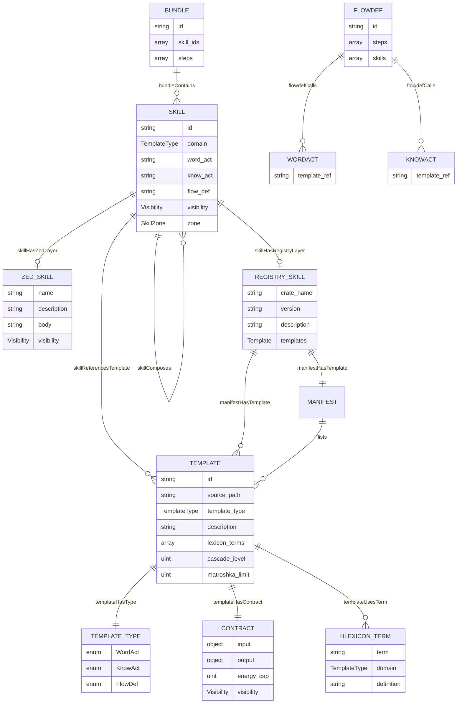
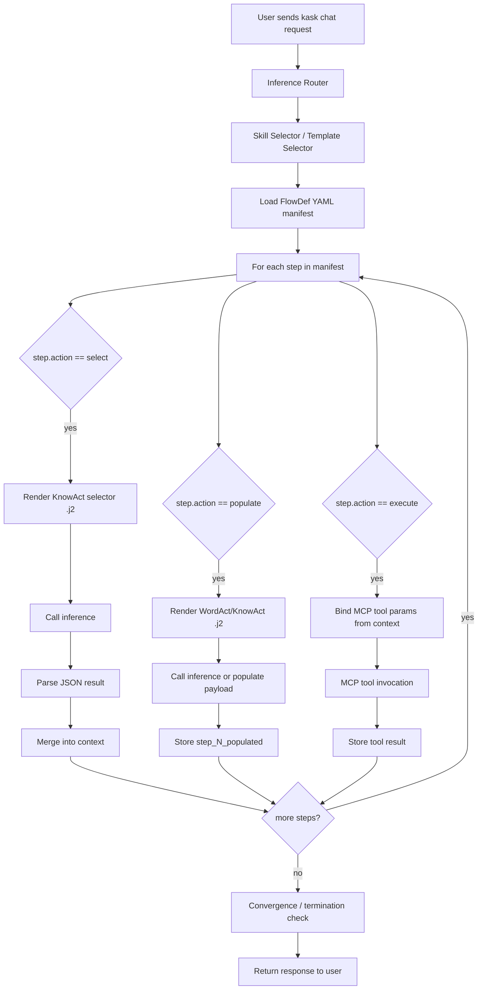

# hKask Dual-Layer Skill System — RDF + ER Model

**Date:** 2026-06-16  
**Scope:** `.agents/skills/*` (Zed layer), `registry/templates/*` (runtime layer), and the hKask code that loads/executes them.

---

## 1. RDF Ontology

### Entities

| Entity | Description | Canonical hKask Type |
|--------|-------------|----------------------|
| `Skill` | A user-facing capability, composed of templates | `hkask_types::ports::Skill` |
| `ZedSkill` | The companion-guide artifact for the Zed coding agent | `.agents/skills/<name>/SKILL.md` |
| `RegistrySkill` | The runtime artifact loaded by the registry index | `registry/templates/<name>/manifest.yaml` + `*.j2` |
| `Template` | A renderable artifact with a typed contract | `hkask_types::ports::RegistryEntry` |
| `WordAct` | Atomic speech/action `.j2` template — "what to say" | `TemplateType::WordAct` |
| `KnowAct` | Reasoning/evaluation `.j2` template — "how to think" | `TemplateType::KnowAct` |
| `FlowDef` | YAML process manifest — "what to do" | `TemplateType::FlowDef` (`BundleManifest`) |
| `Manifest` | Registry manifest describing a template crate | `registry/templates/<name>/manifest.yaml` |
| `hLexiconTerm` | Canonical vocabulary term | `hkask_types::lexicon::LexiconTerm` |
| `Contract` | Typed `input`/`output` schema on a `.j2` | frontmatter `contract:` block |
| `CnsSpan` | Observability span registered in CNS | `hkask_types::cns::CnsSpan` |
| `Bundle` | Curated composition of calibrated primary skills | `hkask_types::bundle::BundleManifest` |

### Relations

| Relation | Domain → Range | Meaning |
|----------|---------------|---------|
| `skillHasZedLayer` | `Skill` → `ZedSkill` | Companion guide exists |
| `skillHasRegistryLayer` | `Skill` → `RegistrySkill` | Runtime templates exist |
| `manifestHasTemplate` | `Manifest` → `Template` | Manifest lists template entries |
| `templateHasType` | `Template` → `{WordAct, KnowAct, FlowDef}` | Runtime type discriminator |
| `templateHasContract` | `Template` → `Contract` | Input/output schema |
| `templateUsesTerm` | `Template` → `hLexiconTerm` | Lexicon grounding |
| `skillReferencesTemplate` | `Skill` → `Template` | `word_act`, `know_act`, or `flow_def` pointer |
| `flowdefCalls` | `FlowDef` → `{WordAct, KnowAct}` | YAML step references a `.j2` via `template_ref` |
| `skillComposes` | `Skill` → `Skill` | A skill may invoke another skill's templates |
| `bundleContains` | `Bundle` → `Skill` | Bundle manifest lists constituent skills |

### Invariants

```text
1. ∀ Template t: t.template_type ∈ {WordAct, KnowAct, FlowDef}
2. ∀ .j2 file f: f.template_type ∈ {WordAct, KnowAct}
   (FlowDef has file extension .yaml; .j2 extension implies WordAct or KnowAct)
3. ∀ FlowDef m: m is a YAML BundleManifest with select/populate/execute steps
4. A Skill is complete ⇔ skillHasZedLayer(s) ∧ skillHasRegistryLayer(s)
5. template_type DDMVSS aliases (Cognition, Prompt, Process) MUST NOT appear in runtime frontmatter
6. Bundles are curated compositions of primary skills, not a separate template type
```

---

## 2. Mermaid ER Diagram



---

## 3. Mermaid Flowchart: User Request → FlowDef → WordAct/KnowAct Cascade



---

## 4. Key Code Citations

- `crates/hkask-types/src/lexicon.rs:18-35` — `TemplateType` enum with file-extension mapping.
- `crates/hkask-types/src/lexicon.rs:64-70` — `file_extension()` returns `"yaml"` for `FlowDef`, `"j2"` for `WordAct`/`KnowAct`.
- `crates/hkask-templates/src/registry.rs:1-38` — Registry stores `RegistryEntry` templates and `BundleManifest` bundles; comment states FlowDef is YAML.
- `crates/hkask-templates/src/executor.rs:1-88` — `ManifestExecutor` executes `BundleManifest` YAML, rendering `.j2` templates in select/populate steps.
- `crates/hkask-templates/src/skill_loader.rs:1-184` — `SkillLoader` reads `.agents/skills/*/SKILL.md` frontmatter only; does not parse body or link to registry templates.

---

## 5. Implications

- The Zed layer (`SKILL.md`) is a **companion guide** for the coding agent. It is parsed for name/description/visibility and registered as a `Skill`, but its body text is **not** executed at runtime.
- The runtime layer (`registry/templates/<name>/`) contains the actual executable templates: `.j2` files rendered by `ManifestExecutor` and `.yaml` `FlowDef` manifests executed as process cascades.
- A `.j2` file declaring `template_type: FlowDef` is a category error: the runtime type system says FlowDef is `.yaml`.
- A bundle is a `BundleManifest` (`.yaml`) that references calibrated primary skills; it should not add new `.j2` template types.
