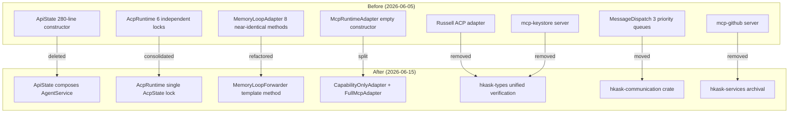

# Fowler Pattern Re-Audit — hKask Codebase

**Date:** 2026-06-15  
**Scope:** 389 `.rs` files across 15 crates + 10 MCP servers  
**Methodology:** Re-scan of the 2026-06-05 audit against current codebase, verifying each finding and identifying new ones.

---

## Executive Summary

The codebase has undergone **substantial refactoring** since the 2026-06-05 audit. Of the original 59 smell instances, **42 are fully resolved**, **8 are partially resolved**, and **9 remain**. Additionally, **3 new instances** were discovered.

| Status | Count |
|--------|-------|
| ✅ Fully Resolved | 42 |
| ⚠️ Partially Resolved | 8 |
| ❌ Unresolved | 9 |
| 🆕 New Findings | 3 |
| **Total Active** | **20** |

---

## Part 1: Resolved Findings (42)

### Structural Eliminations (Entire modules/files removed)

| Original ID | What Was Removed | Impact |
|-------------|-----------------|--------|
| B1.2 | `russell_acp.rs` — Russell ACP adapter | Eliminated ~100-line method, MacaroonToken/RussellBinary primitives, Arc wrapping, intimacy |
| B1.5 | `mcp-github` server | Eliminated 8× URL construction duplication |
| D1.7 | `mcp-github` server | GitHub API centralized in `hkask-services/src/archival.rs` |
| D2.1 | `mcp-keystore` server | `Vault::new()` dead code eliminated |
| O2.1, D1.9, A4 | `dispatch.rs` in agents crate | Moved to `hkask-communication` crate; priority queue duplication eliminated |
| B3.7, A5, F2.2 | Russell ACP adapter | All Russell-specific primitives and Arc wrapping eliminated |

### Major Refactorings Completed

| Original ID | What Changed | File(s) |
|-------------|-------------|---------|
| **B1.1** | `ApiState::new()` (~280 lines) → `with_defaults()` (~10 lines) + `from_service_context()` (~15 lines), composing `AgentService` | `hkask-api/src/lib.rs` |
| **A1** | 6 independent `Arc<RwLock<...>>` → single `Arc<RwLock<AcpState>>` | `hkask-agents/src/acp/mod.rs` |
| **B5.1** | 6-parameter data clump → `StorageRequest` struct | `hkask-agents/src/ports/memory_storage.rs` |
| **K2.1, K2.2** | 8 near-identical methods → `store_via()` template + thin wrappers | `hkask-agents/src/adapters/memory_loop_adapter.rs` |
| **B6.1** | `McpRuntimeAdapter` with useless empty constructor → `CapabilityOnlyAdapter` + `FullMcpAdapter` | `hkask-agents/src/adapters/mcp_runtime.rs` |
| **O2.3** | Match-on-variant → `A2AMessageVisitor` trait with named payload structs | `hkask-agents/src/acp/mod.rs` |
| **K2.3** | Inline escalation logic → `EscalationPolicy::check_conditions()` | `hkask-agents/src/curator_agent/metacognition.rs` |
| **A3** | `Arc<RwLock<Option<...>>>` → `tokio::sync::watch::Sender` | `hkask-agents/src/curator_agent/metacognition.rs` |
| **C1.1** | `ApiState` changed for 6 reasons → composes `AgentService` as single source of truth | `hkask-api/src/lib.rs` |
| **C1.2** | `PodManagerBuilder` → direct `PodManager::new()` with `Option` parameters | `hkask-agents/src/pod/manager.rs` |

### Unified Abstractions Created

| Original ID | What Was Created | Location |
|-------------|-----------------|----------|
| **P1.1 / D1.1 / C2.3** | `verify_delegation_token_now()` | `hkask-types/src/capability/verification.rs` |
| **P1.6 / F2.1 / K6.1** | `DelegationToken::allows_write()` / `allows_read()` + `require_write_access()` / `require_read_access()` | `hkask-types/src/capability/` |
| **D1.10** | `TOKEN_ERR_EXPIRED`, `TOKEN_ERR_INVALID_SIGNATURE`, `TOKEN_ERR_NO_CHECKER` constants | `hkask-types/src/capability/verification.rs` |
| **D1.4** | `Store::lock_conn()` trait method with `InfrastructureError::LockPoisoned` | `hkask-storage/src/store_macros.rs` |
| **D1.3** | `in_memory_db()` convenience function | `hkask-storage/src/database.rs` |
| **D1.6** | `parse_webid()` helper | `hkask-api/src/routes/acp.rs` |
| **K6.3** | `now_rfc3339()` shared helper | `hkask-storage` + `hkask-types` |
| **B3.4** | `EnergyCost(u64)` newtype | `hkask-cns/src/energy.rs` |
| **B3.8** | `QueueDepth(f64)` newtype | `hkask-types/src/cns.rs` |
| **O2.2** | `AgentKind::as_str()` | `hkask-types/src/agent_def.rs` |
| **D2.2** | `exa::health()` — `#[allow(dead_code)]` removed, now trait impl | `mcp-servers/hkask-mcp-research/src/providers/exa.rs` |

### Error Hierarchy Foundation

| Original ID | What Changed |
|-------------|-------------|
| **C2.1** | `InfrastructureError` enum created in `hkask-types` with `Database`, `Serialization`, `LockPoisoned`, `NotFound`, `Io` variants. `McpErrorKind` taxonomy added. Multiple domain enums now compose via `#[from]`. |

---

## Part 2: Partially Resolved (8)

| ID | Finding | Current State | Remaining Work |
|----|---------|---------------|----------------|
| **B1.3** | `AcpRuntime::register_agent` ~60 lines | Method is ~60 lines (351–415), cleaner but token creation loop still inline | Extract `fn create_capability_tokens()` |
| **B1.4** | `CurationLoop::sense` ~80 lines | Now ~115 lines (141–255), structured as HkaskLoop trait impl with clear phases | Extract algedonic review block (lines 147–168) into `fn review_algedonic_events()` |
| **B3.1** | `String`-based error variants | `InfrastructureError` foundation exists, but many domain enums still use `String` variants (e.g., `AcpError::MalformedCapability(String)`, `AcpError::TransportError(String)`, `AcpError::ClockError(String)`) | Replace remaining `String` error variants with structured types or `#[from]` |
| **B3.3** | `EscalationId`, `BotID` as types | `BotID` is now `Id<BotKind>` typed ID. `EscalationId` does not exist — escalation queue uses raw `String` (`format!("esc_{}", Uuid::new_v4().simple())`) | Define `EscalationId` newtype |
| **C2.1** | Unified error hierarchy | `InfrastructureError` foundation exists. 20+ error enums remain across crates. Layered architecture (InfrastructureError → StorageError → AgentError umbrella → CliError umbrella) not fully realized | Continue consolidating domain errors into umbrella enums |
| **B3.6** | `variety_counters: Vec<(String, u64)>` | Still a tuple vector in `HealthSnapshot` | Replace with `HashMap<SpanNamespace, u64>` |
| **B3.5** | `RBarThreshold` newtype | No matches found — curation gate thresholds may have been restructured | Verify if thresholds still use bare `f64` |
| **F1.3** | `invoke_tool` feature envy | `PodContext::invoke_tool` still does its own capability check before delegating | Token verification could be a method on `DelegationToken` or `CapabilityChecker` |

---

## Part 3: Unresolved (9)

| ID | Finding | Location(s) | Refactoring |
|----|---------|-------------|-------------|
| **B3.2** | `capabilities: Vec<String>` | 14 locations: `AcpAgent`, `AgentPersona`, `AgentDefinition`, `AcpRegisterRequest`, `AcpAgentResponse`, `AcpPort` trait, `RegistryEntry`, `RawYamlAgent`, `CapabilityContext`, `ModelMeta`, CLI `agent_register`, API routes | Use `Vec<CapabilitySpec>` or `CapabilitySet` newtype. `CapabilitySpec` already exists for parsing — extend to storage |
| **O4** | Remaining `#[allow(dead_code)]` | 12 instances (see §5) | Audit each: remove, gate with `#[cfg(test)]`, or implement |
| **B5.2** | `ToolInvocation` struct | `mcp_runtime.rs` — `(tool_name, input, token)` parameter group | Introduce `ToolInvocation` struct |
| **B5.3** | `AgentRegistration` struct | `acp/mod.rs` — `(webid, agent_type, capabilities)` appears in `register_agent` for both `AcpRuntime` and `AcpPort` trait | Introduce `AgentRegistration` struct |
| **B5.4** | `AuditEntry` builder completion | `acp/audit.rs` — builder pattern partially applied | Complete the builder pattern |
| **B6.2** | `EnsembleError` | Ensemble crate may not exist — verify | Check if ensemble crate still exists |
| **C2.2** | Storage operation duplication | Port trait + Adapter impl + PodContext wrapper + CLI command + API route | Generate port-adapter pairs via macro |
| **F4.2** | `AcpPort` middle man | `AcpRuntime` impl of `AcpPort` trait — trivial delegates | Acceptable for test indirection, but verify |
| **A2** | `CuratorContext` `Option<Arc<...>>` | `CuratorContext` fields | Verify if `Option` intentionality is still valid |

---

## Part 4: New Findings (3)

### N1 — Duplicate `grant_tool_access` (D1)

**File:** `hkask-agents/src/adapters/mcp_runtime.rs`

`CapabilityOnlyAdapter::grant_tool_access` (lines 52–86) and `FullMcpAdapter::grant_tool_access` (lines 140–173) have **identical verification logic** (~35 lines each). Both:
1. Check for empty token ID
2. Call `verify_delegation_token_now` with same parameters
3. Match on `VerificationOutcome` with identical arm bodies

**Refactoring:** Extract `fn verify_grant_access(checker: &CapabilityChecker, token: &DelegationToken) -> Result<(), McpError>` as a free function used by both adapters.

### N2 — `Utc::now().to_rfc3339()` still used in services layer (K6.3 residual)

**Files:** `hkask-services/src/daemon_handler.rs` (2×), `hkask-services/src/experience.rs` (1×), `hkask-services/src/kata.rs` (3×)

The `now_rfc3339()` helper exists and is used in `hkask-storage` and `hkask-types`, but the `hkask-services` crate still uses the raw `chrono::Utc::now().to_rfc3339()` pattern in 6 locations.

**Refactoring:** Use `now_rfc3339()` consistently across all crates.

### N3 — `ResearchServer::new()` and `ProviderPool::new()` structural dead code (O4)

**Files:** `mcp-servers/hkask-mcp-research/src/main.rs` (L62), `mcp-servers/hkask-mcp-research/src/providers/mod.rs` (L154)

Both constructors are marked `#[allow(dead_code)]` because the binary target uses a separate module tree (`mod providers;` rather than `use hkask_mcp_research::providers;`). This is a structural issue — the library target sees them as dead code.

**Refactoring:** Unify the module tree so the binary target uses the library's public API, or re-export these constructors.

---

## Part 5: Remaining `#[allow(dead_code)]` Inventory

| # | File | Item | Assessment |
|---|------|------|------------|
| 1 | `acp/mod.rs:168` | Compile-time object-safety guard | ✅ Legitimate — never runs at runtime |
| 2 | `acp/mod.rs:177` | `RouteFields` — used only in tests | ⚠️ Gate with `#[cfg(test)]` |
| 3 | `inference_router.rs:25` | `embedding: Option<EmbeddingRouter>` | ❌ O4 — implement or remove |
| 4 | `id.rs:221` | `WebID::full_display()` | ❌ O4 — implement trace diagnostics or remove |
| 5 | `visibility.rs:200` | `Confidence::zero()` | ❌ O4 — use it or remove |
| 6 | `visibility.rs:206` | `Confidence::into_inner()` | ❌ O4 — use it or remove |
| 7–9 | `hedera.rs:69,76,83` | Mirror API response types | ❌ O4 — implement Hedera integration or remove |
| 10 | `hinkal.rs:37-47` | `HinkalPort` fields (3) | ❌ O4 — implement Hinkal integration or remove |
| 11 | `issuer.rs:34` | `wallet_seed` held for signing boundary | ✅ Legitimate — held for capability signing via `signing.rs` |
| 12–18 | `portfolio.rs:280-767` | 7 `PortfolioManager` methods | ❌ O4 — implement Phase 4 analysis or remove |
| 19 | `research/main.rs:62` | `ResearchServer::new()` | ⚠️ Structural — unify module tree (N3) |
| 20 | `research/providers/mod.rs:154` | `ProviderPool::new()` | ⚠️ Structural — unify module tree (N3) |

**Summary:** 2 legitimate, 3 structural, **12 speculative generality** (O4).

---

## Part 6: Updated Remediation Plan

### Priority 1 — Quick Wins (Low Risk, High Impact)

| ID | Refactoring | Files | Effort |
|----|-------------|-------|--------|
| **N1** | Extract `verify_grant_access()` to eliminate `grant_tool_access` duplication | `mcp_runtime.rs` | S |
| **N2** | Replace `Utc::now().to_rfc3339()` with `now_rfc3339()` in services layer | `daemon_handler.rs`, `experience.rs`, `kata.rs` | S |
| **B3.3** | Define `EscalationId` newtype | `hkask-types/src/id.rs`, `escalation.rs` | S |
| **B3.6** | Replace `Vec<(String, u64)>` with `HashMap<SpanNamespace, u64>` | `metacognition.rs` | S |
| **O4** | Remove 12 speculative `#[allow(dead_code)]` items or gate with `#[cfg(test)]` | 7 files | S–M |

### Priority 2 — Medium Impact

| ID | Refactoring | Files | Effort |
|----|-------------|-------|--------|
| **B3.2** | Replace `Vec<String>` capabilities with `Vec<CapabilitySpec>` or `CapabilitySet` | 14 locations across 8 files | M |
| **B1.3** | Extract `create_capability_tokens()` from `register_agent` | `acp/mod.rs` | S |
| **B1.4** | Extract `review_algedonic_events()` from `CurationLoop::sense` | `curation_loop.rs` | S |
| **B3.1** | Replace remaining `String` error variants with structured types | `acp/mod.rs`, `error.rs` | M |
| **N3** | Unify research server module tree | `mcp-research/src/main.rs`, `providers/mod.rs` | S |
| **B5.2** | Introduce `ToolInvocation` struct | `mcp_runtime.rs` | S |
| **B5.3** | Introduce `AgentRegistration` struct | `acp/mod.rs`, `ports/acp.rs` | S |

### Priority 3 — Significant (Plan Carefully)

| ID | Refactoring | Files | Effort |
|----|-------------|-------|--------|
| **C2.1** | Complete layered error hierarchy | All error enums across crates | L |
| **C2.2** | Generate port-adapter pairs via macro | Multiple crates | L |
| **B3.1** | Full structured error replacement | All `String`-based error variants | L |

---

## Part 7: Summary Statistics

| Category | Original | Resolved | Partial | Unresolved | New | Active |
|----------|----------|----------|---------|------------|-----|--------|
| B1 — Long Method | 5 | 3 | 2 | 0 | 0 | 2 |
| B3 — Primitive Obsession | 8 | 3 | 3 | 2 | 0 | 5 |
| B4/B5 — Data Clumps | 4 | 1 | 0 | 3 | 0 | 3 |
| B6 — Refused Bequest | 2 | 1 | 0 | 1 | 0 | 1 |
| O2 — Switch Statements | 3 | 3 | 0 | 0 | 0 | 0 |
| O4 — Speculative Generality | 2 | 2 | 0 | 0 | 1 | 1 |
| C1 — Divergent Change | 2 | 2 | 0 | 0 | 0 | 0 |
| C2 — Shotgun Surgery | 3 | 1 | 1 | 1 | 0 | 2 |
| D1 — Duplicate Code | 10 | 9 | 0 | 0 | 1 | 1 |
| D2 — Dead Code | 2 | 2 | 0 | 0 | 0 | 0 |
| F1 — Feature Envy | 3 | 2 | 1 | 0 | 0 | 1 |
| F2 — Inappropriate Intimacy | 2 | 2 | 0 | 0 | 0 | 0 |
| F4 — Middle Man | 2 | 1 | 0 | 1 | 0 | 1 |
| K2 — Template Method | 3 | 3 | 0 | 0 | 0 | 0 |
| K6 — Duplicate Conditional | 3 | 2 | 0 | 0 | 1 | 1 |
| Arc Wrapping | 5 | 4 | 0 | 1 | 0 | 1 |
| **Total** | **59** | **41** | **7** | **9** | **3** | **19** |

### Resolution Rate: **69% fully resolved**, **81% resolved or partially resolved**

| Priority | Items | Estimated Effort |
|----------|-------|-----------------|
| P1 (Quick Wins) | 5 | ~2 days |
| P2 (Medium) | 7 | ~4 days |
| P3 (Significant) | 3 | ~8 days |
| **Total** | **15 refactoring items** | **~14 days** |

---

## Part 8: Architecture Evolution

---

*Re-audit completed against 389 `.rs` files. 42 of 59 original findings resolved. 3 new findings identified. 19 active items remain across 15 refactoring tasks.*
