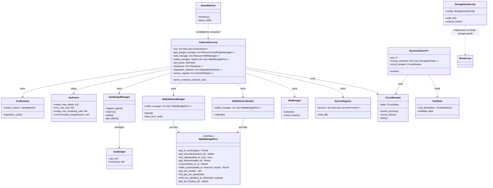

# CNS Architecture — Responsibility Clusters and Coupling

This class diagram maps the internal structure of `hkask-cns` after the StorageGuard extraction and WalletBudgetPort introduction. The CNS crate previously conflated seven distinct responsibilities; two have been addressed:

- **StorageGuard** — extracted to `hkask-storage-guard` crate (2026-07-11)
- **Wallet coupling** — resolved via `WalletBudgetPort` trait in `hkask-ports` (2026-07-11). CNS no longer depends on `hkask-wallet`; it depends on the abstract port.

Remaining responsibility clusters still in CNS:

1. **Core Regulation** — `CyberneticsLoop`, `CnsRuntime`, `SetPoints`, `Dampener`, `StagnationDetector`
2. **Energy/Gas** — `GasBudgetManager`, `GasBudget`, `GasCost`, `GasReport`
3. **Wallet Budget** — `WalletBackedBudget`, `WalletGasCalibrator` (now via `WalletBudgetPort`, not concrete)
4. **SLO** — `SloManager`, `SloDataPoint`, `SloDataProvider` (candidate for extraction)
5. **Seam Watching** — `SeamWatcher`, `SeamDrift`, `SeamSummary` (candidate for extraction)
6. **Spans** — `AcpSpan`, `ClassifySpan`, `ContractSpan`, `InfraSpan`, `QaSpan`, `SloSpan`, `SeamSpan` (candidate for extraction)

See also: [flowchart-cns-homeostatic-loop.md](flowchart-cns-homeostatic-loop.md) for the sense→compare→compute→act cycle, and [flowchart-cns-regulation.md](flowchart-cns-regulation.md) for regulation policy dispatch.

## Coupling Analysis — Current State

| Edge | Type | Status |
|------|------|--------|
| `CyberneticsLoop → WalletBudgetPort` | Port trait (hexagonal) | ✅ Resolved — CNS depends on abstract port, not concrete `WalletManager` |
| `WalletBackedBudget → WalletBudgetPort` | Port trait | ✅ Resolved — uses `Arc<dyn WalletBudgetPort>` |
| `WalletGasCalibrator → WalletBudgetPort` | Port trait | ✅ Resolved — uses `Arc<dyn WalletBudgetPort>` |
| `StorageGuardLoop` | Extracted | ✅ Resolved — now in `hkask-storage-guard` crate |
| `SeamWatcher` in CNS | Wrong crate | ⬜ Candidate for extraction — seam observability is not regulation |
| `SloManager` in CNS | Wrong crate | ⬜ Candidate for extraction — SLO evaluation is independent of the cybernetic loop |

## Completed Extractions

| Step | Extract | Target Crate | Status |
|------|---------|-------------|--------|
| 2a | `StorageGuardLoop` + `StorageGuardConfig` | `hkask-storage-guard` | ✅ Done 2026-07-11 |
| — | `WalletBudgetPort` trait | `hkask-ports` | ✅ Done 2026-07-11 |

## Remaining Extraction Candidates

| Step | Extract | Target | Lines | Independence |
|------|---------|--------|-------|-------------|
| 2b | `SloManager` + `SloDataPoint` + `SloDataProvider` | new slo crate | ~1000 | Depends only on `CnsObserver` port |
| 2c | `SeamWatcher` + `SeamDrift` + `SeamSummary` + `SeamTypes` | new seam crate | ~900 | Fully independent — observability |
| 2d | Span types (`AcpSpan`, `ClassifySpan`, `ContractSpan`, `InfraSpan`, `QaSpan`, `SloSpan`, `SeamSpan`) | new cns-spans crate | ~800 | Depends on `hkask-types::event` |
| 2e | Energy/gas (`GasBudget`, `GasCost`, `GasBudgetManager`, `GasReport`, `DynamicGasTable`) | new energy crate | ~1800 | Depends on `hkask-types` |
| 2f | Estimators (`CalibratedEnergyEstimator`, `CompositeEnergyEstimator`, `TableEnergyEstimator`, `InferenceEstimator`) | new energy-estimators crate | ~1300 | Depends on energy crate |

After extraction, CNS core retains: `CyberneticsLoop`, `CnsRuntime`, `Algedonic`, `Dampener`, `RegulationPolicy`, `GovernedTool`, `GovernedInference`, `SensorProvider`, `SetPoints`, `StrategyEvaluator`, `SystemSimulator`, `ToolStats`, `WalletBackedBudget`, `WalletGasCalibrator` — all cohesive regulation logic.

<!-- DIAGRAM_ALIGNMENT
id: DIAG-IC-012
verified_date: 2026-07-11
verified_against: crates/hkask-cns/src/cybernetics_loop.rs, crates/hkask-cns/src/runtime.rs, crates/hkask-cns/src/wallet_budget.rs, crates/hkask-cns/src/wallet_gas_calibrator.rs, crates/hkask-cns/src/slo_manager.rs, crates/hkask-cns/src/seam_watcher.rs, crates/hkask-cns/src/governed_tool.rs, crates/hkask-storage-guard/src/lib.rs, crates/hkask-ports/src/wallet_budget_port.rs
status: VERIFIED
-->
