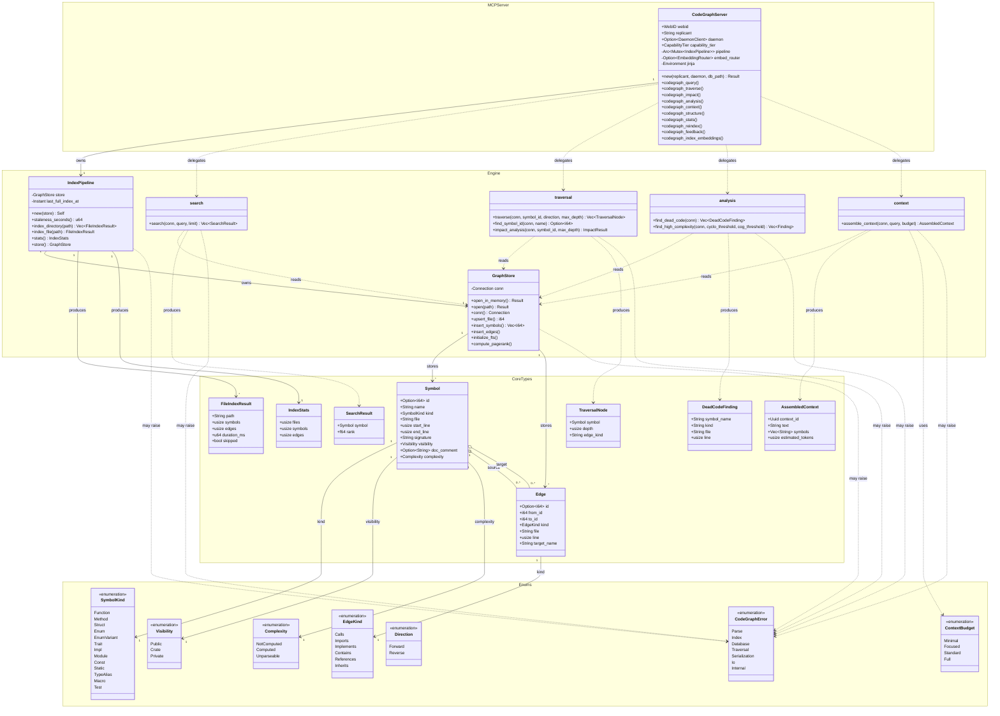

# CodeGraph Type System

The `hkask-codegraph` crate provides a native Rust code understanding engine. It uses tree-sitter to parse Rust source into a semantic graph stored in SQLite, with FTS5 keyword search, recursive CTE graph traversal, impact analysis, dead code detection, and token-budgeted context assembly for LLM prompts.

This diagram shows the core type hierarchy and the relationships between the indexing pipeline, graph store, search engine, and MCP server layer.

### Diagram Notes

- **Symbol** and **Edge** are the core data types. Every Rust function, struct, trait, impl, module, etc. becomes a Symbol. Relationships (calls, imports, containment, trait implementations, inheritance) become Edges.
- **GraphStore** wraps a SQLite connection with `code_files`, `symbols`, `edges` tables plus `symbols_fts` (FTS5) and `symbols_vec` (sqlite-vec 0.1 for embeddings).
- **IndexPipeline** coordinates the full indexing flow: walk files → SHA-256 hash → parse with tree-sitter → extract symbols/edges → batch insert → resolve edge targets.
- **CodeGraphServer** is the thin MCP wrapper exposing 10 tools: `codegraph_query`, `codegraph_traverse`, `codegraph_impact`, `codegraph_analysis`, `codegraph_context`, `codegraph_structure`, `codegraph_stats`, `codegraph_reindex`, `codegraph_feedback`, `codegraph_index_embeddings`.
- **ContextBudget** controls token limits for LLM prompt assembly: Minimal (512), Focused (2048), Standard (4096), Full (8192).
- **CodeGraphError** uses `thiserror` with variants for Parse, Index, Database, Traversal, Serialization, Io, and Internal.

### Related Documentation

- [`class-service-layer.md`](class-service-layer.md) — Service layer class diagram (hexagonal ports)
- [`sequence-mcp-tool-dispatch.md`](sequence-mcp-tool-dispatch.md) — MCP tool dispatch sequence
- [`../architecture/hKask-architecture-master.md`](../architecture/hKask-architecture-master.md) — Architecture master (four patterns, crate-to-loop mapping)
- [`hkask-codegraph`](../../crates/hkask-codegraph/) — Implementation crate (original design plan absorbed)
