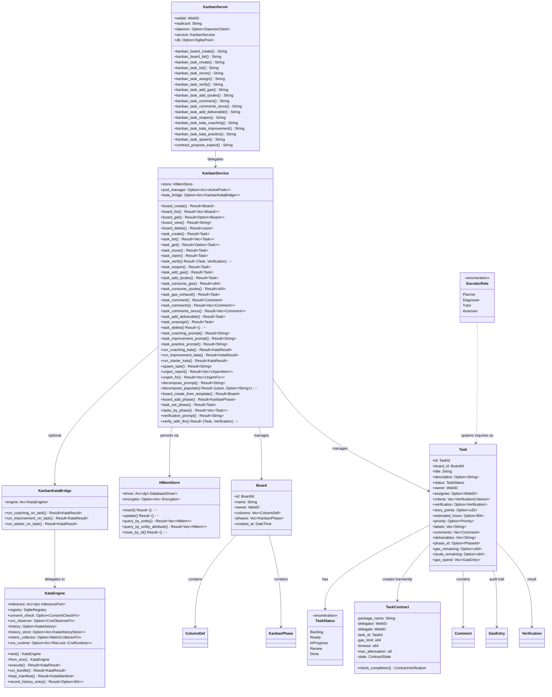

# Kata-Kanban MCP Server — Architecture Class Diagram

**Diataxis type:** Reference
**Status:** Current (v0.31.0)

This diagram maps the structural relationships in the `hkask-mcp-kata-kanban` MCP server and its backing `hkask-services-kata-kanban` service crate. The MCP server (`KanbanServer`) is a thin tri-surface wrapper that delegates every tool call to `KanbanService`. The service owns an `HMemStore` (board/task persistence), an optional `ActivePods` (subagent spawning), and an optional `KanbanKataBridge` (full kata execution). The bridge delegates to `KataEngine`, which holds the inference port, template registry, and optional CNS/history/metric callbacks.

Two execution paths exist: (1) **prompt generation** — `task_coaching_prompt` / `task_improvement_prompt` / `task_practice_prompt` produce a rendered string for the caller to feed to an LLM; (2) **full kata execution** — `run_coaching_kata` / `run_improvement_kata` / `run_starter_kata` invoke `KataEngine::execute()` end-to-end with inference, gas tracking, and CNS spans. The MCP surface exposes only path (1); path (2) is available only through the REPL `kask kanban kata` commands and the service API.

Cross-links:
- [Kata PDCA Lifecycle State Machine](../how-to/skills-and-composition.md#kata-pdca-lifecycle-state-machine) — single-pass execution flow
- [Kata-Kanban Execution Boundary](../how-to/skills-and-composition.md#kata-kanban-execution-boundary) — sequence diagram of the two paths
- [Architecture Master: Kata](../architecture/core/hKask-architecture-master.md#kata--cybernetic-capability-development) — canonical kata architecture
- [Service Layer Class Diagram](../explanation/architecture-patterns.md#service-layer-class-diagram) — broader service decomposition

<!-- DIAGRAM_ALIGNMENT
id: DIAG-IC-017
verified_date: 2026-07-20
verified_against: mcp-servers/hkask-mcp-kata-kanban/src/lib.rs:29-34 (KanbanServer struct), crates/hkask-services-kata-kanban/src/kanban/service_impl/service.rs:34-38 (KanbanService struct), crates/hkask-services-kata-kanban/src/bridge.rs:18-20 (KanbanKataBridge struct), crates/hkask-services-kata-kanban/src/kata/mod.rs:76-94 (KataEngine struct), crates/hkask-storage/src/hmem.rs:134-138 (HMemStore struct), crates/hkask-services-kata-kanban/src/kanban/types/task.rs:9-55 (Task struct), crates/hkask-services-kata-kanban/src/kanban/types/status.rs:16-27 (TaskStatus enum), crates/hkask-services-kata-kanban/src/kanban/types/contract.rs:17-40 (TaskContract struct), crates/hkask-services-kata-kanban/src/kanban/socratic.rs:265-270 (SocraticRole enum)
status: VERIFIED
-->
