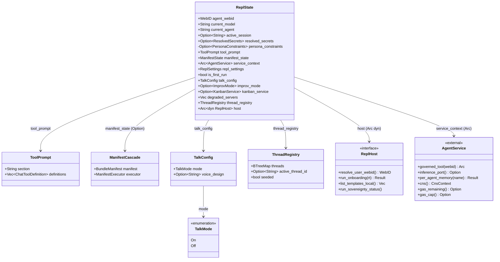

# ReplState Decomposition — Type Hierarchy

Class diagram of `ReplState` and its sub-structs in `crates/hkask-repl/src/lib.rs`. `ReplState` is the central state object for the REPL — all infrastructure (inference, memory, tool dispatch, gas tracking) is accessed through `service_context: Arc<AgentService>`. The sub-structs group paired state to enforce invariants at the type level.

<!-- DIAGRAM_ALIGNMENT
id: DIAG-REPL-002
verified_date: 2026-07-20
verified_against: crates/hkask-repl/src/lib.rs:100-159; crates/hkask-services-context/src/context_impl.rs:103-474
status: VERIFIED
-->

## Design Notes

- **`ManifestState` is a type alias** for `Option<ManifestCascade>`, not a struct. This enforces the "both present or both absent" invariant at the type level — the invalid state `Some(manifest) + None(executor)` is unrepresentable. The previous struct shape with two `Option<T>` fields permitted this invalid state.
- **`TalkMode` is an enum**, not a `bool`. The `enabled: bool` field was replaced with `mode: TalkMode` so the on/off decision is explicit at the type level. The invalid state "off but has voice_design" is still representable (the user can set a voice while talk is off), but the on/off check in the turn pipeline is now a pattern match, not a boolean test.
- **`tool_prompt` is a cache.** It exists because `ToolPort` uses `impl Trait` returns, making `Arc<dyn ToolPort>` infeasible. The cache is refreshed during MCP server start/stop. A future refactor making `ToolPort` dyn-compatible would eliminate this cache.
- **`host: Arc<dyn ReplHost>`** bridges the REPL crate to the CLI binary. The REPL crate cannot depend on `hkask-cli` (dependency direction violation), so `ReplHost` is a trait implemented by `CliHost` in `hkask-cli`. After onboarding, the host is only used for `resolve_user_webid()` in tool invocation — a value already available in `agent_webid` and `service_context.webid()`.
- **Manual `Debug` impl** redacts `resolved_secrets`, `manifest_state`, `service_context`, and `host` so the central state object can be inspected in diagnostics without leaking secrets or hitting non-Debug trait-object bounds.

## Cross-References

- [REPL Specification §3.2 — ReplState](../specifications/REPL-specification.md#32-replstate--central-state-object)
- [ADR-046: REPL Extraction Path](../architecture/ADRs/ADR-046-repl-extraction-path.md)
- [REPL Turn Pipeline Flowchart](flowchart-repl-turn-pipeline.md)
