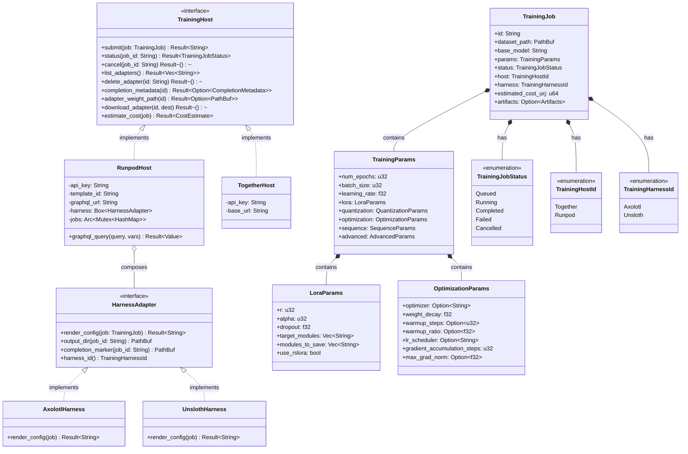

# Training Server Class Diagram

This diagram shows the trait hierarchy and struct composition of the hKask MCP training server's provider layer. It maps the relationships between training hosts, harnesses, and parameter types.

## Design Notes

- `TrainingHost` is the seam for compute backends — new providers (e.g., Baseten, Modal) add without changing the router
- `HarnessAdapter` is the seam for training tooling — renders config in the harness's native format (YAML for Axolotl, Python for Unsloth)
- `RunpodHost` composes a `HarnessAdapter` — the host delegates config generation to the harness
- `TrainingParams` is a deep struct: it contains all hyperparameters as nested sub-structs, giving callers a single entry point
- `LoraParams` defaults: r=16, alpha=32, dropout=0, 7 target modules (all attention + MLP projections)
- `TrainingParams` defaults: LR=1e-4, 3 epochs, batch_size=4
