# TUI Window Trait Hierarchy

**Type:** class diagram | **Target:** `hkask-tui` window architecture | **Diataxis quadrant:** Reference

The `hkask-tui` crate uses a single `Window` trait (9 methods) implemented by 22 concrete window types. Windows that connect to an MCP server additionally implement `McpTabbedWindow` for two-tab Chat/Data layout. All data flows through 15 domain-specific bridge traits, each providing a focused surface for one service domain.

## Diagram

```mermaid
classDiagram
    namespace core {
        class Window {
            <<interface>>
            +id() WindowId
            +title() str
            +kind() WindowKind
            +render(Frame, Rect, bool)
            +handle_key(KeyEvent) bool
            +can_close() bool
            +on_focus()
            +on_blur()
            +tick()
        }
        class McpTabbedWindow {
            <<interface>>
            +active_tab() McpTab
            +set_active_tab(McpTab)
            +chat_state_mut() McpChatState
            +mcp_server_name() str
            +render_chat_tab(Frame, Rect)
            +render_data_tab(Frame, Rect)
            +handle_chat_key(KeyEvent) Option~String~
        }
        class WindowId {
            +Uuid
        }
        class WindowKind {
            <<enumeration>>
            Chat
            CnsMonitor
            Backup
            Registry
            Pods
            Kanban
            Wallet
            Memory
            Companies
            Matrix
            Configuration
            Curator
            Terminal
            Editor
            Training
            Media
            Skills
            Research
            Docproc
            Replica
            Logo
            Scenarios
        }
        class WindowBridges {
            +bridge: Arc~dyn ReplBridge~
            +wallet_bridge: Option~Arc~dyn WalletDataBridge~~
            +config_bridge: Option~Arc~dyn ConfigDataBridge~~
            +backup_bridge: Option~Arc~dyn BackupDataBridge~~
            +registry_bridge: Option~Arc~dyn RegistryDataBridge~~
            +memory_bridge: Option~Arc~dyn MemoryDataBridge~~
            +kanban_bridge: Option~Arc~dyn KanbanDataBridge~~
            +matrix_bridge: Option~Arc~dyn MatrixDataBridge~~
            +media_bridge: Option~Arc~dyn MediaDataBridge~~
            +training_bridge: Option~Arc~dyn TrainingDataBridge~~
            +companies_bridge: Option~Arc~dyn CompaniesDataBridge~~
            +research_bridge: Option~Arc~dyn ResearchDataBridge~~
            +docproc_bridge: Option~Arc~dyn DocprocDataBridge~~
            +replica_bridge: Option~Arc~dyn ReplicaDataBridge~~
            +skills_bridge: Option~Arc~dyn SkillsDataBridge~~
            +scenarios_bridge: Option~Arc~dyn ScenariosDataBridge~~
        }
    }
    namespace bridges {
        class ReplBridge {
            <<interface>>
            +start_inference(String)
            +poll_inference() InferenceState
            +streaming_text() String
            +send_message_blocking(str) TuiTurnResult
            +agent_name() str
            +model_name() str
            +gas_remaining() u64
            +gas_cap() u64
            +cns_alert_count() u32
            +context_pressure() f64
            +mcp_status() (usize, usize)
            +pod_counts() (usize, usize, usize)
            +cns_domains() Vec~(String, bool)~
            +send_curator_message(str) String
            +start_scoped_inference(String, str)
        }
        class WalletDataBridge {
            <<interface>>
            +wallet_balance() (u64, u64, u64)
            +wallet_transactions(usize) Vec~WalletTxSummary~
            +gas_per_rjoule() u64
            +transaction_count() u64
        }
    }
    namespace windows {
        class ChatWindow
        class CnsMonitorWindow
        class CuratorWindow
        class KanbanWindow
        class WalletWindow
        class MemoryWindow
        class CompaniesWindow
        class MatrixWindow
        class TrainingWindow
        class MediaWindow
        class SkillsWindow
        class ResearchWindow
        class DocprocWindow
        class ReplicaWindow
        class ScenariosWindow
        class RegistryWindow
        class BackupWindow
        class ConfigurationWindow
        class PodsWindow
        class TerminalWindow
        class EditorWindow
        class LogoWindow
    }
    Window <|-- ChatWindow : implements
    Window <|-- CnsMonitorWindow : implements
    Window <|-- CuratorWindow : implements
    Window <|-- KanbanWindow : implements
    Window <|-- WalletWindow : implements
    Window <|-- MemoryWindow : implements
    Window <|-- CompaniesWindow : implements
    Window <|-- MatrixWindow : implements
    Window <|-- TrainingWindow : implements
    Window <|-- MediaWindow : implements
    Window <|-- SkillsWindow : implements
    Window <|-- ResearchWindow : implements
    Window <|-- DocprocWindow : implements
    Window <|-- ReplicaWindow : implements
    Window <|-- ScenariosWindow : implements
    Window <|-- RegistryWindow : implements
    Window <|-- BackupWindow : implements
    Window <|-- ConfigurationWindow : implements
    Window <|-- PodsWindow : implements
    Window <|-- TerminalWindow : implements
    Window <|-- EditorWindow : implements
    Window <|-- LogoWindow : implements
    Window <|-- McpTabbedWindow : extends
    McpTabbedWindow <|-- KanbanWindow : implements
    McpTabbedWindow <|-- MemoryWindow : implements
    McpTabbedWindow <|-- MatrixWindow : implements
    McpTabbedWindow <|-- TrainingWindow : implements
    McpTabbedWindow <|-- MediaWindow : implements
    McpTabbedWindow <|-- CompaniesWindow : implements
    McpTabbedWindow <|-- ResearchWindow : implements
    McpTabbedWindow <|-- DocprocWindow : implements
    McpTabbedWindow <|-- ReplicaWindow : implements
    McpTabbedWindow <|-- SkillsWindow : implements
    Window o-- WindowKind : kind
    Window ..> WindowBridges : created via
    WindowBridges o-- ReplBridge : 1
    WindowBridges o-- WalletDataBridge : 0..1
    ChatWindow ..> ReplBridge : uses
    KanbanWindow ..> ReplBridge : uses
    KanbanWindow ..> KanbanDataBridge : uses
```

## Key Relationships

| From | To | Cardinality | Notes |
|------|----|------------|-------|
| `Window` trait | 22 concrete windows | 1 implements N | Object-safe trait, `Box<dyn Window>` storage |
| `McpTabbedWindow` trait | 10 MCP-scoped windows | 1 implements N | Two-tab Chat/Data pattern |
| `WindowBridges` | `ReplBridge` | 1:1 | Required — every window needs chat |
| `WindowBridges` | Domain bridges | 1:0..1 each | Optional — wired via builder pattern |
| `ChatWindow` | `ReplBridge` | uses | Async inference + streaming text |

## Bridge Trait Surface

Each of the 15 domain bridge traits exposes ≤7 methods, following deep-module discipline:

| Bridge | Methods | Purpose |
|--------|---------|---------|
| `ReplBridge` | 15 | Chat/inference — the primary interaction bridge; exceeds ≤7 |
| `WalletDataBridge` | 4 | rJoule balance, transactions, conversion rate |
| `ConfigDataBridge` | 1 | Configuration snapshot |
| `BackupDataBridge` | 5 | Snapshots, restore, verify, prune |
| `RegistryDataBridge` | 6 | Templates, skills, styles, bundles |
| `MemoryDataBridge` | 4 | Episodic/semantic memory, consolidation |
| `KanbanDataBridge` | 5 | Task board CRUD + status transitions |
| `MatrixDataBridge` | 4 | Rooms, messages, connection status |
| `MediaDataBridge` | 4 | Gallery status, images, audio, video |
| `TrainingDataBridge` | 4 | Adapters, sessions, deployments |
| `CompaniesDataBridge` | 3 | Profiles, financials, portfolios |
| `ResearchDataBridge` | 4 | Web search, RSS feeds, extraction |
| `DocprocDataBridge` | 4 | Chunking, QA pairs, RDF extraction |
| `ReplicaDataBridge` | 3 | Replica CRUD + generation |
| `SkillsDataBridge` | 4 | Skill list, install, activate, execute |
| `ScenariosDataBridge` | 5 | Event trees, forecasts, calibration |

---

*Generated from `crates/hkask-tui/src/window.rs`, `bridges/mod.rs`, `mcp_tabbed.rs`, `window_catalog.rs` — v0.31.0*
