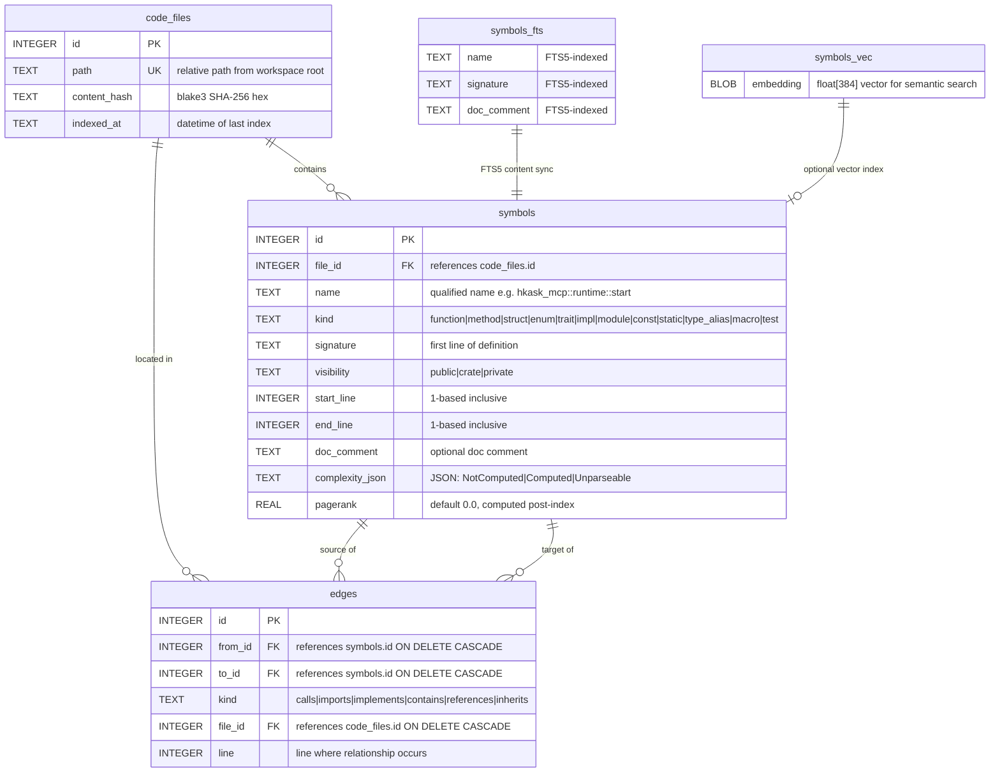

# CodeGraph Database Schema

The codegraph engine stores its semantic graph in SQLite with 3 base tables, 2 virtual tables, 9 indexes, and 3 FTS5 sync triggers. WAL mode enables concurrent readers during write transactions. Foreign keys are enforced at the database level for edge integrity.

The schema follows the same SQLite-native pattern as hKask's storage layer — no external graph database, no in-memory graph. All traversal is done via recursive CTEs in SQL.

### Notable Indexes

| Index | Table | Columns | Purpose |
|-------|-------|---------|---------|
| `idx_symbols_name` | symbols | name | Name-based lookup (`find_symbol_id`) |
| `idx_symbols_kind` | symbols | kind | Filter by symbol type |
| `idx_symbols_file` | symbols | file_id | Per-file symbol queries |
| `idx_symbols_pagerank` | symbols | pagerank DESC | Top-symbols ranking (`codegraph_structure`) |
| `idx_edges_from` | edges | from_id | Forward traversal (dependencies) |
| `idx_edges_to` | edges | to_id | Reverse traversal (callers) |
| `idx_edges_kind` | edges | kind | Filter by relationship type |

### FTS5 Triggers

Three triggers keep `symbols_fts` synchronized with `symbols`:
- `symbols_ai` — AFTER INSERT: copies name, signature, doc_comment into FTS index
- `symbols_ad` — AFTER DELETE: removes from FTS index
- `symbols_au` — AFTER UPDATE: delete old + insert new (no in-place FTS update)

### Design Decisions

- **Recursive CTEs, not in-memory graphs.** Traversal is pure SQL (`WITH RECURSIVE`), bounded by `max_depth`. This avoids loading the entire graph into memory and allows concurrent reads through WAL mode.
- **SHA-256 content hashing.** Every indexed file's hash is stored in `code_files.content_hash`. On re-index, files with matching hashes are skipped — no tree-sitter work for unchanged code.
- **sqlite-vec is optional.** The `symbols_vec` table uses `CREATE VIRTUAL TABLE IF NOT EXISTS`. If sqlite-vec isn't loaded, FTS5 keyword search still works — vector search degrades gracefully.
- **Foreign keys enforced.** `ON DELETE CASCADE` on both `symbols` and `edges` foreign keys ensures referential integrity without manual cleanup.

### Related Documentation

- [`class-codegraph-types.md`](class-codegraph-types.md) — Type system class diagram
- [`flowchart-codegraph-pipeline.md`](flowchart-codegraph-pipeline.md) — Indexing pipeline flowchart
- [`../architecture/hKask-architecture-master.md`](../architecture/hKask-architecture-master.md) — Architecture master
