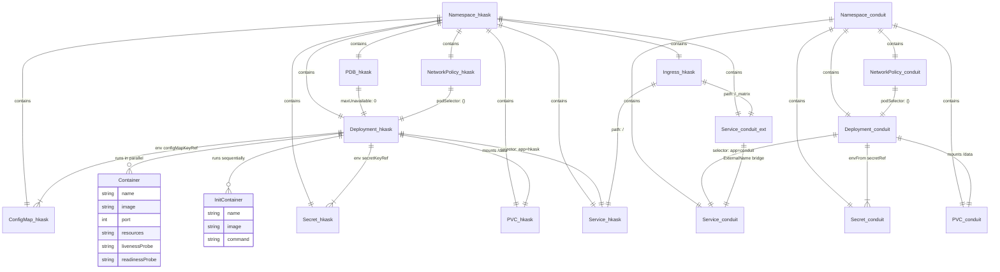

# K8s Resource Relationships

How Kubernetes resources in the hKask deployment relate to each other — what owns what, what references what. Extracted from `deploy/k8s/*.yaml`. Uses ERD notation for K8s resource dependency mapping.

**Key relationships:**
- **Namespace** owns all resources within it — deleting a namespace cascades to everything
- **Deployment** manages pods via label selectors — changing the selector orphans existing pods
- **PVC** persists independently of the Deployment — survives pod restarts and node failures
- **Service** bridges ephemeral pod IPs to a stable DNS name via label selector
- **ExternalName Service** bridges the `hkask` namespace to `hkask-conduit` so the Ingress can route `/_matrix`
- **PDB** prevents voluntary eviction of the sole pod — `maxUnavailable: 0`

For the architecture overview, see `docs/diagrams/flowchart-deployment-architecture.md`.
For the startup sequence, see `docs/diagrams/flowchart-pod-startup.md`.
