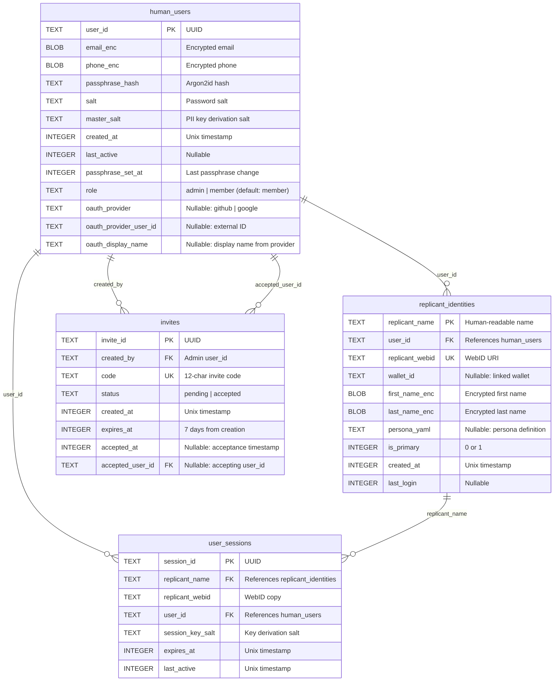

# Multi-User Data Model (ERD)

Entity-relationship diagram for hKask's multi-user schema (`crates/hkask-storage/src/sql/users.sql`).

## Diagram

## Cardinality Notes

- **human_users → replicant_identities:** One-to-many. A human can own multiple replicants.
- **human_users → user_sessions:** One-to-many. A human can have multiple active sessions across replicants.
- **human_users → invites (created_by):** One-to-many. An admin can issue many invites.
- **human_users → invites (accepted_user_id):** One-to-many (nullable). A user can accept multiple invites (though normally one).
- **replicant_identities → user_sessions:** One-to-many. A replicant can have multiple sessions.

## Notable Indexes

| Index | Table | Columns | Purpose |
|-------|-------|---------|---------|
| `idx_replicant_identities_user` | replicant_identities | user_id | Lookup replicants by human |
| `idx_replicant_identities_webid` | replicant_identities | replicant_webid | Lookup by WebID |
| `idx_user_sessions_user` | user_sessions | user_id | Session listing by user |
| `idx_user_sessions_replicant` | user_sessions | replicant_name | Session listing by replicant |
| `idx_user_sessions_expiry` | user_sessions | expires_at | Expired session cleanup |
| `idx_invites_code` | invites | code | Invite lookup by code |
| `idx_invites_created_by` | invites | created_by | Admin's invite listing |

## Cross-References

- Functional spec: `docs/architecture/core/FUNCTIONAL_SPECIFICATION.md` §3.16
- Server config: `crates/hkask-types/src/server_config.rs`
- Invite flow: `docs/diagrams/flowchart-oauth-registration.md`
- Invite lifecycle: `docs/diagrams/state-invite-lifecycle.md`
