# Storage Schema ERD

Plain-English description: This ERD models the full SQLite schema used by `hkask-storage` (and co-located schema init in `hkask-wallet`, `hkask-agents`). The diagram covers 37 tables organized into six logical clusters: **Identity/Users** (human_users, replicant_identities, sessions, invites), **Goals** (goals, criteria, artifacts), **Wallet** (balances, transactions, API keys, encumbrances, deposits), **Gallery** (galleries, images, tags, face registry), **Monitoring/CNS** (nu_events, cns_alerts, cns_variety_checkpoint, audit_log, escalations), and **Knowledge** (triples, embeddings). Four governance tables (consent_records, sovereignty_boundaries, quarantined_goals, loop_cursors) and five meta/infra tables (agent_registry, specs, spec_curation_records, kata_history, pod_meta) are shown as standalone entities. All FK relationships use Crow's Foot notation (`||--o{` for mandatory-one to optional-many, `||--||` for mandatory one-to-one).

```mermaid
erDiagram
    human_users {
        TEXT user_id PK
        BLOB email_enc
        BLOB phone_enc
        TEXT passphrase_hash
        TEXT salt
        TEXT master_salt
        INTEGER created_at
        INTEGER last_active
        INTEGER passphrase_set_at
        TEXT role
        TEXT oauth_provider
        TEXT oauth_provider_user_id
        TEXT oauth_display_name
    }

    replicant_identities {
        TEXT replicant_name PK
        TEXT user_id FK
        TEXT replicant_webid UK
        TEXT wallet_id
        BLOB first_name_enc
        BLOB last_name_enc
        TEXT persona_yaml
        INTEGER is_primary
        INTEGER created_at
        INTEGER last_login
    }

    user_sessions {
        TEXT session_id PK
        TEXT replicant_name FK
        TEXT replicant_webid
        TEXT user_id FK
        TEXT session_key_salt
        INTEGER expires_at
        INTEGER last_active
    }

    invites {
        TEXT invite_id PK
        TEXT created_by FK
        TEXT code UK
        TEXT status
        INTEGER created_at
        INTEGER expires_at
        INTEGER accepted_at
        TEXT accepted_user_id FK
    }

    goals {
        TEXT id PK
        TEXT webid
        TEXT text
        TEXT state
        TEXT visibility
        TEXT created_at
        TEXT completed_at
        TEXT parent_goal_id
        INTEGER depth
        TEXT display_name
    }

    goal_criteria {
        TEXT id PK
        TEXT goal_id FK
        TEXT type
        TEXT description
        INTEGER satisfied
    }

    goal_artifacts {
        TEXT id PK
        TEXT goal_id FK
        TEXT artifact_ref
        TEXT artifact_type
        TEXT created_at
    }

    wallet_balances {
        TEXT wallet_id PK
        INTEGER balance_rj
        INTEGER usdc_equivalent_micro
        TEXT created_at
        TEXT updated_at
    }

    wallet_transactions {
        INTEGER id PK
        TEXT wallet_id FK
        TEXT tx_type
        TEXT tx_subtype
        TEXT chain
        TEXT on_chain_tx_hash
        INTEGER amount_rj
        INTEGER balance_after_rj
        TEXT key_id
        TEXT tool_name
        INTEGER gas_units
        TEXT created_at
    }

    api_keys {
        TEXT key_id PK
        TEXT wallet_id FK
        BLOB public_key
        INTEGER spending_limit_rj
        INTEGER spent_rj
        TEXT scope
        TEXT purpose
        TEXT rate_limit_json
        TEXT privacy_mode
        TEXT preferred_chain
        TEXT expires_at
        TEXT issued_at
        TEXT revoked_at
        TEXT created_at
    }

    encumbrances {
        TEXT key_id PK
        TEXT wallet_id FK
        INTEGER amount_rj
        INTEGER consumed_rj
        TEXT status
        TEXT created_at
        TEXT released_at
    }

    deposit_addresses {
        TEXT wallet_id PK
        TEXT chain PK
        INTEGER derivation_index PK
        TEXT address
        TEXT privacy_mode
        TEXT created_at
    }

    deposit_references {
        TEXT reference PK
        TEXT wallet_id FK
        TEXT chain
        TEXT expires_at
        INTEGER spent
        TEXT created_at
    }

    galleries {
        TEXT id PK
        TEXT root_path UK
        TEXT mode
        INTEGER image_count
        INTEGER total_size_bytes
        TEXT created_at
        TEXT updated_at
    }

    gallery_images {
        TEXT id PK
        TEXT gallery_id FK
        TEXT relative_path
        TEXT absolute_path
        TEXT hash
        INTEGER width
        INTEGER height
        TEXT format
        INTEGER size_bytes
        TEXT added_at
    }

    gallery_tags {
        TEXT id PK
        TEXT image_id FK
        TEXT tag_type
        TEXT value
        REAL confidence
        TEXT model_used
        TEXT created_at
    }

    face_registry {
        TEXT id PK
        TEXT first_name
        TEXT last_name
        TEXT image_id FK
        BLOB embedding
        TEXT status
        TEXT notes
        TEXT created_at
        TEXT updated_at
    }

    triples {
        TEXT id PK
        TEXT entity
        TEXT attribute
        TEXT value
        TEXT valid_from
        TEXT valid_to
        TEXT recalled_at
        TEXT transaction_at
        REAL confidence
        TEXT perspective
        TEXT visibility
        TEXT owner_webid
    }

    embeddings {
        TEXT id PK
        TEXT entity_ref
        BLOB vector
        INTEGER dimensions
        TEXT model
        TEXT created_at
    }

    nu_events {
        TEXT id PK
        TEXT timestamp
        TEXT observer_webid
        TEXT span_category
        TEXT span_path
        TEXT phase
        TEXT observation
        TEXT regulation
        TEXT outcome
        INTEGER recursion_depth
        TEXT parent_event
        TEXT visibility
    }

    cns_variety_checkpoint {
        TEXT domain PK
        INTEGER variety_count
        TEXT last_updated
        INTEGER threshold
    }

    cns_alerts {
        TEXT id PK
        TEXT timestamp
        TEXT alert_type
        TEXT severity
        TEXT domain
        TEXT message
        INTEGER resolved
        TEXT resolved_at
    }

    audit_log {
        TEXT id PK
        TEXT timestamp
        TEXT actor_webid
        TEXT action
        TEXT resource
        TEXT outcome
        TEXT details
        TEXT ip_address
        TEXT created_at
    }

    consent_records {
        TEXT id PK
        TEXT webid UK
        TEXT granted_categories
        INTEGER granted_at
        INTEGER revoked_at
        INTEGER active
    }

    sovereignty_boundaries {
        TEXT id PK
        TEXT webid UK
        TEXT sovereign_categories
        TEXT shared_categories
        TEXT public_categories
        TEXT requires_affirmative_consent
        INTEGER created_at
        INTEGER updated_at
    }

    quarantined_goals {
        TEXT id PK
        TEXT original_data
        TEXT quarantine_reason
        TEXT quarantined_at
        INTEGER repair_attempts
        INTEGER repaired
    }

    agent_registry {
        TEXT name PK
        TEXT agent_kind
        TEXT definition_json
        TEXT token_hash
        TEXT registered_at
        TEXT source_yaml
    }

    user_profile {
        INTEGER id PK
        TEXT profile_json
    }

    contacts {
        INTEGER id PK
        TEXT agent_name
        TEXT contact_name
        TEXT relationship
        TEXT notes
    }

    scheduled_tasks {
        INTEGER id PK
        TEXT agent_name
        TEXT trigger_expr
        TEXT action
        TEXT params
        TEXT next_run
        INTEGER enabled
    }

    specs {
        TEXT id PK
        TEXT name
        TEXT category
        TEXT domain_anchor
        TEXT signed_by
        TEXT signature
        TEXT created_at
        TEXT valid_from
        TEXT valid_to
        TEXT data
    }

    spec_curation_records {
        TEXT spec_id
        TEXT decision
        TEXT rationale
        REAL coherence_score
        TEXT ocap_boundary
        TEXT curated_at
        TEXT recorded_at
    }

    loop_cursors {
        TEXT key PK
        INTEGER value
        TEXT updated_at
    }

    pod_meta {
        TEXT key PK
        TEXT value
    }

    kata_history {
        INTEGER id PK
        TEXT agent_name
        TEXT date
        TEXT kata_type
        TEXT practice_name
        INTEGER steps_completed
        INTEGER gas_consumed
        TEXT created_at
    }

    escalations {
        TEXT id PK
        TEXT template_id
        TEXT bot_id
        TEXT output
        REAL confidence
        INTEGER retry_count
        TEXT error_context
        TEXT created_at
        TEXT status
        TEXT resolved_at
        TEXT resolved_by
    }

    backup_meta {
        TEXT webid
        TEXT source_server_url
        TEXT exported_at
        INTEGER triple_count
        INTEGER schema_version
    }

    %% ── Identity/Users relationships ──
    human_users ||--o{ replicant_identities : "user_id FK"
    human_users ||--o{ user_sessions : "user_id FK"
    replicant_identities ||--o{ user_sessions : "replicant_name FK"
    human_users ||--o{ invites : "created_by FK"
    human_users ||--o| invites : "accepted_user_id FK"

    %% ── Goals relationships ──
    goals ||--o{ goal_criteria : "goal_id FK"
    goals ||--o{ goal_artifacts : "goal_id FK"

    %% ── Wallet relationships ──
    wallet_balances ||--o{ wallet_transactions : "wallet_id FK"
    wallet_balances ||--o{ api_keys : "wallet_id FK"
    wallet_balances ||--o{ deposit_references : "wallet_id FK"
    wallet_balances ||--o{ encumbrances : "wallet_id FK"
    api_keys ||--|| encumbrances : "key_id FK"

    %% ── Gallery relationships ──
    galleries ||--o{ gallery_images : "gallery_id FK"
    gallery_images ||--o{ gallery_tags : "image_id FK"
    gallery_images ||--o{ face_registry : "image_id FK"
```

<!-- DIAGRAM_ALIGNMENT
  id: DIAG-PL-010
  verified_date: 2026-06-30
  verified_against: crates/hkask-storage/src/
  status: VERIFIED
-->

## Notable Indexes

| Table | Index Name | Columns | Notes |
|-------|-----------|---------|-------|
| `replicant_identities` | `idx_replicant_identities_user` | `user_id` | Lookup by human user |
| `replicant_identities` | `idx_replicant_identities_webid` | `replicant_webid` | Lookup by WebID |
| `user_sessions` | `idx_user_sessions_user` | `user_id` | Session lookup by user |
| `user_sessions` | `idx_user_sessions_replicant` | `replicant_name` | Session lookup by replicant |
| `user_sessions` | `idx_user_sessions_expiry` | `expires_at` | Expired session cleanup |
| `invites` | `idx_invites_code` | `code` | Invite code lookup |
| `invites` | `idx_invites_created_by` | `created_by` | Invites by creator |
| `agent_registry` | `idx_agent_registry_kind` | `agent_kind` | Filter by agent kind |
| `contacts` | `idx_contacts_agent` | `agent_name` | Agent contact lookup |
| `scheduled_tasks` | `idx_scheduled_agent` | `agent_name` | Agent task lookup |
| `embeddings` | `idx_embeddings_entity_ref` | `entity_ref` | Embedding lookup by entity |
| `nu_events` | `idx_nu_events_timestamp_category` | `timestamp, span_category` | CNS event range scan |
| `nu_events` | `idx_nu_events_category_phase` | `span_category, phase` | CNS phase filtering |
| `audit_log` | `idx_audit_log_timestamp` | `timestamp` | Audit time-range scan |
| `audit_log` | `idx_audit_log_actor` | `actor_webid` | Audit by actor |
| `consent_records` | `idx_consent_active` | `active` | Active consent lookup |
| `sovereignty_boundaries` | `idx_sovereignty_webid` | `webid` | Sovereignty by WebID |
| `sovereignty_boundaries` | `idx_sovereignty_updated` | `updated_at` | Sovereignty recency scan |
| `wallet_transactions` | `idx_wallet_tx_wallet_id` | `wallet_id` | Transactions by wallet |
| `wallet_transactions` | `idx_wallet_tx_created_at` | `created_at` | Transaction time-range |
| `api_keys` | `idx_api_keys_wallet_id` | `wallet_id` | Keys by wallet |
| `api_keys` | `idx_api_keys_public_key` | `public_key` | Key lookup by pubkey |
| `deposit_addresses` | `deposit_addresses_unique_address` | `chain, privacy_mode, address` | Unique deposit address (UNIQUE constraint) |
| `deposit_references` | `idx_deposit_refs_wallet_id` | `wallet_id` | Deposit refs by wallet |
| `deposit_references` | `idx_deposit_refs_expires` | `expires_at` | Expired deposit cleanup |
| `encumbrances` | `idx_encumbrances_wallet_id` | `wallet_id` | Encumbrances by wallet |
| `gallery_images` | `idx_gallery_images_gallery` | `gallery_id` | Images by gallery |
| `gallery_images` | `idx_gallery_images_hash` | `hash` | Image hash dedup |
| `gallery_tags` | `idx_gallery_tags_image` | `image_id` | Tags by image |
| `gallery_tags` | `idx_gallery_tags_type` | `tag_type` | Tags by type |
| `gallery_tags` | `idx_gallery_tags_unique` | `image_id, tag_type, value` | Unique tag per image (UNIQUE) |
| `face_registry` | `idx_face_registry_status` | `status` | Faces by status |
| `kata_history` | `idx_kata_history_agent` | `agent_name` | Kata by agent |
| `kata_history` | `idx_kata_history_date` | `date` | Kata by date |
| `kata_history` | `idx_kata_history_type` | `kata_type` | Kata by type |

## Cross-Reference

This diagram models the storage layer for all [MDS Core Entities](../architecture/core/MDS.md#11-core-entities):
- **`HumanUser`** → `human_users` table
- **`Replicant`** → `replicant_identities` table
- **`AgentDefinition` / `RegisteredAgent`** → `agent_registry` table
- **`Wallet`** → `wallet_balances`, `wallet_transactions`, `encumbrances`, `deposit_addresses`, `deposit_references`
- **`ApiKey`** → `api_keys` table
- **`Triple`** → `triples` table
- **`CnsRuntime`** → `nu_events`, `cns_variety_checkpoint`, `cns_alerts` tables
- **`GasBudget`** → `loop_cursors` table (cursor-based gas tracking)

All FK relationships align with the ownership chains defined in [PRINCIPLES.md](../architecture/core/PRINCIPLES.md) P1 (User Sovereignty) and P9 (Economic Layer). The `webid` columns in `triples`, `goals`, `consent_records`, `sovereignty_boundaries`, and `nu_events` implement the multi-tenant data isolation required by P1 and P4 (Clear Boundaries).
