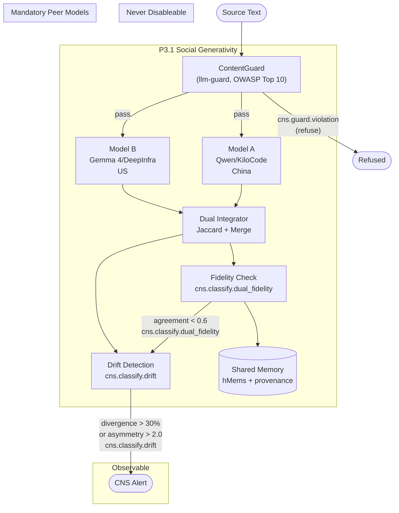

# Classification + Guard Architecture Overview

How dual-model classification, content safety guard, drift detection, and
memory storage compose. P3.1 Social Generativity governs the entire pipeline —
no single model gates shared memory, and no LLM boundary is unguarded.

Related: `crates/hkask-guard/src/lib.rs`, `crates/hkask-services-runtime/src/dual_classify.rs`, `docs/architecture/core/PRINCIPLES.md` §P3.1

## Subsystems

| Subsystem | Crate | OWASP Alignment |
|---|---|---|
| ContentGuard | `hkask-guard` | LLM01, LLM02, LLM04, LLM06 |
| Dual Classifier | `hkask-services-runtime` | LLM09 (Misinformation — cross-jurisdiction) |
| Drift Detection | `hkask-services-runtime` | Operational monitoring |
| Memory Storage | `hkask-storage` | Provenance-tagged hMems |
