# hKask Bootstrap Sequence

**Purpose:** Trace the full startup sequence from binary entry point through to CLI command dispatch or API server listen. Covers both the lightweight CLI path (`kask <command>`) and the full `AgentService` composition path (`kask serve`, `kask chat`, `kask curator`).

**Related:** [MDS.md](../architecture/core/MDS.md) §5 Bootstrap Sequence, [PRINCIPLES.md](../architecture/core/PRINCIPLES.md)

---

## Bootstrap Sequence Description

The binary entry point (`crates/hkask-cli/src/main.rs`) is a thin dispatcher. On invocation it:

1. Loads `.env` and parses CLI arguments via Clap.
2. Initializes the tracing subscriber (JSON or human-readable, debug or default filter).
3. Creates a Tokio single-threaded runtime.
4. Checks fusion model configuration (P9: proactive cost-safety).
5. Initializes a lightweight `SqliteRegistry` for CLI subcommand use.
6. Emits a CNS span (`command_dispatched`) and routes to the matching command handler.

For commands that need full infrastructure (`Serve`, `Chat`, `Curator`), the handler calls `AgentService::build(config)`, which assembles all shared infrastructure in dependency order:

- **Phase A — Foundation:** Opens SQLCipher databases, creates all persistent stores (Consent, Escalation, Goal, Sovereignty, Spec, User, CNS events), initializes the CNS runtime with the variety threshold, and loads the seam watcher.
- **Phase B — Loops:** Creates the loop system, cybernetics loop with set points, inference router (wrapped behind a governed inference membrane), episodic/semantic memory databases with their loops, the CuratorAgent with curation loop, and an optional federation sync loop.
- **Phase C — MCP + Pods:** Creates the MCP runtime, wraps the raw tool port behind a governed tool membrane (OCAP enforcement), builds the capability checker (system OCAP + A2A trust root), assembles ActivePods with PodFactory and FullMcpAdapter, activates the CuratorPod with CuratorSync, and starts the Unix daemon listener.
- **Phase D — Registry + Wallet:** Creates the shared SqliteRegistry on the primary DB connection, restores A2A agent state from persistent storage, builds the per-agent wallet service with deposit monitoring and gas calibration.

The resulting `AgentService` struct is wrapped by surface-specific types:
- **CLI:** `ReplState = AgentService + REPL fields`
- **API:** `ApiState = Arc<AgentService> + HTTP fields` (Git CAS, wallet, API key auth)

The API server path additionally starts built-in MCP servers (excluding filesystem/curator/kanban), builds the axum router with middleware layers (CNS, session cookies, auth tokens, admin role gating, API key auth), and binds the TCP listener.

---

## Bootstrap Flowchart

```mermaid
flowchart TD
    Start([kask invoked]) --> LoadEnv[Load .env silently]
    LoadEnv --> ParseArgs[Parse CLI args with Clap]
    ParseArgs --> InitLog[Init tracing subscriber]
    InitLog --> CreateRt[Create Tokio runtime]
    CreateRt --> ChkFusion[Check fusion model config]
    ChkFusion --> InitReg[Init SqliteRegistry]
    InitReg --> CnsOpen[Open CNS span: command_dispatched]
    CnsOpen --> Cmd{Command type?}

    Cmd -->|Serve/Chat/Curator| SvCfg[ServiceConfig::from_env]
    Cmd -->|Other| Dispatch[Route to handler]
    Dispatch --> CnsClose[Close CNS span]
    CnsClose --> End([Process exit])

    SvCfg --> ResolveSecrets[Resolve secrets from keystore]
    ResolveSecrets --> BuildAgent[AgentService::build]

    subgraph PhaseA["Phase A: Foundation"]
        BuildAgent --> OpenDb[Database::open SQLCipher]
        OpenDb --> NuEvt[NuEventStore CNS event sink]
        NuEvt --> Stores[Create 7 stores]
        Stores --> CnsRt[CnsRuntime with threshold]
        CnsRt --> SeamW[SeamWatcher load + drift check]
    end

    subgraph PhaseB["Phase B: Loops"]
        SeamW --> LoopSys[LoopSystem::new]
        LoopSys --> Cybernetics[CyberneticsLoop + set points]
        Cybernetics --> Inference{in_memory?}
        Inference -->|No| InfRouter[InferenceRouter → GovernedInference]
        Inference -->|Yes| MemOpen
        InfRouter --> MemOpen[Open memory.db]
        MemOpen --> Episodic[EpisodicMemory + EpisodicLoop]
        Episodic --> Semantic[SemanticMemory + SemanticLoop]
        Semantic --> CuratorCtx[CuratorContext + CuratorAgent]
        CuratorCtx --> CurationLp[Register CurationLoop]
        CurationLp --> FedCheck{Federation enabled?}
        FedCheck -->|Yes| FedSync[Spawn FederationSync]
        FedCheck -->|No| PhaseC
        FedSync --> PhaseC
    end

    subgraph PhaseC["Phase C: MCP + Pods"]
        PhaseC[McpRuntime::new] --> GovTool[GovernedTool membrane]
        GovTool --> McpDisp[McpDispatcher]
        McpDisp --> ManExec[Wire ManifestExecutor]
        ManExec --> CapChk[Build CapabilityChecker]
        CapChk --> ActivePods[ActivePods + PodFactory]
        ActivePods --> PodBkup[Bg: pod_backup_daemon]
        PodBkup --> CuratorPod[Bg: ensure CuratorPod]
        CuratorPod --> Daemon[Bg: DaemonListener Unix socket]
    end

    subgraph PhaseD["Phase D: Registry + Wallet"]
        Daemon --> RegStore[SqliteRegistry on primary DB]
        RegStore --> AgtStore[AgentRegistryStore + schema]
        AgtStore --> A2ARestore[Restore A2A agents from store]
        A2ARestore --> WalletSvc[WalletService per-agent wallet]
        WalletSvc --> DepositM[Bg: deposit monitor]
        DepositM --> GasCal[Bg: wallet gas calibrator]
    end

    GasCal --> IntoService[AgentServiceWiring → AgentService]
    IntoService --> Surf{Surface?}

    Surf -->|CLI| BuildRepl[Build ReplState]
    BuildRepl --> ChatLoop[Enter chat/REPL loop]
    ChatLoop --> CnsClose

    Surf -->|API| McpSrv[Start API MCP servers]
    McpSrv --> ApiState[ApiState::from_service_context]
    ApiState --> Router[Create axum router + middleware]
    Router --> Bind[TCP bind + axum::serve]
    Bind --> Listen([Listening for requests])
```



---

## DIAGRAM_ALIGNMENT

| Field | Value |
|-------|-------|
| **id** | `DIAG-PL-006` |
| **verified_date** | `2026-06-30` |
| **verified_against** | `crates/hkask-cli/src/main.rs` |
| **status** | `VERIFIED` |

### Verification notes

- `crates/hkask-cli/src/main.rs:32–252` — Binary entry point, CLI parsing, CNS spans, command routing
- `crates/hkask-cli/src/cli/helpers.rs:26–42` — Logging initialization
- `crates/hkask-cli/src/commands/serve.rs:20–69` — API serve command → `ServiceConfig::from_env` → `AgentService::build` → `ApiState::from_service_context` → `create_router` → `axum::serve`
- `crates/hkask-services-core/src/config.rs:140–204` — `ServiceConfig::from_env()` — env vars + keystore secret resolution
- `crates/hkask-services-context/src/context_impl/build.rs:30–76` — `AgentService::build()` — 4-phase canonical assembly
- `crates/hkask-services-context/src/context_impl/build.rs:168–292` — `build_foundation()` — DB open, 7 stores, CNS runtime, seam watcher
- `crates/hkask-services-context/src/context_impl/build.rs:324–530` — `build_loops()` — LoopSystem, CyberneticsLoop, Inference, Memory, Curator, Federation
- `crates/hkask-services-context/src/context_impl/build.rs:547–712` — `build_mcp_and_pods()` — GovernedTool, McpDispatcher, CapabilityChecker, ActivePods, CuratorPod, DaemonListener
- `crates/hkask-services-context/src/context_impl/build.rs:744–820` — `build_registry_and_wallet()` — SqliteRegistry, AgentRegistryStore, A2A restore, WalletService
- `crates/hkask-services-context/src/context_impl/build.rs:95–146` — `into_service()` — AgentServiceWiring → AgentService
- `crates/hkask-api/src/lib.rs:102–155` — `ApiState::with_defaults()` + `from_service_context()`
- `crates/hkask-api/src/lib.rs:201–279` — `create_router()` — axum router + middleware layers
- `crates/hkask-cns/src/runtime.rs:290–310` — `CnsRuntime` struct and initialization
- `crates/hkask-mcp/src/runtime.rs:124–145` — `McpRuntime` struct and `new()`
- `docs/architecture/core/MDS.md:631–638` — MDS Bootstrap Sequence reference
- `docs/DIAGRAMS_INDEX.md:61` — DIAG-PL-004 predecessor (now superseded by this DIAG-PL-006)

---

## Cross-Reference: MDS.md Bootstrap Sequence

[MDS.md §5](../architecture/core/MDS.md#bootstrap-sequence) describes the bootstrap at the domain-spec level:

> 1. `AgentService::build(config)` assembles all shared infrastructure
> 2. Per-agent memory created via `build_per_agent_memory(db)`
> 3. Consolidation is routed through `AgentService::consolidate_agent_memory(agent_name, request)` — the single OCAP-gated, consent-checked entry point
> 4. CLI surface wraps with `ReplState` (= `AgentService` + REPL fields)
> 5. API surface wraps with `ApiState` (= `Arc<AgentService>` + HTTP fields)

The lifecycle spec template ([MDS.md §7.4](../architecture/core/MDS.md#74-lifecycle-spec-template)) captures the MDS-level bootstrap sequence:

```yaml
bootstrap:
  sequence: [resolve_secrets, open_databases, build_service_context, start_loops]
```

This flowchart (DIAG-PL-006) expands those four steps into the full implementation-level sequence verified against the current source code.
