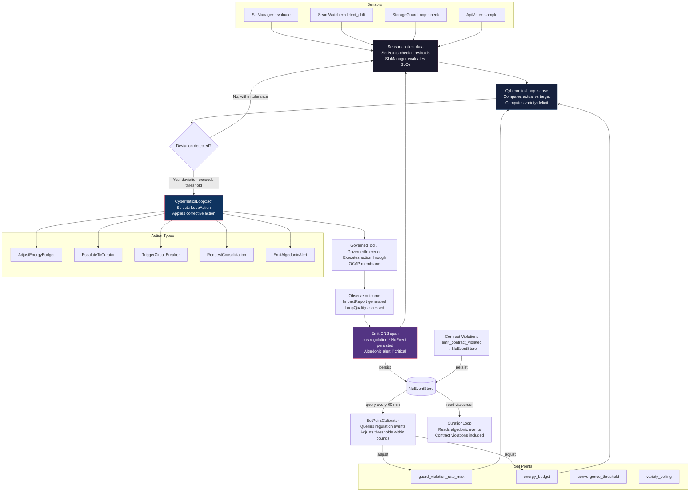

# CNS Homeostatic Loop — Mermaid Flowchart

**Diataxis quadrant:** Explanation  
**Domain ontology tier:** Core  
**Purpose:** Visualize the CNS (Cybernetic Nervous System) homeostatic self-regulation loop — the feedback mechanism by which hKask monitors its own health and takes corrective action.  
**Verified against:** `crates/hkask-cns/src/cybernetics_loop.rs`, `crates/hkask-cns/src/runtime.rs`  
last-verified-against: "3d1a876f45e3ce64864c3453f1e71d75b2f14376"

> **v0.32.0 update:** Added `SetPointCalibrator` (self-tuning regulation thresholds via NuEventStore replay) and contract violation path to CurationLoop.

**Node-to-code mapping:**

| Diagram Node | Source Location |
|-------------|----------------|
| CyberneticsLoop::sense | `crates/hkask-cns/src/cybernetics_loop.rs` |
| CyberneticsLoop::act | `crates/hkask-cns/src/cybernetics_loop.rs` |
| GovernedTool membrane | `crates/hkask-cns/src/governed_tool.rs` |
| SloManager::evaluate | `crates/hkask-cns/src/slo_manager.rs` |
| SeamWatcher | `crates/hkask-cns/src/seam_watcher.rs` |
| StorageGuardLoop | `crates/hkask-storage-guard/src/lib.rs` |
| SetPoints | `crates/hkask-cns/src/set_points.rs` |
| SetPointCalibrator | `crates/hkask-cns/src/set_point_calibrator.rs` |
| ObservableSpan trait | `crates/hkask-types/src/observable_span.rs` |
| LoopAction enum | `crates/hkask-cns/src/types/loops/actions.rs` |
| ImpactReport | `crates/hkask-cns/src/types/loops/core.rs` |
| Algedonic escalation | `crates/hkask-cns/src/runtime.rs` |
| CurationLoop | `crates/hkask-agents/src/curator/curation_loop.rs` |
| Contract events | `crates/hkask-cns/src/contract_events.rs` |
| NuEventStore | `crates/hkask-storage/src/nu_event_store.rs` |

**Cardinality:** 1 CyberneticsLoop runs per AgentService instance. N SetPoints are configured (4 shown). M Sensors feed into the loop. 5 LoopAction types exist in the current codebase (verified against `ActionType` enum).
