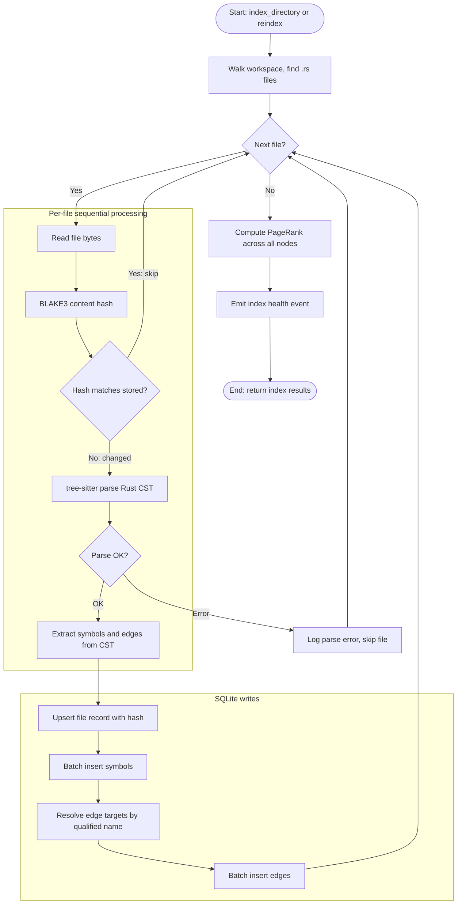

# CodeGraph Indexing Pipeline

The `IndexPipeline` coordinates the end-to-end flow from source files on disk to a searchable code graph in SQLite. It uses incremental BLAKE3 content hashes to skip unchanged files, parses Rust source with tree-sitter, extracts symbols and edges, resolves references by name, and computes PageRank when finalized.

Key design invariants:
- **Incremental skip**: Per-file BLAKE3 hash-on-read before tree-sitter work
- **Sequential directory indexing**: Files are indexed one at a time; each successful file writes symbols and resolvable edges to SQLite
- **Staleness tracking**: `last_full_index_at` is reset by `finalize()` and exposed by `staleness_seconds()`

### Pipeline Stages

| Stage | Component | What Happens |
|-------|-----------|-------------|
| **Walk** | `walkdir` | Discover all `.rs` files in workspace |
| **Hash** | `blake3` | BLAKE3 content hash; compare to `code_files.content_hash` |
| **Parse** | `tree-sitter-rust` | Build Concrete Syntax Tree from source bytes |
| **Extract** | `extractor.rs` | Walk CST, produce `Vec<Symbol>` + `Vec<Edge>` with qualified names |
| **Insert** | `store.rs` | Batch insert symbols (ID assigned), resolve edge targets by name lookup |
| **Rank** | `pagerank` | Compute PageRank across all nodes for importance weighting |
| **Health** | tracing | Emit `cns.codegraph.index_health` after `finalize()` |

### CNS Spans

The pipeline emits tracing events for cybernetic observability:
- `cns.codegraph.file_indexed` — symbols, edges, and elapsed time for a changed file
- `cns.codegraph.index_health` — total files, symbols, edges, and zero staleness after `finalize()`

`staleness_seconds()` exposes elapsed time since `finalize()` for a caller that needs to monitor index freshness.

### Related Documentation

- [`class-codegraph-types.md`](class-codegraph-types.md) — Type system class diagram
- [`sequence-mcp-tool-dispatch.md`](sequence-mcp-tool-dispatch.md) — MCP tool dispatch sequence (applies to codegraph tools)
- [`../architecture/hKask-architecture-master.md`](../architecture/hKask-architecture-master.md) — Architecture master (crate-to-loop mapping)
- [`hkask-codegraph`](../../crates/hkask-codegraph/) — Implementation crate (original design plan absorbed)
