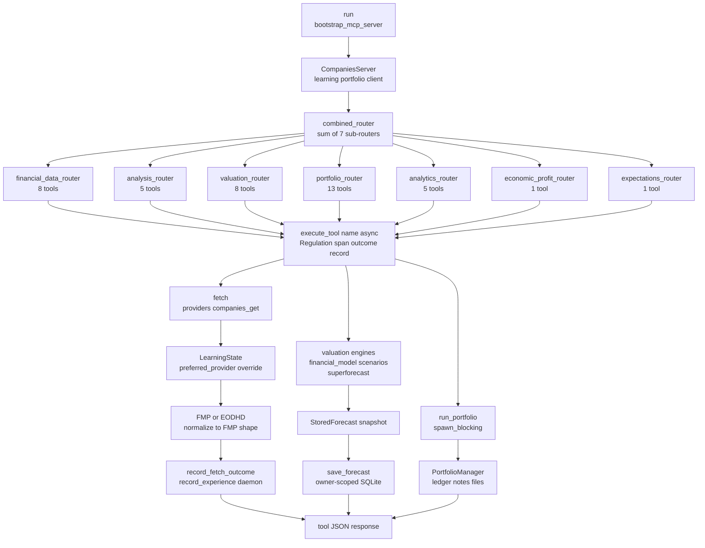

# Companies MCP — Tool Routing and Dispatch Flow

**Diataxis type:** Reference
**Status:** Current (v0.31.0)
**Source:** `mcp-servers/hkask-mcp-companies/src/lib.rs:499-509` (combined_router), `src/lib.rs:368-495` (fetch, forecast store, record_experience), `src/tools/mod.rs`, `src/providers.rs:111-198` (companies_get), `src/portfolio.rs:290-340` (PortfolioManager)

This diagram traces the dispatch seam shared by all 41 companies tools. `run()` bootstraps a `CompaniesServer` whose `combined_router` sums seven domain sub-routers. Every tool funnels through `execute_tool` (Regulation span + outcome recording), then branches into one of three downstream sinks: provider-routed financial data, valuation engines that persist `StoredForecast` snapshots, or `PortfolioManager` ledger operations offloaded to `spawn_blocking`.

<!-- DIAGRAM_ALIGNMENT
id: DIAG-RF-004
verified_date: 2026-07-17
verified_against: mcp-servers/hkask-mcp-companies/src/lib.rs:499-509 (combined_router composition); mcp-servers/hkask-mcp-companies/src/lib.rs:368-495 (fetch, save_forecast, record_experience); mcp-servers/hkask-mcp-companies/src/tools/mod.rs:1-8 (seven tool sub-modules); mcp-servers/hkask-mcp-companies/src/providers.rs:111-198 (companies_get routing); mcp-servers/hkask-mcp-companies/src/portfolio.rs:290-340 (PortfolioManager)
status: VERIFIED
-->

## Key paths

- **Financial data:** any of the 8 `financial_data_router` tools → `execute_tool` → `fetch` → `providers::companies_get` → `LearningState.preferred_provider` override (Beta posterior) → FMP or EODHD → normalize → `record_fetch_outcome` → daemon experience
- **Valuation:** `dcf_valuation`, `reverse_dcf`, `calibrate_forecast`, `monte_carlo_dcf`, `comparable_analysis`, `scenario_analysis`, `sensitivity_analysis` → `execute_tool` → `financial_model` / `scenarios` / `superforecast` → `StoredForecast.snapshot` → `save_forecast` (owner-scoped SQLite)
- **Forecast tracking:** `forecast_get` / `forecast_list` read persisted snapshots; `forecast_record` appends outcomes and reloads the snapshot for return-gap decomposition; `result_feedback` feeds the `LearningState` Beta prior
- **Portfolio:** `portfolio_list`, `portfolio_delete`, `ledger_import`, `ledger_export`, `portfolio_returns`, `portfolio_attribution`, `portfolio_characteristics`, `portfolio_comparison`, notes and files → `execute_tool` → `run_portfolio` (`spawn_blocking`) → `PortfolioManager` SQLite
- **Research:** `research_search` bypasses `fetch` and calls `research::search` directly against Exa, Tavily, and Brave
- **Screener:** `company_screener` bypasses `fetch` and calls `screener::fmp_screener` directly against FMP

## Cross-links

- [Companies MCP Server Reference](../reference/mcp-servers/companies.md) — full tool catalog, configuration, and behavioral boundaries
- [Companies User Guide](../how-to/companies-mcp.md) — task-oriented procedures for valuation, forecasting, and portfolio operations
- [Companies Semantic Graph Audit](../status/companies-mcp-semantic-graph-audit-2026-07-17.md) — internal module dependency graph health
- [MCP Server Registry](../reference/mcp-servers/README.md) — catalog of all 15 built-in servers
- [Diagram Index](../DIAGRAMS_INDEX.md) — DIAG-RF-004 registration