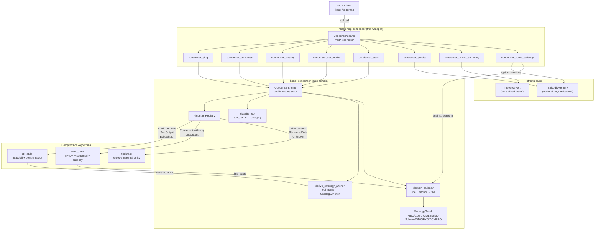

# Condenser Pipeline — Architecture Flowchart

**Diataxis type:** Reference
**Status:** Current (v0.31.0)

This diagram traces the condenser MCP server's tool dispatch and compression pipeline. The `CondenserServer` (thin MCP wrapper) delegates to `CondenserEngine` (pure domain logic), which dispatches to one of three compression algorithms based on the classified `ContextCategory`. The ontology anchor — derived from the tool name via bridge crates — feeds domain-aware saliency scoring into `word_rank` and `rtk_style`.

Cross-links:
- [MCP Server Registry](../reference/mcp-servers/README.md) — all built-in MCP servers
- [API Reference: hkask-condenser](../reference/api-reference.md) — full module and type listing
- [Architecture Patterns](../explanation/architecture-patterns.md) — MCP bootstrap and tool dispatch sequence

