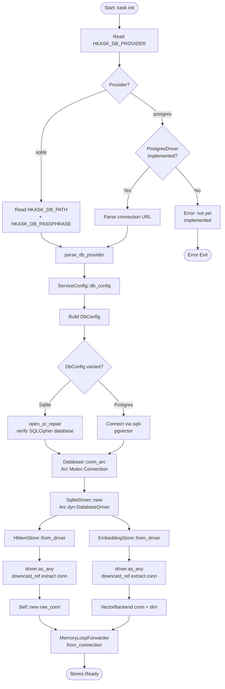

# Database Connection Lifecycle

Reference flowchart tracing the path from environment variable to constructed stores. Covers SQLite (stable) and PostgreSQL (planned v0.32) paths.

Related: [ADR-043](../architecture/ADR-043-database-driver.md), [Class Diagram](class-database-driver.md)

