# hKask Documentation Structure

This diagram maps the Diataxis quadrant structure of the `docs/` directory. hKask follows the [Diataxis](https://diataxis.fr/) methodology: documentation is organized by purpose into four quadrants (Tutorial, How-To, Reference, Explanation), supplemented by architecture, specifications, status, plans, and research directories. The canonical entry point is [`docs/README.md`](../README.md).

```mermaid
flowchart TD
    Root["docs/<br/>Documentation Portal"]

    Root --> HowTo["how-to/<br/>Task-oriented guides"]
    Root --> Reference["reference/<br/>Neutral, descriptive"]
    Root --> Explanation["explanation/<br/>Background, reasoning"]
    Root --> Architecture["architecture/<br/>ADRs + master spec"]
    Root --> Specifications["specifications/<br/>Standards + specs"]
    Root --> Status["status/<br/>Point-in-time reports"]
    Root --> Plans["plans/<br/>Forward-looking designs"]
    Root --> Research["research/<br/>Source material"]
    Root --> Generated["generated/<br/>Auto-generated docs"]
    Root --> CI["ci/<br/>Verification scripts"]

    HowTo --> HowToGS["getting-started.md<br/>End-to-end tutorial"]
    HowTo --> HowToGuides["8 guides<br/>install, skills, pods, training..."]

    Reference --> RefAPI["api-reference.md<br/>45 crates catalogued"]
    Reference --> RefCNS["cns-spans.md<br/>Span registry"]
    Reference --> RefMC["magna-carta.md<br/>P1-P4 principles"]
    Reference --> RefMCP["mcp-servers/<br/>15 MCP servers"]
    Reference --> RefSkills["skills/<br/>46 skills registry"]

    Explanation --> ExplArch["architecture-patterns.md<br/>Hexagonal ports, VSM"]
    Explanation --> ExplCNS["cns-and-loops.md<br/>Homeostatic regulation"]
    Explanation --> ExplSov["sovereignty-and-ocap.md<br/>OCAP dispatch"]
    Explanation --> ExplFed["federation-and-transport.md<br/>Federation protocol"]
    Explanation --> ExplEnergy["energy-and-economy.md<br/>Gas + ledger system"]
    Explanation --> ExplCog["cognition-and-replica.md<br/>Memory + forecasting"]

    Architecture --> ArchCore["core/<br/>Master spec + MDS + principles"]
    Architecture --> ArchADRs["ADRs/<br/>17 decision records"]
    ArchCore --> ArchMaster["hKask-architecture-master.md<br/>Authoritative index"]

    Specifications --> SpecDocs["DOCUMENTATION_STANDARDS.md<br/>This document's rules"]
    Specifications --> SpecReq["REQUIREMENTS.md<br/>Goal specs"]
    Specifications --> SpecREPL["REPL-specification.md"]
    Specifications --> SpecWallet["wallet-specification.md"]
    Specifications --> SpecSalience["salience-specification.md"]

    Status --> StatusProj["PROJECT_STATUS.md<br/>Build + test health"]
    Status --> StatusReports["Point-in-time audits<br/>and inventories"]

    Generated --> GenCLI["cli-reference.md<br/>kask --help output"]
    Generated --> GenOpenAPI["openapi.json<br/>HTTP API spec"]

    CI --> CIVerify["verify-docs.sh<br/>10-step health check"]
    CI --> CILinks["check-links.sh<br/>Hyperlink integrity"]
    CI --> CICitations["check-citations.sh<br/>PS-07 compliance"]
```



<!-- DIAGRAM_ALIGNMENT
id: DIAG-DOC-001
verified_date: 2026-07-17
verified_against: docs/README.md; docs/specifications/DOCUMENTATION_STANDARDS.md; docs/ directory listing
status: VERIFIED
-->

## Navigation Principles

1. **Tutorial** quadrant is collapsed into `how-to/getting-started.md` — a single end-to-end walkthrough for new developers.
2. **How-To** guides answer "how do I achieve X?" with direct, imperative instructions.
3. **Reference** documents are neutral, complete, descriptive-only — no procedures, no opinions.
4. **Explanation** documents provide background and reasoning — "this design exists because…"
5. **Architecture** holds the authoritative master spec, ADRs, and core design documents.
6. **Specifications** hold standards (including this document's governing rules) and formal specs.
7. **Status** reports are point-in-time snapshots — historical records, not rewritten.
8. **Plans** are forward-looking design documents — may reference not-yet-existing crates.
9. **Research** holds source material and literature reviews.
10. **Generated** docs are auto-generated from code (`kask --help`, OpenAPI) and excluded from manual editing.

## Verification

Documentation health is mechanically verified by [`docs/ci/verify-docs.sh`](../ci/verify-docs.sh) — a 10-step check that builds ground truth from code (crate count, MCP count, skill count, version) and verifies every document against it. Run:

```bash
bash docs/ci/verify-docs.sh
```

## Cross-References

- [Documentation Portal](../README.md) — canonical index of all active documents
- [Documentation Standards](../specifications/DOCUMENTATION_STANDARDS.md) — governing rules for metadata, citations, diagrams, lifecycle
- [MDS Category Mapping](../architecture/core/MDS.md) — 5-category taxonomy → directory mapping
- [Diagram Index](../DIAGRAMS_INDEX.md) — registry of all Mermaid diagrams in the corpus
